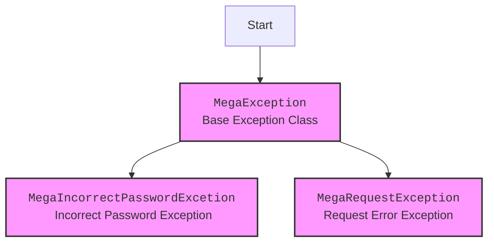

## Анализ кода `hypotez/src/endpoints/bots/google_dirve/mega/exceptions.py`

### 1. <алгоритм>

1.  **Начало**: Программа начинается с определения базового класса `MegaException`.
    *   Пример: `class MegaException(Exception): pass`

2.  **Создание класса `MegaIncorrectPasswordExcetion`**: Определяется класс, наследующий `MegaException`, для обработки ошибок, связанных с неправильным паролем.
    *   Пример: `class MegaIncorrectPasswordExcetion(MegaException):`
    *   Описание: Этот класс представляет собой специфическую ошибку, возникающую при вводе неверных учетных данных.

3.  **Создание класса `MegaRequestException`**: Создается класс, наследующий `MegaException`, для обработки ошибок, связанных с запросами к Mega API.
    *   Пример: `class MegaRequestException(MegaException): pass`
    *   Описание: Этот класс сигнализирует о проблемах, возникших во время выполнения запросов к Mega.

4.  **Конец**: Программа завершается после определения всех классов исключений.

### 2. <mermaid>



**Объяснение зависимостей `mermaid`:**

-   `MegaException`: Базовый класс исключений, от которого наследуются другие исключения, связанные с Mega.
-   `MegaIncorrectPasswordExcetion`: Класс исключения, специфичный для ошибок с неправильным паролем или электронной почтой.
-   `MegaRequestException`: Класс исключения для ошибок, возникающих во время выполнения запросов к Mega API.

### 3. <объяснение>

**Импорты:**

-   В данном коде нет явных импортов, кроме базового класса `Exception`, который является встроенным в Python.

**Классы:**

1.  **`MegaException(Exception)`**:
    *   **Роль**: Базовый класс для всех исключений, связанных с Mega. Он наследует от встроенного класса `Exception`, что позволяет ему быть использованным в качестве пользовательского исключения.
    *   **Атрибуты**: Нет собственных атрибутов.
    *   **Методы**: Нет собственных методов.
    *   **Взаимодействие**: Служит основой для всех других классов исключений, специфичных для Mega.

2.  **`MegaIncorrectPasswordExcetion(MegaException)`**:
    *   **Роль**: Класс исключения, который используется, когда пользователь вводит неверный пароль или адрес электронной почты.
    *   **Атрибуты**: Нет собственных атрибутов.
    *   **Методы**: Нет собственных методов.
    *   **Взаимодействие**: Наследует от `MegaException`, что означает, что его можно перехватить как `MegaException`.
    *   **Пример**: Когда пользователь вводит неверный пароль, код может сгенерировать исключение `raise MegaIncorrectPasswordExcetion("Incorrect credentials provided.")`.

3.  **`MegaRequestException(MegaException)`**:
    *   **Роль**: Класс исключения, который используется, когда возникает ошибка во время выполнения запроса к Mega API.
    *   **Атрибуты**: Нет собственных атрибутов.
    *   **Методы**: Нет собственных методов.
    *   **Взаимодействие**: Наследует от `MegaException`, что означает, что его можно перехватить как `MegaException`.
    *   **Пример**: Если запрос к Mega API возвращает ошибку, код может сгенерировать исключение `raise MegaRequestException("Error during API request")`.

**Переменные:**

-   В данном коде нет переменных, используются только классы.

**Потенциальные ошибки и области для улучшения:**

1.  **Отсутствие подробных сообщений об ошибках**:  Классы исключений не имеют сообщений по умолчанию. Было бы полезно добавить конструктор `__init__` в каждый класс, чтобы можно было передавать сообщения об ошибке. Пример:
    ```python
    class MegaIncorrectPasswordExcetion(MegaException):
        def __init__(self, message):
            self.message = message
            super().__init__(self.message)

    ```
    Это позволит более точно определять причину возникновения исключения.
2.  **Возможность расширения**: В будущем могут понадобиться другие типы исключений. Можно было бы предусмотреть иерархию более детальных исключений, например `MegaUploadException`, `MegaDownloadException` и т.д.

**Цепочка взаимосвязей с другими частями проекта:**

Эти классы исключений используются в других частях проекта, где происходит взаимодействие с Mega API. Например, при попытке входа в систему через Mega, или при загрузке или скачивании файлов. Когда возникает ошибка, связанная с Mega, код возбуждает одно из этих исключений, позволяя другим частям программы правильно обрабатывать возникшую проблему и предоставлять пользователю осмысленное сообщение об ошибке.