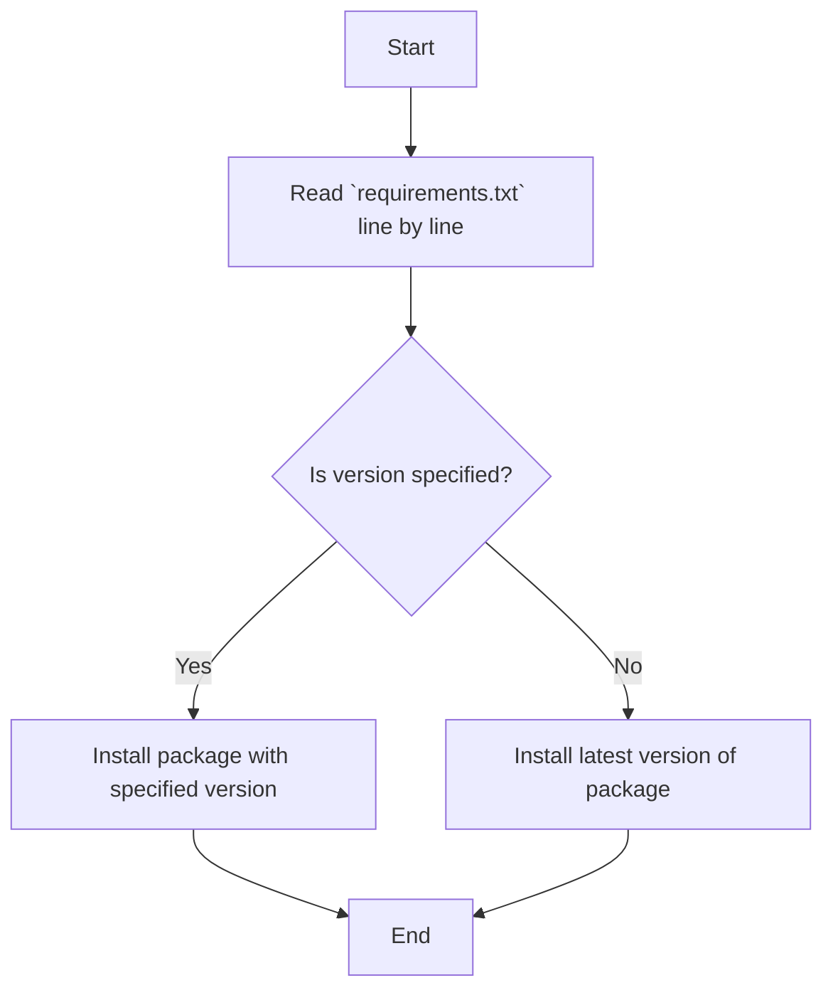

## Анализ `requirements.txt`

### 1. `<алгоритм>`:
Файл `requirements.txt` содержит список Python пакетов и их версий, необходимых для проекта.  
Алгоритм обработки этого файла прост:  
1. Читается файл построчно.
2. Каждая строка интерпретируется как имя пакета и его версия (если указана).
3. Эти зависимости используются менеджером пакетов (например, `pip`) для установки необходимых библиотек перед запуском проекта.
   
   **Примеры:**
     - `python-telegram-bot==12.0.0b1`: Устанавливает пакет `python-telegram-bot` версии `12.0.0b1`.
     - `PyDrive`: Устанавливает последнюю версию пакета `PyDrive`.
     - `URLObject>=2.1.1`: Устанавливает пакет `URLObject` версии 2.1.1 или выше.

### 2. `<mermaid>`:

**Описание зависимостей:**
Диаграмма показывает простой процесс чтения файла `requirements.txt` и установку Python пакетов.  
Каждая строка файла определяет пакет, который нужно установить.
Если в строке указана версия, пакет устанавливается с конкретной версией.
В противном случае, устанавливается последняя версия пакета.

### 3. `<объяснение>`:

#### Импорты:
В данном случае, нет импортов в самом файле `requirements.txt`.  
Это файл, который определяет список зависимостей (пакетов), необходимых для работы проекта.  
Менеджер пакетов `pip` использует этот файл для установки необходимых пакетов.
- **`python-telegram-bot==12.0.0b1`**: Это библиотека для работы с Telegram Bot API. Указана конкретная версия для обеспечения совместимости.
- **`pySmartDL`**: Библиотека для загрузки файлов с поддержкой возобновления загрузки, прогресс-баром и т.д.
- **`PyDrive`**: Это библиотека Google Drive API для Python, позволяющая взаимодействовать с Google Drive.
- **`requests`**: Популярная библиотека для отправки HTTP-запросов, используется для взаимодействия с веб-сервисами.
- **`urllib3`**: HTTP-клиент для Python, используется `requests` в качестве низкоуровневого API.
- **`URLObject>=2.1.1`**: Библиотека для работы с URL-адресами, указана минимальная версия для совместимости.
- **`pycrypto>=2.6`**: Пакет криптографических инструментов для Python, необходим для некоторых библиотек.
- **`httplib2==0.15.0`**: Библиотека для отправки HTTP-запросов, используется в некоторых случаях в качестве альтернативы `requests`, указана конкретная версия.

#### Классы, Функции, Переменные:
Так как `requirements.txt` — это файл конфигурации, он не содержит классов, функций или переменных. Он просто перечисляет зависимости.

#### Потенциальные ошибки и области для улучшения:
1. **Отсутствие требований к конкретной версии:**
   - Для некоторых пакетов не указаны конкретные версии, что может привести к проблемам совместимости при обновлении пакетов. Рекомендуется указывать версии для всех зависимостей для обеспечения воспроизводимости окружения.
2. **Множество зависимостей:**
   - Наличие нескольких библиотек для выполнения одной и той же задачи (например, `requests` и `httplib2`) может привести к путанице. Желательно придерживаться одной библиотеки для конкретной цели.
3. **Безопасность:**
   - Следует регулярно проверять версии пакетов на наличие уязвимостей и обновлять их.

#### Цепочка взаимосвязей с другими частями проекта:
Файл `requirements.txt` является основополагающим для всего проекта. Без него невозможно установить необходимые зависимости, и проект не сможет корректно работать.
Данный файл используется при развертывании проекта, для установки всех зависимостей.
Это особенно важно при использовании виртуальных окружений, поскольку файл обеспечивает воспроизводимость окружения.