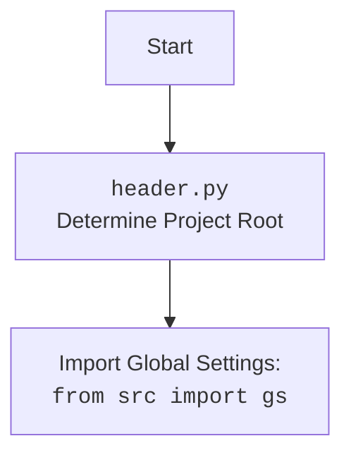

## ИНСТРУКЦИЯ:

Анализируй предоставленный код подробно и объясни его функциональность. Ответ должен включать три раздела:

1. **<алгоритм>**: Опиши рабочий процесс в виде пошаговой блок-схемы, включая примеры для каждого логического блока, и проиллюстрируй поток данных между функциями, классами или методами.
2.  **<mermaid>**: Напиши код для диаграммы в формате `mermaid`, проанализируй и объясни все зависимости,
    которые импортируются при создании диаграммы.
    **ВАЖНО!** Убедитесь, что все имена переменных, используемые в диаграмме `mermaid`,
    имеют осмысленные и описательные имена. Имена переменных вроде `A`, `B`, `C`, и т.д., не допускаются!

    **Дополнительно**: Если в коде есть импорт `import header`, добавьте блок `mermaid` flowchart, объясняющий `header.py`:
    ```mermaid
    flowchart TD
        Start --> Header[<code>header.py</code><br> Determine Project Root]

        Header --> import[Import Global Settings: <br><code>from src import gs</code>]
    ```

3.  **<объяснение>**: Предоставьте подробные объяснения:
    - **Импорты**: Их назначение и взаимосвязь с другими пакетами `src.`.
    - **Классы**: Их роль, атрибуты, методы и взаимодействие с другими компонентами проекта.
    - **Функции**: Их аргументы, возвращаемые значения, назначение и примеры.
    - **Переменные**: Их типы и использование.
    - Выделите потенциальные ошибки или области для улучшения.

Дополнительно, постройте цепочку взаимосвязей с другими частями проекта (если применимо).

Это обеспечивает всесторонний и структурированный анализ кода.
## Формат ответа: `.md` (markdown)
**КОНЕЦ ИНСТРУКЦИИ**

## <алгоритм>

1.  **`set_project_root(marker_files=('__root__','.git'))`**:
    *   **Начало**: Функция вызывается с кортежем `marker_files`, по умолчанию это `('__root__','.git')`.
    *   **Получение текущего пути**: Определяется абсолютный путь к текущему файлу, из которого вызывается функция, и затем его родительская директория.
        *   *Пример*: Если файл `header.py` находится в `/home/user/hypotez/src/endpoints/bots/`, то `current_path` будет `/home/user/hypotez/src/endpoints/bots`.
    *   **Инициализация `__root__`**: Переменной `__root__` присваивается значение `current_path`.
        *   *Пример*: `__root__` = `/home/user/hypotez/src/endpoints/bots`
    *   **Поиск корневой директории**: Происходит итерация по текущей директории и всем ее родительским директориям.
        *   Для каждой директории `parent` проверяется наличие файлов/папок из `marker_files`.
        *   *Пример*: Проверяется наличие файла `__root__` или папки `.git` в `/home/user/hypotez/src/endpoints/bots/`, затем в `/home/user/hypotez/src/endpoints/`, и так далее.
    *   **Условие остановки**: Если найден хотя бы один маркер (`__root__` или `.git`), то текущая директория `parent` устанавливается как корень (`__root__`), цикл завершается.
        *   *Пример*: Если папка `.git` была найдена в `/home/user/hypotez`, то `__root__` = `/home/user/hypotez`
    *   **Добавление корневой директории в `sys.path`**: Если `__root__` отсутствует в списке путей поиска модулей (`sys.path`), то она добавляется в начало списка.
        *   *Пример*: `/home/user/hypotez` добавляется в `sys.path`.
    *   **Возврат**: Функция возвращает путь к корневой директории `__root__`.

2.  **Инициализация `__root__`**:
    *   Вызывается `set_project_root()`, и результат (путь к корневой директории) присваивается глобальной переменной `__root__`.

3.  **Импорт `gs`**:
    *   Импортируется модуль `gs` из пакета `src`.
        *   Этот шаг предполагает, что в `sys.path` уже находится корень проекта, что обеспечивается предыдущими шагами.

4.  **Загрузка `settings.json`**:
    *   Инициализация переменной `settings` в `None`.
    *   Попытка открыть и прочитать файл `settings.json` из директории `src` относительно корня проекта.
        *   *Пример*: Открывается файл `/home/user/hypotez/src/settings.json`.
    *   Если файл успешно прочитан, содержимое парсится из JSON и сохраняется в переменной `settings`.
    *   В случае ошибки (файл не найден или JSON невалидный), `settings` остается `None`.

5.  **Загрузка `README.MD`**:
    *   Инициализация переменной `doc_str` в `None`.
    *   Попытка открыть и прочитать файл `README.MD` из директории `src` относительно корня проекта.
        *   *Пример*: Открывается файл `/home/user/hypotez/src/README.MD`.
    *   Если файл успешно прочитан, содержимое сохраняется в переменной `doc_str`.
    *   В случае ошибки (файл не найден), `doc_str` остается `None`.

6.  **Инициализация глобальных переменных**:
    *   Извлекаются значения из `settings` или устанавливаются значения по умолчанию, если файл `settings.json` не был загружен:
        *   `__project_name__`: Название проекта, по умолчанию `'hypotez'`.
        *   `__version__`: Версия проекта, по умолчанию `''`.
        *   `__doc__`: Документация проекта, содержимое `README.MD` или `''`.
        *   `__details__`: Детальная информация, по умолчанию `''`.
        *   `__author__`: Автор проекта, по умолчанию `''`.
        *   `__copyright__`: Авторское право, по умолчанию `''`.
        *   `__cofee__`: Сообщение для разработчика, по умолчанию сообщение с ссылкой на boosty.

## <mermaid>

```mermaid
flowchart TD
    Start[Start] --> FindProjectRoot
    FindProjectRoot[<code>set_project_root()</code><br>Find project root directory]
    FindProjectRoot --> SetRootPath[Set project root <code>__root__</code>]
    SetRootPath --> AddToSysPath[Add <code>__root__</code> to <code>sys.path</code>]
    AddToSysPath --> ImportGS[Import Global Settings: <br><code>from src import gs</code>]
    ImportGS --> LoadSettings[Load <code>settings.json</code>]
    LoadSettings --> LoadDoc[Load <code>README.MD</code>]
    LoadDoc --> SetProjectInfo[Set project info variables:<br><code>__project_name__, __version__, __doc__, etc.</code>]
    SetProjectInfo --> End[End]


    style Start fill:#f9f,stroke:#333,stroke-width:2px
    style End fill:#ccf,stroke:#333,stroke-width:2px
```


**Описание `mermaid` диаграммы:**

*   **`Start`**: Начало выполнения скрипта.
*   **`FindProjectRoot`**: Функция `set_project_root()` пытается определить корень проекта, поднимаясь по дереву каталогов от текущего файла.
*    **`SetRootPath`**: Устанавливает путь к корневой директории в переменную `__root__`.
*   **`AddToSysPath`**: Добавляет найденный корень проекта в `sys.path`, чтобы импорты модулей работали правильно.
*   **`ImportGS`**: Импортирует глобальные настройки из модуля `gs` из пакета `src`. Этот модуль, вероятно, содержит общие переменные и конфигурации проекта.
*   **`LoadSettings`**: Загружает файл `settings.json` в переменную `settings` (если он существует).
*    **`LoadDoc`**: Загружает содержимое `README.MD` в переменную `doc_str` (если он существует).
*   **`SetProjectInfo`**: Инициализирует глобальные переменные проекта (`__project_name__`, `__version__`, `__doc__`, и т.д.) на основе данных из `settings` или со значениями по умолчанию.
*   **`End`**: Конец выполнения.

## <объяснение>

**Импорты:**

*   `sys`: Модуль `sys` используется для работы с системными параметрами и функциями. В данном случае, `sys.path` используется для добавления корневой директории проекта в список путей, где Python ищет модули. Это позволяет импортировать модули из пакета `src`.
*   `json`: Модуль `json` используется для работы с данными в формате JSON. В данном случае, он используется для загрузки данных из файла `settings.json`.
*    `packaging.version`:  Используется для работы с версиями.
*   `pathlib.Path`: Модуль `pathlib` предоставляет способ работы с путями в файловой системе в объектно-ориентированном стиле. Здесь `Path` используется для определения путей к директориям и файлам.
*   `src.gs`: Импортируется модуль `gs` из пакета `src`. Этот модуль, предположительно, содержит глобальные настройки и константы, общие для проекта. Импорт `gs` в `header.py` позволяет использовать пути проекта.
**Функции:**
*   **`set_project_root(marker_files: tuple = ('__root__', '.git')) -> Path`**:
    *   **Аргументы**:
        *   `marker_files`: Кортеж строк, содержащий имена файлов или директорий, которые обозначают корень проекта. По умолчанию `('__root__', '.git')`.
    *   **Возвращаемое значение**: Объект `Path`, представляющий путь к корневой директории проекта.
    *   **Назначение**: Функция находит корневую директорию проекта, проходя вверх по иерархии каталогов, пока не найдет файл или директорию из `marker_files`. После обнаружения добавляет корневой путь в `sys.path`.
    *   **Пример**: Вызов `set_project_root()` может вернуть `Path('/home/user/hypotez')`, если в этой директории находится папка `.git` или файл `__root__`.
**Переменные:**
*   `__root__`: Глобальная переменная типа `Path`, хранит путь к корневой директории проекта.
*  `settings`: Глобальная переменная типа `dict`,  содержит настройки проекта, загруженные из файла `settings.json`, или `None`, если загрузка не удалась.
* `doc_str`: Глобальная переменная типа `str`, содержит документацию проекта, загруженную из файла `README.MD`, или `None`, если загрузка не удалась.
*   `__project_name__`: Глобальная переменная типа `str`,  содержит имя проекта, полученное из `settings` или значение по умолчанию `'hypotez'`.
*  `__version__`: Глобальная переменная типа `str`, содержит версию проекта, полученную из `settings` или значение по умолчанию `''`.
*  `__doc__`: Глобальная переменная типа `str`, содержит документацию проекта, полученную из `doc_str` или значение по умолчанию `''`.
*  `__details__`: Глобальная переменная типа `str`,  содержит детальную информацию о проекте.
*   `__author__`: Глобальная переменная типа `str`, содержит автора проекта, полученного из `settings` или значение по умолчанию `''`.
*   `__copyright__`: Глобальная переменная типа `str`, содержит авторское право, полученное из `settings` или значение по умолчанию `''`.
*   `__cofee__`: Глобальная переменная типа `str`, содержит ссылку на boosty, полученную из `settings` или значение по умолчанию `Treat the developer to a cup of coffee for boosting enthusiasm in development: https://boosty.to/hypo69`.

**Объяснение:**

Файл `header.py` предназначен для определения корневой директории проекта и загрузки глобальных настроек, а также для определения основных метаданных проекта.

1.  **Определение корневой директории**: Функция `set_project_root()` ищет корневую директорию проекта, начиная с текущей директории и поднимаясь вверх по дереву, пока не найдет маркерные файлы.  После этого добавляет найденный путь в `sys.path` для возможности импорта других модулей проекта.
2.  **Загрузка настроек**: Происходит попытка загрузки настроек из файла `settings.json`, расположенного в директории `src` относительно корня проекта.
3.  **Инициализация метаданных**:  Метаданные, такие как имя проекта, версия, документация и автор, извлекаются из файла `settings.json` или устанавливаются значения по умолчанию.
4.  **Взаимосвязь с другими частями проекта**: Этот файл является центральным, так как устанавливает корень проекта и загружает основные настройки, которые используются в других модулях проекта.

**Потенциальные ошибки и области для улучшения:**

*   **Обработка ошибок загрузки настроек**: Обработка ошибок при загрузке файла `settings.json` происходит через `try-except`, но при этом нет какой либо обработки ошибки.  В случае ошибки, переменная `settings` остается `None`. Можно добавить логирование ошибки и установить какие-либо значения по умолчанию.
*   **Обработка ошибок загрузки README.MD**: Обработка ошибок при загрузке файла `README.MD` происходит через `try-except`, но при этом нет какой либо обработки ошибки. В случае ошибки, переменная `doc_str` остается `None`. Можно добавить логирование ошибки и установить какие-либо значения по умолчанию.
*   **Жестко заданное имя файла настроек**: Имя файла настроек (`settings.json`) и `README.MD` жестко задано.  Можно сделать его настраиваемым через переменную среды или аргумент командной строки.
*   **Зависимость от наличия marker files**: Если marker files не найдены, корень проекта будет установлен в текущую директорию. Это может вызвать ошибки в работе проекта. Можно добавить проверки и выдавать предупреждение, если не удается найти корень проекта.

В целом, код выполняет свою функцию, но его можно сделать более гибким и надежным, добавив дополнительную обработку ошибок и конфигурацию.