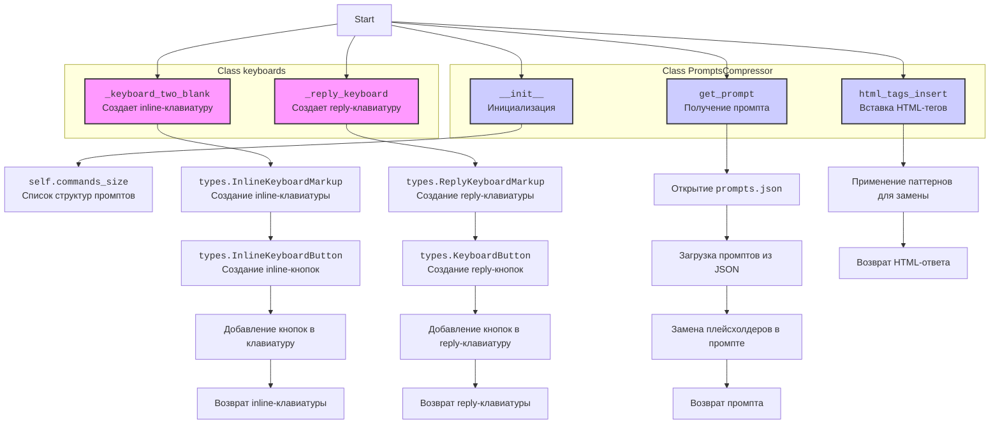

## ИНСТРУКЦИЯ:

Анализируй предоставленный код подробно и объясни его функциональность. Ответ должен включать три раздела:

1.  **<алгоритм>**: Опиши рабочий процесс в виде пошаговой блок-схемы, включая примеры для каждого логического блока, и проиллюстрируй поток данных между функциями, классами или методами.
2.  **<mermaid>**: Напиши код для диаграммы в формате `mermaid`, проанализируй и объясни все зависимости,
    которые импортируются при создании диаграммы.
    **ВАЖНО!** Убедитесь, что все имена переменных, используемые в диаграмме `mermaid`,
    имеют осмысленные и описательные имена. Имена переменных вроде `A`, `B`, `C`, и т.д., не допускаются!

    **Дополнительно**: Если в коде есть импорт `import header`, добавьте блок `mermaid` flowchart, объясняющий `header.py`:
    ```mermaid
    flowchart TD
        Start --> Header[<code>header.py</code><br> Determine Project Root]

        Header --> import[Import Global Settings: <br><code>from src import gs</code>]
    ```

3.  **<объяснение>**: Предоставьте подробные объяснения:
    -   **Импорты**: Их назначение и взаимосвязь с другими пакетами `src.`.
    -   **Классы**: Их роль, атрибуты, методы и взаимодействие с другими компонентами проекта.
    -   **Функции**: Их аргументы, возвращаемые значения, назначение и примеры.
    -   **Переменные**: Их типы и использование.
    -   Выделите потенциальные ошибки или области для улучшения.

Дополнительно, постройте цепочку взаимосвязей с другими частями проекта (если применимо).

Это обеспечивает всесторонний и структурированный анализ кода.
## Формат ответа: `.md` (markdown)
**КОНЕЦ ИНСТРУКЦИИ**

## <алгоритм>

### Класс `keyboards`
1.  **`_keyboard_two_blank(self, data: list[str], name: list[str]) -> types.InlineKeyboardMarkup`**:
    *   **Вход:** `data` (список callback_data для кнопок) и `name` (список текстов для кнопок).
    *   **Создание:** Инициализируется объект `types.InlineKeyboardMarkup` с шириной ряда 2.
    *   **Создание кнопок:** Для каждого элемента в `data` и `name` создается `types.InlineKeyboardButton` с соответствующими текстом и callback_data.
    *   **Формирование клавиатуры:**
        *   Если количество кнопок четное, они добавляются попарно в строку.
        *   Если количество кнопок нечетное, все кроме последней добавляются попарно, а последняя кнопка добавляется в отдельную строку.
    *   **Выход:** Возвращается сформированная inline-клавиатура.

        **Пример:**

        ```python
        keyboard_instance = keyboards()
        data_example = ["data1", "data2", "data3"]
        name_example = ["Кнопка 1", "Кнопка 2", "Кнопка 3"]
        keyboard = keyboard_instance._keyboard_two_blank(data_example, name_example)
        # Результат: Inline клавиатура с кнопками "Кнопка 1" ("data1"), "Кнопка 2" ("data2") в одной строке и "Кнопка 3" ("data3") в другой строке.
        ```
2.  **`_reply_keyboard(self, name: list[str]) -> types.ReplyKeyboardMarkup`**:
    *   **Вход:** `name` (список текстов для кнопок).
    *   **Создание:** Инициализируется объект `types.ReplyKeyboardMarkup` с возможностью изменения размера.
    *   **Создание кнопок:** Для каждого элемента в `name` создается `types.KeyboardButton`.
    *   **Формирование клавиатуры:** Каждая кнопка добавляется в отдельную строку.
    *   **Выход:** Возвращается сформированная reply-клавиатура.

        **Пример:**
        ```python
        keyboard_instance = keyboards()
        names_example = ["Кнопка A", "Кнопка B", "Кнопка C"]
        reply_keyboard = keyboard_instance._reply_keyboard(names_example)
        # Результат: Reply клавиатура с кнопками "Кнопка A", "Кнопка B", "Кнопка C" каждая в своей строке.
        ```

### Класс `PromptsCompressor`
1.  **`__init__(self)`**:
    *   **Инициализация:** Устанавливает атрибут `commands_size`, представляющий собой список списков, где каждый подсписок описывает структуру параметров для конкретного запроса (индекса).
2.  **`get_prompt(self, info: list[str], ind: int) -> str`**:
    *   **Вход:** `info` (список параметров для промпта) и `ind` (индекс промпта).
    *   **Чтение промптов:** Извлекает промпт из `prompts.json` по индексу `ind`.
    *   **Замена параметров:** Заменяет плейсхолдеры (например, `[TOPIC]`, `[TA]`) в промпте на соответствующие значения из `info`.
    *   **Выход:** Возвращает сформированный промпт.

        **Пример:**
        ```python
        compressor = PromptsCompressor()
        info_example = ["Тема 1", "ЦА 1", "Тон 1", "Структура 1", "Длина 1", "Дополнительно 1"]
        prompt = compressor.get_prompt(info_example, 0)
        #  Результат: сформированный промпт из prompts.json  с плейсхолдерами [TOPIC],[TA],[TONE],[STRUCT],[LENGTH],[EXTRA] замененными на "Тема 1", "ЦА 1", "Тон 1", "Структура 1", "Длина 1", "Дополнительно 1"
        ```
3.  **`html_tags_insert(response: str) -> str`**:
    *   **Вход:** `response` (текст ответа).
    *   **Определение паттернов:** Задан список паттернов для поиска и замены (например, `#### text` на `<b><u>text</u></b>`).
    *   **Замена тегов:** Замена всех найденных паттернов на HTML-теги в переданном тексте.
    *   **Выход:** Возвращает текст с HTML-тегами.

        **Пример:**
        ```python
        text_with_marks = "#### Заголовок \nтекст **жирный** *курсив* `код` ```python\nprint('Hello')\n```"
        html_text = PromptsCompressor.html_tags_insert(text_with_marks)
        # Результат: html текст :  "<b><u>Заголовок</u></b>\nтекст <b>жирный</b> <i>курсив</i> <code>код</code> <pre><code>\nprint('Hello')\n</code></pre>"
        ```

## <mermaid>


### Анализ зависимостей `mermaid`

*   **`types.InlineKeyboardMarkup`**:  Используется для создания inline клавиатуры, которые прикрепляются к сообщениям в Telegram и позволяют пользователям взаимодействовать с ботом, нажимая на кнопки.
*   **`types.InlineKeyboardButton`**: Используется для создания отдельных кнопок в inline клавиатуре. Каждая кнопка имеет текст и `callback_data`, которая передается боту при нажатии.
*   **`types.ReplyKeyboardMarkup`**: Используется для создания reply-клавиатур, которые отображаются пользователям внизу поля ввода и позволяют быстро выбирать варианты ответов.
*    **`types.KeyboardButton`**: Используется для создания отдельных кнопок в reply-клавиатуре.

## <объяснение>

### Импорты

*   `import json`: Используется для работы с JSON-файлами (чтение промптов).
*   `import re`: Используется для работы с регулярными выражениями (поиск и замена HTML-тегов).
*   `from telebot import types`: Импортирует модуль `types` из библиотеки `telebot`, который предоставляет классы для работы с клавиатурами (inline и reply).

### Классы

1.  **`keyboards`**:
    *   **Роль:**  Отвечает за создание различных типов клавиатур для Telegram бота.
    *   **Атрибуты:** Нет атрибутов.
    *   **Методы:**
        *   `_keyboard_two_blank(self, data: list[str], name: list[str]) -> types.InlineKeyboardMarkup`: Создает inline-клавиатуру с кнопками в два столбца.
            *   **Аргументы**:
                *   `data` (list[str]): Список `callback_data` для кнопок.
                *   `name` (list[str]): Список текстов для кнопок.
            *   **Возвращает**: `types.InlineKeyboardMarkup`: Готовую inline-клавиатуру.
            *   **Пример**:
                ```python
                keyboard = keyboards()._keyboard_two_blank(data=["1","2","3"], name=["one","two","three"])
                ```
                Создает inline-клавиатуру с кнопками "one","two","three".
        *   `_reply_keyboard(self, name: list[str])`: Создает reply-клавиатуру с кнопками, каждая в отдельной строке.
            *   **Аргументы**:
                *   `name` (list[str]): Список текстов для кнопок.
            *   **Возвращает**: `types.ReplyKeyboardMarkup`: Готовую reply-клавиатуру.
            *   **Пример**:
                ```python
                 keyboard = keyboards()._reply_keyboard(name=["one","two","three"])
                ```
                Создает reply-клавиатуру с кнопками "one","two","three".

2.  **`PromptsCompressor`**:
    *   **Роль:** Отвечает за управление и форматирование промптов, используемых для взаимодействия с моделями.
    *   **Атрибуты:**
        *   `commands_size`: Список списков, где каждый подсписок описывает структуру параметров для конкретного запроса (индекса).
    *   **Методы:**
        *   `__init__(self)`: Инициализирует список `commands_size`.
        *   `get_prompt(self, info: list[str], ind: int) -> str`: Получает промпт из JSON и заменяет плейсхолдеры на переданные значения.
            *   **Аргументы**:
                *   `info` (list[str]): Список параметров для промпта.
                *   `ind` (int): Индекс промпта в файле.
            *   **Возвращает**: `str`: Сформированный промпт.
            *    **Пример**:
                 ```python
                 prompts = PromptsCompressor()
                 prompt = prompts.get_prompt(info = ["test1","test2","test3","test4","test5","test6"],ind = 0)
                 ```
                 Возвращает текст промпта с замененными плейсхолдерами [TOPIC], [TA], [TONE], [STRUCT], [LENGTH], [EXTRA]
        *   `html_tags_insert(response: str) -> str`:  Вставляет HTML-теги в текст для форматирования.
            *   **Аргументы**:
                *   `response` (str): Строка для обработки.
            *   **Возвращает**: `str`: Строка с HTML-тегами.
            *   **Пример**:
                ```python
                html_text = PromptsCompressor.html_tags_insert("#### Заголовок \nтекст **жирный** *курсив* `код`")
                ```
                Возвращает: "<b><u>Заголовок</u></b>\nтекст <b>жирный</b> <i>курсив</i> <code>код</code>"

### Переменные

*   `data` (list[str]): Список, содержащий callback_data для inline-кнопок.
*   `name` (list[str]): Список, содержащий тексты для кнопок (как inline, так и reply).
*   `keyboard` (`types.InlineKeyboardMarkup`): Объект inline-клавиатуры.
*   `markup` (`types.ReplyKeyboardMarkup`): Объект reply-клавиатуры.
*   `buttons` (list[`types.InlineKeyboardButton`] or list[`types.KeyboardButton`]): Список кнопок.
*   `commands_size` (list[list[str]]): Список структур параметров для промптов.
*   `info` (list[str]): Список значений параметров для промпта.
*   `ind` (int): Индекс промпта.
*   `commands` (str): Текст промпта из JSON файла.
*  `response` (str): Текст ответа, к которому применяются HTML-теги.
*  `patterns` (list[tuple(str,str)]): Список кортежей, где первый элемент - регулярное выражение, а второй - строка для замены.
*   `file` (file): Файловый объект для чтения JSON файла.

### Потенциальные ошибки и области для улучшения

1.  **Обработка ошибок:**
    *   В `PromptsCompressor.get_prompt` отсутствует обработка исключений при открытии или чтении файла `prompts.json`.
    *   Не обрабатываются ошибки в случае, если индекс `ind` выходит за пределы допустимого диапазона.
    *   Необходимо добавить try-except блоки для обработки возможных ошибок.
2.  **Использование констант:**
    *   Путь к файлу `prompts.json` ("ToolBox/BaseSettings/prompts.json") используется напрямую в коде. Следует вынести его в константу.
3.  **Ограничения `_keyboard_two_blank`:**
    *   Функция `_keyboard_two_blank` создает кнопки только с шириной 2. Нужно добавить возможность задавать ширину.
4.  **Общая архитектура**:
    *   Оба класса  `keyboards` и `PromptsCompressor` можно сделать более гибкими, передавая параметры конфигурации через конструкторы. Это позволит использовать их в разных частях проекта с разными настройками.
5.  **Обработка HTML тегов**:
    *  В `html_tags_insert` не обрабатываются случаи, когда в ответе могут быть другие HTML теги, которые нужно экранировать, для правильного отображения.
### Взаимосвязь с другими частями проекта
*  Данные классы используются в основном для формирования ответов бота, предоставляя пользователю клавиатуры для ввода данных и корректно сформированные промпты для отправки запросов к моделям и возврата ответов. `keyboards` используется для создания клавиатур для управления ботом, а `PromptsCompressor` для работы с промптами. Эти классы  зависимы от `telebot` и `json`, и `re` библиотек и являются частью ядра логики бота.