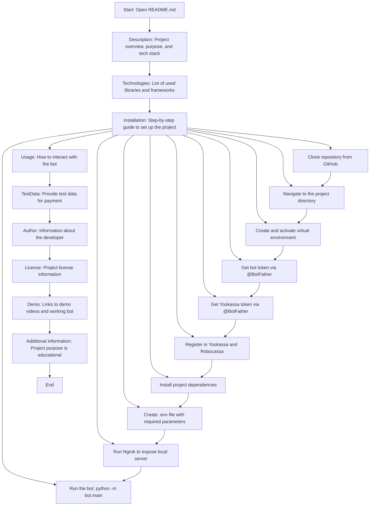

## Анализ кода `README.md`

### 1. <алгоритм>
Этот файл README.md представляет собой документацию к проекту Telegram-бота "Digital Market Hook", который является учебным проектом. Основная цель этого документа - предоставить всю необходимую информацию для развертывания, использования и понимания архитектуры бота.

**Пошаговая блок-схема:**

1.  **Начало**: Пользователь начинает изучение проекта с чтения README.md.
    *   _Пример_: Пользователь читает заголовок "Digital Market Hook".

2.  **Описание**: Пользователь знакомится с описанием проекта, его назначением (Telegram-бот для цифрового магазина), технологиями и используемыми платежными системами.
    *   _Пример_: Чтение раздела "Описание" о использовании веб-хуков и интеграции с ЮКассой, Telegram-Stars и Robocassa.

3.  **Технологии**: Пользователь изучает список используемых библиотек и технологий.
    *   _Пример_: Чтение раздела "Технологии", где перечисляются `aiogram`, `aiosqlite`, `loguru`, и другие.

4.  **Установка**: Пользователь следует инструкциям для настройки проекта:
    *   **Клонирование репозитория**:
        *   _Пример_: `git clone https://github.com/Yakvenalex/DigitalMarketHookBot.git`
    *   **Переход в директорию проекта**:
        *   _Пример_: `cd DigitalMarketHookBot`
    *   **Создание и активация виртуального окружения**:
        *   _Пример_: `python -m venv venv` и `source venv/bin/activate`
    *   **Получение токенов**:
        *   _Пример_: Получение токена бота и платежного токена ЮКассы через BotFather.
    *   **Регистрация в платежных системах**:
        *   _Пример_: Регистрация в ЮКассе и Робокассе.
    *   **Установка зависимостей**:
        *   _Пример_: `pip install -r requirements.txt`
    *   **Создание файла `.env`**:
        *   _Пример_: Установка переменных окружения `BOT_TOKEN`, `ADMIN_IDS`, `PROVIDER_TOKEN` и т.д.
    *   **Запуск Ngrok (для вебхуков)**:
        *    _Пример_: `ngrok http 8000` для создания публичного URL.
    *   **Запуск бота**:
        *   _Пример_: `python -m bot.main`

5.  **Использование**: Пользователь узнает, как взаимодействовать с ботом в Telegram, какие есть функции и как производится оплата.
    *   _Пример_: Чтение раздела "Использование" о тестовой оплате через ЮKassa, Робокасса и Telegram Stars.

6.  **Тестовые данные**: Пользователь получает тестовые данные для проверки оплат.
    *   _Пример_: Использование тестовой карты `1111 1111 1111 1026`, `12/26`, `000` для тестирования.

7. **Автор**: Пользователь знакомится с информацией об авторе проекта.
    *   _Пример_: Чтение раздела "Автор" с контактами разработчика.

8.  **Лицензия**: Пользователь узнает, под какой лицензией распространяется проект.
    *   _Пример_: Указание, что проект распространяется под лицензией MIT.

9.  **Демонстрация функционала**: Пользователь смотрит видео и тестирует работающего бота.
    *   _Пример_: Переход по ссылкам на видео демонстрации и на работающего бота.

10. **Дополнительная информация**: Пользователь узнает про назначение проекта, как учебного.
     *    _Пример_: Чтение раздела "Дополнительная информация" о некоммерческом характере проекта.

11. **Конец**: Пользователь получил всю необходимую информацию.

### 2. <mermaid>

**Описание зависимостей в `mermaid`:**

*   **Start:** Начало процесса анализа файла README.md.
*   **Description:** Описание проекта, его назначения и используемых технологий.
*   **Technologies:** Список используемых библиотек и фреймворков.
*   **Installation:** Раздел, описывающий пошаговую инструкцию для настройки проекта.
    *   **CloneRepo:** Шаг клонирования репозитория с GitHub.
    *   **ChangeDir:** Шаг перехода в директорию проекта.
    *   **Venv:** Шаг создания и активации виртуального окружения.
    *    **BotToken:** Шаг получения токена бота.
    *    **YookassaToken:** Шаг получения токена ЮКассы.
    *   **RegisterPayments:** Шаг регистрации в ЮКассе и Робокассе.
    *   **InstallDeps:** Шаг установки зависимостей проекта.
    *   **EnvFile:** Шаг создания файла `.env` с параметрами окружения.
    *   **RunNgrok:** Шаг запуска Ngrok для создания публичного URL.
    *   **RunBot:** Шаг запуска бота.
*   **Usage:** Раздел, описывающий, как взаимодействовать с ботом.
*  **TestData:** Раздел, описывающий тестовые данные для оплаты.
*   **Author:** Раздел, описывающий информацию об авторе проекта.
*   **License:** Раздел, описывающий информацию о лицензии проекта.
*   **Demo:** Раздел с демонстрационными материалами.
*   **AdditionalInfo:** Раздел с дополнительной информацией о некоммерческом назначении проекта.
*   **End:** Конец процесса анализа файла README.md.

### 3. <объяснение>

**Описание:**

Файл `README.md` представляет собой всеобъемлющее руководство для проекта "Digital Market Hook". Он предоставляет информацию о проекте, используемых технологиях, инструкцию по установке, а также демонстрационные материалы.

**Импорты:**
Файл `README.md` не содержит импортов, поскольку это файл документации, а не код Python.

**Классы:**
Файл `README.md` не содержит классов. Это файл с текстовым содержанием.

**Функции:**
Файл `README.md` не содержит функций. Он служит для описания проекта.

**Переменные:**
Файл `README.md` содержит переменные окружения, которые необходимо установить в файле `.env`. Эти переменные используются для настройки бота:

*   `BOT_TOKEN`: Токен Telegram-бота, полученный от @BotFather.
*   `ADMIN_IDS`: Список ID администраторов Telegram.
*   `PROVIDER_TOKEN`: Токен ЮКассы, полученный от @BotFather.
*   `SITE_URL`: URL для вебхуков.
*   `SITE_HOST`: Хост для вебсервера.
*   `SITE_PORT`: Порт для вебсервера.
*   `MRH_LOGIN`: Логин от Robocassa.
*  `MRH_PASS_1`: Пароль 1 от Robocassa.
* `MRH_PASS_2`: Пароль 2 от Robocassa.
*   `IN_TEST`: Флаг для работы Robocassa в тестовом или боевом режиме.

**Объяснения:**

*   **Описание проекта:**  Файл `README.md` является основным документом, который знакомит пользователя с проектом "Digital Market Hook". Он описывает функциональность бота, который является примером Telegram-бота для цифрового интернет-магазина с поддержкой вебхуков и трех платежных систем.
*   **Технологии:** Файл перечисляет используемые библиотеки, такие как `aiogram` для Telegram-бота, `aiosqlite` для работы с SQLite, `loguru` для логирования, `pydantic` для валидации данных и `aiohttp` для вебсервера. Это помогает пользователю понять технологический стек проекта.
*   **Инструкция по установке:** Файл подробно описывает процесс установки, включая клонирование репозитория, настройку виртуального окружения, установку зависимостей и настройку переменных окружения. Также есть инструкция по использованию Ngrok для работы вебхуков.
*   **Использование:** Файл содержит информацию о том, как пользователь может взаимодействовать с ботом и какие возможности предоставляет бот.
*   **Демонстрация:** Файл предоставляет ссылки на демонстрационные видео и на работающего бота, что позволяет пользователю увидеть функциональность проекта в действии.
*   **Тестовые данные:** Файл предоставляет тестовые данные для проверки оплат, это позволяет пользователю быстрее проверить функционал бота.
*   **Дополнительная информация:** Содержит уточнение о том, что проект имеет образовательные цели.

**Потенциальные ошибки и улучшения:**

*   **Необходимость Ngrok:** Использование Ngrok для вебхуков может быть временным решением. В будущем, при размещении на сервере, следует настроить статический IP и домен для вебхуков.
*   **Безопасность:**  Нужно обеспечить более безопасное хранение паролей и ключей.
*   **Обновление зависимостей**: Версии зависимостей не всегда являются актуальными. Рекомендуется всегда использовать актуальные версии библиотек.
*   **Улучшение описания**: Подробности о каждой из платежных систем можно было бы расширить.

**Взаимосвязь с другими частями проекта:**

*   `requirements.txt`: Файл `README.md` упоминает файл `requirements.txt`, который содержит список всех зависимостей, необходимых для работы проекта.
*   `.env`: Файл `README.md` требует создания файла `.env` для хранения переменных окружения, используемых в коде проекта.
*   `bot.main`:  Файл `README.md`  указывает на файл `bot.main` как на точку входа для запуска бота.
*   `src`: Структура `src` с кодом  описывается косвенно в разделе "Технологии", упоминанием библиотек.

Этот файл `README.md` является важным компонентом проекта, предоставляющим всю необходимую информацию для его использования и понимания.