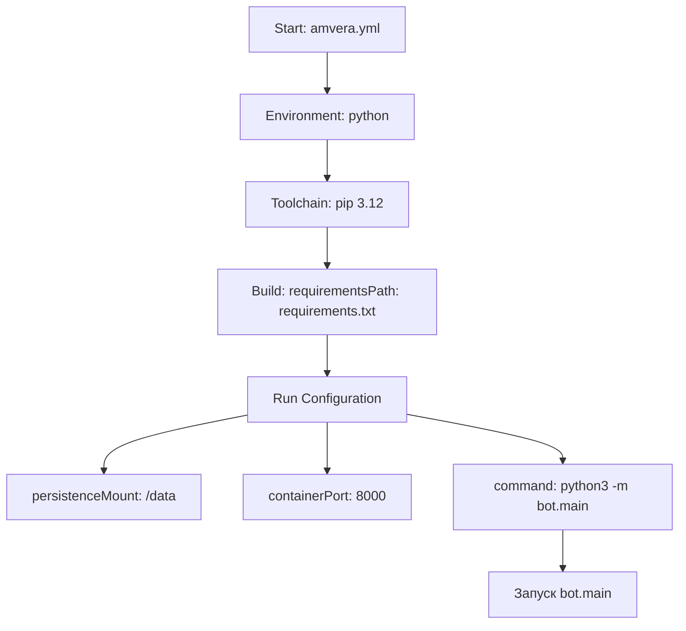

## Анализ кода `hypotez/src/endpoints/bots/telegram/digital_market/amvera.yml`

### <алгоритм>

1. **Начало**: Файл `amvera.yml` начинается с определения метаданных для окружения Python.
2. **Окружение (environment)**: Указывается, что используется Python.
3. **Инструменты (toolchain)**: Определяется, что используется `pip` для управления пакетами и указана версия Python 3.12.
4. **Сборка (build)**: Определяется путь `requirements.txt` для установки зависимостей.
5. **Запуск (run)**:
   - `persistenceMount`: Указывается точка монтирования `/data` для сохранения данных.
   - `containerPort`: Указывается, что контейнер слушает порт 8000.
   - `command`: Определяется команда для запуска приложения - `python3 -m bot.main`, указывающая на запуск модуля `main` внутри пакета `bot`.

**Пример:**

- **environment**: `python` -  указывает на использование Python в качестве языка.
- **toolchain**: `pip` и версия `3.12` -  указывают на использование `pip` для управления пакетами Python и на точную версию Python, которая должна быть использована.
- **build**: `requirementsPath: requirements.txt` -  означает, что все зависимости проекта, будут установлены из файла `requirements.txt`.
- **run**: 
    - `persistenceMount: /data` - означает, что папка `/data` внутри контейнера, будет сохраняться между перезапусками.
    - `containerPort: 8000` - означает, что приложение будет доступно на порту 8000 внутри контейнера.
    - `command: python3 -m bot.main` - команда, запускающая приложение, то есть Python будет интерпретировать модуль `main` внутри пакета `bot`.
### <mermaid>

**Объяснение зависимостей:**

-   Диаграмма начинается с `Start`, представляющего начало анализа файла `amvera.yml`.
-   `Environment: python` указывает на используемое окружение Python.
-   `Toolchain: pip 3.12` показывает, что используется `pip` для управления пакетами Python версии 3.12.
-   `Build: requirementsPath: requirements.txt` указывает, что зависимости проекта находятся в файле `requirements.txt`.
-   `Run Configuration` представляет настройки для запуска приложения.
-   `persistenceMount: /data` показывает точку монтирования для сохранения данных.
-   `containerPort: 8000` обозначает порт, на котором запущено приложение.
-   `command: python3 -m bot.main` указывает на команду для запуска приложения.
-   `BotStart` представляет собой запуск модуля `main` внутри пакета `bot`.

### <объяснение>

**Общее описание:**

Файл `amvera.yml` является конфигурационным файлом для развертывания приложения в окружении Amvera. Он содержит метаданные, настройки сборки и запуска приложения. Файл определяет, как приложение будет собрано, какие зависимости должны быть установлены и как приложение должно быть запущено.

**Детальное объяснение:**

- **`environment: python`**:  Указывает, что приложение разработано на языке Python. Это необходимо для Amvera, чтобы определить, как правильно настроить среду выполнения.
- **`toolchain`**:
    - `name: pip`:  Используется менеджер пакетов `pip` для установки зависимостей.
    - `version: 3.12`: Указывает версию Python 3.12, которая должна использоваться. Это гарантирует, что приложение будет работать в предсказуемой среде с нужными версиями пакетов.
- **`build`**:
    - `requirementsPath: requirements.txt`:  Указывает на файл `requirements.txt`, в котором перечислены все Python-библиотеки, необходимые для работы приложения. Amvera использует этот файл для установки зависимостей перед запуском приложения.
- **`run`**:
    - `persistenceMount: /data`:  Указывает, что директория `/data` внутри контейнера должна быть сохранена между перезапусками приложения. Это позволяет сохранять данные, созданные во время работы приложения.
    - `containerPort: 8000`:  Указывает, что приложение слушает порт 8000 внутри контейнера. Этот порт будет использоваться для доступа к приложению извне.
    - `command: python3 -m bot.main`:  Это команда, которая выполняется для запуска приложения. Она указывает, что Python должен выполнить модуль `main` внутри пакета `bot`. Обычно `bot.main` содержит точку входа в приложение, которое может включать в себя запуск Telegram бота или другого типа сервиса.

**Цепочка взаимосвязей с другими частями проекта:**
- `requirements.txt`:  Файл, который содержит список всех Python-пакетов, необходимых для работы приложения. Этот файл критически важен для сборки проекта.
- `bot/main.py`: Модуль, который является точкой входа в приложение. Он отвечает за запуск всего функционала, описанного в файле `amvera.yml`.

**Потенциальные проблемы и улучшения:**

- **Отсутствие описания `bot`**: Файл `amvera.yml` не описывает конкретное содержимое `bot.main`. Для отладки и понимания работы всего приложения, необходимо дополнительное понимание структуры и функциональности модуля `bot.main`.
- **Отсутствие деталей окружения**: Не указаны какие-либо специфические переменные окружения.
- **Версия Python**: Указана жестко версия Python 3.12, что может привести к проблемам, если проект зависим от более новых версий языка.
- **Отсутствие Dockerfile**: Если приложение требует специфической настройки окружения, то использование Dockerfile может упростить сборку и развертывание.

**Резюме:**

Файл `amvera.yml` - это конфигурационный файл для Amvera, который описывает основные аспекты запуска приложения, включая среду выполнения, зависимости и команду для запуска. Он предоставляет базовую конфигурацию, но требует дополнительных деталей (таких как структура проекта, его логика и т.д.) для полного понимания и отладки.