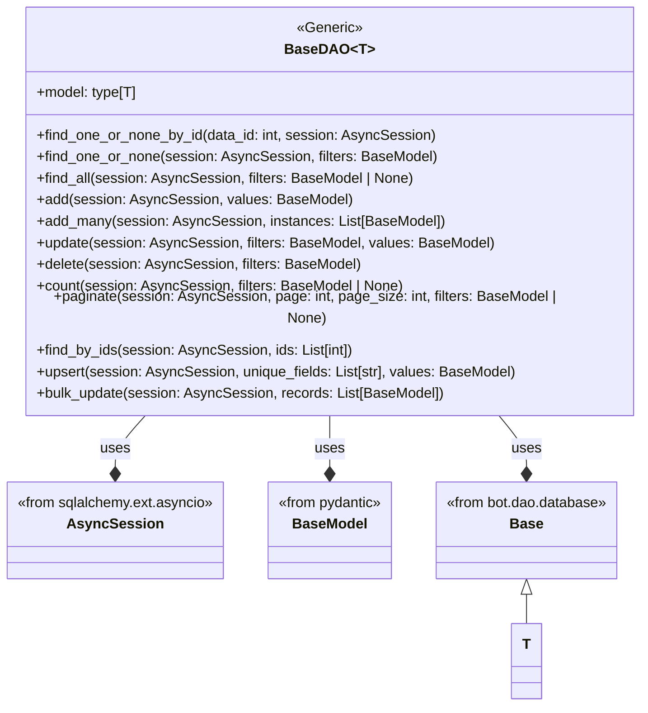

## ИНСТРУКЦИЯ:

Анализируй предоставленный код подробно и объясни его функциональность. Ответ должен включать три раздела:  

1. **<алгоритм>**: Опиши рабочий процесс в виде пошаговой блок-схемы, включая примеры для каждого логического блока, и проиллюстрируй поток данных между функциями, классами или методами.  
2. **<mermaid>**: Напиши код для диаграммы в формате `mermaid`, проанализируй и объясни все зависимости, 
    которые импортируются при создании диаграммы. 
    **ВАЖНО!** Убедитесь, что все имена переменных, используемые в диаграмме `mermaid`, 
    имеют осмысленные и описательные имена. Имена переменных вроде `A`, `B`, `C`, и т.д., не допускаются!  
    
    **Дополнительно**: Если в коде есть импорт `import header`, добавьте блок `mermaid` flowchart, объясняющий `header.py`:\
    ```mermaid
    flowchart TD
        Start --> Header[<code>header.py</code><br> Determine Project Root]
    
        Header --> import[Import Global Settings: <br><code>from src import gs</code>] 
    ```

3. **<объяснение>**: Предоставьте подробные объяснения:  
   - **Импорты**: Их назначение и взаимосвязь с другими пакетами `src.`.  
   - **Классы**: Их роль, атрибуты, методы и взаимодействие с другими компонентами проекта.  
   - **Функции**: Их аргументы, возвращаемые значения, назначение и примеры.  
   - **Переменные**: Их типы и использование.  
   - Выделите потенциальные ошибки или области для улучшения.  

Дополнительно, постройте цепочку взаимосвязей с другими частями проекта (если применимо).  

Это обеспечивает всесторонний и структурированный анализ кода.
## Формат ответа: `.md` (markdown)
**КОНЕЦ ИНСТРУКЦИИ**
## Алгоритм:

### Класс `BaseDAO`

1.  **Инициализация**: Класс `BaseDAO` является дженериком, принимающим тип `T`, который должен быть наследником `Base` (модели SQLAlchemy). Он предназначен для выполнения базовых операций с базой данных.
    
2.  **`find_one_or_none_by_id(cls, data_id: int, session: AsyncSession)`**:
    *   Принимает `data_id` (целочисленный идентификатор) и `session` (асинхронная сессия БД).
    *   Формирует запрос `SELECT * FROM cls.model WHERE id = data_id`.
    *   Выполняет запрос, возвращает одну запись или `None`.
    *   Пример: `await BaseDAO.find_one_or_none_by_id(123, session)`
    
3.  **`find_one_or_none(cls, session: AsyncSession, filters: BaseModel)`**:
    *   Принимает `session` и `filters` (модель Pydantic).
    *   Преобразует `filters` в словарь (`filter_dict`).
    *   Формирует запрос `SELECT * FROM cls.model WHERE <filters>`.
    *   Выполняет запрос, возвращает одну запись или `None`.
    *   Пример: `await BaseDAO.find_one_or_none(session, UserFilter(name="John"))`
    
4.  **`find_all(cls, session: AsyncSession, filters: BaseModel | None = None)`**:
    *   Принимает `session` и опциональные `filters`.
    *   Преобразует `filters` в словарь (если есть).
    *   Формирует запрос `SELECT * FROM cls.model WHERE <filters>`.
    *   Выполняет запрос, возвращает список всех записей.
    *   Пример: `await BaseDAO.find_all(session, UserFilter(age=30))`
    
5.  **`add(cls, session: AsyncSession, values: BaseModel)`**:
    *   Принимает `session` и `values` (модель Pydantic).
    *   Преобразует `values` в словарь (`values_dict`).
    *   Создаёт новый экземпляр модели `cls.model` с данными из `values_dict`.
    *   Добавляет новый экземпляр в сессию.
    *   Пример: `await BaseDAO.add(session, UserCreate(name="Alice", age=25))`
    
6.  **`add_many(cls, session: AsyncSession, instances: List[BaseModel])`**:
    *   Принимает `session` и список `instances` (моделей Pydantic).
    *   Преобразует список `instances` в список словарей `values_list`.
    *   Создаёт список экземпляров модели `cls.model` из `values_list`.
    *   Добавляет все экземпляры в сессию.
    *   Пример: `await BaseDAO.add_many(session, [UserCreate(name="Bob"), UserCreate(name="Eve")])`

7.  **`update(cls, session: AsyncSession, filters: BaseModel, values: BaseModel)`**:
    *   Принимает `session`, `filters` и `values` (модели Pydantic).
    *   Преобразует `filters` и `values` в словари.
    *   Формирует запрос `UPDATE cls.model SET <values> WHERE <filters>`.
    *   Выполняет запрос, возвращает количество обновленных строк.
    *   Пример: `await BaseDAO.update(session, UserFilter(id=1), UserUpdate(age=31))`
    
8.  **`delete(cls, session: AsyncSession, filters: BaseModel)`**:
    *   Принимает `session` и `filters` (модель Pydantic).
    *   Преобразует `filters` в словарь.
    *   Формирует запрос `DELETE FROM cls.model WHERE <filters>`.
    *   Выполняет запрос, возвращает количество удаленных строк.
    *   Пример: `await BaseDAO.delete(session, UserFilter(name="Bob"))`
    
9.  **`count(cls, session: AsyncSession, filters: BaseModel | None = None)`**:
    *   Принимает `session` и опциональные `filters`.
    *   Преобразует `filters` в словарь (если есть).
    *   Формирует запрос `SELECT COUNT(*) FROM cls.model WHERE <filters>`.
    *   Выполняет запрос, возвращает количество записей.
    *   Пример: `await BaseDAO.count(session, UserFilter(age=25))`
    
10. **`paginate(cls, session: AsyncSession, page: int = 1, page_size: int = 10, filters: BaseModel = None)`**:
    *   Принимает `session`, номер страницы `page`, размер страницы `page_size` и опциональные `filters`.
    *   Преобразует `filters` в словарь (если есть).
    *   Формирует запрос `SELECT * FROM cls.model WHERE <filters> LIMIT page_size OFFSET (page - 1) * page_size`.
    *   Выполняет запрос, возвращает список записей для заданной страницы.
    *   Пример: `await BaseDAO.paginate(session, page=2, page_size=10, UserFilter(age=30))`

11. **`find_by_ids(cls, session: AsyncSession, ids: List[int])`**:
    *   Принимает `session` и список `ids`.
    *    Формирует запрос `SELECT * FROM cls.model WHERE id IN ids`.
    *   Выполняет запрос, возвращает список записей.
    *   Пример: `await BaseDAO.find_by_ids(session, [1, 2, 3])`
    
12. **`upsert(cls, session: AsyncSession, unique_fields: List[str], values: BaseModel)`**:
    *   Принимает `session`, список уникальных полей `unique_fields`, и `values` (модель Pydantic).
    *   Проверяет, существует ли запись с уникальными полями.
    *   Если запись существует, обновляет её; если нет, создаёт новую.
    *   Пример: `await BaseDAO.upsert(session, ["email"], UserUpsert(email="test@test.com", name="Test"))`

13. **`bulk_update(cls, session: AsyncSession, records: List[BaseModel])`**:
    *    Принимает `session` и список `records` (модели Pydantic).
    *   Проходит по списку записей и формирует запрос `UPDATE cls.model SET values WHERE id = record.id`.
    *   Выполняет запросы, возвращает количество обновленных строк.
    *   Пример: `await BaseDAO.bulk_update(session, [UserUpdate(id=1, name="New Name"), UserUpdate(id=2, age=40)])`
    
### Общий поток данных:
1. Вызывается один из методов `BaseDAO`.
2. Данные из Pydantic моделей преобразуются в словари.
3. Формируется SQL запрос с использованием SQLAlchemy.
4. Запрос выполняется с использованием асинхронной сессии.
5. Результат возвращается вызывающей стороне.

## Mermaid:



### Зависимости:

*   `BaseDAO` - основной класс, выполняющий операции с базой данных.
*   `AsyncSession` - класс из `sqlalchemy.ext.asyncio`, предоставляющий асинхронную сессию для работы с базой данных.
*   `BaseModel` - класс из `pydantic`, используемый для валидации и преобразования данных.
*   `Base` - класс из `bot.dao.database`, базовый класс для моделей SQLAlchemy.
*   `T` - типовой параметр, представляющий модель SQLAlchemy, наследующую от `Base`.

## Объяснение:

### Импорты:

*   `typing`:
    *   `List`, `Any`, `TypeVar`, `Generic` - используются для аннотаций типов, дженериков и работы со списками.
*   `pydantic`:
    *   `BaseModel` - используется для создания моделей данных, валидации и преобразования.
*   `sqlalchemy.exc`:
    *   `SQLAlchemyError` - используется для перехвата исключений, связанных с SQLAlchemy.
*   `sqlalchemy.future`:
    *   `select` - используется для создания запросов SELECT.
*   `sqlalchemy`:
    *   `update as sqlalchemy_update`, `delete as sqlalchemy_delete`, `func` - используются для создания запросов UPDATE, DELETE и для SQL функций.
*   `loguru`:
    *   `logger` - используется для логирования.
*   `sqlalchemy.ext.asyncio`:
    *   `AsyncSession` - используется для асинхронных сессий с базой данных.
*   `bot.dao.database`:
    *   `Base` - используется как базовый класс для SQLAlchemy моделей, к которым будет применяться BaseDAO.

### Классы:

*   `BaseDAO(Generic[T])`:
    *   **Роль**: Абстрактный класс для доступа к данным в БД, реализует общие CRUD операции.
    *   **Атрибуты**: `model: type[T]` - модель SQLAlchemy, с которой работает DAO.
    *   **Методы**:
        *   `find_one_or_none_by_id`: Поиск одной записи по ID.
        *   `find_one_or_none`: Поиск одной записи по фильтрам.
        *   `find_all`: Поиск всех записей по фильтрам.
        *   `add`: Добавление одной записи.
        *   `add_many`: Добавление нескольких записей.
        *   `update`: Обновление записей по фильтрам.
        *   `delete`: Удаление записей по фильтрам.
        *   `count`: Подсчет количества записей по фильтрам.
        *   `paginate`: Пагинация записей.
        *   `find_by_ids`: Поиск нескольких записей по списку ID.
        *   `upsert`: Создание или обновление записи.
        *   `bulk_update`: Массовое обновление записей.
    *   **Взаимодействие**: Работает с моделями SQLAlchemy, используя асинхронную сессию.

### Функции (методы класса `BaseDAO`):

*   **`find_one_or_none_by_id(cls, data_id: int, session: AsyncSession)`**:
    *   **Аргументы**:
        *   `data_id`: Целочисленный идентификатор записи.
        *   `session`: Асинхронная сессия базы данных.
    *   **Возвращает**: Найденная запись типа `T` или `None`.
    *   **Назначение**: Поиск записи по ID.
*   **`find_one_or_none(cls, session: AsyncSession, filters: BaseModel)`**:
    *   **Аргументы**:
        *   `session`: Асинхронная сессия базы данных.
        *   `filters`: Модель Pydantic, содержащая фильтры.
    *   **Возвращает**: Найденная запись типа `T` или `None`.
    *   **Назначение**: Поиск одной записи по фильтрам.
*   **`find_all(cls, session: AsyncSession, filters: BaseModel | None = None)`**:
    *   **Аргументы**:
        *   `session`: Асинхронная сессия базы данных.
        *   `filters`: Опциональная модель Pydantic, содержащая фильтры.
    *   **Возвращает**: Список всех записей типа `List[T]`.
    *   **Назначение**: Поиск всех записей по фильтрам.
*   **`add(cls, session: AsyncSession, values: BaseModel)`**:
    *   **Аргументы**:
        *   `session`: Асинхронная сессия базы данных.
        *   `values`: Модель Pydantic, содержащая значения для создания записи.
    *   **Возвращает**: Созданная запись типа `T`.
    *   **Назначение**: Создание новой записи.
*   **`add_many(cls, session: AsyncSession, instances: List[BaseModel])`**:
    *   **Аргументы**:
        *   `session`: Асинхронная сессия базы данных.
        *   `instances`: Список моделей Pydantic, содержащих значения для создания записей.
    *   **Возвращает**: Список созданных записей типа `List[T]`.
    *   **Назначение**: Создание нескольких новых записей.
*   **`update(cls, session: AsyncSession, filters: BaseModel, values: BaseModel)`**:
    *   **Аргументы**:
        *   `session`: Асинхронная сессия базы данных.
        *   `filters`: Модель Pydantic, содержащая фильтры для обновления.
        *   `values`: Модель Pydantic, содержащая значения для обновления.
    *   **Возвращает**: Количество обновленных строк типа `int`.
    *   **Назначение**: Обновление записей по фильтрам.
*   **`delete(cls, session: AsyncSession, filters: BaseModel)`**:
    *   **Аргументы**:
        *   `session`: Асинхронная сессия базы данных.
        *   `filters`: Модель Pydantic, содержащая фильтры для удаления.
    *   **Возвращает**: Количество удаленных строк типа `int`.
    *   **Назначение**: Удаление записей по фильтрам.
*   **`count(cls, session: AsyncSession, filters: BaseModel | None = None)`**:
    *   **Аргументы**:
        *   `session`: Асинхронная сессия базы данных.
        *   `filters`: Опциональная модель Pydantic, содержащая фильтры.
    *   **Возвращает**: Количество записей типа `int`.
    *   **Назначение**: Подсчет количества записей по фильтрам.
*   **`paginate(cls, session: AsyncSession, page: int = 1, page_size: int = 10, filters: BaseModel = None)`**:
    *   **Аргументы**:
        *   `session`: Асинхронная сессия базы данных.
        *   `page`: Номер страницы типа `int`.
        *   `page_size`: Размер страницы типа `int`.
        *   `filters`: Опциональная модель Pydantic, содержащая фильтры.
    *   **Возвращает**: Список записей для заданной страницы типа `List[T]`.
    *   **Назначение**: Пагинация записей.
*    **`find_by_ids(cls, session: AsyncSession, ids: List[int])`**:
    *   **Аргументы**:
        *   `session`: Асинхронная сессия базы данных.
        *   `ids`: Список ID для поиска.
    *   **Возвращает**: Список записей типа `List[T]`.
    *   **Назначение**: Поиск нескольких записей по списку ID.
*   **`upsert(cls, session: AsyncSession, unique_fields: List[str], values: BaseModel)`**:
    *   **Аргументы**:
        *   `session`: Асинхронная сессия базы данных.
        *   `unique_fields`: Список строк, определяющих уникальность записи.
        *   `values`: Модель Pydantic, содержащая значения для создания или обновления записи.
    *   **Возвращает**: Созданная или обновленная запись типа `T`.
    *   **Назначение**: Создание или обновление записи в зависимости от наличия.
*   **`bulk_update(cls, session: AsyncSession, records: List[BaseModel])`**:
    *   **Аргументы**:
        *   `session`: Асинхронная сессия базы данных.
        *   `records`: Список моделей Pydantic, содержащих данные для обновления.
    *   **Возвращает**: Количество обновленных записей типа `int`.
    *   **Назначение**: Массовое обновление записей.

### Переменные:

*   `T = TypeVar("T", bound=Base)`:
    *   **Тип**: TypeVar (типовая переменная)
    *   **Использование**: Определяет дженерик тип `T`, который должен быть наследником `Base` (модели SQLAlchemy).
*   `filter_dict`, `values_dict`:
    *   **Тип**: `dict`
    *   **Использование**: Используются для хранения данных из Pydantic моделей в виде словарей для формирования SQL-запросов.
*  `query`:
    *   **Тип**: `sqlalchemy.sql.selectable.Select` или `sqlalchemy.sql.dml.Update` или `sqlalchemy.sql.dml.Delete`
    *   **Использование**:  Хранит сгенерированный SQL запрос.
*   `result`:
    *   **Тип**: `sqlalchemy.engine.cursor.CursorResult`
    *   **Использование**: Хранит результат выполнения SQL запроса.
*   `record`, `records`, `new_instance`, `new_instances`:
    *   **Тип**: `T`, `List[T]`
    *   **Использование**: Хранят объекты моделей, полученные из БД.
* `updated_count`:
    *   **Тип**: `int`
    *   **Использование**: Хранит счетчик обновленных записей в `bulk_update`.
* `stmt`:
    *   **Тип**: `sqlalchemy.sql.dml.Update`
    *   **Использование**: Хранит SQL запрос на обновление в `bulk_update`.

### Потенциальные ошибки и области для улучшения:

1.  **Обработка ошибок**: Все ошибки SQLALchemy перехватываются, логируются и пробрасываются дальше. Стоит добавить кастомные исключения.
2.  **Валидация**: Не производится дополнительная валидация данных, кроме pydantic. Стоит добавить дополнительные проверки.
3.  **Пагинация**: Можно добавить общую сумму записей в ответ `paginate`.
4.  **Bulk update**:  В `bulk_update` используется цикл, что может быть неэффективно при большом количестве записей, стоит использовать более оптимизированный метод.
5.  **Безопасность**: Отсутствует проверка на SQL инъекции, хотя использование SQLAlchemy от этого защищает, но стоит использовать параметризацию для дополнительных проверок.
6.  **Логирование**: Логирование можно сделать более детальным, например, добавив вывод SQL запросов.

### Цепочка взаимосвязей:

*   `BaseDAO` используется как базовый класс для создания DAO для конкретных моделей SQLAlchemy.
*   Модели Pydantic используются для валидации входных данных.
*   SQLAlchemy используется для работы с базой данных.
*   Логирование производится с помощью loguru.

В целом, этот код предоставляет мощный и гибкий способ работы с базой данных в асинхронном режиме.