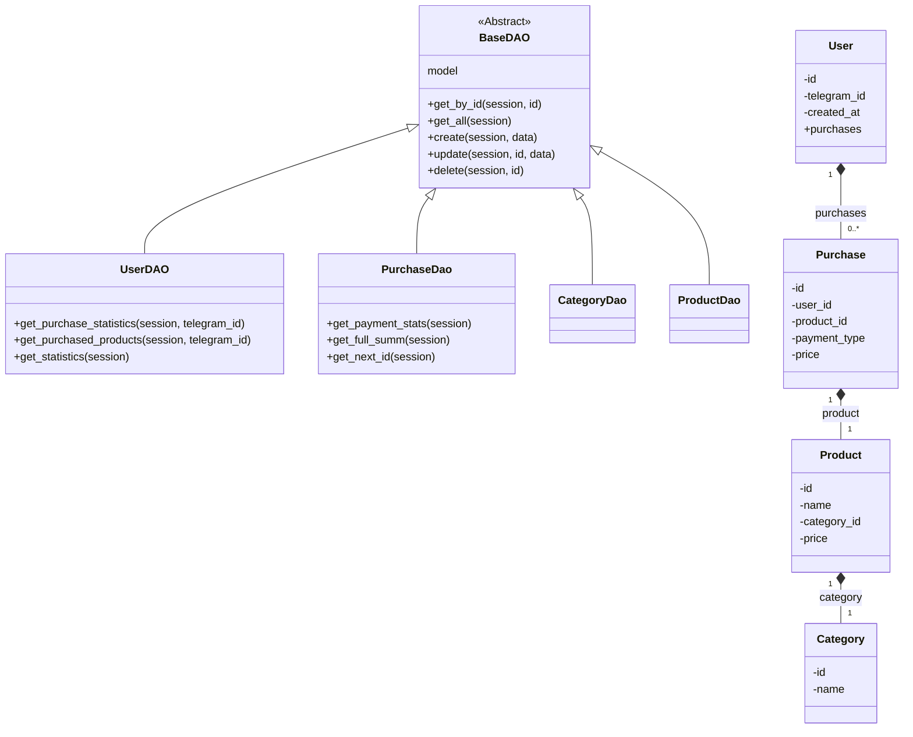

## ИНСТРУКЦИЯ:

Анализируй предоставленный код подробно и объясни его функциональность. Ответ должен включать три раздела:  

1. **<алгоритм>**: Опиши рабочий процесс в виде пошаговой блок-схемы, включая примеры для каждого логического блока, и проиллюстрируй поток данных между функциями, классами или методами.  
2. **<mermaid>**: Напиши код для диаграммы в формате `mermaid`, проанализируй и объясни все зависимости, 
    которые импортируются при создании диаграммы. 
    **ВАЖНО!** Убедитесь, что все имена переменных, используемые в диаграмме `mermaid`, 
    имеют осмысленные и описательные имена. Имена переменных вроде `A`, `B`, `C`, и т.д., не допускаются!  
    
    **Дополнительно**: Если в коде есть импорт `import header`, добавьте блок `mermaid` flowchart, объясняющий `header.py`:
    ```mermaid
    flowchart TD
        Start --> Header[<code>header.py</code><br> Determine Project Root]
    
        Header --> import[Import Global Settings: <br><code>from src import gs</code>] 
    ```

3. **<объяснение>**: Предоставьте подробные объяснения:  
   - **Импорты**: Их назначение и взаимосвязь с другими пакетами `src.`.  
   - **Классы**: Их роль, атрибуты, методы и взаимодействие с другими компонентами проекта.  
   - **Функции**: Их аргументы, возвращаемые значения, назначение и примеры.  
   - **Переменные**: Их типы и использование.  
   - Выделите потенциальные ошибки или области для улучшения.  

Дополнительно, постройте цепочку взаимосвязей с другими частями проекта (если применимо).  

Это обеспечивает всесторонний и структурированный анализ кода.
## Формат ответа: `.md` (markdown)
**КОНЕЦ ИНСТРУКЦИИ**

## <алгоритм>

**UserDAO**

1.  **get_purchase_statistics**:
    *   Принимает `AsyncSession` и `telegram_id`.
    *   Создает SQL-запрос для подсчета общего количества покупок и общей суммы для указанного пользователя (`telegram_id`).
    *   Исполняет запрос.
    *   Если результаты есть, возвращает словарь с `total_purchases` и `total_amount`.
    *   Если результатов нет, возвращает `None`.
    *   При возникновении ошибки БД, ловит ее, печатает сообщение об ошибке и возвращает `None`.
    *   _Пример_:
        *   Входные данные: `session`, `telegram_id=12345`.
        *   SQL-запрос: `SELECT COUNT(purchase.id) AS total_purchases, SUM(purchase.price) AS total_amount FROM purchase JOIN user ON purchase.user_id = user.id WHERE user.telegram_id = 12345;`.
        *   Выходные данные: `{'total_purchases': 5, 'total_amount': 1500}`
2.  **get_purchased_products**:
    *   Принимает `AsyncSession` и `telegram_id`.
    *   Создает SQL-запрос для получения пользователя (`telegram_id`) и его покупок, включая связанные продукты.
    *   Исполняет запрос.
    *   Если пользователь найден, возвращает список его покупок.
    *   Если пользователь не найден, возвращает `None`.
    *   При возникновении ошибки БД, ловит ее, печатает сообщение об ошибке и возвращает `None`.
    *   _Пример_:
        *   Входные данные: `session`, `telegram_id=12345`.
        *  SQL-запрос: `SELECT user.* FROM user WHERE user.telegram_id = 12345`.
        *  SQL-запрос: `SELECT purchase.* FROM purchase WHERE purchase.user_id IN (SELECT user.id FROM user WHERE user.telegram_id = 12345)`.
        *   SQL-запрос: `SELECT product.* FROM product WHERE product.id IN (SELECT purchase.product_id FROM purchase WHERE purchase.user_id IN (SELECT user.id FROM user WHERE user.telegram_id = 12345))`.
        *   Выходные данные: `[Purchase(id=1, product=Product(...), ...), Purchase(id=2, product=Product(...), ...)]`.
3.  **get_statistics**:
    *   Принимает `AsyncSession`.
    *   Определяет текущее время в UTC.
    *   Создает SQL-запрос для подсчета общего количества пользователей, новых пользователей за сегодня, неделю и месяц.
    *   Исполняет запрос.
    *   Возвращает словарь со статистикой.
    *   При возникновении ошибки БД, ловит ее, логирует и пробрасывает ошибку.
    *   _Пример_:
        *   Входные данные: `session`.
        *   SQL-запрос: `SELECT COUNT(*) AS total_users, SUM(CASE WHEN created_at >= now() - interval '1 day' THEN 1 ELSE 0 END) AS new_today, SUM(CASE WHEN created_at >= now() - interval '7 day' THEN 1 ELSE 0 END) AS new_week, SUM(CASE WHEN created_at >= now() - interval '30 day' THEN 1 ELSE 0 END) AS new_month FROM user;`.
        *   Выходные данные: `{'total_users': 100, 'new_today': 5, 'new_week': 20, 'new_month': 50}`

**PurchaseDao**

1.  **get_payment_stats**:
    *   Принимает `AsyncSession`.
    *   Создает SQL-запрос для получения статистики сумм покупок, сгруппированных по типу оплаты.
    *   Исполняет запрос.
    *   Форматирует результаты в строку, включая суммы для `yukassa`, `robocassa`, и `stars`.
    *   Возвращает форматированную строку.
    *   _Пример_:
        *   Входные данные: `session`.
        *   SQL-запрос: `SELECT payment_type, SUM(price) AS total_price FROM purchase GROUP BY payment_type;`.
        *   Выходные данные: `"💳 Юкасса: 1200.50 ₽\n🤖 Робокасса: 800.00 ₽\n⭐ STARS: 200\n\nСтатистика актуальна на данный момент."`
2.  **get_full_summ**:
    *   Принимает `AsyncSession`.
    *   Создает SQL-запрос для получения общей суммы всех покупок.
    *   Исполняет запрос.
    *   Возвращает общую сумму или 0, если покупок нет.
    *   _Пример_:
        *   Входные данные: `session`.
        *  SQL-запрос: `SELECT SUM(price) AS total_price FROM purchase;`.
        *   Выходные данные: `2200`.
3.  **get_next_id**:
    *   Принимает `AsyncSession`.
    *   Создает SQL-запрос для получения следующего свободного ID для новой записи (максимальный ID + 1 или 1, если таблица пуста).
    *   Исполняет запрос.
    *   Возвращает следующий ID.
    *   _Пример_:
        *   Входные данные: `session`.
        *   SQL-запрос: `SELECT COALESCE(MAX(id) + 1, 1) FROM purchase;`.
        *   Выходные данные: `6`.

**CategoryDao и ProductDao**
*   Эти классы являются простыми DAO и не имеют специфичных методов, кроме базовых, унаследованных от `BaseDAO`.

## <mermaid>



**Объяснение зависимостей:**

*   `BaseDAO`: Абстрактный базовый класс, предоставляющий общие методы для работы с базой данных (CRUD операции). Все DAO-классы (`UserDAO`, `PurchaseDao`, `CategoryDao`, `ProductDao`) наследуют от него, реализуя специфические методы для каждой модели.
*   `UserDAO`, `PurchaseDao`, `CategoryDao`, `ProductDao`: Классы DAO (Data Access Object) для доступа к таблицам БД `User`, `Purchase`, `Category`, `Product` соответственно.
*   `User`: Модель данных, представляющая пользователя, имеет атрибуты `id`, `telegram_id`, `created_at` и связь с покупками (`purchases`).
*  `Purchase`: Модель данных, представляющая покупку, имеет атрибуты `id`, `user_id`, `product_id`, `payment_type`, `price` и связи с пользователем (`user`) и продуктом (`product`).
*   `Category`: Модель данных, представляющая категорию, имеет атрибуты `id`, `name`.
*  `Product`: Модель данных, представляющая продукт, имеет атрибуты `id`, `name`, `category_id`, `price` и связь с категорией (`category`).
*   Связи (`--`, `*--`) обозначают отношения между моделями. Например, пользователь может иметь несколько покупок (связь "один-ко-многим" от `User` к `Purchase`), покупка связана с одним продуктом (связь "один-к-одному" от `Purchase` к `Product`). Продукт относится к одной категории (связь "один-к-одному" от `Product` к `Category`).

## <объяснение>

**Импорты:**

*   `datetime`, `UTC`, `timedelta` из `datetime`: Используются для работы с датами и временем, в частности, для вычисления временных интервалов при формировании статистики.
*   `Optional`, `List`, `Dict` из `typing`: Используются для аннотации типов, делая код более читаемым и понятным, а также для статического анализа кода.
*   `logger` из `loguru`: Используется для логирования событий, что помогает при отладке и мониторинге.
*   `select`, `func`, `case` из `sqlalchemy`: Используются для построения SQL-запросов, в частности, `select` для запросов выборки, `func` для использования SQL-функций (например, `count`, `sum`), и `case` для условных выражений в SQL.
*   `SQLAlchemyError` из `sqlalchemy.exc`: Используется для обработки исключений, связанных с базой данных.
*   `AsyncSession` из `sqlalchemy.ext.asyncio`: Используется для работы с асинхронными сессиями базы данных.
*   `selectinload` из `sqlalchemy.orm`: Используется для eager loading связанных объектов при запросе.
*   `BaseDAO` из `bot.dao.base`: Базовый класс для DAO, предоставляющий общие методы для доступа к данным.
*   `User`, `Purchase`, `Category`, `Product` из `bot.dao.models`: Модели ORM (Object-Relational Mapping), представляющие таблицы базы данных.

**Классы:**

*   **UserDAO**:
    *   **Роль**: Предоставляет методы для доступа к данным пользователей, их покупок и статистики.
    *   **Атрибуты**:
        *   `model = User`: Указывает, что этот DAO работает с моделью `User`.
    *   **Методы**:
        *   `get_purchase_statistics(session: AsyncSession, telegram_id: int) -> Optional[Dict[str, int]]`: Возвращает статистику по покупкам пользователя (общее количество и общая сумма), используя `telegram_id`.
        *   `get_purchased_products(session: AsyncSession, telegram_id: int) -> Optional[List[Purchase]]`: Возвращает список покупок пользователя, включая связанные продукты, используя `telegram_id`.
        *   `get_statistics(session: AsyncSession) -> Dict[str, int]`: Возвращает статистику пользователей (общее количество, новые за сегодня, неделю и месяц).
*   **PurchaseDao**:
    *   **Роль**: Предоставляет методы для доступа к данным о покупках, их статистике и для получения следующего ID.
    *   **Атрибуты**:
        *   `model = Purchase`: Указывает, что этот DAO работает с моделью `Purchase`.
    *   **Методы**:
        *   `get_payment_stats(session: AsyncSession) -> str`: Возвращает статистику по типам оплат в виде форматированной строки.
        *   `get_full_summ(session: AsyncSession) -> int`: Возвращает общую сумму всех покупок.
        *   `get_next_id(session: AsyncSession) -> int`: Возвращает следующий свободный ID для новой записи.
*   **CategoryDao**:
    *   **Роль**: Предоставляет базовые методы для доступа к данным категорий.
    *   **Атрибуты**:
        *   `model = Category`: Указывает, что этот DAO работает с моделью `Category`.
*   **ProductDao**:
    *   **Роль**: Предоставляет базовые методы для доступа к данным продуктов.
    *   **Атрибуты**:
        *   `model = Product`: Указывает, что этот DAO работает с моделью `Product`.

**Функции:**

*   Все методы классов являются асинхронными (`async def`), что позволяет не блокировать выполнение при операциях с БД.
*   Все методы DAO принимают `session: AsyncSession` в качестве аргумента, что позволяет работать с базой данных в рамках асинхронной сессии.
*   Все методы, работающие с данными, обрабатывают `SQLAlchemyError`, что делает код более надежным.

**Переменные:**

*   `now`: Объект `datetime` с текущим временем в UTC.
*   `result`: Результат выполнения SQL-запроса.
*   `stats`: Результат выборки из базы данных, часто используется для хранения полученных данных перед их дальнейшей обработкой.
*   `statistics`: Словарь для хранения статистики пользователей.
*   `totals`: Словарь для хранения статистики оплат по различным типам.
*   `formatted_stats`: Форматированная строка для представления статистики оплат.
*   `total_price`: Общая сумма всех покупок или `None`.
*   `query`: SQL-запрос, который будет выполнен.

**Потенциальные ошибки и области для улучшения:**

*   **Обработка ошибок:** В методах `get_purchase_statistics` и `get_purchased_products` при возникновении `SQLAlchemyError` выводится сообщение в консоль и возвращается `None`. Возможно, стоит использовать `logger` для логирования ошибок, и в зависимости от ситуации, пробрасывать исключение для дальнейшей обработки на более высоком уровне, что позволит улучшить отслеживание и обработку ошибок.
*   **Форматирование статистики**: Форматирование строки `formatted_stats` в методе `PurchaseDao.get_payment_stats` является жестко закодированным. Возможно, имеет смысл вынести форматирование в отдельную функцию или использовать шаблонизатор для большей гибкости.
*   **Логика `get_next_id`**: Метод `get_next_id` предполагает, что ID являются последовательными целыми числами. В случае удаления записей из таблицы это может привести к пропускам в последовательности ID. Возможно, стоит пересмотреть этот метод для более сложных случаев.
*   **Отсутствие пагинации**: Запросы `get_purchased_products` и `get_all` могут возвращать очень много данных. Возможно стоит добавить пагинацию для работы с большими объемами данных.
*   **Общая структура**: Использование `BaseDAO` и DAO классов для каждой модели упрощает работу с базой данных и обеспечивает повторное использование кода.
*   **Асинхронность**: Использование асинхронных сессий и методов позволяет эффективно работать с базой данных, не блокируя основной поток выполнения.

**Цепочка взаимосвязей с другими частями проекта:**

*   Этот модуль (DAO) является частью слоя доступа к данным, который взаимодействует с моделями ORM (из `bot.dao.models`) и базой данных.
*   Другие части проекта, такие как обработчики команд телеграм-бота, сервисы и т.д., будут использовать эти DAO для получения и изменения данных, связанных с пользователями, покупками, категориями и продуктами. Например, когда пользователь запрашивает статистику, вызывается метод `UserDAO.get_purchase_statistics`.

В целом, код представляет собой хорошо структурированный и организованный набор классов для работы с базой данных, с использованием асинхронных операций и базовых принципов DAO.