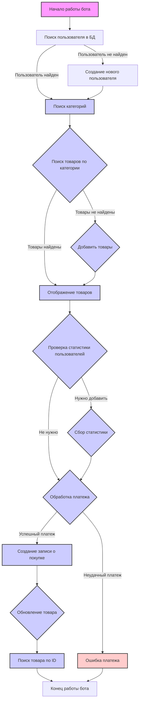

## АНАЛИЗ ЛОГ-ФАЙЛА

### <алгоритм>

1.  **Запуск бота:**
    *   `2024-12-20 at 11:20:27 | INFO | Бот успешно запущен.` - Бот стартует и записывает это в лог.

2.  **Поиск пользователя:**
    *   `2024-12-20 at 11:20:44 | INFO | Поиск одной записи User по фильтрам: {'telegram_id': 5127841744}` - Система пытается найти пользователя с `telegram_id = 5127841744`.
    *   **Пример:** Если пользователь с таким ID есть, то выведет: `2024-12-20 at 11:20:51 | INFO | Запись найдена по фильтрам: {'telegram_id': 5127841744}`
    *   **Пример:** Если пользователя нет, выведет:  `2024-12-20 at 11:20:44 | INFO | Запись не найдена по фильтрам: {'telegram_id': 5127841744}`

3.  **Добавление пользователя:**
    *   Если пользователя не нашли на предыдущем шаге, система добавляет нового пользователя:
    *   `2024-12-20 at 11:20:44 | INFO | Добавление записи User с параметрами: {'telegram_id': 5127841744, 'username': 'yakvenalexx', 'first_name': 'Alexey', 'last_name': 'Yakovenko'}`
    *   `2024-12-20 at 11:20:44 | INFO | Запись User успешно добавлена.`

4. **Поиск записей Category**
   *  `2024-12-20 at 11:54:26 | INFO | Поиск всех записей Category по фильтрам: {}` - система ищет все категории
   *  `2024-12-20 at 11:54:27 | INFO | Найдено 6 записей.` - найдено 6 категорий

5. **Поиск и добавление товаров (Product):**
   *  `2024-12-20 at 15:56:46 | INFO | Добавление записи Product с параметрами: {'name': 'Новый товар с файлом', ...}` - Добавление нового товара в базу данных.

6. **Удаление товаров (Product):**
   * `2024-12-20 at 16:25:30 | INFO | Удаление записей Product по фильтру: {'id': 1}` - Удаление товара из базы данных

7. **Получение статистики:**
    *  `2024-12-20 at 12:43:37 | INFO | Статистика успешно получена: {'total_users': 1, 'new_today': 1, 'new_week': 1, 'new_month': 1}` - Система собирает и логирует статистику.
    *   `2024-12-20 at 12:41:46 | ERROR | Ошибка при получении статистики: (sqlite3.OperationalError) near ")": syntax error` - Пример ошибки SQL при попытке запроса статистики.

8.  **Подсчет количества записей:**
    *   `2024-12-20 at 12:32:09 | INFO | Подсчет количества записей User по фильтру: {}` - Подсчет количества пользователей.
    *   `2024-12-20 at 12:32:09 | INFO | Найдено 1 записей.` - результат подсчета пользователей.
    *   `2024-12-20 at 15:12:33 | INFO | Подсчет количества записей Product по фильтру: {}`
    *   `2024-12-20 at 15:12:33 | INFO | Найдено 0 записей.`

9.  **Поиск категории по ID:**
   *  `2024-12-20 at 15:29:15 | INFO | Поиск Category с ID: 5` - Поиск определенной категории по её ID.
   *  `2024-12-20 at 15:29:15 | INFO | Запись с ID 5 найдена.` - Результат поиска

10. **Добавление покупки (Purchase):**
    * `2024-12-20 at 22:08:41 | INFO | Добавление записи Purchase с параметрами: {'user_id': 1, 'payment_id': '...', 'price': 290, 'product_id': 2}` - Добавление новой покупки в базу данных.
    * `2024-12-20 at 22:06:31 | ERROR | Ошибка при добавлении записи: (sqlite3.IntegrityError) NOT NULL constraint failed: purchases.product_id` - Пример ошибки добавления, связанной с отсутствующим `product_id`

11. **Поиск Product по ID:**
   * `2024-12-20 at 22:08:41 | INFO | Поиск Product с ID: 2` - Поиск товара по его ID
   * `2024-12-20 at 22:08:41 | INFO | Запись с ID 2 найдена.` - Результат поиска

12. **Поиск записей Product по `category_id`:**
   * `2024-12-20 at 21:23:46 | INFO | Поиск всех записей Product по фильтрам: {'category_id': 2}` - Поиск всех продуктов, относящихся к определенной категории

13.  **Остановка бота:**
    *   `2024-12-20 at 11:25:10 | ERROR | Бот остановлен!` - Бот завершает свою работу.

14. **Получение ответа от Робокассы:**
    * `2024-12-26 at 16:18:40 | SUCCESS | Получен ответ от Робокассы!` - Подтверждение получения ответа.
    * `2024-12-26 at 16:18:40 | INFO | Ответ: {'out_summ': '234', 'OutSum': '234', ...}` -  Лог ответа от Робокассы.
     * `2024-12-26 at 20:44:05 | WARNING | Неверная подпись для InvId: 1` - Предупреждение о неверной подписи при проверке ответа.
      * `2024-12-26 at 20:55:23 | INFO | Успешная проверка подписи для InvId: 1` -  Успешная проверка подписи ответа от Робокассы.

15. **Обработка вебхука:**
    * `2024-12-26 at 12:50:16 | ERROR | Ошибка при обработке вебхука: product_kb() missing 1 required positional argument: 'stars_price'` -  Ошибка, указывающая на нехватку аргументов в функции `product_kb()`.
     * `2024-12-26 at 12:51:32 | ERROR | Ошибка при обработке вебхука: too many values to unpack (expected 3)` - Ошибка, связанная с неправильным распаковкой значений.
     * `2024-12-26 at 12:54:25 | ERROR | Ошибка при обработке вебхука: Telegram server says - Bad Request: wrong file identifier/HTTP URL specified` - Ошибка от сервера Telegram, указывающая на неверный файл или URL.
      * `2024-12-26 at 12:50:31 | ERROR | Ошибка при обработке вебхука: Telegram server says - Bad Request: query is too old and response timeout expired or query ID is invalid` - Ошибка от сервера Telegram, указывающая на устаревший запрос.
###  <mermaid>

**Зависимости в диаграмме:**

*   Диаграмма отражает **логическую последовательность** обработки запросов бота, начиная с запуска (`Start`) и заканчивая остановкой (`End`).
*   **Поток управления:** Диаграмма показывает, как происходит **переход** между этапами, в зависимости от условий. Например, если пользователь не найден, происходит его создание.
*   **База данных:** В диаграмме отражена работа с базой данных:
    *   `UserSearch` - поиск пользователя.
    *   `CreateUser` - создание нового пользователя.
    *   `CheckCategory` - поиск категорий.
    *    `FindProductByCategory` - поиск товаров по категории.
    *   `AddProduct` - Добавление нового товара
     *   `CreatePurchase` - создание записи о покупке.
      *   `UpdateProduct` -  обновление информации о товаре
     *   `ProductSearch` - Поиск товара по ID
    *   `CollectUserStatistic` - сбор статистики.
*   **Оплата:** `ProcessPayment` - блок, отвечающий за обработку платежей.
*   **Ошибки:** `PaymentError` - показывает, что происходит в случае неудачной оплаты.

### <объяснение>

**Импорты:**

*   Лог-файл не показывает импорты, так как это не код Python. Он показывает только логи, которые генерируются в процессе работы бота.

**Классы:**

*   Лог-файл не содержит определений классов.
*   Из логов можно сделать вывод о том, что существуют следующие сущности (представленные в виде классов):
    *   `User`: Представляет пользователя системы (бота). Содержит такие атрибуты как `telegram_id`, `username`, `first_name`, `last_name`.
    *  `Category`: Представляет категорию продуктов.
    *   `Product`: Представляет товар, который можно купить. Содержит атрибуты: `name`, `description`, `price`, `category_id`, `file_id`, `hidden_content`.
    *   `Purchase`: Представляет запись о покупке. Содержит атрибуты: `user_id`, `payment_id`, `price`, `product_id`.
*   Взаимодействия:
    *   Система ищет пользователей и товары в БД, используя их `id` или другие поля.
    *   Система добавляет новых пользователей, товары и покупки в БД.

**Функции:**

*   Лог-файл не содержит вызовов или определений функций.
*   Исходя из контекста логов, можно предположить наличие следующих функций:
    *   Функции для поиска (например, `find_user`, `find_category`, `find_product`):
        *   Аргументы: Словарь с параметрами поиска.
        *   Возвращаемое значение: Найденная запись или `None`.
    *   Функции для добавления (например, `add_user`, `add_product`, `add_purchase`):
        *   Аргументы: Словарь с параметрами для добавления записи.
        *   Возвращаемое значение: Успешный результат добавления.
    *   Функции для подсчета (например, `count_users`, `count_products`):
        *   Аргументы: Словарь с фильтрами.
        *   Возвращаемое значение: Количество записей.
     *  Функции для удаления (например `delete_product`)
        *  Аргументы: Словарь с фильтрами для удаления
        *  Возвращаемое значение: Количество удаленных записей
     *  Функция `product_kb()`: Судя по ошибкам, она создает клавиатуру для продукта, но имеет неверное количество аргументов
    * Функции для получения статистики.
    *   Функции для проверки подписи ответа от Робокассы
    *   Функции для работы с вебхуками

**Переменные:**

*   `telegram_id` (целое число): Идентификатор пользователя в Telegram.
*   `username` (строка): Имя пользователя в Telegram.
*   `first_name` (строка): Имя пользователя.
*   `last_name` (строка): Фамилия пользователя.
*   `name` (строка): Название товара.
*   `description` (строка): Описание товара.
*   `price` (число): Цена товара.
*   `category_id` (целое число): Идентификатор категории, к которой относится товар.
*   `file_id` (строка/None): Идентификатор файла (если есть).
*   `hidden_content` (строка): Скрытый контент, доступный после покупки.
*   `payment_id` (строка): Идентификатор платежа.
*  `product_id` (целое число): Идентификатор товара.
*  `payment_type` (строка): Тип платежной системы.
*   `total_users` (целое число): Общее количество пользователей.
*   `new_today`, `new_week`, `new_month` (целые числа): Количество новых пользователей за сегодня, неделю, месяц.
*   `InvId` (строка): Идентификатор платежа из Робокассы.
*   `SignatureValue` (строка): Подпись ответа от Робокассы.
*   `signature_valid` (булево): Флаг, указывающий на валидность подписи.
*   `result` (строка): Результат ответа от Робокассы.

**Потенциальные ошибки и области для улучшения:**

*   **SQL Errors**: В логах есть ошибки `sqlite3.OperationalError`, что указывает на проблемы с SQL запросами.
*   **IntegrityError**: Ошибка `IntegrityError` при добавлении покупки из-за отсутствия `product_id`, указывает на проблемы при формировании данных для добавления в БД.
*   **Ошибки Webhook**: `product_kb() missing 1 required positional argument: 'stars_price'` - указывает на ошибку в работе вебхука, где не хватает аргументов для обработки
*   **Ошибки от сервера Telegram**: `Telegram server says - Bad Request: query is too old and response timeout expired or query ID is invalid` и `Telegram server says - Bad Request: wrong file identifier/HTTP URL specified` - указывают на проблемы при работе с API Telegram.
*   **Проверка подписи Робокассы**: Есть случаи, когда подпись ответа от Робокассы неверная (`Неверная подпись для InvId: 1`), что указывает на проблемы с настройками или проверкой подписи
*   **Обработка ошибок:** В логах есть много `ERROR`, что указывает на необходимость улучшения обработки ошибок и логирования.

**Взаимосвязь с другими частями проекта:**

*   Судя по логам, бот активно взаимодействует с:
    *   **Базой данных:** Для хранения пользователей, товаров, категорий и покупок.
    *   **API Telegram:** Для получения сообщений от пользователей и отправки ответов.
    *   **Платежной системой (Робокасса/ЮKassa):**  Для обработки платежей.

Этот анализ дает понимание основных процессов работы бота, но не охватывает код самого бота. Лог-файл помогает выявить основные ошибки и направления для улучшения, что является важным шагом для отладки и оптимизации приложения.