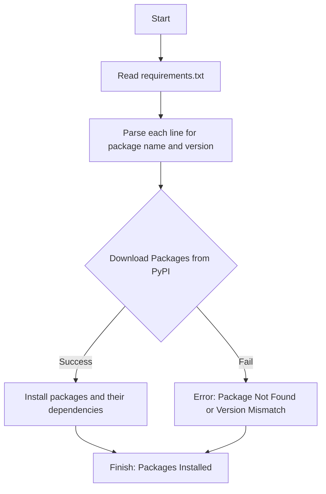

## Анализ кода `requirements.txt`

### 1. <алгоритм>

Файл `requirements.txt` содержит список зависимостей Python для проекта, в котором используется Telegram бот. Алгоритм его обработки прост:
1. **Чтение файла:** Инструмент управления пакетами (например, `pip`) читает файл `requirements.txt`.
2. **Парсинг зависимостей:** Инструмент парсит каждую строку, определяя имя пакета и его версию.
3. **Установка пакетов:** Инструмент загружает и устанавливает указанные пакеты и их зависимости из Python Package Index (PyPI) или другого репозитория.
4. **Обработка ошибок:** В случае если пакет не найден или версия не соответствует, выводится ошибка.

**Пример:**
Предположим, `requirements.txt` содержит:
```
aiogram==3.15.0
SQLAlchemy==2.0.35
```

Процесс установки будет выглядеть так:
1. `pip` читает файл.
2.  `pip` парсит строки и определяет, что нужно установить `aiogram` версии 3.15.0 и `SQLAlchemy` версии 2.0.35.
3.  `pip` скачивает и устанавливает `aiogram==3.15.0`. Затем он скачивает и устанавливает `SQLAlchemy==2.0.35`.
4.  В случае успеха, все пакеты будут установлены.

### 2. <mermaid>


**Объяснение зависимостей `mermaid`:**
 - `Start`: Начало процесса.
 - `ReadFile`: Читает содержимое файла `requirements.txt`.
 - `ParseDependencies`: Разбирает каждую строку для определения имени пакета и его версии.
 - `DownloadPackages`: Попытка загрузить пакеты из PyPI (или другого репозитория).
 - `InstallPackages`: Установка пакетов и их зависимостей.
 - `Error`:  Указывает на ошибку, если пакет не найден или версия не соответствует.
 - `Finish`:  Конец процесса, когда все пакеты установлены или произошла ошибка.

### 3. <объяснение>
#### Импорты:
Этот файл не содержит импорты кода, а является файлом со списком зависимостей. Он используется для установки необходимых Python пакетов с помощью инструмента `pip`.

- `aiogram==3.15.0`: Асинхронный фреймворк для создания Telegram ботов. Эта библиотека обеспечивает удобный интерфейс для работы с Telegram Bot API, позволяя обрабатывать входящие сообщения, команды, создавать клавиатуры и многое другое. Она является ключевой для функциональности Telegram бота.

- `aiosqlite==0.20.0`: Асинхронный драйвер для работы с базами данных SQLite. Используется для асинхронного доступа к SQLite базам данных, что полезно в асинхронных приложениях (например, Telegram ботах), так как это позволяет не блокировать главный поток при работе с базой данных.

- `loguru==0.7.2`: Библиотека для удобного и настраиваемого логирования. Позволяет гибко настраивать, куда записывать логи и в каком формате.

- `pydantic-settings==2.7.0`: Библиотека для управления настройками приложения на основе Pydantic. Позволяет использовать Pydantic для валидации и загрузки настроек из различных источников, таких как переменные окружения и `.env` файлы.

- `SQLAlchemy==2.0.35`: Библиотека для работы с базами данных, обеспечивающая ORM (Object-Relational Mapping). Используется для взаимодействия с различными типами баз данных (например, PostgreSQL, MySQL, SQLite) через Python-интерфейс.

- `pydantic>=2.4.1,<2.10`: Библиотека для валидации и сериализации данных. Используется для определения моделей данных и проверки их соответствия заданным правилам.

- `alembic==1.14.0`: Библиотека для миграций баз данных. Она позволяет автоматизировать процесс обновления структуры базы данных.

- `aiohttp==3.10.11`: Асинхронная HTTP клиентская и серверная библиотека. Позволяет делать асинхронные HTTP запросы, что важно для работы с API и другими сетевыми ресурсами в асинхронных приложениях.

#### Классы, Функции и Переменные
Файл `requirements.txt` сам по себе не содержит классов, функций или переменных. Он просто перечисляет зависимости для Python-проекта. Установка этих пакетов позволяет использовать их классы, функции и переменные в коде проекта.

#### Взаимосвязь с другими частями проекта
- Эти зависимости важны для работы Telegram бота. Например, `aiogram` используется для создания и управления ботом.
- `SQLAlchemy` и `aiosqlite` применяются для работы с базой данных, где могут храниться данные о пользователях, состояниях бота и другие необходимые данные.
- `pydantic` и `pydantic-settings` обеспечивают валидацию и управление настройками проекта, что позволяет упростить конфигурирование и снизить вероятность ошибок.
- `loguru` используется для логирования действий и возможных ошибок бота.
- `alembic` обеспечивает управление структурой базы данных в процессе разработки.
- `aiohttp` может быть использован для выполнения запросов к сторонним API, если это потребуется для функциональности бота.

#### Потенциальные ошибки и области для улучшения:
- **Несовместимость версий:** Важно следить за совместимостью версий пакетов, так как обновление одной библиотеки может повлечь за собой несовместимости с другими.
- **Устаревшие пакеты:** Регулярно обновляйте пакеты до последних стабильных версий для исправления ошибок и получения новых функций.
- **Отсутствие виртуального окружения:** Рекомендуется использовать виртуальное окружение для управления зависимостями проекта, это позволит избежать конфликтов между разными проектами.
- **Отсутствие точных версий (например, `pydantic>=2.4.1,<2.10`)**: Может привести к непредсказуемому поведению.

#### Заключение
Файл `requirements.txt` содержит список необходимых библиотек, которые являются основой для работы Telegram бота. Он определяет, какие пакеты Python нужно установить, чтобы проект функционировал правильно.  Важно поддерживать этот файл в актуальном состоянии, регулярно обновлять версии и использовать виртуальное окружение.