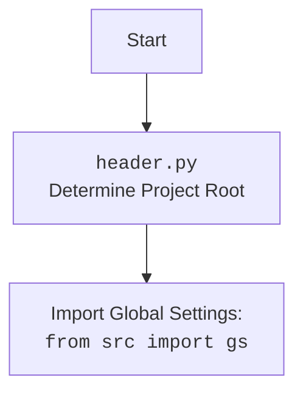

## <алгоритм>

1.  **`set_project_root(marker_files)`**:
    *   Принимает кортеж `marker_files` (по умолчанию `('__root__', '.git')`) как маркеры корневой директории проекта.
    *   Определяет текущую директорию файла (`__file__`).
    *   Инициализирует переменную `__root__` как текущую директорию.
    *   Итерируется по текущей директории и всем её родительским директориям.
        *   Для каждой родительской директории проверяет, существует ли в ней хотя бы один из файлов-маркеров.
        *   Если маркер найден, устанавливает `__root__` в эту директорию и прерывает цикл.
    *   Проверяет, есть ли путь `__root__` в `sys.path`. Если нет, добавляет его в начало.
    *   Возвращает путь `__root__`.
    *   **Пример:**
        *   Допустим, скрипт расположен в `/home/user/projects/hypotez/src/logger/header.py`, а корневой маркер `.git` расположен в `/home/user/projects/hypotez/`. Функция вернет `/home/user/projects/hypotez/`.
        *   Если бы ни одного маркера не было найдено, вернулась бы директория файла `/home/user/projects/hypotez/src/logger/`.

2.  **`__root__ = set_project_root()`**:
    *   Вызывает функцию `set_project_root()` и сохраняет возвращаемое значение (путь к корневой директории) в переменную `__root__`.

3.  **Импорт `from src import gs`**:
    *   Импортирует модуль `gs` из пакета `src`. Этот модуль, вероятно, содержит глобальные настройки или пути.

4.  **Загрузка `settings.json`**:
    *   Инициализирует переменную `settings` в `None`.
    *   Пытается открыть файл `settings.json`, расположенный в директории `src` относительно корневой директории проекта.
    *   Если файл открыт успешно, загружает его содержимое (ожидается JSON) в переменную `settings`.
    *   Обрабатывает исключения `FileNotFoundError` и `json.JSONDecodeError`, если файл не найден или не является валидным JSON. В случае ошибки, `settings` останется `None`.

5. **Загрузка `README.MD`**:
    *   Инициализирует переменную `doc_str` в `None`.
    *   Пытается открыть файл `README.MD`, расположенный в директории `src` относительно корневой директории проекта.
    *   Если файл открыт успешно, считывает его содержимое в переменную `doc_str`.
    *   Обрабатывает исключения `FileNotFoundError` и `json.JSONDecodeError`, если файл не найден или не является валидным. В случае ошибки, `doc_str` останется `None`.

6.  **Определение глобальных переменных**:
    *   `__project_name__`: Устанавливает имя проекта из `settings['project_name']`, если он присутствует, иначе устанавливает `'hypotez'`.
    *   `__version__`: Устанавливает версию проекта из `settings['version']`, если она присутствует, иначе устанавливает пустую строку.
    *   `__doc__`: Устанавливает документацию проекта из `doc_str`, если он не `None`, иначе устанавливает пустую строку.
    *   `__details__`: Устанавливает детали проекта в пустую строку.
    *   `__author__`: Устанавливает автора проекта из `settings['author']`, если он присутствует, иначе устанавливает пустую строку.
    *   `__copyright__`: Устанавливает копирайт проекта из `settings['copyrihgnt']`, если он присутствует, иначе устанавливает пустую строку.
    *   `__cofee__`: Устанавливает сообщение для пожертвований из `settings['cofee']`, если он присутствует, иначе устанавливает сообщение по умолчанию.

## <mermaid>

```mermaid
flowchart TD
    Start[Start] --> FindRoot[<code>set_project_root()</code><br> Find Project Root];
    FindRoot --> CheckMarkers{Check for <br>Marker Files <br> (<code>__root__</code>, <code>.git</code>)};
    CheckMarkers -- Found --> SetRoot[Set Project Root <br><code>__root__</code> = Parent Directory];
    CheckMarkers -- Not Found --> NextParent[Go to Parent <br> Directory];
    NextParent -- Exists --> CheckMarkers
    NextParent -- Not Exists --> SetRoot
    SetRoot --> AddPath[Add <code>__root__</code> to <code>sys.path</code>];
    AddPath --> ImportGS[Import Global Settings: <br><code>from src import gs</code>];
    ImportGS --> LoadSettings[Try to Load <br><code>settings.json</code>];
    LoadSettings -- Success --> LoadReadme[Try to Load <br><code>README.MD</code>];
    LoadSettings -- Fail --> LoadReadme;
    LoadReadme -- Success --> SetGlobalVars[Set Global Variables <br><code>__project_name__</code>, <br><code>__version__</code>, <br><code>__doc__</code>, etc.]
    LoadReadme -- Fail --> SetGlobalVars;
    SetGlobalVars --> End[End]
    
    
     
    
    
    
```



## <объяснение>

**Импорты:**

*   `sys`: Используется для работы с системными переменными и параметрами, в частности, для изменения пути поиска модулей `sys.path`.
*   `json`: Используется для загрузки данных из файла `settings.json` в формате JSON.
*   `packaging.version.Version`: Не используется в предоставленном коде.
*   `pathlib.Path`: Используется для работы с путями к файлам и каталогам. Предоставляет более объектно-ориентированный способ работы с путями по сравнению со строками.
*  `src`: Это пакет внутри проекта, который содержит модули и настройки проекта, включая `gs`, который, предположительно, хранит глобальные настройки проекта.

**Функции:**

*   `set_project_root(marker_files: tuple) -> Path`:
    *   **Аргументы**:
        *   `marker_files`: кортеж строк (путей файлов или каталогов) для определения корня проекта.
    *   **Возвращаемое значение**:
        *   `Path`: Объект `Path`, представляющий путь к корневой директории проекта.
    *   **Назначение**:
        *   Функция определяет корневую директорию проекта путем поиска вверх по дереву каталогов, пока не найдет маркерный файл или директорию. Затем добавляет этот путь в `sys.path`, чтобы обеспечить корректную работу импортов относительно корня проекта.
    *   **Пример**: Вызов `set_project_root()` с `marker_files=('__root__', '.git')` в директории `/home/user/projects/hypotez/src/logger/` найдет корень проекта в `/home/user/projects/hypotez/` при условии, что там находится файл или директория `.git`.

**Переменные:**

*   `__root__` (`Path`): Путь к корневой директории проекта, определяемый функцией `set_project_root()`.
*   `settings` (`dict` или `None`): Словарь с настройками проекта, загруженный из `settings.json`, или `None`, если файл не был найден или не удалось распарсить JSON.
*   `doc_str` (`str` или `None`): Строка с содержимым `README.MD`, если он успешно прочитан, или `None` в случае ошибки.
*   `__project_name__` (`str`): Имя проекта, взятое из `settings` или `'hypotez'` по умолчанию.
*   `__version__` (`str`): Версия проекта, взятая из `settings` или пустая строка по умолчанию.
*   `__doc__` (`str`): Содержимое `README.MD` или пустая строка по умолчанию.
*   `__details__` (`str`): Всегда пустая строка.
*   `__author__` (`str`): Автор проекта, взятый из `settings` или пустая строка по умолчанию.
*   `__copyright__` (`str`): Информация об авторских правах, взятая из `settings` или пустая строка по умолчанию.
*   `__cofee__` (`str`): Сообщение для пожертвований, взятое из `settings` или сообщение по умолчанию.

**Взаимосвязь с другими частями проекта:**

*   Этот модуль является важной частью инфраструктуры проекта, поскольку определяет корневой каталог и обеспечивает правильную работу импортов.
*   Импорт `from src import gs` указывает на зависимость от модуля глобальных настроек, который, скорее всего, будет содержать пути и другие глобальные параметры проекта.
*   Чтение `settings.json` показывает, что проект использует файл конфигурации для управления параметрами, такими как имя, версия и автор.
*   Чтение `README.MD` позволяет использовать его содержание в качестве документации.

**Потенциальные ошибки и области для улучшения:**

*   **Обработка ошибок:** Обработка ошибок при загрузке `settings.json` и `README.MD` минимальна. Можно добавить более подробную информацию об ошибках, а также логирование ошибок.
*   **Отсутствие валидации:** Нет никакой проверки для содержимого `settings.json`, что может привести к непредсказуемым ошибкам.
*   **Зависимость от маркерных файлов:** Использование маркерных файлов для определения корневой директории может быть ненадежным в некоторых случаях. Возможно, стоит добавить возможность задания корня проекта через переменные окружения или аргументы командной строки.
*  **Неиспользуемый импорт:** `from packaging.version import Version` импортируется, но не используется, что делает импорт излишним.

В целом, код выполняет важную задачу по определению корневой директории проекта и загрузке его основных настроек. Однако, необходимо добавить обработку ошибок, валидацию и сделать более гибкой конфигурацию корня проекта.