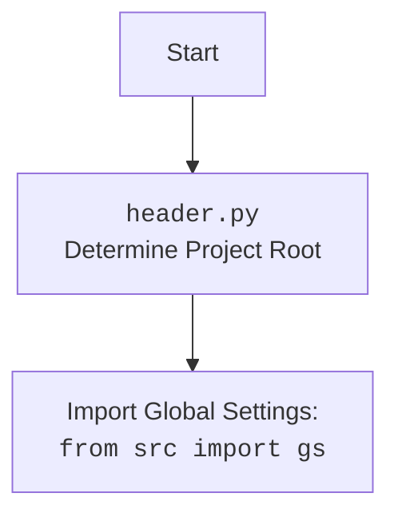

## <алгоритм>

**Общая схема работы `BotHandler`:**

1.  **Инициализация `BotHandler`:**
    *   При создании экземпляра `BotHandler` происходит инициализация веб-драйвера `Firefox` с заданными опциями (`--kiosk`, `--headless`).
2.  **Обработка входящих сообщений `handle_message`:**
    *   Получает текстовое сообщение `q` от пользователя.
    *   **Пример:**
        *   `q = "Привет бот!"`
        *   `q = "https://example.com"`
        *   `q = "--next"`
        *   `q = "?"`
    *   Проверяет, является ли сообщение `q` символом `?` :
        *   Если `q == "?"`, бот отправляет пользователю фотографию из `gs.path.endpoints / 'kazarinov' / 'assets' / 'user_flowchart.png'` и завершает обработку.
    *   Проверяет, является ли сообщение `q` URL:
        *   Если `is_url(q)` возвращает `True`, то вызывается метод `handle_url` для обработки URL. После обработки URL, выполняется дополнительная логика (обозначенная `...` ) и функция завершает выполнение.
        *   **Пример:** `q = "https://www.onetab.com/12345"`
    *   Проверяет, является ли сообщение `q` командой для получения следующего вопроса (`--next`, `-next`, `__next`, `-n`, `-q`):
        *   Если `q` является одной из этих команд, вызывается метод `handle_next_command`.
    *   Если сообщение не является URL и не является командой, то оно отправляется в модель `model.chat(q)`, и полученный ответ отправляется пользователю.
        *   **Пример:** `q = "Какая сегодня погода?"`
3.  **Обработка URL `handle_url`:**
    *   Получает URL из сообщения пользователя.
    *   Проверяет, является ли URL ссылкой OneTab:
        *   Если URL является ссылкой OneTab, вызывается метод `fetch_target_urls_onetab` для извлечения URL.
        *   Если `fetch_target_urls_onetab` возвращает пустой список, отправляет сообщение "Некорректные данные.".
        *   **Пример:** `response = "https://www.one-tab.com/12345"`
    *   Вызывает `get_graber_by_supplier_url`, чтобы определить граббер.
4.  **Обработка команды `handle_next_command`:**
    *   Выбирает случайный вопрос из списка `self.questions_list`.
    *   Отправляет вопрос и ответ от модели `self.model.ask(question)` пользователю.
    *   В случае ошибки логирует её и отправляет сообщение "Произошла ошибка при чтении вопросов.".
5.  **Извлечение URL из OneTab `fetch_target_urls_onetab`:**
    *   Выполняет GET-запрос к указанному URL OneTab.
    *   Проверяет статус ответа HTTP-запроса. Если статус не 200, то ошибка.
    *   Парсит HTML-контент с помощью `BeautifulSoup`.
    *   Извлекает все ссылки из тегов `<a>` с классом `tabLink`.
    *   Возвращает список извлеченных URL или `False`, если произошла ошибка.
    *   **Пример:**
        *   `one_tab_url = "https://www.one-tab.com/12345"`
        *   Возвращает `['https://example1.com', 'https://example2.com']` или `False`
6.  **Взаимодействие с внешними сервисами:**
    *   Использует класс `Driver` для управления веб-драйверами (в данном случае `Firefox`).
    *   Использует класс `GoogleGenerativeAI` для обработки текстовых запросов.
    *   Использует `get_graber_by_supplier_url` для получения граббера.

## <mermaid>

```mermaid
flowchart TD
    subgraph BotHandler
        Start(Начало обработки сообщения) --> Check_if_question_mark{Сообщение = "?"?}
            Check_if_question_mark -- Да --> Send_photo[Отправить фото user_flowchart.png]
            Check_if_question_mark -- Нет --> Check_if_URL{Сообщение - URL?}
        
        Check_if_URL -- Да --> handle_URL_call[Вызвать handle_url()]
        handle_URL_call --> process_URL[Обработка URL]
            process_URL --> Check_OneTab_URL{URL one-tab.com?}
            Check_OneTab_URL -- Да --> Fetch_urls[fetch_target_urls_onetab()]
            Fetch_urls --> Check_urls_empty{URLS isEmpty?}
            Check_urls_empty -- Да --> Send_error_message[Отправить сообщение "Некорректные данные"]
            Check_urls_empty -- Нет --> Get_graber[get_graber_by_supplier_url()]

            Check_OneTab_URL -- Нет --> Get_graber_direct[get_graber_by_supplier_url()]


            Get_graber --> End_process_URL[Завершить обработку URL]
            Get_graber_direct --> End_process_URL[Завершить обработку URL]


        Check_if_URL -- Нет --> Check_if_command{Сообщение - команда "--next" или аналог?}
        Check_if_command -- Да --> handle_next_command_call[Вызвать handle_next_command()]
            handle_next_command_call --> next_command_processing[Обработка команды next]
                 next_command_processing --> random_question[Выбрать случайный вопрос]
                 random_question --> ask_model[Запрос к модели]
                 ask_model --> send_question_answer[Отправить вопрос и ответ]
                 send_question_answer --> next_command_processing_end[Завершить обработку команды next]

        Check_if_command -- Нет --> ask_model_chat[Запрос к модели через model.chat()]
            ask_model_chat --> send_chat_answer[Отправить ответ]
        send_chat_answer --> End(Конец обработки сообщения)
        Send_photo --> End(Конец обработки сообщения)
        End_process_URL --> End(Конец обработки сообщения)
    end

    subgraph fetch_target_urls_onetab
        Start_fetch_urls(Начало fetch_target_urls_onetab) --> Send_get_request[GET-запрос к one_tab_url]
        Send_get_request --> check_status_code{status_code != 200?}
        check_status_code -- Да --> Log_error[Логирование ошибки]
        Log_error --> Return_False[Возврат False]

        check_status_code -- Нет --> Parse_HTML[Парсинг HTML]
        Parse_HTML --> Extract_urls[Извлечение URL из тегов <a class=tabLink>]
        Extract_urls --> Return_urls[Возврат списка URL]

        Return_urls --> End_fetch_urls(Конец fetch_target_urls_onetab)
        Return_False --> End_fetch_urls(Конец fetch_target_urls_onetab)
    end
    
    

    style Start fill:#f9f,stroke:#333,stroke-width:2px
    style End fill:#ccf,stroke:#333,stroke-width:2px

    style Start_fetch_urls fill:#f9f,stroke:#333,stroke-width:2px
    style End_fetch_urls fill:#ccf,stroke:#333,stroke-width:2px

```

**Объяснение `mermaid`:**

*   **`BotHandler` subgraph:**
    *   `Start`: Начало обработки сообщения, точка входа для обработки сообщений пользователя.
    *   `Check_if_question_mark`: Проверяет, является ли входящее сообщение вопросительным знаком `?`.
    *   `Send_photo`: Отправляет пользователю фотографию `user_flowchart.png`, если сообщение равно `?`.
    *   `Check_if_URL`: Проверяет, является ли сообщение URL-адресом.
    *   `handle_URL_call`: Вызывает функцию `handle_url` для обработки URL-адреса.
    *   `process_URL`: Начинает обработку URL.
    *    `Check_OneTab_URL`: Проверяет является ли url ссылкой на `one-tab.com`.
    *   `Fetch_urls`: Вызывает `fetch_target_urls_onetab()` для извлечения URL из one-tab.com.
    *  `Check_urls_empty`: Проверка пустой ли список urls.
    *   `Send_error_message`: Отправляет сообщение об ошибке, если URL-адрес недействителен.
    *   `Get_graber`: Получает граббер для дальнейшей обработки.
        *   `Get_graber_direct`: если url не one-tab.com, то получает граббер напрямую.
    *  `End_process_URL`: Конец обработки url.
    *   `Check_if_command`: Проверяет, является ли сообщение командой для получения следующего вопроса.
    *    `handle_next_command_call`: Вызывает функцию `handle_next_command()`.
    *    `next_command_processing`: Начинает обработку команды `next`.
    *   `random_question`: Выбирает случайный вопрос.
    *   `ask_model`: Запрашивает ответ у модели.
    *   `send_question_answer`: Отправляет пользователю вопрос и ответ.
    * `next_command_processing_end`: Конец обработки команды `next`.
    *   `ask_model_chat`: Отправляет сообщение на обработку в модель чата `model.chat()`.
    *   `send_chat_answer`: Отправляет ответ от модели пользователю.
    *   `End`: Конец обработки сообщения.
*   **`fetch_target_urls_onetab` subgraph:**
    *   `Start_fetch_urls`: Начало функции `fetch_target_urls_onetab`.
    *   `Send_get_request`: Отправляет GET-запрос к указанному URL.
    *   `check_status_code`: Проверяет статус-код ответа от сервера.
    *   `Log_error`: Логирует ошибку, если статус-код не 200.
    *   `Return_False`: Возвращает `False`, если произошла ошибка.
    *   `Parse_HTML`: Выполняет парсинг HTML-контента, полученного из ответа сервера.
    *   `Extract_urls`: Извлекает URL-адреса из HTML-документа, а именно из тегов `<a>` с классом `tabLink`.
    *   `Return_urls`: Возвращает список извлеченных URL-адресов.
    *   `End_fetch_urls`: Конец функции `fetch_target_urls_onetab`.

**Импортируемые зависимости:**

Диаграмма показывает, как различные функции и методы взаимодействуют внутри класса `BotHandler`, а также с функциями `fetch_target_urls_onetab` и внешними модулями.



## <объяснение>

**Импорты:**

*   `header`: Модуль, вероятно, для определения корневой директории проекта и настройки переменных окружения.
*   `random`: Для генерации случайных вопросов в методе `handle_next_command`.
*   `asyncio`: Для асинхронного выполнения операций (например, отправка сообщений в Telegram).
*   `requests`: Для отправки HTTP-запросов (используется в `fetch_target_urls_onetab`).
*   `typing.Optional, typing.Any`: Для аннотации типов. `Optional` указывает, что переменная может быть `None`, `Any` указывает, что переменная может быть любого типа.
*   `bs4.BeautifulSoup`: Для парсинга HTML (используется в `fetch_target_urls_onetab`).
*   `telegram.Update`: Для работы с объектами обновлений от Telegram.
*   `telegram.ext.CallbackContext`: Для работы с контекстом обратного вызова в Telegram.
*   `src.gs`: Глобальные настройки проекта.
*   `src.webdriver.driver.Driver`: Абстрактный класс для веб-драйверов.
*   `src.webdriver.chrome.Chrome`, `src.webdriver.firefox.Firefox`, `src.webdriver.edge.Edge`: Конкретные реализации веб-драйверов.
*   `src.ai.gemini.GoogleGenerativeAI`: Класс для взаимодействия с API Gemini.
*   `src.suppliers.get_graber_by_supplier.get_graber_by_supplier_url`: Функция для получения граббера по URL.
*   `src.utils.url.is_url`: Функция для проверки, является ли строка URL.
*   `src.utils.printer.pprint`: Функция для печати данных в отформатированном виде.
*    `src.logger.logger.logger`: Объект логгера для записи сообщений.

**Класс `BotHandler`:**

*   **Назначение:** Обрабатывает команды, полученные от Telegram бота.
*   **Атрибуты:**
    *   `webdriver`: Экземпляр веб-драйвера, создаётся в конструкторе.
    *   `model`: Экземпляр модели для обработки текстовых запросов (не инициализирован в коде).
    *   `questions_list`: Список вопросов (не инициализирован в коде).
*   **Методы:**
    *   `__init__(self, webdriver_name: str)`: Конструктор класса, инициализирует веб-драйвер.
    *   `async handle_message(self, update: Update, context: CallbackContext) -> None`: Обрабатывает текстовые сообщения с URL-маршрутизацией.
    *   `async handle_url(self, update: Update, context: CallbackContext) -> Any`: Обрабатывает URL, присланный пользователем.
    *   `async handle_next_command(self, update: Update) -> None`: Обрабатывает команду `--next` и её аналоги.
    *   `fetch_target_urls_onetab(self, one_tab_url: str) -> list[str] | bool`: Извлекает URL из страницы OneTab.

**Функции:**

*   `__init__(self, webdriver_name: str)`:
    *   **Аргументы:**
        *   `webdriver_name (str)`: Имя веб-драйвера (например, 'firefox').
    *   **Назначение:** Инициализирует веб-драйвер `Firefox` с опциями `--kiosk` и `--headless`.
*   `async handle_message(self, update: Update, context: CallbackContext) -> None`:
    *   **Аргументы:**
        *   `update (Update)`: Объект обновления от Telegram.
        *   `context (CallbackContext)`: Контекст обратного вызова Telegram.
    *   **Назначение:** Обрабатывает входящие текстовые сообщения, определяя, является ли сообщение URL, командой или обычным текстом.
*   `async handle_url(self, update: Update, context: CallbackContext) -> Any`:
    *   **Аргументы:**
        *   `update (Update)`: Объект обновления от Telegram.
        *   `context (CallbackContext)`: Контекст обратного вызова Telegram.
    *   **Назначение:** Обрабатывает URL, присланный пользователем, в том числе ссылки OneTab.
*   `async handle_next_command(self, update: Update) -> None`:
    *   **Аргументы:**
        *   `update (Update)`: Объект обновления от Telegram.
    *   **Назначение:** Обрабатывает команды `--next`, `-next`, `__next`, `-n`, `-q`, выбирает случайный вопрос из `self.questions_list`, отправляет вопрос и ответ.
*   `fetch_target_urls_onetab(self, one_tab_url: str) -> list[str] | bool`:
    *   **Аргументы:**
        *   `one_tab_url (str)`: URL страницы OneTab.
    *   **Возвращаемое значение:**
        *   `list[str]`: Список URL, найденных на странице, или `False`, в случае ошибки.
    *   **Назначение:** Извлекает URL-адреса со страницы OneTab, используя `requests` для получения HTML и `BeautifulSoup` для парсинга.

**Переменные:**

*   `webdriver_name` (str): Имя веб-драйвера, передается при инициализации класса `BotHandler`.
*   `response`: В методах `handle_url` и `fetch_target_urls_onetab` хранит ответ от запроса.
*   `urls` (list[str]): Список URL, полученных из OneTab.
*   `q` (str): Текст сообщения пользователя, полученный в `handle_message`.
*   `answer` (str): Ответ от модели `model.chat(q)`.
*   `question` (str): Случайно выбранный вопрос из `self.questions_list`.
*    `user_id` (int): id пользователя телеграмм.
*    `graber`: Экземпляр грабера, полученный в `get_graber_by_supplier_url`.

**Взаимосвязь с другими частями проекта:**

*   Модуль использует `src.gs` для доступа к глобальным настройкам.
*   Использует веб-драйверы из пакета `src.webdriver`.
*   Использует `GoogleGenerativeAI` из `src.ai` для обработки текстовых запросов.
*   Использует `get_graber_by_supplier_url` из `src.suppliers` для получения граббера.
*   Использует `is_url` из `src.utils` для проверки url.
*   Использует `pprint` из `src.utils` для печати.
*   Использует логгер из `src.logger` для записи.

**Потенциальные ошибки и области для улучшения:**

*   Отсутствует инициализация атрибутов `self.model` и `self.questions_list`.
*   Обработка ошибок в `fetch_target_urls_onetab` не возвращает конкретную причину.
*   Метод `handle_url` не доделан.
*   В `handle_message` после обработки url стоит многоточие `...`, которое ничего не выполняет.
*   Не реализована обработка ошибок в методе `handle_url` при вызове `get_graber_by_supplier_url`.
*   Необходимо добавить обработку ошибок при запросах к `self.model`.

**Цепочка взаимосвязей:**

1.  **Telegram Bot API** -> `BotHandler` (через `telegram.ext`)
2.  `BotHandler` -> `src.webdriver` (для управления браузером).
3.  `BotHandler` -> `src.ai.gemini.GoogleGenerativeAI` (для обработки текста).
4.  `BotHandler` -> `src.suppliers.get_graber_by_supplier` (для получения граббера).
5.  `BotHandler` -> `src.utils.url` (для проверки url)
6. `BotHandler` -> `src.utils.printer` (для вывода в консоль)
7. `BotHandler` -> `src.logger` (для логирования)
8.  `BotHandler` -> `src.gs` (для глобальных настроек).
9. `BotHandler` -> `requests` (для запросов к OneTab)
10.  `fetch_target_urls_onetab` -> `requests` -> `BeautifulSoup` (для парсинга HTML).