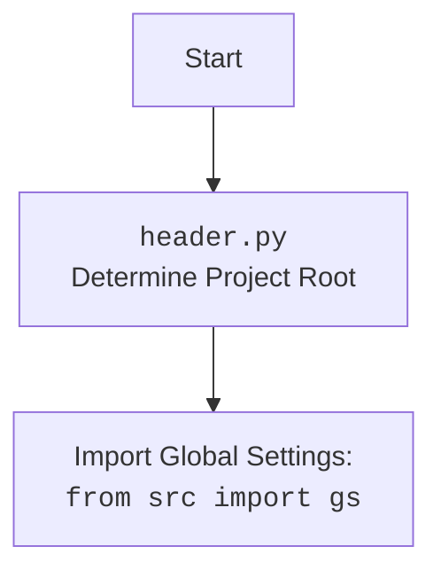

## <алгоритм>

1.  **Инициализация:**
    *   Импортируются необходимые библиотеки и модули.
    *   Инициализируется класс `EmilTelegramBot`, который является наследником `TelegramBot`.
    *   Из файла `emil.json` загружается конфигурация.
    *   Создается модель `GoogleGenerativeAI` для общения с пользователем.
    *   Создается экземпляр `BotHandler`.
    *   В конструкторе определяется токен Telegram бота в зависимости от режима (`test` или `production`).
    *   Вызывается конструктор родительского класса `TelegramBot` и передается ему токен и обработчик.
        *   *Пример*: Режим работы `test`, токен бота `hypo69_test_bot`, используется `BotHandler` для обработки.

2.  **Обработка сообщений:**
    *   Функция `handle_message` получает сообщения от пользователя и передает их обработчику `BotHandler`.
        *   *Пример*: Пользователь отправляет текст "Привет". Сообщение передается в `BotHandler` для дальнейшей обработки.
    *   Функция `handle_log` принимает сообщения, содержащие логи, записывает их в лог и отправляет подтверждение пользователю.
        *   *Пример*: Пользователь отправляет текст "LOG: some event". Сообщение логируется, и бот отвечает "Log received and processed.".
    *   Функция `handle_voice` обрабатывает голосовые сообщения.
        *   *Пример*: Пользователь отправляет голосовое сообщение. Оно передается в родительскую функцию `handle_voice` для обработки.
    *   Функция `transcribe_voice` транскрибирует голосовые сообщения. В текущей реализации она возвращает заглушку.
        *   *Пример*: голосовое сообщение передается в функцию `transcribe_voice`. Возвращается строка "Распознавание голоса ещё не реализовано.".

3.  **Запуск бота:**
    *   В функции `main` создается экземпляр `EmilTelegramBot`.
    *   Создается веб-приложение `aiohttp` с помощью `create_app`, которому передается бот.
    *   Веб-приложение запускается на заданном хосте и порту.
        *   *Пример*: Бот запускается по адресу `http://localhost:8080`.
        *   Внутри `create_app` настраиваются `webhook` для получения сообщений от Telegram.

## <mermaid>

```mermaid
flowchart TD
    Start[Start] --> EmilTelegramBotInit[EmilTelegramBot<br>Initialize: mode, token, bot_handler]
    EmilTelegramBotInit --> LoadConfig[Load Configuration:<br><code>emil.json</code>]
    LoadConfig --> CreateGeminiModel[Create GoogleGenerativeAI Model]
    CreateGeminiModel --> CreateBotHandler[Create BotHandler]
    CreateBotHandler --> TelegramBotInit[TelegramBot<br>Initialize with: token, bot_handler]
    TelegramBotInit --> HandleMessage[handle_message:<br>Forward to bot_handler]
    TelegramBotInit --> HandleLog[handle_log:<br>Log message, send confirmation]
    TelegramBotInit --> HandleVoice[handle_voice:<br>Forward to parent class]
    HandleVoice --> TranscribeVoice[transcribe_voice:<br>Stub: "Распознавание голоса ещё не реализовано."]
    Start --> Main[main]
    Main --> CreateBot[Create EmilTelegramBot]
    CreateBot --> CreateWebApp[Create aiohttp web application<br><code>create_app(bot)</code>]
    CreateWebApp --> RunWebApp[Run aiohttp application:<br><code>web.run_app(app, host, port)</code>]
```



**Зависимости в `mermaid` диаграмме:**

*   `EmilTelegramBotInit`:  Инициализация экземпляра класса `EmilTelegramBot`. Зависит от наличия конфигурационного файла (`emil.json`).
*   `LoadConfig`:  Загрузка конфигурации из файла `emil.json`.  Это начальный этап настройки бота, определяет режим работы.
*   `CreateGeminiModel`: Создание модели `GoogleGenerativeAI`. Необходима для взаимодействия с пользователем.
*   `CreateBotHandler`:  Создание экземпляра класса `BotHandler`,  ответственного за обработку логики бота.
*  `TelegramBotInit`: Инициализация родительского класса `TelegramBot`.
*   `HandleMessage`:  Обработка текстовых сообщений, которые перенаправляются `bot_handler`.
*  `HandleLog`: Обработка сообщений лога и их логирования.
*   `HandleVoice`:  Обработка голосовых сообщений.
*   `TranscribeVoice`: Транскрибирует голосовые сообщения.
*   `Main`: Основная функция, точка входа в приложение. Запускает бота и веб-сервер.
*   `CreateBot`: Создание экземпляра `EmilTelegramBot`.
*   `CreateWebApp`:  Создание веб-приложения для обработки `webhooks` от Telegram. Зависит от экземпляра бота.
*   `RunWebApp`:  Запуск веб-приложения на определенном хосте и порту.

## <объяснение>

**Импорты:**

*   `from __future__ import annotations`: Позволяет использовать аннотации типов, которые ссылаются на класс, который еще не определен.
*   `import asyncio`:  Для асинхронного программирования. Используется в `TelegramBot`, `BotHandler` и др.
*   `from pathlib import Path`:  Работа с путями к файлам. Используется для загрузки конфигурации.
*   `from typing import List, Optional, Dict, Self`:  Аннотации типов для улучшения читаемости и предотвращения ошибок.
*   `from types import SimpleNamespace`: Для представления конфигурации в виде объекта с атрибутами.
*   `from telegram import Update`:  Представляет обновление от Telegram.
*   `from telegram.ext import Application, CommandHandler, MessageHandler, filters, CallbackContext`:  Классы для создания и управления Telegram-ботом.
*   `import header`: Модуль, определяющий корневую директорию проекта и загружающий глобальные настройки.
*   `from src import gs`:  Глобальные настройки, определенные в `header.py`.
*   `from src.endpoints.bots.telegram.bot_web_hooks import TelegramBot`:  Базовый класс для telegram-ботов с использованием веб-хуков.
*   `from src.endpoints.emil.bot_handlers import BotHandler`:  Класс, обрабатывающий логику бота.
*  `from src.ai.openai import OpenAIModel`: Класс для работы с моделями OpenAI. Не используется напрямую в этом коде.
*   `from src.ai.gemini import GoogleGenerativeAI`: Класс для работы с моделями Gemini.
*   `from src.utils.file import recursively_read_text_files, save_text_file`: Функции для работы с файлами.
*   `from src.utils.url import is_url`:  Функция для проверки, является ли строка URL.
*   `from src.utils.jjson import j_loads, j_loads_ns, j_dumps`:  Функции для работы с JSON, включая загрузку JSON в SimpleNamespace.
*   `from src.logger.logger import logger`: Логгер для записи информации о работе бота.
*   `import argparse`: Для парсинга аргументов командной строки. Не используется напрямую в этом коде.
*   `from aiohttp import web`: Для создания веб-сервера.
*   `from src.endpoints.bots.telegram.bot_web_hooks import create_app`: Функция для создания веб-приложения `aiohttp` для `Telegram` бота.

**Классы:**

*   `EmilTelegramBot(TelegramBot)`:
    *   **Роль**:  Основной класс для Telegram-бота.
    *   **Атрибуты**:
        *   `token (str)`: Токен бота Telegram.
        *   `config (SimpleNamespace)`:  Конфигурация из файла `emil.json`.
        *   `model (GoogleGenerativeAI)`: Модель для диалога с пользователем.
        *  `bot_handler (BotHandler)`: Экземпляр обработчика логики бота.
    *   **Методы**:
        *   `__init__(self, mode: Optional[str] = None, webdriver_name: Optional[str] = 'firefox')`: Инициализирует бота, загружает конфигурацию, создает модель `Gemini`, устанавливает обработчик сообщений `BotHandler` и токен.
        *   `handle_message(self, update: Update, context: CallbackContext) -> None`:  Перенаправляет текстовые сообщения в `bot_handler`.
        *   `handle_log(self, update: Update, context: CallbackContext) -> None`:  Обрабатывает и логирует сообщения лога.
        *  `handle_voice(self, update: Update, context: CallbackContext) -> None`: Обрабатывает голосовые сообщения, передавая их в родительский метод.
        * `transcribe_voice(self, file_path: Path) -> str`: Транскрибирует голосовые сообщения.

**Функции:**

*   `main() -> None`:
    *   **Назначение**: Запускает бота.
    *   **Аргументы**: Нет.
    *   **Возвращаемые значения**: Нет.
    *   **Пример**: Создает экземпляр `EmilTelegramBot`, создает и запускает веб-приложение.

**Переменные:**

*   `mode (str)`: Режим работы бота (`test` или `production`).
*   `token (str)`: Токен Telegram бота.
*  `config (SimpleNamespace)`: Объект, содержащий настройки из файла `emil.json`.
*  `model (GoogleGenerativeAI)`: Объект для работы с моделью Gemini.
*   `bot_handler (BotHandler)`:  Экземпляр класса `BotHandler` для обработки сообщений.
*  `app (web.Application)`: Веб-приложение для обработки вебхуков от Telegram.

**Потенциальные ошибки и области для улучшения:**

*   **`transcribe_voice`**: Реализована как заглушка. Необходима полноценная реализация для распознавания речи.
*   **Обработка ошибок**: В коде отсутствует явная обработка ошибок. Необходимо добавить обработку исключений.
*   **Конфигурация:** Использование `emil.json` для конфигурации упрощает настройку, но могут быть добавлены другие способы конфигурации.
*   **Модульность:**  Взаимодействие с различными сервисами (например, распознавание речи) может быть вынесено в отдельные модули.
*  **Логирование**: Логирование может быть настроено более гибко, например, с уровнем детализации.

**Взаимосвязи с другими частями проекта:**

*   `header.py`: Определяет глобальные настройки и пути проекта.
*   `src.endpoints.bots.telegram.bot_web_hooks.TelegramBot`: Базовый класс для Telegram ботов.
*   `src.endpoints.emil.bot_handlers.BotHandler`: Отвечает за обработку сообщений и логику бота.
*   `src.ai.gemini.GoogleGenerativeAI`: Модель Gemini для генерации текста.
*   `src.utils.*`: Различные утилиты (файлы, url, json).
*   `src.logger.logger`: Логирование событий в проекте.

Этот анализ представляет собой подробное объяснение функциональности кода, включая его алгоритм, диаграмму `mermaid` и детальное описание всех его компонентов и связей.