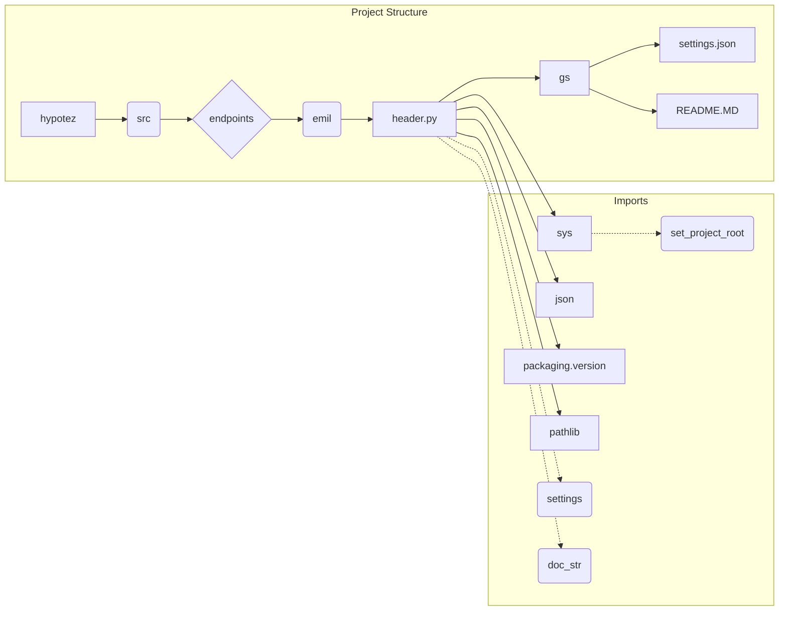

# <input code>

```python
## \file hypotez/src/endpoints/emil/header.py
# -*- coding: utf-8 -*-

#! venv/bin/python/python3.12

"""
.. module: src.endpoints.emil 
	:platform: Windows, Unix
	:synopsis:

"""


import sys
import json
from packaging.version import Version

from pathlib import Path
def set_project_root(marker_files=('__root__','.git')) -> Path:
    """
    Finds the root directory of the project starting from the current file's directory,
    searching upwards and stopping at the first directory containing any of the marker files.

    Args:
        marker_files (tuple): Filenames or directory names to identify the project root.
    
    Returns:
        Path: Path to the root directory if found, otherwise the directory where the script is located.
    """
    __root__:Path
    current_path:Path = Path(__file__).resolve().parent
    __root__ = current_path
    for parent in [current_path] + list(current_path.parents):
        if any((parent / marker).exists() for marker in marker_files):
            __root__ = parent
            break
    if __root__ not in sys.path:
        sys.path.insert(0, str(__root__))
    return __root__


# Get the root directory of the project
__root__ = set_project_root()
"""__root__ (Path): Path to the root directory of the project"""

from src import gs

settings:dict = None
try:
    with open(gs.path.root / 'src' / 'settings.json', 'r') as settings_file:
        settings = json.load(settings_file)
except (FileNotFoundError, json.JSONDecodeError):
    ...

doc_str:str = None
try:
    with open(gs.path.root / 'src' / 'README.MD', 'r') as settings_file:
        doc_str = settings_file.read()
except (FileNotFoundError, json.JSONDecodeError):
    ...


__project_name__ = settings.get("project_name", 'hypotez') if settings  else 'hypotez'
__version__: str = settings.get("version", '')  if settings  else ''
__doc__: str = doc_str if doc_str else ''
__details__: str = ''
__author__: str = settings.get("author", '')  if settings  else ''
__copyright__: str = settings.get("copyrihgnt", '')  if settings  else ''
__cofee__: str = settings.get("cofee", "Treat the developer to a cup of coffee for boosting enthusiasm in development: https://boosty.to/hypo69")  if settings  else "Treat the developer to a cup of coffee for boosting enthusiasm in development: https://boosty.to/hypo69"
```

# <algorithm>


**Пример:**

Если текущий файл находится в `hypotez/src/endpoints/emil/header.py`, алгоритм ищет родительские директории, пока не найдет директорию содержащую `pyproject.toml`, `requirements.txt` или `.git`. Если такая директория найдена (`__root__`), её путь добавляется в `sys.path`.  Если нет, то используется путь текущего файла.


# <mermaid>




# <explanation>

**Импорты:**

- `sys`: Предоставляет доступ к системным переменным и функциям. Используется для добавления пути к проекту в `sys.path`, чтобы импортировать модули из других частей проекта.
- `json`: Модуль для работы с JSON-данными. Используется для загрузки настроек из файла `settings.json`.
- `packaging.version`:  Модуль для работы с версиями пакетов.  В данном случае, скорее всего, не используется.
- `pathlib`: Модуль для работы с путями к файлам и директориям. Очень удобный способ работы с файлами.
- `src.gs`:  Судя по коду, `gs` - это модуль из пакета `src`, который, скорее всего, содержит инструменты для работы с файловой системой проекта. (`gs.path.root` явно показывает, что `gs` имеет атрибут `path` с атрибутом `root`).

**Классы:**

В коде нет классов, только функции и переменные.

**Функции:**

- `set_project_root(marker_files=...)`:  Ищет корневую директорию проекта, начиная от текущего файла и ищет директорию, содержащую файлы из набора `marker_files`.  Это полезная функция, которая позволит импортировать модули из проекта.
  - `marker_files`: Кортеж имен файлов/директорий, которые используются для поиска корневой директории.  По умолчанию это `pyproject.toml`, `requirements.txt` и `.git`.
  - Возвращает `Path` объект, содержащий путь к корневой директории. Добавляет этот путь в `sys.path`  для импорта модулей из других частей проекта.
  
**Переменные:**

- `__root__`: Содержит путь к корневой директории проекта.
- `settings`: Словарь, содержащий настройки проекта (загружается из `settings.json`).
- `doc_str`: Строка, содержащая текст из `README.MD`.
- `__project_name__`, `__version__`, `__doc__`, `__details__`, `__author__`, `__copyright__`, `__cofee__`: Переменные, содержащие информацию о проекте, полученную из файла `settings.json`.  Они инициализируются значениями из настроек, или значениями по умолчанию.


**Возможные ошибки и улучшения:**

- **Обработка ошибок:**  Используются `try...except` блоки для обработки `FileNotFoundError` и `json.JSONDecodeError`. Но можно добавить более конкретные проверки (например, на валидность структуры данных в `settings.json`) и сообщения об ошибках.
- **Валидация данных:**  Добавление проверок на правильность данных из `settings.json` (например, тип данных для `version`, `project_name`) для предотвращения неожиданного поведения.
- **Документация:** Добавлены docstrings, но можно добавить более подробные пояснения для улучшения читаемости кода.


**Взаимосвязь с другими частями проекта:**

Код напрямую зависит от модуля `gs`, который предоставляет функции для работы с путями.  Судя по коду, `gs.path.root` — это ключевой элемент, который указывает на наличие модуля/класса, отвечающего за определение корневой директории проекта.  Без `gs` код не сможет найти корневой каталог, и это повлияет на другие части проекта, которые импортируют модули из разных каталогов.  Этот код — часть проекта, который, по всей видимости, запрашивает информацию о проекте для дальнейшего использования, например, для запуска, сборки или генерации документации.