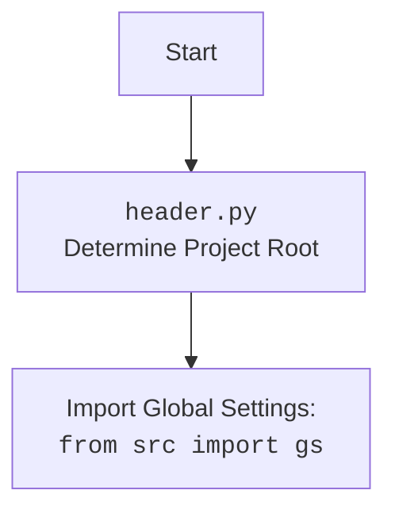

## АНАЛИЗ КОДА: `hypotez/src/endpoints/emil/header.py`

### <алгоритм>

1.  **`set_project_root(marker_files)`:**
    *   Начало: Функция `set_project_root` вызывается с кортежем `marker_files`, по умолчанию `('__root__', '.git')`.
    *   `current_path`: Определяет абсолютный путь к директории, в которой находится текущий скрипт (`header.py`).
    *   `__root__`: Инициализируется как `current_path`.
    *   Цикл `for parent in [current_path] + list(current_path.parents)`: Итерируется по текущей директории и всем ее родительским директориям.
        *   Проверка `any((parent / marker).exists() for marker in marker_files)`: Проверяет, существует ли хотя бы один из `marker_files` в текущей родительской директории.
            *   Если `marker_file` найден:
                *   `__root__` присваивается путь к этой родительской директории.
                *   Цикл завершается с помощью `break`.
    *   Проверка `if __root__ not in sys.path`: Проверяет, добавлен ли путь `__root__` в `sys.path`.
        *   Если путь не найден:
            *   `__root__` добавляется в `sys.path` в начало списка.
    *   Возвращает `__root__` - путь к корневой директории проекта.
    *   Пример: Если `header.py` лежит в `/Users/user/projects/hypotez/src/endpoints/emil`, то поиск `__root__` начнётся от `/Users/user/projects/hypotez/src/endpoints/emil` и будет подниматься вверх до тех пор, пока не найдётся директория, содержащая `__root__` или `.git` (к примеру, `/Users/user/projects/hypotez`).

2.  **`__root__ = set_project_root()`:**
    *   Вызывается функция `set_project_root()`, результат сохраняется в глобальную переменную `__root__`.

3.  **Импорт `src.gs`**:
    *  Импортирует модуль `gs` из пакета `src`, который содержит глобальные настройки и пути проекта.

4.  **Загрузка `settings.json`:**
    *   Пытается открыть файл `settings.json`, расположенный по пути `<root>/src/settings.json`.
    *   Если файл найден, загружает его содержимое как JSON в словарь `settings`.
    *   В случае ошибок `FileNotFoundError` или `json.JSONDecodeError` пропускает ошибку (заглушка `...`).
    *   Пример: Файл `settings.json` может содержать:
        ```json
        {
          "project_name": "hypotez",
          "version": "1.0.0",
          "author": "John Doe",
          "copyright": "2024"
        }
        ```

5.   **Загрузка `README.MD`:**
    *   Пытается открыть файл `README.MD`, расположенный по пути `<root>/src/README.MD`.
    *   Если файл найден, читает его содержимое в строку `doc_str`.
    *   В случае ошибок `FileNotFoundError` или `json.JSONDecodeError` пропускает ошибку (заглушка `...`).

6.  **Инициализация глобальных переменных:**
    *   `__project_name__`:  Берет значение из `settings.get("project_name")`, если `settings` загружен, иначе устанавливает значение по умолчанию `hypotez`.
    *   `__version__`: Берет значение из `settings.get("version")`, если `settings` загружен, иначе устанавливает значение по умолчанию `''`.
    *   `__doc__`:  Присваивает значение переменной `doc_str` если она задана, иначе `''`.
    *   `__details__`: Устанавливается значение `''`
    *   `__author__`: Берет значение из `settings.get("author")`, если `settings` загружен, иначе устанавливает значение по умолчанию `''`.
    *   `__copyright__`:  Берет значение из `settings.get("copyright")`, если `settings` загружен, иначе устанавливает значение по умолчанию `''`.
     *   `__cofee__`: Берет значение из `settings.get("cofee")`, если `settings` загружен, иначе устанавливает значение по умолчанию "Treat the developer to a cup of coffee for boosting enthusiasm in development: https://boosty.to/hypo69".

### <mermaid>

```mermaid
flowchart TD
    Start --> setProjectRoot[<code>set_project_root</code><br>Find Project Root]
    setProjectRoot --> initPath[<code>current_path = Path(__file__).resolve().parent</code><br>Get Current Path]
    initPath --> loopParents[Loop Through Parents]
    loopParents --"Found Marker File"--> setRoot[<code>__root__ = parent</code><br>Set Project Root]
    loopParents --"No Marker File"--> loopParents
    setRoot --> checkPath[<code>if __root__ not in sys.path</code><br>Check Path in sys.path]
    checkPath --"Path Not Found"--> insertPath[<code>sys.path.insert(0, str(__root__))</code><br>Insert Path to sys.path]
    checkPath --"Path Found"--> returnRoot[<code>return __root__</code><br>Return Project Root]
    insertPath --> returnRoot
    returnRoot --> setGlobalRoot[<code>__root__ = set_project_root()</code><br>Set Global Root Variable]
    setGlobalRoot --> importGS[Import Global Settings: <br><code>from src import gs</code>]
    importGS --> tryLoadSettings[Try to Load <code>settings.json</code>]
    tryLoadSettings --"File Found"--> loadSettings[<code>settings = json.load(settings_file)</code><br>Load Settings]
    tryLoadSettings --"File Not Found"-->  skipSettings[Skip Settings Loading]
    loadSettings --> tryLoadDoc[Try to Load <code>README.MD</code>]
    skipSettings --> tryLoadDoc
    tryLoadDoc --"File Found"--> loadDoc[<code>doc_str = settings_file.read()</code><br>Load Document String]
    tryLoadDoc --"File Not Found"--> skipDoc[Skip Document Loading]
    loadDoc --> setGlobalVars[Set Global Variables]
    skipDoc --> setGlobalVars
    setGlobalVars --> End
   
    
    classDef file_style fill:#f9f,stroke:#333,stroke-width:2px
    class setProjectRoot,initPath,loopParents,setRoot,checkPath,insertPath,returnRoot file_style
    
    classDef process_style fill:#ccf,stroke:#333,stroke-width:2px
    class importGS,tryLoadSettings, loadSettings, skipSettings, tryLoadDoc, loadDoc, skipDoc process_style
```



### <объяснение>

**Импорты:**

*   `sys`:  Используется для работы с системными параметрами и функциями, в частности, для добавления пути к корневой директории проекта в `sys.path`. Это позволяет импортировать модули из разных частей проекта.
*   `json`: Используется для загрузки данных из файла `settings.json` в формате JSON.
*   `packaging.version.Version`:  Импортируется для работы с версиями пакетов.
*   `pathlib.Path`:  Используется для представления путей к файлам и директориям, обеспечивая кроссплатформенную работу с файловой системой.

*   `from src import gs`: Импортирует модуль `gs` (глобальные настройки) из пакета `src`. Это позволяет использовать общие пути и настройки проекта, определённые в `src/gs.py`.

**Функции:**

*   `set_project_root(marker_files: tuple = ('__root__', '.git')) -> Path`:
    *   **Аргументы:**
        *   `marker_files` (tuple): Кортеж с именами файлов или директорий, которые обозначают корень проекта. По умолчанию `('__root__', '.git')`.
    *   **Возвращает:**
        *   `Path`: Объект `pathlib.Path`, представляющий путь к корневой директории проекта.
    *   **Назначение:** Функция ищет корневую директорию проекта, начиная с директории, где расположен файл. Она поднимается вверх по структуре директорий, пока не найдет один из `marker_files`.
    *   **Пример:**
        ```python
        root_path = set_project_root()
        print(root_path)  # Выведет /Users/user/projects/hypotez
        ```

**Переменные:**

*   `__root__` (Path):  Путь к корневой директории проекта, определённый функцией `set_project_root()`. Эта переменная используется как основа для поиска других файлов и модулей в проекте.
*  `settings` (dict):  Словарь, содержащий настройки проекта, загруженные из файла `settings.json`.
*  `doc_str` (str):  Строка, содержащая содержимое файла `README.MD`.
*   `__project_name__` (str): Название проекта, по умолчанию `'hypotez'`, если не найдено в `settings.json`.
*   `__version__` (str):  Версия проекта, по умолчанию `''`, если не найдено в `settings.json`.
*   `__doc__` (str):  Содержимое файла `README.MD`, по умолчанию `''`.
*   `__details__` (str):  Детали проекта (пока не используются), установлены в `''`.
*   `__author__` (str):  Автор проекта, по умолчанию `''`, если не найдено в `settings.json`.
*   `__copyright__` (str):  Авторское право проекта, по умолчанию `''`, если не найдено в `settings.json`.
*   `__cofee__` (str): Строка, содержащая информацию о возможности поддержать разработчика, по умолчанию "Treat the developer to a cup of coffee for boosting enthusiasm in development: https://boosty.to/hypo69".

**Объяснение:**

Файл `header.py` отвечает за определение корневой директории проекта и загрузку основных настроек. Он добавляет путь к корню проекта в `sys.path`, что позволяет импортировать модули из любой точки проекта. Функция `set_project_root()` ищет корневую директорию, начиная с текущего файла и двигаясь вверх по директориям, пока не найдет маркерный файл. Далее загружаются настройки из `settings.json` и `README.MD`, которые затем используются для инициализации глобальных переменных, таких как имя проекта, версия, описание и авторские права.

**Потенциальные ошибки и улучшения:**

*   **Обработка ошибок:**  Обработка `FileNotFoundError` и `json.JSONDecodeError` при загрузке `settings.json` и `README.MD` выполняется с помощью `...`, что может усложнить отладку. Лучше логировать эти ошибки и задавать значения по умолчанию для `settings` и `doc_str`  в случае проблем.
*   **Конфигурация:**  Маркерные файлы для поиска корневой директории могут быть вынесены в переменные окружения или настройки проекта. Это сделает конфигурацию более гибкой.
*   **`__details__`**: Назначение переменной `__details__` не ясно. Возможно, её стоит переименовать или удалить, если она не используется.
*   **Зависимость от структуры директорий:** Логика загрузки файлов `settings.json` и `README.MD` зависит от того, что они находятся в `<root>/src/`. Может потребоваться более гибкий механизм поиска файлов.

**Взаимосвязь с другими частями проекта:**

*   **`src.gs`:**  Этот модуль предоставляет доступ к глобальным путям и настройкам проекта, необходимым для работы `header.py`.
*   **Другие модули:** `header.py` предоставляет глобальные переменные, такие как `__root__`, `__project_name__`, `__version__`, `__doc__`, которые используются другими модулями проекта для получения доступа к корневой директории, информации о проекте и документации.

В целом, `header.py` является важным модулем для инициализации проекта, определения корневой директории и загрузки основных параметров, необходимых для работы других частей проекта.