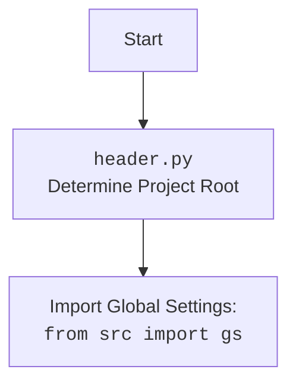

## ИНСТРУКЦИЯ:

Анализируй предоставленный код подробно и объясни его функциональность. Ответ должен включать три раздела:

1.  **<алгоритм>**: Опиши рабочий процесс в виде пошаговой блок-схемы, включая примеры для каждого логического блока, и проиллюстрируй поток данных между функциями, классами или методами.
2.  **<mermaid>**: Напиши код для диаграммы в формате `mermaid`, проанализируй и объясни все зависимости,
    которые импортируются при создании диаграммы.
    **ВАЖНО!** Убедитесь, что все имена переменных, используемые в диаграмме `mermaid`,
    имеют осмысленные и описательные имена. Имена переменных вроде `A`, `B`, `C`, и т.д., не допускаются!

    **Дополнительно**: Если в коде есть импорт `import header`, добавьте блок `mermaid` flowchart, объясняющий `header.py`:\
    ```mermaid\
    flowchart TD\
        Start --> Header[<code>header.py</code><br> Determine Project Root]\
    \
        Header --> import[Import Global Settings: <br><code>from src import gs</code>] \
    ```

3.  **<объяснение>**: Предоставьте подробные объяснения:
    *   **Импорты**: Их назначение и взаимосвязь с другими пакетами `src.`.
    *   **Классы**: Их роль, атрибуты, методы и взаимодействие с другими компонентами проекта.
    *   **Функции**: Их аргументы, возвращаемые значения, назначение и примеры.
    *   **Переменные**: Их типы и использование.
    *   Выделите потенциальные ошибки или области для улучшения.

Дополнительно, постройте цепочку взаимосвязей с другими частями проекта (если применимо).

Это обеспечивает всесторонний и структурированный анализ кода.
## Формат ответа: `.md` (markdown)
**КОНЕЦ ИНСТРУКЦИИ**

## <алгоритм>

```mermaid
graph LR
    A[Начало сценария: `run_scenario()`] --> B{Цикл по URL-адресам};
    B -- для каждого URL --> C[Определение граббера: `get_graber_by_supplier_url()`];
    C -- граббер найден --> D{Получение данных о товаре: `graber.grab_page()`};
    C -- граббер не найден --> E[Логирование: "Нет грабера для URL"];
    D -- данные получены --> F[Конвертация данных: `convert_product_fields()`];
    D -- ошибка получения данных --> G[Логирование: "Ошибка получения полей товара"];
    F -- данные сконвертированы --> H{Сохранение данных: `save_product_data()`};
    F -- ошибка конвертации данных --> I[Логирование: "Не удалось конвертировать данные"];
    H -- данные сохранены --> J[Добавление данных в список `products_list`];
    H -- ошибка сохранения данных --> K[Логирование: "Данные не сохранены"];
    J --> B;
    B -- все URL обработаны --> L[Преобразование списка товаров в строку];
    L --> M{Обработка данных через ИИ: `process_ai()`};
    M -- получен ответ ИИ --> N[Сохранение ответа ИИ];
    M -- ошибка запроса/парсинга ИИ --> O[Логирование: "Ошибка обработки ИИ"];
    N --> P[Постинг в Facebook: `post_facebook()`];
        P --> Q[Генерация отчета: `create_report()`];
        Q --> R[Отправка отчета боту];
    R --> S[Конец сценария];
    E --> B
    G --> B
    I --> B
    K --> B
    O --> M
```

**Примеры для каждого блока:**

*   **A [Начало сценария: `run_scenario()`]**: Инициализация параметров сценария, таких как `update`, `context`, `urls`, `price`, `mexiron_name`.
*   **B {Цикл по URL-адресам}**: Перебирает список URL-адресов, например, `urls = ['https://example1.com/product1', 'https://example2.com/product2']`.
*   **C [Определение граббера: `get_graber_by_supplier_url()`]**: Для `url = 'https://aliexpress.com/item/123.html'` вернет экземпляр класса граббера `aliexpress.AliExpressGraber`.
*   **D {Получение данных о товаре: `graber.grab_page()`}**: Извлекает данные о товаре, например, `f = {'id_product': 123, 'name': {'language': [{'value': 'Product Name'}]}, 'description_short': {'language': [{'value': 'Short description'}]}}`.
*    **E [Логирование: "Нет грабера для URL"]**: Если `url = 'https://unknown-supplier.com'` не будет найден соответствующий граббер, будет записано сообщение об ошибке
*   **F [Конвертация данных: `convert_product_fields()`]**: Преобразует `f` в словарь, например, `product_data = {'product_title': 'Product Name', 'product_id': 123, 'description_short': 'Short description'}`.
*    **G [Логирование: "Ошибка получения полей товара"]**: Если на этапе `graber.grab_page()` произошла ошибка.
*   **H {Сохранение данных: `save_product_data()`}**: Сохраняет `product_data` в JSON-файл, например, в `export_path/products/123.json`.
*    **I [Логирование: "Не удалось конвертировать данные"]**: Если `convert_product_fields` вернет пустой словарь
*   **J [Добавление данных в список `products_list`]**: Добавляет `product_data` в список, например, `products_list = [{'product_title': 'Product Name', 'product_id': 123, 'description_short': 'Short description'}]`.
*   **K [Логирование: "Данные не сохранены"]**: Если при сохранении данных возникла ошибка
*   **L [Преобразование списка товаров в строку]**: Преобразует `products_list` в строку для отправки в ИИ, например, `"[{\'product_title\': \'Product Name\', \'product_id\': 123, \'description_short\': \'Short description\'}]"`.
*   **M {Обработка данных через ИИ: `process_ai()`}**: Запрашивает у ИИ обработку данных и возвращает ответ, например, `response_dict = {'ru': 'Русское описание', 'he': 'Ивритское описание'}`.
*   **N [Сохранение ответа ИИ]**: Сохраняет данные, сгенерированные ИИ
*    **O [Логирование: "Ошибка обработки ИИ"]**: Если на этапе получения ответа от ИИ возникла ошибка
*   **P [Постинг в Facebook: `post_facebook()`]**: Публикует сообщение с информацией о мехироне в Facebook.
*   **Q [Генерация отчета: `create_report()`]**: Создает HTML и PDF отчет на основе полученных данных.
*   **R [Отправка отчета боту]**: Отправляет сгенерированный PDF-отчет боту Telegram.
*   **S [Конец сценария]**: Завершение выполнения сценария.

## <mermaid>

```mermaid
flowchart TD
    Start[Начало] --> Init[Инициализация SupplierToPrestashopProvider];
    Init --> LoadConfig[Загрузка конфигурации];
    LoadConfig --> SetTimestamp[Установка метки времени];
    SetTimestamp --> SetExportPath[Определение пути экспорта];
    SetExportPath --> LoadModel[Загрузка модели ИИ];
    LoadModel --> RunScenario[Выполнение сценария `run_scenario()`];
    RunScenario --> LoopUrls{Цикл по URL-адресам};
    LoopUrls -- Для каждого URL --> GetGraber[Получение граббера: `get_graber_by_supplier_url()`];
    GetGraber -- Грабер найден --> GrabPage[Извлечение данных: `graber.grab_page()`];
    GetGraber -- Грабер не найден --> LogNoGraber[Лог: нет грабера];
    LogNoGraber --> LoopUrls;
    GrabPage --> ConvertFields[Конвертация данных: `convert_product_fields()`];
    GrabPage -- Ошибка извлечения данных --> LogErrorGrab[Лог: ошибка извлечения];
        LogErrorGrab --> LoopUrls;
    ConvertFields --> SaveData[Сохранение данных: `save_product_data()`];
        ConvertFields -- Ошибка конвертации --> LogErrorConvert[Лог: ошибка конвертации];
          LogErrorConvert --> LoopUrls;
    SaveData --> AddToList[Добавление данных в список];
    SaveData -- Ошибка сохранения --> LogErrorSave[Лог: ошибка сохранения];
      LogErrorSave --> LoopUrls;
    AddToList --> LoopUrls;
    LoopUrls -- Все URL обработаны --> ProcessAI[Обработка через ИИ: `process_ai()`];
    ProcessAI --> PostFacebook[Публикация в Facebook: `post_facebook()`];
    ProcessAI -- Ошибка обработки ИИ --> LogErrorAI[Лог: ошибка ИИ];
    PostFacebook --> CreateReport[Создание отчета: `create_report()`];
    CreateReport --> End[Конец];
    LogErrorAI --> ProcessAI
```



**Зависимости:**

*   `from __future__ import annotations`: Используется для отложенной оценки аннотаций типов.
*   `from src.suppliers import aliexpress`: Импортирует модуль `aliexpress`, предположительно содержащий класс для сбора данных с AliExpress.
*   `import asyncio`: Используется для асинхронного программирования.
*   `import random`: Для генерации случайных чисел.
*   `import shutil`: Для работы с файловой системой.
*   `from pathlib import Path`: Для представления путей к файлам и директориям.
*   `from typing import Optional, List`: Для аннотации типов.
*   `from types import SimpleNamespace`: Для создания простых объектов с атрибутами.
*   `from dataclasses import field`: Для создания dataclass полей.
*   `from telegram import Update`: Для работы с обновлениями Telegram.
*   `from telegram.ext import CallbackContext`: Для работы с контекстом Telegram.
*   `import header`: Импорт модуля `header`, который предположительно определяет корень проекта и глобальные настройки.
*   `from src import gs`: Импортирует глобальные настройки проекта.
*   `from src.endpoints.prestashop.product_fields import ProductFields`: Импортирует класс `ProductFields`, используемый для представления полей продукта.
*   `from src.webdriver.driver import Driver`: Импортирует класс `Driver` для управления браузером.
*   `from src.ai.gemini import GoogleGenerativeAI`: Импортирует класс `GoogleGenerativeAI` для взаимодействия с моделью ИИ Gemini.
*   `from src.endpoints.advertisement.facebook.scenarios import (post_message_title, upload_post_media, message_publish)`: Импортирует функции для публикации сообщений и медиа в Facebook.
*   `from src.utils.jjson import j_loads, j_loads_ns, j_dumps`: Импортирует функции для работы с JSON.
*   `from src.utils.file import read_text_file, save_text_file, recursively_get_file_path`: Импортирует функции для работы с файлами.
*   `from src.utils.image import save_image_from_url, save_image`: Импортирует функции для работы с изображениями.
*    `from src.utils.convertors.unicode import decode_unicode_escape`: Импортирует функции для работы с unicode.
*   `from src.utils.printer import pprint`: Импортирует функцию для форматированного вывода данных.
*   `from src.logger.logger import logger`: Импортирует класс для логирования.

## <объяснение>

### Импорты:

*   `from __future__ import annotations`: Обеспечивает возможность использования аннотаций типов, которые могут ссылаться на классы, объявленные позже в файле.
*   `from src.suppliers import aliexpress`: Импортирует модуль `aliexpress`, который содержит класс `AliExpressGraber`, предназначенный для парсинга данных с сайта AliExpress. Это позволяет отделить логику парсинга от основного сценария.
*   `import asyncio`: Обеспечивает возможность использовать асинхронные операции, что позволяет повысить производительность, особенно при выполнении сетевых запросов.
*   `import random`: Используется для генерации случайных чисел, хотя в данном коде это не видно.
*   `import shutil`: Позволяет выполнять операции с файлами и каталогами, такие как копирование, удаление и т. д.
*   `from pathlib import Path`: Упрощает работу с путями к файлам и каталогам, делая код более читаемым и переносимым.
*   `from typing import Optional, List`: Используется для определения типов переменных и возвращаемых значений, что улучшает читаемость и проверку кода.
*   `from types import SimpleNamespace`: Позволяет создавать простые объекты с динамическими атрибутами, что полезно для хранения настроек.
*   `from dataclasses import field`: Используется для настройки атрибутов dataclass.
*   `from telegram import Update`: Используется для обработки обновлений от Telegram бота.
*   `from telegram.ext import CallbackContext`: Используется для получения контекста вызова от Telegram бота.
*   `import header`: Импортирует модуль `header`, который предположительно определяет корень проекта и глобальные настройки.
*   `from src import gs`: Импортирует глобальные настройки проекта, такие как пути к файлам, API ключи, и т. д.
*   `from src.endpoints.prestashop.product_fields import ProductFields`: Импортирует класс `ProductFields`, который, вероятно, используется для представления и работы с данными о продукте, полученными от поставщика.
*   `from src.webdriver.driver import Driver`: Импортирует класс `Driver`, который, вероятно, управляет браузером (например, Chrome или Firefox) через Selenium.
*   `from src.ai.gemini import GoogleGenerativeAI`: Импортирует класс `GoogleGenerativeAI`, который является интерфейсом для взаимодействия с моделью искусственного интеллекта Gemini.
*   `from src.endpoints.advertisement.facebook.scenarios import (post_message_title, upload_post_media, message_publish)`: Импортирует функции для взаимодействия с Facebook API для публикации сообщений.
*   `from src.utils.jjson import j_loads, j_loads_ns, j_dumps`: Импортирует функции для сериализации и десериализации JSON данных. `j_loads` и `j_loads_ns` для загрузки JSON из строки и файла соответственно. `j_dumps` - для сохранения JSON в файл.
*   `from src.utils.file import read_text_file, save_text_file, recursively_get_file_path`: Импортирует функции для работы с файлами.
*   `from src.utils.image import save_image_from_url, save_image`: Импортирует функции для загрузки и сохранения изображений.
*    `from src.utils.convertors.unicode import decode_unicode_escape`: Импортирует функции для работы с unicode
*   `from src.utils.printer import pprint`: Импортирует функцию для удобного вывода объектов в консоль.
*   `from src.logger.logger import logger`: Импортирует объект `logger` для логирования событий в приложении.

### Классы:

*   **`SupplierToPrestashopProvider`**:
    *   **Роль**: Основной класс, инкапсулирующий логику извлечения, преобразования и сохранения данных о продуктах от поставщиков, а также их обработки с помощью ИИ и публикации в Facebook.
    *   **Атрибуты**:
        *   `driver` (`Driver`): Экземпляр Selenium WebDriver для управления браузером.
        *   `export_path` (`Path`): Путь для сохранения данных.
        *   `mexiron_name` (`str`): Имя мехирона.
        *   `price` (`float`): Цена.
        *   `timestamp` (`str`): Временная метка.
        *   `products_list` (`List`): Список словарей, представляющих обработанные данные о продуктах.
        *   `model` (`GoogleGenerativeAI`): Экземпляр класса для взаимодействия с ИИ.
        *   `config` (`SimpleNamespace`): Объект с настройками.
        *   `update` (`Update`): Объект обновления от Telegram.
        *  `context` (`CallbackContext`): Объект контекста от Telegram.
    *   **Методы**:
        *   `__init__(self, driver: Driver)`: Инициализирует объект, загружает настройки, устанавливает метку времени, определяет путь экспорта, инициализирует модель ИИ.
        *   `run_scenario(self, update: Update, context: CallbackContext, urls: list[str], price: Optional[str] = '', mexiron_name: Optional[str] = '') -> bool`:  Выполняет основной сценарий, включая парсинг данных о продуктах, их обработку через ИИ и сохранение.
        *   `convert_product_fields(self, f: ProductFields) -> dict`: Преобразует объект `ProductFields` в словарь.
        *   `save_product_data(self, product_data: dict)`: Сохраняет данные о продукте в JSON-файл.
        *   `process_ai(self, products_list: List[str], lang:str, attempts: int = 3) -> tuple | bool`: Обрабатывает список продуктов через модель ИИ.
        *   `post_facebook(self, mexiron:SimpleNamespace) -> bool`: Осуществляет публикацию данных в Facebook.
        *    `create_report(self, data: dict, lang:str, html_file: Path, pdf_file: Path) -> bool`: Генерирует отчет в формате `html` и `pdf`.

### Функции:

*   `__init__`:
    *   **Аргументы**: `driver` (экземпляр `Driver`).
    *   **Возвращаемое значение**: `None`.
    *   **Назначение**: Инициализирует объект `SupplierToPrestashopProvider`, загружает конфигурацию, устанавливает timestamp, определяет путь экспорта, загружает модель ИИ. При ошибке загрузки конфигурации/пути/модели - завершает выполнение функции.
*   `run_scenario`:
    *   **Аргументы**:
        *   `update` (`Update`): Объект обновления от Telegram.
        *   `context` (`CallbackContext`): Контекст вызова от Telegram.
        *   `urls` (`list[str]`): Список URL адресов товаров
        *   `price` (`Optional[str]`): Цена.
        *   `mexiron_name` (`Optional[str]`): Имя мехирона.
    *   **Возвращаемое значение**: `bool` (True в случае успеха, False в противном случае).
    *   **Назначение**: Выполняет основной сценарий:
        1. Итерирует по списку `urls`.
        2. Определяет граббер для текущего URL.
        3. Получает данные о товаре.
        4. Конвертирует данные о товаре.
        5. Сохраняет данные о товаре в json-файл.
        6. Добавляет в общий список `products_list`
        7. После завершения итерации - запускает обработку `products_list` через ИИ и публикацию в Facebook
*   `convert_product_fields`:
    *   **Аргументы**: `f` (экземпляр `ProductFields`).
    *   **Возвращаемое значение**: `dict` (словарь с данными о товаре)
    *   **Назначение**: Преобразует объект `ProductFields` в словарь для отправки модели ИИ.
*   `save_product_data`:
    *   **Аргументы**: `product_data` (словарь с данными о товаре).
    *   **Возвращаемое значение**: `bool` (True в случае успеха, None - при ошибке).
    *   **Назначение**: Сохраняет данные о товаре в файл в формате JSON.
*   `process_ai`:
    *   **Аргументы**:
        *   `products_list` (`List[str]`): Список словарей с данными о товарах в формате строки.
        *   `lang` (`str`): Язык, на котором будет обрабатываться запрос к ИИ.
        *   `attempts` (`int`): Количество попыток запроса к ИИ (по умолчанию 3).
    *   **Возвращаемое значение**: `tuple` (обработанные данные) или `bool` (False если не удалось получить данные от ИИ).
    *   **Назначение**: Отправляет данные о товарах модели ИИ для обработки, обрабатывает ответ и возвращает его. В случае неудачи может повторить запрос определенное количество раз.
*   `post_facebook`:
    *   **Аргументы**: `mexiron` (SimpleNamespace с данными о мехироне)
    *   **Возвращаемое значение**: `bool` (True в случае успеха, False в случае неудачи).
    *   **Назначение**: Публикует сообщение с информацией о мехироне в Facebook.
*   `create_report`:
     *  **Аргументы**:
        *  `data` (`dict`): данные для формирования отчета.
        *  `lang` (`str`): язык отчета
        *  `html_file` (`Path`): путь к html-файлу
        *  `pdf_file` (`Path`): путь к pdf-файлу
    *  **Возвращаемое значение**: `bool` (True в случае успеха, False в случае неудачи).
    *  **Назначение**: Генерирует отчет в формате `html` и `pdf` и отправляет его боту в Telegram.

### Переменные:

*   `driver` (`Driver`): Экземпляр класса `Driver` для управления браузером.
*   `export_path` (`Path`): Путь для экспорта данных, формируется на основе конфигурации.
*   `mexiron_name` (`str`): Имя мехирона, может быть передано при вызове `run_scenario`.
*   `price` (`float`): Цена, может быть передана при вызове `run_scenario`.
*   `timestamp` (`str`): Временная метка, созданная при инициализации.
*   `products_list` (`List`): Список словарей с данными о продуктах, собранных в процессе выполнения сценария.
*   `model` (`GoogleGenerativeAI`): Экземпляр класса `GoogleGenerativeAI`, используемый для взаимодействия с моделью ИИ.
*   `config` (`SimpleNamespace`): Объект с настройками приложения, загружается из JSON-файла.
*   `update` (`Update`): Объект обновления от Telegram.
*   `context` (`CallbackContext`): Объект контекста от Telegram.
*   `required_fields` (`tuple`): Кортеж с полями товара, которые необходимо получить с сайта.

### Потенциальные ошибки и области для улучшения:

*   **Обработка ошибок**: В коде присутствует обработка ошибок с помощью блоков `try-except`, но, возможно, стоит расширить логику обработки для разных типов исключений.
*   **Логирование**: Логирование выполняется, но можно добавить уровни логирования (debug, info, warning, error) для большей гибкости.
*   **Повторные запросы к ИИ**: В функции `process_ai` есть механизм повторных запросов, но можно сделать его более гибким (например, добавлять задержку перед повторным запросом).
*   **Обработка `None` значений**: В коде есть проверки на `None`, но можно добавить более явную обработку таких случаев.
*   **Параллелизация**: Цикл по `urls` выполняется последовательно, можно рассмотреть возможность параллелизации запросов для ускорения обработки.
*   **Конфигурация**: Хранение путей к файлам, API ключей и прочих параметров в `gs` может быть не самым удобным решением. Возможно, стоит использовать более продвинутые решения для управления конфигурацией.
*   **Зависимости**: Зависимости от конкретных поставщиков (например, `aliexpress`) могут привести к проблемам, если потребуется работать с другим поставщиком. Можно рассмотреть возможность использования интерфейсов для более гибкого подхода.
*   **Модульность**: Функционал `post_facebook`, `create_report` можно вынести в отдельные модули, для более гибкой архитектуры.

### Взаимосвязь с другими частями проекта:

*   **`src.suppliers`**: Модуль, содержащий грабберы для различных поставщиков, используется для извлечения данных.
*   **`src.webdriver`**: Содержит классы для управления браузером, используется для взаимодействия с сайтами.
*   **`src.ai`**: Содержит классы для работы с моделями ИИ, используется для обработки данных.
*   **`src.endpoints.prestashop`**: Содержит классы и функции для работы с Prestashop (хотя в данном коде прямого использования нет).
*   **`src.endpoints.advertisement`**: Содержит функции для работы с рекламными платформами, в данном случае Facebook.
*   **`src.utils`**: Содержит различные утилиты для работы с JSON, файлами, изображениями, и т. д.
*   **`src.logger`**: Содержит класс для логирования событий в приложении.

В целом, данный код является частью более крупного проекта, и его функциональность заключается в автоматизации процесса извлечения данных о товарах от различных поставщиков, их обработки через ИИ и дальнейшей публикации в Facebook и генерации отчетов.