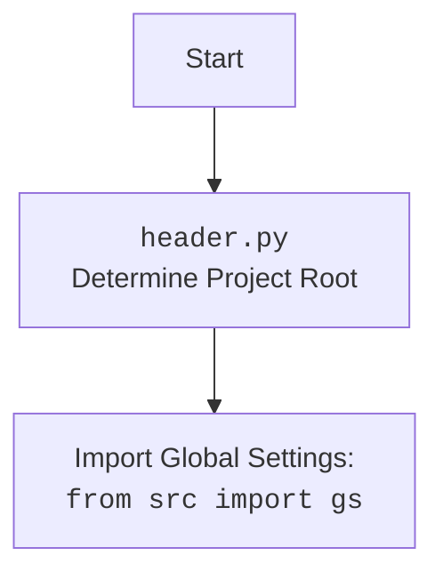

## АНАЛИЗ КОДА: `hypotez/src/endpoints/gemini_simplechat/main.py`

### 1. <алгоритм>

**Блок-схема работы `main.py`:**

```mermaid
graph TD
    A[Start] --> B{Environment};
    B -- Vercel --> C[vercel_handler];
    B -- Local --> D[initialize_local];
    C --> C1{Set config.templates_path from ./header};
    C1 --> C2{Get API Key from env};
    C2 -- API Key OK --> C3[Wrap app in app_wrapper];
    C2 -- API Key missing --> C4[Log Error and Exit];
    C3 --> Z[End];
    
    D --> D1{Set api from config};
    D1 --> D2{Set config.templates_path};
    D2 --> E[Run uvicorn];
    E --> Z
    
    
    F[Request] -- GET / --> G{Is config.templates_path valid?};
    G -- Yes --> H{Read HTML from config.templates_path};
    H -- HTML OK --> I[Return HTMLResponse];
    H -- Error --> J{Return HTTPException};
    G -- No --> K{Return HTTPException};

    F -- POST /api/chat --> L{Is model initialized?};
    L -- No --> M{Init GoogleGenerativeAI};
    M --> N{Call model.chat() with request};
    L -- Yes --> N
    N --> O{Return response};
    O -- Error --> P[Log error and raise HTTPException];
    
    Z[End];
```

**Пояснения к блок-схеме:**

1.  **Start**: Начало выполнения программы.
2.  **Environment**: Проверяется, где выполняется код: Vercel или локально.
3.  **vercel\_handler**: (Vercel)
    *   **Set `config.templates_path`**: Устанавливает путь к шаблону `index.html` на основе пути к корню проекта (определяется в `header.py`).
    *   **Get API Key from env**: Получает API-ключ Gemini из переменных окружения. Если ключ не найден, выдаёт ошибку и завершает программу.
    *   **Wrap app in `app_wrapper`**: Оборачивает приложение FastAPI в функцию `app_wrapper` для совместимости с Vercel.
4.  **initialize\_local**: (Local)
    *   **Set api from config**: Устанавливает API ключ из конфигурации.
    *   **Set `config.templates_path`**: Устанавливает путь к шаблону `index.html`.
5.  **Run uvicorn**: Запускает локальный сервер FastAPI с помощью `uvicorn`.
6.  **Request**: Получение запроса
    *   **GET /**:
        *   Проверяется, является ли `config.templates_path` корректным путем.
        *   Если да, то из файла читается HTML-код, который возвращается в ответе. Если возникает ошибка при чтении файла, возвращается HTTPException.
        *   Если `config.templates_path` не является валидным, возвращается HTTPException.
    *   **POST /api/chat**:
        *   Проверяется, инициализирован ли `model`. Если нет, то создается экземпляр `GoogleGenerativeAI`.
        *   Вызывается метод `chat()` модели с запросом пользователя. Возвращается ответ от модели.
        *   В случае ошибки, выводится ошибка в лог и возвращается HTTPException.
7.  **End**: Конец выполнения программы.

### 2. <mermaid>

```mermaid
flowchart TD
    subgraph FastAPI App
        A[Start] --> B{Environment Check};
        B -- Vercel --> C[vercel_handler];
        B -- Local --> D[initialize_local];
        
        C --> C1{Set templates_path from header};
        C1 --> C2{Get GEMINI_API_KEY from env};
        C2 -- API Key OK --> C3[Wrap FastAPI app];
        C2 -- API Key missing --> C4[Log error and exit];
        C3 --> Z[End];

        D --> D1{Set API Key from config};
         D1 --> D2{Set templates_path};
        D2 --> E[Run uvicorn server];
         E --> Z
         
        F[Request: GET "/"] --> G{Check config.templates_path};
        G -- Valid --> H{Read HTML file};
        H -- Success --> I[Return HTMLResponse];
        H -- Error --> J[Return HTTPException];
        G -- Invalid --> K[Return HTTPException];


        L[Request: POST "/api/chat"] --> M{Is model initialized?};
        M -- No --> N{Init GoogleGenerativeAI};
        M -- Yes --> O{Call model.chat()};
        N --> O;
        O --> P{Return chat response};
        P -- Error --> Q[Log error and raise HTTPException];
    end
    
    subgraph GoogleGenerativeAI
        R[GoogleGenerativeAI class] --> S{chat(message)};
        S --> T[Call Gemini API];
        T --> U[Return Response];
    end
   
    Z[End];
    style A fill:#f9f,stroke:#333,stroke-width:2px
     style Z fill:#ccf,stroke:#333,stroke-width:2px
     
  
```



**Анализ зависимостей (mermaid):**

*   **FastAPI App subgraph**:
    *   **Environment Check**: Определяет, в какой среде запущено приложение (Vercel или локально).
    *   **vercel\_handler**: Функция, обрабатывающая запросы в среде Vercel.
        *   Зависит от модуля `header` для получения корня проекта (`__root__`).
        *   Зависит от переменных окружения для получения API-ключа.
        *   Зависит от `app` (экземпляр FastAPI).
    *   **initialize\_local**: Функция, инициализирующая приложение для локального запуска.
        *   Зависит от `gs` для получения путей и API ключа из конфигурации.
    *   **GET "/"**: Обрабатывает GET-запросы к корню приложения.
        *   Зависит от `config` для получения пути к HTML-шаблону.
    *   **POST "/api/chat"**: Обрабатывает POST-запросы к API чата.
        *   Зависит от `GoogleGenerativeAI` для работы с моделью Gemini.
        *   Зависит от `ChatRequest` для валидации запроса.
    *   **uvicorn**: Используется для запуска сервера FastAPI локально.
*   **GoogleGenerativeAI subgraph**:
    *   **GoogleGenerativeAI class**: Класс, предоставляющий интерфейс для взаимодействия с моделью Gemini.
        *   Зависит от Google Gemini API.
        *   Имеет метод `chat(message)`, который отправляет запрос и получает ответ.

* **header.py flowchart:**
    * Определяет корень проекта.
    * Импортирует глобальные настройки `gs`.

### 3. <объяснение>

**Импорты:**

*   `from __future__ import annotations`: Включает отложенную оценку аннотаций типов.
*   `sys`, `os`: Системные модули для работы с ОС и интерпретатором Python.
*   `pathlib.Path`: Модуль для работы с путями к файлам и директориям.
*   `types.SimpleNamespace`: Создание простых объектов с атрибутами.
*   `fastapi.middleware.cors.CORSMiddleware`: Промежуточное ПО для обработки CORS.
*   `fastapi.FastAPI`, `fastapi.HTTPException`: Классы для создания FastAPI-приложения и обработки HTTP-исключений.
*   `fastapi.responses.HTMLResponse`: Возврат HTML-ответа.
*   `pydantic.BaseModel`: Базовый класс для создания моделей данных.
*   `uvicorn`: ASGI-сервер для запуска FastAPI.
*   `src.ai.GoogleGenerativeAI`: Класс для взаимодействия с моделью Gemini.
*   `src.utils.jjson.j_loads_ns`: Загрузка JSON-файла в объект `SimpleNamespace`.
*   `src.logger.logger`: Модуль для логирования.
*   `from .header import __root__`: Импортирует корень проекта из `header.py` (только для Vercel).
*   `from src import gs`: Импортирует глобальные настройки из `src`.

**Классы:**

*   **`ChatRequest(BaseModel)`**: Модель данных для запроса чата.
    *   `message`: Строка с сообщением от пользователя.
*   **`GoogleGenerativeAI`**: Класс для взаимодействия с Google Gemini API (импортируется из `src.ai`).
    *   Метод `chat()` отправляет сообщение в Gemini и возвращает ответ.

**Функции:**

*   **`root()`**:
    *   Обрабатывает GET-запросы к корневому URL ("/").
    *   Читает HTML-файл шаблона из `config.templates_path`.
    *   Возвращает HTML-ответ или HTTPException в случае ошибки.
*   **`chat(request: ChatRequest)`**:
    *   Обрабатывает POST-запросы к "/api/chat".
    *   Принимает `ChatRequest` в качестве аргумента.
    *   Инициализирует модель `GoogleGenerativeAI` (если еще не инициализирована).
    *   Отправляет запрос в Gemini через метод `chat()` модели.
    *   Возвращает JSON-ответ с сообщением от модели.
*   **`vercel_handler(request)`**:
    *   Функция-обработчик для Vercel.
    *   Получает путь к корню проекта из `header.py`.
    *   Устанавливает путь к шаблонам.
    *   Получает API-ключ Gemini из переменных окружения.
    *   Запускает FastAPI приложение.
*   **`initialize_local()`**:
    *   Инициализирует `config` и `model` для локального выполнения.
    *   Устанавливает API ключ и путь к шаблонам.
*   **`app_wrapper(scope, receive, send)`**: Функция-обертка, используется только в `vercel_handler` для совместимости с Vercel.

**Переменные:**

*   `app`: Экземпляр FastAPI-приложения.
*   `model`: Экземпляр класса `GoogleGenerativeAI`.
*   `api_key`: Строка с API-ключом Gemini.
*   `system_instruction`: Строка с системной инструкцией для модели.
*  `config`: Объект `SimpleNamespace`, содержащий загруженные настройки из `config.json`
*  `gs`: Псевдоним для `config` или импортированных глобальных настроек.

**Потенциальные ошибки и улучшения:**

*   Обработка ошибок должна быть более детальной, и нужно предоставлять пользователю более понятные сообщения об ошибках.
*   Логирование должно быть расширено, добавив контекст к логам (например, id запроса).
*   В `vercel_handler` жестко прописан выход из программы через `sys.exit(1)`. Желательно использовать более изящный способ обработки ошибок в продакшене.
*   В продакшене `allow_origins=["*"]` может быть небезопасным и должен быть заменен на конкретные разрешенные домены.
*   Использование глобальных переменных, таких как `model`, может усложнить тестирование и поддержку кода. Желательно использовать зависимость или другие паттерны.
*  При локальном запуске используется `from src import gs` что требует запуска из корня проекта, это стоит прояснить в документации.

**Цепочка взаимосвязей:**

*   `main.py` -> `src.ai.GoogleGenerativeAI`:  `main.py` использует `GoogleGenerativeAI` для взаимодействия с моделью Gemini.
*  `main.py` -> `src.utils.jjson`: `main.py` использует `j_loads_ns` для загрузки настроек из `config.json`.
*  `main.py` -> `src.logger`: `main.py` использует `logger` для записи логов.
*   `main.py` -> `header.py` (Vercel): Получение корня проекта, пути к шаблонам и глобальных настроек.
*   `main.py` -> `src` (Local): Получение глобальных настроек `gs`.