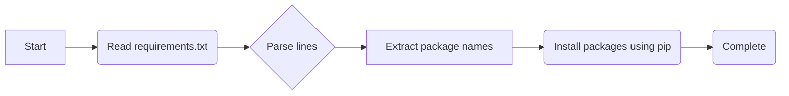

## Анализ файла requirements.txt

### <алгоритм>

Файл `requirements.txt` в Python используется для перечисления зависимостей проекта. Каждая строка представляет собой имя пакета, который должен быть установлен для корректной работы проекта. Процесс установки выглядит следующим образом:

1. **Чтение файла:** Программа `pip` (менеджер пакетов Python) считывает содержимое файла `requirements.txt`.
2. **Парсинг строк:** Каждая строка файла интерпретируется как имя пакета.
3. **Установка пакетов:** `pip` пытается загрузить и установить каждый пакет, перечисленный в файле, из репозитория Python Package Index (PyPI).

**Пример:**

Предположим, что у нас есть `requirements.txt` со следующим содержанием:
```
fastapi
uvicorn
google-generativeai
```

1. `pip` читает файл.
2.  `pip` разбирает файл на три пакета: `fastapi`, `uvicorn` и `google-generativeai`.
3.  `pip` пытается загрузить и установить каждый из этих трех пакетов, а также все их зависимости из PyPI.

### <mermaid>



**Объяснение диаграммы:**

*   **Start**: Начало процесса.
*   **Read requirements.txt**: Чтение содержимого файла `requirements.txt`.
*   **Parse lines**: Разбор каждой строки файла.
*   **Extract package names**: Извлечение имен пакетов из каждой строки.
*   **Install packages using pip**: Установка пакетов, найденных в `requirements.txt` с использованием `pip`.
*   **Complete**: Завершение процесса установки зависимостей.

### <объяснение>

#### Импорты

Файл `requirements.txt` не является кодом Python, поэтому он не содержит импортов в прямом смысле этого слова. Тем не менее, он определяет, какие пакеты должны быть импортированы в коде Python, работающем в этом проекте.

*   **fastapi**: Это современный высокопроизводительный веб-фреймворк для создания API. Он используется для определения и обслуживания конечных точек (endpoints) веб-сервиса, а также для обработки запросов и ответов.
*   **uvicorn**:  Это асинхронный сервер приложений ASGI (Asynchronous Server Gateway Interface), который используется для запуска веб-приложений, созданных с использованием FastAPI. Он обеспечивает высокую производительность и эффективное использование ресурсов.
*   **google-generativeai**: Это библиотека Python для работы с Google Generative AI API, включая Gemini. Она используется для создания приложений, которые могут взаимодействовать с моделями искусственного интеллекта, предоставляемыми Google, например, для генерации текста, перевода и т.д.
*   **pydantic**: Это библиотека для валидации данных на основе аннотаций типов Python.  Она используется для определения структуры данных и гарантирования, что данные, которые обрабатываются в приложении, соответствуют ожидаемому формату.
*   **python-multipart**:  Это библиотека для обработки данных multipart/form-data в HTTP-запросах. Она может быть необходима для приема файлов в веб-приложении.
*  **json_repair**:  Библиотека для исправления некорректных JSON. Может использоваться, когда парсинг JSON выдает ошибку, для исправления проблем.
*   **colorama**:  Библиотека для управления цветами в терминале. Используется для улучшения отображения логов и пользовательского интерфейса в консоли.

**Взаимосвязь с `src`:**

Эти пакеты являются зависимостями проекта, расположенного в директории `src`.  Они импортируются и используются в коде, расположенном в этой директории, для реализации функциональности проекта,  описанной в файле `src/endpoints/gemini_simplechat/requirements.txt`. Например, `fastapi` может использоваться для определения API конечных точек, а `google-generativeai` — для взаимодействия с Gemini API.

**Потенциальные ошибки и области для улучшения:**

*   **Отсутствие версий:**  В `requirements.txt` не указаны точные версии пакетов. Это может привести к проблемам несовместимости, если при установке зависимостей будут использованы новые версии. Рекомендуется указывать версии пакетов, например: `fastapi==0.100.0` и `uvicorn==0.23.2`. Это обеспечит стабильность и воспроизводимость окружения.
*   **Отсутствие разделения зависимостей:** Зависимости для разработки, тестирования и продакшна не разделены. Рекомендуется использовать отдельные файлы (`requirements-dev.txt` , `requirements-test.txt` и тд.) для разных окружений.
*   **Неактуальные пакеты:**  Необходимо периодически проверять и обновлять версии зависимостей, чтобы использовать новые возможности и патчи безопасности. Для этого можно использовать менеджеры пакетов, такие как `pip-tools`.

**Цепочка взаимосвязей:**

1.  `requirements.txt` определяет зависимости, необходимые для работы проекта.
2.  `pip` считывает `requirements.txt` и устанавливает указанные пакеты.
3.  Пакеты, такие как `fastapi`, `uvicorn`, `google-generativeai` и другие, импортируются в файлах Python в директории `src`.
4.  Эти импортированные пакеты предоставляют функциональность, которая используется для создания веб-приложений, API и взаимодействия с AI-моделями.
5.  Файл находится в каталоге `hypotez/src/endpoints/gemini_simplechat/` , что указывает на его использование в конкретном компоненте проекта, ответственном за взаимодействие с Gemini API.