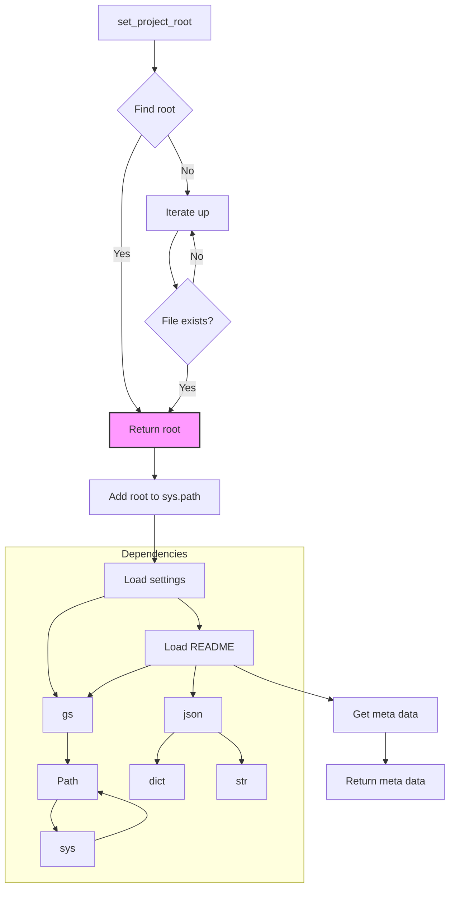

```MD
# <input code>

```python
## \file hypotez/src/endpoints/header.py
# -*- coding: utf-8 -*-

#! venv/bin/python/python3.12

"""
.. module: src.endpoints 
	:platform: Windows, Unix
	:synopsis:

"""


import sys
import json
from packaging.version import Version

from pathlib import Path
def set_project_root(marker_files=('__root__','.git')) -> Path:
    """
    Finds the root directory of the project starting from the current file's directory,
    searching upwards and stopping at the first directory containing any of the marker files.

    Args:
        marker_files (tuple): Filenames or directory names to identify the project root.
    
    Returns:
        Path: Path to the root directory if found, otherwise the directory where the script is located.
    """
    __root__:Path
    current_path:Path = Path(__file__).resolve().parent
    __root__ = current_path
    for parent in [current_path] + list(current_path.parents):
        if any((parent / marker).exists() for marker in marker_files):
            __root__ = parent
            break
    if __root__ not in sys.path:
        sys.path.insert(0, str(__root__))
    return __root__


# Get the root directory of the project
__root__ = set_project_root()
"""__root__ (Path): Path to the root directory of the project"""

from src import gs

settings:dict = None
try:
    with open(gs.path.root / 'src' /  'settings.json', 'r') as settings_file:
        settings = json.load(settings_file)
except (FileNotFoundError, json.JSONDecodeError):
    ...

doc_str:str = None
try:
    with open(gs.path.root / 'src' /  'README.MD', 'r') as settings_file:
        doc_str = settings_file.read()
except (FileNotFoundError, json.JSONDecodeError):
    ...


__project_name__ = settings.get("project_name", 'hypotez') if settings  else 'hypotez'
__version__: str = settings.get("version", '')  if settings  else ''
__doc__: str = doc_str if doc_str else ''
__details__: str = ''
__author__: str = settings.get("author", '')  if settings else ''
__copyright__: str = settings.get("copyrihgnt", '')  if settings else ''
__cofee__: str = settings.get("cofee", "Treat the developer to a cup of coffee for boosting enthusiasm in development: https://boosty.to/hypo69")  if settings else "Treat the developer to a cup of coffee for boosting enthusiasm in development: https://boosty.to/hypo69"
```

# <algorithm>

**Пошаговая блок-схема алгоритма:**

1. **Найти корень проекта:** Функция `set_project_root` ищет корневую директорию проекта, начиная с текущей директории и двигаясь вверх по иерархии директорий. Она проверяет наличие указанных файлов (`pyproject.toml`, `requirements.txt`, `.git`). Если один из этих файлов найден, функция возвращает путь к родительской директории. В противном случае возвращает текущую директорию. Пример: Если текущий файл находится в `hypotez/src/endpoints/header.py`, а `pyproject.toml` находится в `hypotez`, то функция вернет путь к `hypotez`. Если такого файла нет в `hypotez`, то возвратит `hypotez/src/endpoints`.

2. **Добавить корневую директорию в sys.path:** Если корневая директория не присутствует в `sys.path`, она добавляется в начало. Это необходимо для корректного импорта модулей из корневой директории.

3. **Загрузка настроек:** Программа загружает настройки из файла `settings.json` в переменную `settings`. Обработка ошибок ( `FileNotFoundError`, `json.JSONDecodeError`) предотвращает сбой программы при отсутствии файла или ошибке в формате.

4. **Загрузка документации:** Программа загружает документацию из файла `README.MD` в переменную `doc_str`. Обработка ошибок ( `FileNotFoundError`, `json.JSONDecodeError`) предотвращает сбой программы при отсутствии файла или ошибке в формате.

5. **Получение метаданных:** Из словаря `settings` извлекаются значения для `__project_name__`, `__version__`, `__author__`, `__copyright__`, `__cofee__` . Если ключ не найден, используется значение по умолчанию.

6. **Возврат значений:**  Программой возвращаются различные метаданные о проекте, например, имя проекта, версия и т.д.


# <mermaid>


**Объяснение диаграммы:**

* **set_project_root:** Ищет корневую директорию, добавляет ее в `sys.path` и возвращает.
* **Load settings:**  Загружает настройки из `settings.json`.  Зависимость от `json` и `Path`.
* **Load README:**  Загружает документацию из `README.MD`.  Зависимость от `Path`.
* **Get meta data:**  Извлекает данные из `settings` и `doc_str`.
* **Dependencies:** Показывает зависимости от `gs` (вероятно, модуль проекта), `Path` (из `pathlib`), `sys` (для `sys.path`), `json` и `dict` (для работы со словарем).

# <explanation>

**Импорты:**

* `sys`: предоставляет доступ к системным переменным, включая `sys.path`, для импорта модулей.
* `json`: используется для сериализации и десериализации данных в формате JSON.
* `packaging.version`: используется для работы с версиями пакетов.
* `pathlib`: позволяет работать с путями к файлам в удобной и переносимой манере.


**Классы:**

Нет определенных классов, только функция `set_project_root` и переменные.

**Функции:**

* **`set_project_root(marker_files)`:** находит корень проекта, начиная с текущей директории, итеративно проверяя наличие файлов-маркеров. Возвращает `Path` до корневой директории, при необходимости добавляя ее в `sys.path`. Это важно, чтобы скрипт мог находить другие модули проекта.

**Переменные:**

* `__root__`:  хранит путь к корневой директории проекта. Тип `Path`.
* `settings`: словарь с настройками проекта, загружается из `settings.json`. Тип `dict`.
* `doc_str`: хранит содержимое файла `README.MD`. Тип `str`.
* `__project_name__`, `__version__`, `__author__`, `__copyright__`, `__cofee__`: переменные, содержащие данные о проекте. Тип `str`.


**Возможные ошибки/улучшения:**

* **Улучшение обработки ошибок:**  Обработка `FileNotFoundError` и `json.JSONDecodeError` хороша, но можно добавить более информативные сообщения об ошибках,  например, выводить имя файла, который не найден.
* **Более обширные настройки:**  Файл `settings.json` можно расширить, добавив другие полезные метаданные, такие как список авторов, лицензии и т.д.

**Взаимосвязи с другими частями проекта:**

*  Функция `set_project_root` используется для определения корня проекта, который необходим для импорта модулей (например, `gs`).
*  `gs` (вероятно, `global_settings`) – собственный модуль проекта, содержащий пути к важным файлам (`gs.path.root`).  Код предполагает наличие модуля `gs` в пакете `src`, что говорит о структуре проекта с разделением на модули.

**Вывод:** Код хорошо структурирован, содержит обработку ошибок и выполняет важную задачу определения и подготовки среды проекта.