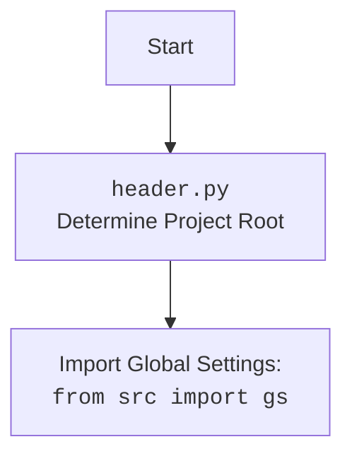

## ИНСТРУКЦИЯ:

Анализируй предоставленный код подробно и объясни его функциональность. Ответ должен включать три раздела:

1.  **<алгоритм>**: Опиши рабочий процесс в виде пошаговой блок-схемы, включая примеры для каждого логического блока, и проиллюстрируй поток данных между функциями, классами или методами.
2.  **<mermaid>**: Напиши код для диаграммы в формате `mermaid`, проанализируй и объясни все зависимости,
    которые импортируются при создании диаграммы.
    **ВАЖНО!** Убедитесь, что все имена переменных, используемые в диаграмме `mermaid`,
    имеют осмысленные и описательные имена. Имена переменных вроде `A`, `B`, `C`, и т.д., не допускаются!

    **Дополнительно**: Если в коде есть импорт `import header`, добавьте блок `mermaid` flowchart, объясняющий `header.py`:
    ```mermaid
    flowchart TD
        Start --> Header[<code>header.py</code><br> Determine Project Root]

        Header --> import[Import Global Settings: <br><code>from src import gs</code>]
    ```

3.  **<объяснение>**: Предоставьте подробные объяснения:
    *   **Импорты**: Их назначение и взаимосвязь с другими пакетами `src.`.
    *   **Классы**: Их роль, атрибуты, методы и взаимодействие с другими компонентами проекта.
    *   **Функции**: Их аргументы, возвращаемые значения, назначение и примеры.
    *   **Переменные**: Их типы и использование.
    *   Выделите потенциальные ошибки или области для улучшения.

Дополнительно, постройте цепочку взаимосвязей с другими частями проекта (если применимо).

Это обеспечивает всесторонний и структурированный анализ кода.
## Формат ответа: `.md` (markdown)
**КОНЕЦ ИНСТРУКЦИИ**

### <алгоритм>

**Функция `set_project_root`:**

1.  **Начало:** Функция принимает опциональный аргумент `marker_files` (кортеж строк, по умолчанию `('__root__', '.git')`).
    *   Пример: `marker_files = ('my_marker', 'config.ini')`
2.  **Инициализация:** Получает абсолютный путь к текущему файлу, извлекает родительскую директорию и сохраняет ее в переменную `current_path`. Инициализирует `__root__` значением `current_path`.
    *   Пример: Если текущий файл находится в `/home/user/my_project/src/endpoints/header.py`, то `current_path` будет `/home/user/my_project/src/endpoints/`, а `__root__` тоже будет `/home/user/my_project/src/endpoints/`.
3.  **Поиск родительской директории:**
    *   Перебирает родительские директории `current_path`, начиная с самой директории и далее вверх по дереву.
    *   Пример: `/home/user/my_project/src/endpoints/` -> `/home/user/my_project/src/` -> `/home/user/my_project/` -> `/home/user/` -> `/home/` -> `/`
4.  **Проверка маркера:**
    *   Для каждой родительской директории, проверяет, существует ли в ней какой-либо файл или директория с именем из `marker_files`.
    *   Пример: проверяется существование `/home/user/my_project/src/endpoints/__root__`, `/home/user/my_project/src/endpoints/.git`, `/home/user/my_project/src/__root__`, `/home/user/my_project/src/.git` и т.д.
5.  **Обновление `__root__`:**
    *   Если маркер найден, присваивает найденный путь к директории переменной `__root__`, и цикл прерывается.
    *   Пример: если файл `__root__` найден в `/home/user/my_project/`, то `__root__` присваивается значение `/home/user/my_project/`.
6.  **Добавление в `sys.path`:**
    *   Проверяет, есть ли `__root__` в `sys.path`. Если нет, добавляет `__root__` в начало списка `sys.path`.
    *   Пример: Если  `__root__` равно `/home/user/my_project/`, проверяется, присутствует ли данный путь в списке путей поиска модулей. Если нет - добавляется в начало.
7.  **Возврат:** Функция возвращает путь к корневой директории, который хранится в переменной `__root__`.

**Основной блок кода:**

1.  **Вызов `set_project_root`:** Вызывает `set_project_root()` и сохраняет результат (путь к корневой директории) в глобальную переменную `__root__`.
2.  **Импорт `gs`:** Импортирует глобальные настройки из `src.gs`.
3.  **Загрузка настроек:**
    *   Пытается прочитать файл `settings.json`, расположенный в `/src/settings.json` относительно корневой директории.
    *   Если удается загрузить JSON из файла, записывает результат в переменную `settings`.
    *   При возникновении исключений `FileNotFoundError` или `json.JSONDecodeError`, пропускает ошибку.
4.  **Загрузка документации:**
    *    Пытается прочитать файл `README.MD`, расположенный в `/src/README.MD` относительно корневой директории.
    *   Если удается загрузить содержимое файла, записывает результат в переменную `doc_str`.
     *   При возникновении исключений `FileNotFoundError` или `json.JSONDecodeError`, пропускает ошибку.
5.  **Инициализация глобальных переменных:** На основе данных из `settings` (если они есть), а также `doc_str` устанавливает значения глобальных переменных:
    *   `__project_name__`: Название проекта (по умолчанию "hypotez").
    *   `__version__`: Версия проекта (по умолчанию "").
    *   `__doc__`: Документация проекта (по умолчанию "").
    *   `__details__`: Детали проекта (по умолчанию "").
    *   `__author__`: Автор проекта (по умолчанию "").
    *   `__copyright__`: Авторские права (по умолчанию "").
    *   `__cofee__`: Призыв к донату на кофе (по умолчанию "Treat the developer to a cup of coffee for boosting enthusiasm in development: https://boosty.to/hypo69").

### <mermaid>
```mermaid
flowchart TD
    Start(Начало) --> FindProjectRoot[Определение корневой директории проекта с помощью `set_project_root()`]
    FindProjectRoot --> SetRootPath[Установка корневого пути в `__root__`]
    SetRootPath --> ImportGS[Импорт глобальных настроек из `src.gs`]
    ImportGS --> LoadSettings[Попытка загрузки настроек из `settings.json`]
    LoadSettings -- Успешно --> ReadSettings[Чтение и разбор `settings.json` в `settings`]
    LoadSettings -- Ошибка --> HandleSettingsError[Обработка ошибок загрузки `settings.json`]
    ReadSettings --> LoadReadme[Попытка загрузки документации из `README.MD`]
    HandleSettingsError --> LoadReadme
    LoadReadme -- Успешно --> ReadReadme[Чтение и разбор `README.MD` в `doc_str`]
    LoadReadme -- Ошибка --> HandleReadmeError[Обработка ошибок загрузки `README.MD`]
    ReadReadme --> SetGlobalVars[Установка глобальных переменных проекта]
    HandleReadmeError --> SetGlobalVars
    SetGlobalVars --> End(Конец)

    style FindProjectRoot fill:#f9f,stroke:#333,stroke-width:2px
    style SetRootPath fill:#ccf,stroke:#333,stroke-width:2px
    style ImportGS fill:#ccf,stroke:#333,stroke-width:2px
    style LoadSettings fill:#ccf,stroke:#333,stroke-width:2px
    style LoadReadme fill:#ccf,stroke:#333,stroke-width:2px
```


### <объяснение>

**Импорты:**

*   `sys`: Этот модуль предоставляет доступ к некоторым переменным и функциям, взаимодействующим с интерпретатором Python. В данном случае используется для добавления корневой директории проекта в `sys.path`, что позволяет импортировать модули из этой директории.
*   `json`: Этот модуль используется для работы с JSON (JavaScript Object Notation), в данном случае для загрузки настроек проекта из файла `settings.json`.
*   `packaging.version`: Этот модуль используется для работы с версиями. В этом файле он импортирован, но нигде не используется. Возможно, это остаток от предыдущей версии или подготовка к будущему функционалу.
*   `pathlib.Path`: Этот модуль предоставляет объектно-ориентированный способ работы с путями к файлам и директориям. Используется для определения корневой директории проекта и чтения файлов настроек и документации.

**Функции:**

*   `set_project_root(marker_files=('__root__', '.git')) -> Path`:
    *   **Аргументы:** `marker_files` - кортеж строк, который определяет маркерные файлы или директории для поиска корневой директории проекта.
    *   **Возвращаемое значение:** Объект `Path`, представляющий корневую директорию проекта.
    *   **Назначение:** Функция рекурсивно обходит родительские директории текущего файла, начиная с текущей, пока не найдет директорию, содержащую маркерный файл или директорию, которые определяют корень проекта (по умолчанию `__root__` или `.git`). Это позволяет запускать скрипты из разных частей проекта, но всегда правильно определять его корень.
    *   **Пример:** Если файл `header.py` находится в `src/endpoints`, а корень проекта находится на уровне директории `src`, то `set_project_root()` вернет путь к директории, содержащей файл `__root__` или директорию `.git`, например, `/path/to/project/src`.

**Переменные:**

*   `__root__`: Глобальная переменная типа `Path`, представляющая корневую директорию проекта.
*   `settings`: Глобальная переменная типа `dict`, содержит загруженные из `settings.json` настройки проекта.
*    `doc_str`: Глобальная переменная типа `str`, содержит загруженную из `README.MD` документацию проекта.
*   `__project_name__`: Глобальная переменная типа `str`, содержащая имя проекта, извлекается из настроек или устанавливается в значение по умолчанию 'hypotez'.
*   `__version__`: Глобальная переменная типа `str`, содержащая версию проекта, извлекается из настроек или устанавливается в значение по умолчанию ''.
*   `__doc__`: Глобальная переменная типа `str`, содержащая описание проекта, загружается из `README.MD` или устанавливается в значение по умолчанию ''.
*   `__details__`: Глобальная переменная типа `str`, содержащая детали проекта, в данном случае не инициализируется значением из настроек.
*   `__author__`: Глобальная переменная типа `str`, содержащая автора проекта, извлекается из настроек или устанавливается в значение по умолчанию ''.
*   `__copyright__`: Глобальная переменная типа `str`, содержащая информацию об авторских правах, извлекается из настроек или устанавливается в значение по умолчанию ''.
*   `__cofee__`: Глобальная переменная типа `str`, содержащая сообщение с призывом к донату на кофе, извлекается из настроек или устанавливается в значение по умолчанию "Treat the developer to a cup of coffee for boosting enthusiasm in development: https://boosty.to/hypo69".

**Взаимосвязи с другими частями проекта:**

*   **`src.gs`:** Этот модуль, скорее всего, содержит глобальные настройки и пути к файлам проекта. `header.py` импортирует его для получения пути к корневой директории и файлам настроек.
*   **`settings.json`:** Этот файл содержит настройки проекта в формате JSON, которые используются для инициализации глобальных переменных, таких как имя, версия, автор и т.д.
*    **`README.MD`:** Этот файл содержит описание проекта, которое устанавливается в глобальную переменную `__doc__`.

**Потенциальные ошибки и области для улучшения:**

*   **Отсутствие обработки исключений:** В блоках `try/except` обрабатываются только `FileNotFoundError` и `json.JSONDecodeError`. Возможны и другие исключения, например, `PermissionError`, которые не будут обработаны и могут привести к непредсказуемому поведению.
*    **Отсутствие валидации:** После загрузки из JSON, хорошо бы провести валидацию.
*   **Использование "..." в `except`:** Использование `...` (Ellipsis) в блоке `except` - это легальный способ ничего не делать, но он не очень информативный. Лучше было бы залогировать ошибку.
*    **Использование пустых строк по умолчанию:** Использование пустой строки (`''`) в качестве значения по умолчанию для `__version__`, `__author__` и `__copyright__` может усложнить понимание, как формируется информация.
*    **Неиспользуемый импорт:** `packaging.version` импортируется, но не используется.
*   **Зависимость от файлов:** Зависимость от `settings.json` и `README.MD` может привести к ошибкам, если эти файлы отсутствуют или повреждены.
*    **Множество глобальных переменных:** Использование множества глобальных переменных может усложнить отладку и понимание кода.

**Цепочка взаимосвязей:**

1.  `header.py` определяет корень проекта, используя `set_project_root()`.
2.  `header.py` импортирует `src.gs` для получения доступа к путям и настройкам.
3.  `header.py` загружает настройки из `settings.json` и информацию из `README.MD` используя пути, полученные из `src.gs`.
4.  `header.py` инициализирует глобальные переменные проекта, такие как имя, версия, автор, описание и т.д., на основе загруженных данных.
5.  Другие модули проекта могут импортировать переменные из `header.py` для использования в своей логике, таким образом используя настройки и метаданные проекта.