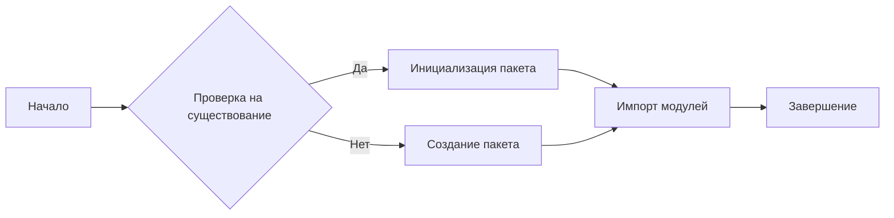
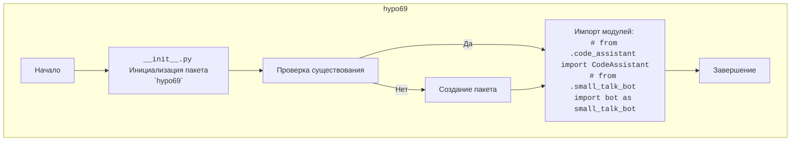

## Анализ кода `hypotez/src/endpoints/hypo69/__init__.py`

### 1. <алгоритм>

Представленный код является файлом `__init__.py`, который используется для обозначения директории `hypo69` как пакета в Python. 

Блок-схема:

Пример:
1. **Начало:**  Программа начинает выполнение, когда интерпретатор Python встречает этот файл.
2. **Проверка на существование:** Python проверяет, является ли директория `hypo69` пакетом (содержит ли файл `__init__.py`).
3. **Инициализация пакета:** Если файл `__init__.py` присутствует, директория считается пакетом.
4. **Импорт модулей:**  В данном случае, закомментированные строки  `# from .code_assistant import CodeAssistant` и `# from .small_talk_bot import bot as small_talk_bot` показывают, что пакет может импортировать модули `code_assistant` и `small_talk_bot` из текущей директории.
5. **Завершение:**  Завершение работы файла `__init__.py`.

### 2. <mermaid>

**Объяснение:**

- `hypo69`:  Представляет директорию `hypo69` как пакет.
- `Start`: Начало выполнения `__init__.py`.
- `PackageInit`:  Файл `__init__.py` инициализирует пакет `hypo69`.
- `Check`: Проверка существования пакета.
- `ImportModules`: Импорт модулей `code_assistant` и `small_talk_bot` (в данном случае закомментированы)
- `CreatePackage`: Создание пакета, если он не существует
- `End`: Конец выполнения файла `__init__.py`.

В данном случае импорты закомментированы, но в общем случае они могут добавить зависимости от других модулей внутри пакета `hypo69` или других частей проекта.

### 3. <объяснение>

**Импорты:**
- В текущем состоянии, импорты закомментированы, что означает, что модули `code_assistant` и `small_talk_bot` не импортируются при инициализации пакета.  
   - Если бы импорты были активными, они бы делали доступными классы и переменные из указанных модулей для использования в рамках пакета `hypo69`.  
   -  Импорт `from .code_assistant import CodeAssistant` подразумевает, что в директории `hypo69` есть файл `code_assistant.py`, из которого импортируется класс `CodeAssistant`. Аналогично, `from .small_talk_bot import bot as small_talk_bot` означает наличие файла `small_talk_bot.py`, из которого импортируется переменная `bot` и переименовывается в `small_talk_bot`.

**Классы:**
- В данном файле классы не определены. Закомментированный код указывает на возможное использование класса `CodeAssistant`. Если бы этот класс импортировался, он был бы доступен для использования в других модулях внутри пакета `hypo69`.

**Функции:**
- В данном файле функции не определены.

**Переменные:**
- В данном файле переменные не определены.  Однако, закомментированный код импортирует переменную `bot` из `small_talk_bot.py`.

**Дополнительно:**
- Этот файл используется для того, чтобы Python рассматривал директорию `hypo69` как пакет, что позволяет организовывать код в модули и подмодули.
- Закомментированные импорты указывают на возможность интеграции с модулями `code_assistant` и `small_talk_bot`, которые, вероятно, предоставляют функциональность для ассистента кода и чат-бота соответственно.
- Отсутствие явного кода в файле `__init__.py` означает, что при импорте пакета `hypo69` не выполняется никаких действий, кроме интерпретации самого файла.

**Возможные ошибки и улучшения:**
- Сейчас в файле нет явной функциональности, кроме объявления директории как пакета.  
- Можно раскомментировать импорты, если эти модули используются в проекте.
- Если `hypo69` должен быть полноценным пакетом, нужно добавить больше функциональности в файл `__init__.py` или в другие модули внутри директории `hypo69`.