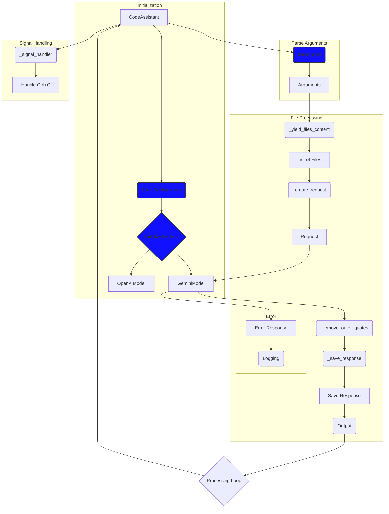

## Анализ кода `code_assistant.mmd`

### 1. <алгоритм>

**Блок-схема:**

1.  **Инициализация:**
    *   Начинается с создания экземпляра класса `CodeAssistant`.
    *   Загружается конфигурация, вероятно, из файла или переменных окружения (блок `Загрузка конфигурации`).
    *   Инициализируются модели `GeminiModel` и `OpenAIModel` (блок `Инициализация моделей`).  Пример:
        ```python
        # Внутри CodeAssistant
        def __init__(self, config):
            self.config = config
            self.gemini_model = GeminiModel(config['gemini'])
            self.openai_model = OpenAIModel(config['openai'])
        ```
2.  **Разбор аргументов:**
    *   Метод `parse_args` обрабатывает аргументы командной строки (блок `parse_args`).
    *   Результат разбора аргументов сохраняется в переменной `Аргументы`, например:
        ```python
        # Внутри CodeAssistant
        def parse_args(self):
            parser = argparse.ArgumentParser(...)
            parser.add_argument('--path', ...)
            args = parser.parse_args()
            return args
        ```
3.  **Обработка файлов:**
    *   Метод `_yield_files_content` генерирует содержимое файлов из переданных в аргументах путей (блок `_yield_files_content`). Пример:
        ```python
        # Внутри CodeAssistant
        def _yield_files_content(self, paths):
            for path in paths:
                with open(path, 'r') as f:
                    yield f.read()
        ```
    *   Содержимое файлов формирует `Список файлов`.
    *   Метод `_create_request` создает запрос к модели на основе содержимого файлов (блок `_create_request`). Пример:
         ```python
         # Внутри CodeAssistant
         def _create_request(self, file_content):
             return f"Explain this code: {file_content}"
         ```
    *   Запрос отправляется в `GeminiModel` (блок `GeminiModel`).
    *   Ответ модели обрабатывается с помощью метода `_remove_outer_quotes` (блок `_remove_outer_quotes`), чтобы убрать внешние кавычки, если они есть в ответе модели.
         ```python
         # Внутри CodeAssistant
        def _remove_outer_quotes(self, response):
            if response.startswith('"') and response.endswith('"'):
                return response[1:-1]
            return response
         ```
    *   Ответ сохраняется с помощью метода `_save_response` (блок `_save_response`).
        ```python
         # Внутри CodeAssistant
         def _save_response(self, filename, response):
             with open(filename + '.md', 'w') as f:
                 f.write(response)
         ```
    *   Ответ выводится на экран (блок `Вывод`).
    *   **Ошибка:** Если при запросе к модели возникает ошибка, она перехватывается, логируется и  обработка переходит к следующему файлу (блок `Ошибка ответа` и `Логирование`).
4.  **Обработка прерывания:**
    *   Метод `_signal_handler` обрабатывает сигналы прерывания, например `Ctrl+C` (блок `_signal_handler`).
    *   При получении сигнала прерывания программа завершается (блок `Обработка Ctrl+C`).
5.  **Цикл обработки:**
    *   После обработки одного файла или при возникновении ошибки обработка переходит к следующему файлу, пока есть файлы для обработки или пока программа не прервана пользователем (блок `Цикл обработки`).

### 2. <mermaid>



**Анализ зависимостей `mermaid`:**

*   **`CodeAssistant`**: Основной класс, управляющий всем процессом.
*   **`Load Configuration`**: Загрузка параметров для работы программы.
*   **`Initialize Models`**: Инициализация используемых моделей `GeminiModel` и `OpenAIModel`.
*   **`GeminiModel`**: Класс, отвечающий за взаимодействие с моделью Gemini.
*   **`OpenAIModel`**: Класс, отвечающий за взаимодействие с моделью OpenAI.
*   **`parse_args`**: Функция для обработки аргументов командной строки.
*  **`Arguments`**: Результат обработки аргументов командной строки.
*   **`_yield_files_content`**: Функция, которая извлекает содержимое файлов.
*   **`List of Files`**: Содержимое файлов, представленное в виде списка.
*   **`_create_request`**: Функция для формирования запроса к языковой модели.
*   **`Request`**: Сформированный запрос к языковой модели.
*   **`_remove_outer_quotes`**: Функция для удаления внешних кавычек из ответа модели.
*   **`_save_response`**: Функция для сохранения ответа в файл.
*   **`Save Response`**: Сохраненный ответ языковой модели в файл.
*    **`Output`**: Вывод ответа языковой модели в консоль.
*   **`Error Response`**: Перехват ошибки ответа от языковой модели.
*   **`Logging`**: Логирование ошибок.
*  **`_signal_handler`**: Обработчик прерывания, позволяющий корректно завершать работу программы при нажатии `Ctrl + C`.
* **`Handle Ctrl+C`**: Обработка сигнала прерывания `Ctrl + C`.
*   **`Processing Loop`**: Возврат к началу цикла обработки для продолжения анализа файлов.

### 3. <объяснение>

**Импорты:**

В предоставленном коде нет явных импортов. Однако, исходя из контекста, можно предположить следующие зависимости:

*   **`argparse`**: Используется для разбора аргументов командной строки.
*   **`src.gs`** (глобальные настройки): Из `mermaid` диаграммы можно предположить, что где-то есть импорт `from src import gs` для доступа к глобальным настройкам.
*   **`GeminiModel`** и **`OpenAIModel`**: Эти классы предполагают наличие кода, который обрабатывает запросы к моделям Gemini и OpenAI соответственно.

**Классы:**

*   **`CodeAssistant`**:
    *   **Роль**: Основной класс, координирующий работу программы. Управляет загрузкой конфигурации, инициализацией моделей, обработкой аргументов, файлов, запросов к моделям, сохранением и выводом ответа.
    *   **Атрибуты**: Вероятно, содержит атрибуты для хранения конфигурации, экземпляров `GeminiModel` и `OpenAIModel`, а также других необходимых данных.
    *   **Методы**:
        *   `__init__`: Конструктор класса, инициализирует атрибуты.
        *   `parse_args`: Парсит аргументы командной строки.
        *   `_yield_files_content`: Генерирует содержимое файлов.
        *   `_create_request`: Создает запрос к языковой модели.
        *   `_remove_outer_quotes`: Удаляет внешние кавычки из ответа модели.
        *   `_save_response`: Сохраняет ответ в файл.
        *   `_signal_handler`: Обрабатывает сигналы прерывания.
*   **`GeminiModel`**:
    *   **Роль**: Инкапсулирует логику взаимодействия с моделью Gemini.
    *   **Атрибуты**: Вероятно, содержит атрибуты для хранения ключей API и других параметров конфигурации.
    *   **Методы**: Вероятно, содержит метод для отправки запроса и получения ответа от Gemini.
*   **`OpenAIModel`**:
    *   **Роль**: Инкапсулирует логику взаимодействия с моделью OpenAI.
    *   **Атрибуты**: Вероятно, содержит атрибуты для хранения ключей API и других параметров конфигурации.
    *   **Методы**: Вероятно, содержит метод для отправки запроса и получения ответа от OpenAI.

**Функции:**

*   `parse_args`:
    *   **Аргументы**: Нет явных аргументов в диаграмме.
    *   **Возвращаемое значение**: Объект, содержащий аргументы командной строки.
    *   **Назначение**: Парсит аргументы командной строки, такие как пути к файлам для обработки.
*   `_yield_files_content`:
    *   **Аргументы**: Список путей к файлам.
    *   **Возвращаемое значение**: Генератор, возвращающий содержимое файлов поочередно.
    *   **Назначение**: Извлекает содержимое файлов из заданных путей.
*   `_create_request`:
    *   **Аргументы**: Содержимое файла.
    *   **Возвращаемое значение**: Строка запроса к языковой модели.
    *   **Назначение**: Формирует запрос на основе содержимого файла.
*   `_remove_outer_quotes`:
    *   **Аргументы**: Ответ от языковой модели.
    *   **Возвращаемое значение**: Ответ без внешних кавычек.
    *   **Назначение**: Убирает кавычки с начала и конца ответа модели.
*   `_save_response`:
    *   **Аргументы**: Имя файла, ответ от языковой модели.
    *   **Возвращаемое значение**: Нет.
    *   **Назначение**: Сохраняет ответ в файл.
*   `_signal_handler`:
    *   **Аргументы**:  Сигнал прерывания.
    *   **Возвращаемое значение**: Нет.
    *   **Назначение**:  Обрабатывает сигналы прерывания для корректного завершения программы.

**Переменные:**

*   Переменные, используемые в диаграмме, имеют описательные названия и их типы зависят от контекста (например, `config`, `args`, `file_content`, `request`, `response`).

**Потенциальные ошибки и области для улучшения:**

*   **Обработка ошибок:** В коде предусмотрена обработка ошибок при запросе к модели, но возможно, стоит добавить более детальное логирование.
*   **Конфигурация**:  Управление конфигурацией должно быть более гибким (например, через файл, переменные окружения).
*   **Мультимодельность**:  В текущей реализации используется только `GeminiModel`. Возможно, стоит рассмотреть возможность выбора модели через аргументы командной строки.
*   **Отсутствие импортов**: В представленном `mermaid` коде нет импортов, это необходимо добавить для полноценного анализа.
*   **Обработка ошибок:** Отсутствие обработки ошибок при работе с файловой системой.
*   **Обработка длинных файлов:** Не предусмотрена обработка очень длинных файлов, которые могут привести к проблемам при создании запроса.
*   **Выбор модели**: Нет механизма выбора модели, который использовался бы для отправки запроса.

**Цепочка взаимосвязей:**

1.  `CodeAssistant` зависит от конфигурации и моделей `GeminiModel` и `OpenAIModel`.
2.  `CodeAssistant` использует `argparse` для разбора аргументов командной строки.
3.  `CodeAssistant` использует функции `_yield_files_content`, `_create_request`, `_remove_outer_quotes`, `_save_response` для обработки файлов и ответов.
4.  `GeminiModel` и `OpenAIModel` зависят от конфигурации и, вероятно, от библиотек для работы с их API.
5.  Все части проекта опираются на глобальные настройки, доступные через `from src import gs`.

Это обеспечивает всесторонний и структурированный анализ кода, включая алгоритм, диаграмму зависимостей и подробное объяснение.