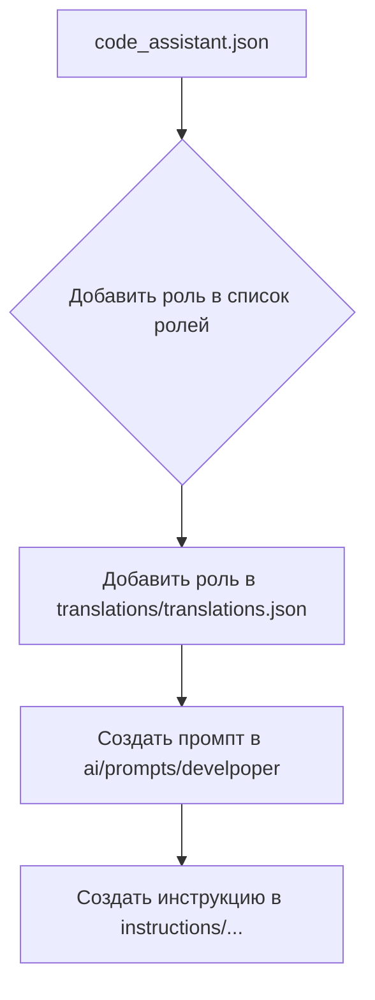

# Анализ кода create_role.mmd

**1. <input code>**

```
%% порядок действий для создания новой роли
graph TD
    A[Файл `code_assistant.json`] --> B[Добавить роль в список ролей]
    B --> C[Добавить роль в файл переводов `translations/translations.json`]
    C --> D[Создать системный промпт в `ai/prompts/develpoper`]
    D --> E[Создать командную инструкцию в `instructions/...`]

    %% Настройка стилей блоков
    style A width: 300px
    style B width: 300px
    style C width: 300px
    style D width: 300px
    style E width: 300px
```

**2. <algorithm>**

Блок-схема описывает последовательность действий для создания новой роли в системе.  Процесс представлен в виде графа:

* **A[Файл `code_assistant.json`]**: Начало процесса. В файле `code_assistant.json` хранится информация о системах.
* **B[Добавить роль в список ролей]**: Добавление новой роли в хранилище данных (например, список ролей).  Пример: Добавляется запись `{"role_name": "Новое_Имя_Роли", ...}`.
* **C[Добавить роль в файл переводов `translations/translations.json`]**: Перевод названия роли на разные языки и добавление в файл переводов. Пример: `{"role_name": {"ru": "Новое_Имя_Роли", "en": "New_Role_Name"}}`
* **D[Создать системный промпт в `ai/prompts/develpoper`]**: Генерация системного запроса для новой роли. Пример: Создание файла `ai/prompts/develpoper/new_role_prompt.json` с описанием ожидаемого поведения.
* **E[Создать командную инструкцию в `instructions/...`]**:  Создание файла инструкций для роли. Пример: Создание файла `instructions/new_role_instruction.md`.

**3. <mermaid>**



**4. <explanation>**

* **Импорты:**  В данном коде нет импортов, так как это *маркировка* (markdown diagram) последовательности шагов.  Нет кода на языке программирования.
* **Классы:** Нет классов.
* **Функции:** Нет функций.
* **Переменные:** Нет переменных.
* **Возможные ошибки:**  Не указан способ добавления роли в `code_assistant.json`.  Не указано, в какой формат данных должна быть добавлена роль (JSON, XML и т.д.). Не описан формат файла переводов. Отсутствуют детали о формате командной инструкции, системного промпта.
* **Связь с другими частями проекта:** Эта блок-схема показывает *порядок действий* для создания новой роли, а значит, *ожидается*, что существуют функции, классы и файлы, реализующие эти шаги. Например, должно быть определено, каким образом будет изменён `code_assistant.json`.  Возможные связи:
    * `code_assistant.json`: БД или конфигурационный файл, управляющий ролями.
    * `translations/translations.json`:  Файл для хранения переводов.
    * `ai/prompts/develpoper`:  Каталог с шаблонами и/или инструкциями для ИИ.
    * `instructions/...`: Каталог с инструкциями для пользователей.

**Вывод:**

Код представляет собой схему процесса создания новой роли.  Для практической реализации необходимо дополнить схему деталями о реализациях каждого шага.  Необходимо описать логику записи в каждый файл, а также структуру этих файлов.