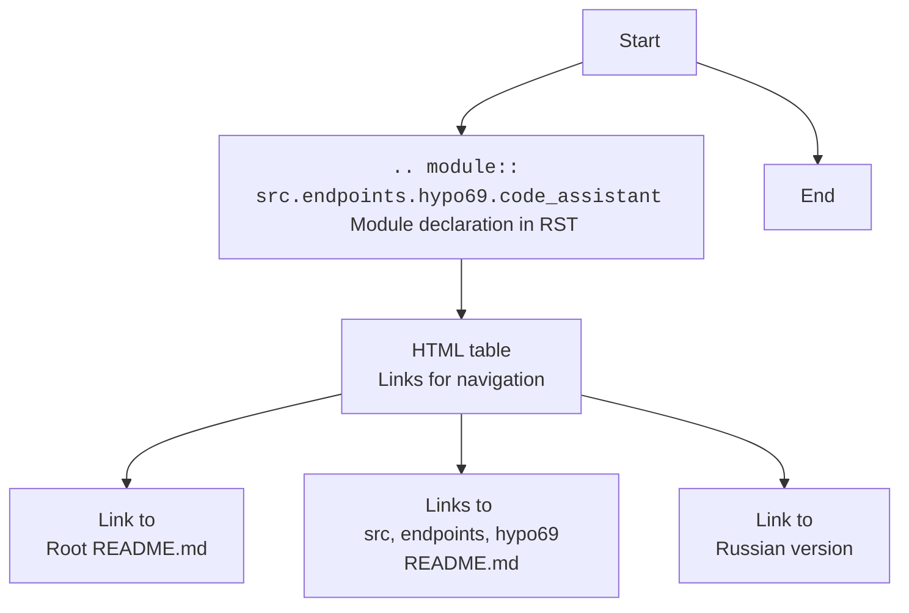

## ИНСТРУКЦИЯ:

Анализируй предоставленный код подробно и объясни его функциональность. Ответ должен включать три раздела:  

1. **<алгоритм>**: Опиши рабочий процесс в виде пошаговой блок-схемы, включая примеры для каждого логического блока, и проиллюстрируй поток данных между функциями, классами или методами.  
2. **<mermaid>**: Напиши код для диаграммы в формате `mermaid`, проанализируй и объясни все зависимости, 
    которые импортируются при создании диаграммы. 
    **ВАЖНО!** Убедитесь, что все имена переменных, используемые в диаграмме `mermaid`, 
    имеют осмысленные и описательные имена. Имена переменных вроде `A`, `B`, `C`, и т.д., не допускаются!  
    
    **Дополнительно**: Если в коде есть импорт `import header`, добавьте блок `mermaid` flowchart, объясняющий `header.py`:\
    ```mermaid
    flowchart TD
        Start --> Header[<code>header.py</code><br> Determine Project Root]
    
        Header --> import[Import Global Settings: <br><code>from src import gs</code>] 
    ```

3. **<объяснение>**: Предоставьте подробные объяснения:  
   - **Импорты**: Их назначение и взаимосвязь с другими пакетами `src.`.  
   - **Классы**: Их роль, атрибуты, методы и взаимодействие с другими компонентами проекта.  
   - **Функции**: Их аргументы, возвращаемые значения, назначение и примеры.  
   - **Переменные**: Их типы и использование.  
   - Выделите потенциальные ошибки или области для улучшения.  

Дополнительно, постройте цепочку взаимосвязей с другими частями проекта (если применимо).  

Это обеспечивает всесторонний и структурированный анализ кода.
## Формат ответа: `.md` (markdown)
**КОНЕЦ ИНСТРУКЦИИ**

### <алгоритм>
Предоставленный код не является исполняемым кодом Python, а представляет собой разметку reStructuredText (RST) и HTML для документации. Однако, опираясь на контекст, можно предположить, что это описание модуля `code_assistant` в рамках проекта `hypo69`. Алгоритм описания модуля в RST выглядит следующим образом:

1. **Модуль:** `.. module:: src.endpoints.hypo69.code_assistant` - Указывается, что данный раздел документации описывает модуль `code_assistant`, расположенный в иерархии `src.endpoints.hypo69`.
   
2. **Таблица ссылок:** HTML-код `<TABLE>` создает таблицу, которая используется для навигации по документации:
   - **Первая колонка:** `<A HREF = 'https://github.com/hypo69/hypo/blob/master/README.MD'>[Root ↑]</A>` - ссылка на корневой README.md проекта `hypo69` на GitHub.
   - **Вторая колонка:** `<A HREF = 'https://github.com/hypo69/hypo/blob/master/src/README.MD'>src</A> \\ <A HREF = 'https://github.com/hypo69/hypo/blob/master/src/endpoints/README.MD'>endpoints</A> \\\n<A HREF = 'https://github.com/hypo69/hypo/blob/master/src/endpoints/hypo69/README.MD'>hypo69</A>` - отображает навигационную цепочку к текущему модулю `code_assistant`. Каждый элемент - ссылка на README.md соответствующей папки.
   - **Третья колонка:** `<A HREF = 'https://github.com/hypo69/hypo/blob/master/src/endpoints/hypo69/code_assistant/code_assistant.ru.md'>Русский</A>` - ссылка на русскую версию документации (предположительно).

**Примеры:**

*   **Модуль:** `.. module:: src.endpoints.hypo69.code_assistant` - этот блок говорит, что текущий документ рассказывает о модуле с именем code_assistant.
*   **Таблица:**
    *   **[Root ↑]**  перенаправит вас на главную страницу проекта на GitHub.
    *   **src / endpoints / hypo69** - это путь к каталогу, где находится модуль code_assistant.
    *   **Русский** - предоставит версию документа на русском языке.

### <mermaid>


**Разбор `mermaid` диаграммы:**

*   `flowchart TD`: Объявляет тип диаграммы как блок-схему, которая идет сверху вниз.
*   `Start[Start]`: Начальный узел, обозначает начало процесса.
*   `ModuleDeclaration[<code>.. module:: src.endpoints.hypo69.code_assistant</code> <br> Module declaration in RST]`: Узел, представляющий объявление модуля в RST. Текст внутри указывает на синтаксис RST и имя модуля.
*   `NavigationTable[HTML table <br>Links for navigation]`: Узел, обозначающий HTML-таблицу, которая содержит навигационные ссылки.
*   `RootLink[Link to <br>Root README.md]`: Узел, представляющий ссылку на корневой `README.md` файл проекта.
*   `ModulePathLinks[Links to <br> src, endpoints, hypo69 README.md]`: Узел, представляющий ссылки на README.md файлы каталогов, ведущих к текущему модулю.
*   `LanguageLink[Link to <br> Russian version]`: Узел, представляющий ссылку на перевод документации.
*   `End[End]`: Конечный узел, обозначает конец процесса.

**Зависимости:**

Диаграмма `mermaid` не показывает импорта зависимостей, так как представленный код сам по себе не содержит исполняемого кода Python, а является разметкой документации. Однако, структура файла намекает на взаимодействие с файловой структурой проекта `hypo69` на GitHub и использует технологию `reStructuredText` для генерации документации.

### <объяснение>

**Импорты:**

В данном фрагменте кода отсутствуют явные импорты Python. Однако, на основе пути модуля `src.endpoints.hypo69.code_assistant`, можно предположить, что он может зависеть от других модулей в пакете `src`, например, от `src.gs`, который может содержать глобальные настройки, или от других модулей в `src.endpoints`. В данном случае мы не видим явных импортов из других модулей, но следует понимать, что `code_assistant` наверняка будет импортировать что-то для своей работы.

**Классы:**

Данный фрагмент не определяет классов. Предполагается, что в модуле `code_assistant` могут быть классы для обработки запросов к ассистенту, например, для парсинга кода, вызова языковой модели и форматирования ответов.

**Функции:**

Код не содержит описания функций. Модуль `code_assistant`, вероятно, будет содержать функции для реализации логики, описанной в алгоритме. Например, функции для:
- приема запроса пользователя;
- извлечения кода из запроса;
- вызова языковой модели для анализа кода;
- форматирования ответа для пользователя.

**Переменные:**

Код не описывает переменные. Переменные будут использоваться внутри функций модуля `code_assistant` для хранения данных, таких как:
- текст запроса пользователя;
- код, извлеченный из запроса;
- ответ языковой модели;
- форматированный ответ для пользователя.

**Потенциальные ошибки и области для улучшения:**

1.  **Отсутствие реального кода:** Данный фрагмент - это разметка документации, а не исполняемый код. Для полноценного анализа требуется увидеть код модуля `code_assistant`.
2.  **Зависимости:** Необходимо изучить фактический код, чтобы выявить и проанализировать все зависимости.
3.  **Обработка ошибок:** Необходимо предусмотреть обработку ошибок (например, если запрос не содержит кода, или если языковая модель не возвращает ответ).
4.  **Масштабируемость:** Необходимо обеспечить масштабируемость и устойчивость системы, особенно если количество запросов к ассистенту будет расти.
5.  **Безопасность:** Следует обращать внимание на безопасность при обработке пользовательских данных и при взаимодействии с языковой моделью.
6.  **Логирование:**  Добавление логирования позволит отслеживать работу модуля и диагностировать проблемы.
7.  **Тестирование:**  Необходимо проводить тестирование для гарантии правильности работы всех функций.

**Цепочка взаимосвязей:**

Модуль `code_assistant` является частью проекта `hypo69` и расположен в подкаталоге `src/endpoints/hypo69`. Предположительно, этот модуль будет взаимодействовать с:

*   **Другими модулями в `src/endpoints`**: Для обработки запросов к другим эндпоинтам API.
*   **Модулями в `src`**: Для доступа к глобальным настройкам или общим утилитам.
*   **Языковой моделью**: Для анализа кода и генерации ответов.
*   **Пользовательским интерфейсом (если есть)**: Для отправки и отображения запросов и ответов.

Таким образом, модуль `code_assistant` играет роль посредника между пользовательскими запросами и функциональностью языковой модели, интегрируясь с различными частями проекта `hypo69`.