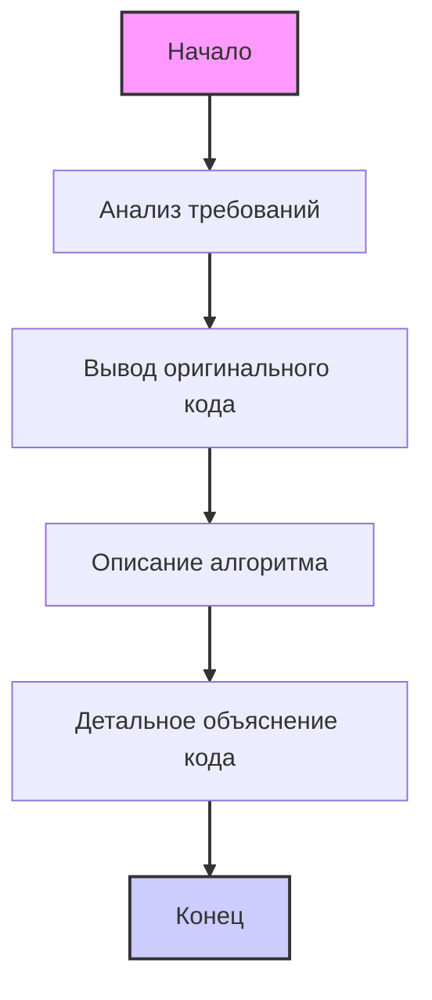

## ИНСТРУКЦИЯ:

Анализируй предоставленный код подробно и объясни его функциональность. Ответ должен включать три раздела:  

1. **<алгоритм>**: Опиши рабочий процесс в виде пошаговой блок-схемы, включая примеры для каждого логического блока, и проиллюстрируй поток данных между функциями, классами или методами.  
2. **<mermaid>**: Напиши код для диаграммы в формате `mermaid`, проанализируй и объясни все зависимости, 
    которые импортируются при создании диаграммы. 
    **ВАЖНО!** Убедитесь, что все имена переменных, используемые в диаграмме `mermaid`, 
    имеют осмысленные и описательные имена. Имена переменных вроде `A`, `B`, `C`, и т.д., не допускаются!  
    
    **Дополнительно**: Если в коде есть импорт `import header`, добавьте блок `mermaid` flowchart, объясняющий `header.py`:\
    ```mermaid
    flowchart TD
        Start --> Header[<code>header.py</code><br> Determine Project Root]
    
        Header --> import[Import Global Settings: <br><code>from src import gs</code>] 
    ```

3. **<объяснение>**: Предоставьте подробные объяснения:  
   - **Импорты**: Их назначение и взаимосвязь с другими пакетами `src.`.  
   - **Классы**: Их роль, атрибуты, методы и взаимодействие с другими компонентами проекта.  
   - **Функции**: Их аргументы, возвращаемые значения, назначение и примеры.  
   - **Переменные**: Их типы и использование.  
   - Выделите потенциальные ошибки или области для улучшения.  

Дополнительно, постройте цепочку взаимосвязей с другими частями проекта (если применимо).  

Это обеспечивает всесторонний и структурированный анализ кода.
## Формат ответа: `.md` (markdown)
**КОНЕЦ ИНСТРУКЦИИ**

## <input code>
```**Summary for the prompt:**

### Key Requirements:
1. **Code Analysis**:
   - Provide the original code without any changes.
   - Describe the algorithm of the code as a step-by-step flowchart, showing how data moves between functions or classes.
   - Explain the code's operation, including imports, classes, functions, variables, and their relationships with other parts of the project.
   - Highlight potential errors or areas for improvement if any.

2. **Response Format**:
   - **<input code>**: The original code without any changes.
   - **<algorithm>**: A step-by-step description of the algorithm with examples.
   - **<explanation>**: A detailed explanation of the code, including:
     - Imports: their purpose and connections to other modules.
     - Classes: their purpose, attributes, methods, and relations to other components.
     - Functions: their purpose, arguments, and return values.
     - Variables: types and usage.
     - Relationships with other parts of the project and potential errors or improvements.

### Example Call:
A code snippet is provided to be analyzed and explained according to the instructions.
## Response format: `.md` (markdown)
---

This prompt is designed for a detailed analysis of the provided code, explaining all aspects, including logic, structure, and potential improvements.```
## <algorithm>

1. **Начало**: Запуск процесса анализа кода.

2. **Анализ требований**:  
   - **Входные данные**: Текст с описанием требований к анализу кода.
   - **Проверка**: Определяются ключевые требования: анализ кода, описание алгоритма, объяснение кода, формат ответа. 
   - **Пример**: Извлекаются требования к структуре ответа (markdown), анализ кода без изменений, описание алгоритма блок-схемой, подробное объяснение всех аспектов кода.

3. **Формирование ответа**:
   - **Вывод**: Вывод оригинального кода без изменений в разделе `<input code>`.
   - **Блок-схема**: Создание текстового описания алгоритма, как последовательности шагов.
     - **Пример**:  "1. Начало", "2. Анализ требований", "3. Формирование ответа", "4. Конец".
   - **Объяснение**:  Создание текстового объяснения всех ключевых элементов кода.
     - **Пример**: Объяснение импортов, классов, функций, переменных, их взаимосвязей.
     - **Пример**: Выделение потенциальных ошибок или областей улучшения, если это необходимо.
     - **Пример**: Указание взаимосвязей с другими частями проекта.

4. **Конец**: Завершение процесса анализа и форматирования ответа.

## <mermaid>


**Объяснение зависимостей `mermaid`:**

Данная `mermaid` диаграмма описывает поток управления процесса анализа кода.
*   **`Start`**: Начало процесса. Обозначает точку входа.
*   **`AnalyzeRequirements`**:  Анализирует текст требований к анализу кода.
*   **`OutputOriginalCode`**:  Выводит оригинальный код в разделе `<input code>`.
*   **`DescribeAlgorithm`**:  Формирует текстовое описание алгоритма в виде последовательности шагов.
*   **`DetailedExplanation`**:  Создаёт подробное текстовое объяснение всех ключевых элементов кода.
*   **`End`**:  Конец процесса. Обозначает точку выхода.
`flowchart TD` - определяет тип диаграммы как блок-схему.
`-->` - обозначает поток выполнения операций.
`style` - задает стили элементам.
`linkStyle` - задает стили связям.

## <объяснение>

**Объяснение:**

Данный код представляет собой инструкцию или описание задачи, которую необходимо выполнить.  Он не содержит исполняемого кода, а лишь определяет формат и структуру ответа на запрос анализа кода.

**Импорты:**

В данном тексте нет явных импортов, так как это инструкция, а не исполняемый код. В случае, если бы  это был Python код, то:
- `import header`  - данный импорт был бы рассмотрен в отдельном блоке `mermaid`.
- `from src import gs` - указывал бы на импорт глобальных настроек из пакета `src`.

**Классы:**

В данном тексте нет классов. Если бы были, их объяснение включало бы:
- **Роль:** Назначение класса и его использование.
- **Атрибуты:** Переменные внутри класса и их типы.
- **Методы:** Функции внутри класса, их аргументы, возвращаемые значения и логика.
- **Взаимодействие:** Как класс взаимодействует с другими частями проекта.

**Функции:**

В данном тексте нет функций.  Если бы были, их объяснение включало бы:
- **Назначение:** Цель функции.
- **Аргументы:** Типы и назначения входных параметров.
- **Возвращаемые значения:** Тип и назначение возвращаемого результата.
- **Логика:** Описание работы функции.
- **Примеры:** Варианты использования функции.

**Переменные:**

В данном тексте нет переменных,  а есть ключевые слова для обозначения разделов:
-  `<input code>`, `<algorithm>`, `<explanation>`. Их можно рассматривать как  переменные, содержащие соответствующие разделы ответа.

**Цепочка взаимосвязей с другими частями проекта:**
-  Инструкция относится к коду, который автоматически генерирует ответы на запросы с анализом кода. Следовательно она должна быть связана с другими частями проекта, которые отвечают за: получение запросов, запуск анализа кода, формирование ответов и их отправку пользователю.

**Потенциальные ошибки или области для улучшения:**
- Данный текст не содержит кода, поэтому  ошибки невозможны.  Улучшения могут касаться более точного описания алгоритма.
- Для реального кода:
   - Ошибки: Отсутствие обработки исключений, неверные типы данных.
   - Улучшения: Оптимизация кода, добавление документации.

Таким образом, инструкция служит для формализации процесса анализа кода и предоставления структурированного ответа, который включает все необходимые компоненты для полного понимания предоставленного кода.