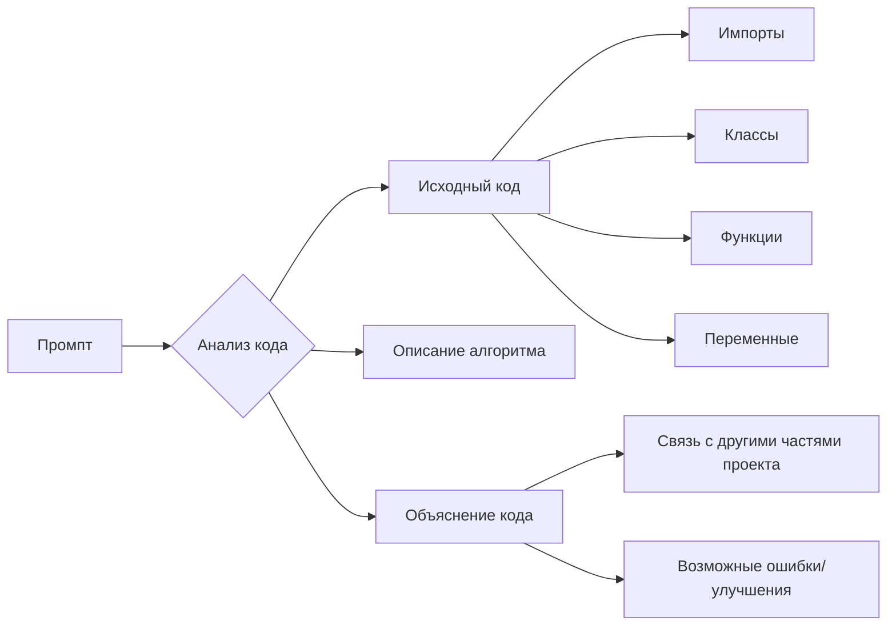

# Анализ кода

## <input code>

```python
# Резюме для промпта:
# ... (Ваш код здесь)
```

## <algorithm>

Поскольку предоставленный код — это описание требований к анализу кода, а не сам код, алгоритма работы нет.  Блок-схема не применима.


## <mermaid>



**Описание диаграммы:**

Диаграмма представляет процесс анализа кода.  Промпт (A) запускает процесс анализа (B).  Анализ включает в себя рассмотрение исходного кода (C), описания алгоритма (D), объяснения (E).  Из исходного кода извлекаются импорты (F), классы (G), функции (H) и переменные (I). Объяснение кода включает анализ связей с другими частями проекта (J) и поиск потенциальных проблем или областей для улучшения (K).

## <explanation>

Этот код не содержит самого кода, а представляет собой набор инструкций (рекомендаций) для анализа кода.  Он задает структуру и требования к анализу, а не описывает функциональность конкретной программы.

**Импорты**: В данном контексте нет импортируемых модулей, так как этот код — это описание процесса анализа, а не сам код.

**Классы**: Отсутствуют классы, так как в заданном коде не содержится определения классов.

**Функции**: Отсутствуют определения функций, поскольку это лишь руководство по анализу кода.

**Переменные**: Нет переменных, так как это набор требований к процессу анализа.

**Связь с другими частями проекта**: Невозможно определить связи с другими частями проекта, поскольку отсутствует сам код.

**Возможные ошибки/улучшения**: При анализе кода необходимо руководствоваться конкретными правилами и инструкциями, заданными в промпте.


**Заключение**:  Для анализа и объяснения кода требуется сам код.  Данный промпт – шаблон, используемый для формирования запроса.