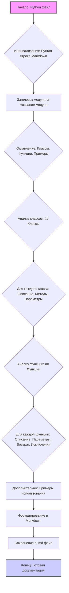

## ИНСТРУКЦИЯ:

### 1. <алгоритм>

1.  **Начало**: Получить на вход Python файл.
2.  **Инициализация**: Создать пустую строку для хранения сгенерированной Markdown-документации.
3.  **Заголовок**:
    - Добавить заголовок первого уровня (`#`) с названием модуля.
    - Добавить раздел "Обзор" (`## Обзор`) и краткое описание назначения модуля.
4.  **Оглавление**:
    - Сгенерировать оглавление. В оглавление должны входить разделы:
        - Классы (`## Классы`)
        - Функции (`## Функции`)
        - Примеры использования (если есть).
5.  **Анализ классов**:
    - Если в коде есть классы:
        - Добавить раздел "Классы" (`## Классы`).
        - Для каждого класса:
            - Добавить заголовок третьего уровня (`###`) с названием класса.
            - Добавить краткое описание класса.
            - Добавить раздел "Методы" с перечислением краткого описания каждого метода.
            - Добавить раздел "Параметры" с описанием атрибутов класса.
    - Пример:
        ```markdown
        ## Классы

        ### `MyClass`

        **Описание**: Описание класса `MyClass`.

        **Методы**:
        - `method1`: Описание метода `method1`.
        - `method2`: Описание метода `method2`.

        **Параметры**:
        - `param1` (int): Описание параметра `param1`.
        - `param2` (str): Описание параметра `param2`.
        ```
6.  **Анализ функций**:
    - Добавить раздел "Функции" (`## Функции`).
    - Для каждой функции:
        - Добавить заголовок третьего уровня (`###`) с названием функции.
        - Добавить краткое описание функции.
        - Проанализировать docstring функции и добавить описание параметров, возвращаемых значений и вызываемых исключений.
    - Пример:
        ```markdown
        ## Функции

        ### `my_function`

        **Описание**: Описание функции `my_function`.

        **Параметры**:
        - `param1` (str): Описание параметра `param1`.
        - `param2` (Optional[int], optional): Описание параметра `param2`. По умолчанию `None`.

        **Возвращает**:
        - `dict`: Описание возвращаемого значения.

        **Вызывает исключения**:
        - `ValueError`: Описание ситуации, в которой возникает исключение `ValueError`.
        ```
7.  **Дополнительно**:
    - Если в коде есть примеры, добавить раздел "Примеры использования" (`## Примеры использования`) и проиллюстрировать примеры кода.
8.  **Форматирование**:
    - Убедиться, что вся документация отформатирована в Markdown, включая заголовки, списки, ссылки и блоки кода.
9.  **Завершение**: Сохранить сгенерированную Markdown-документацию в файл `.md`.
10. **Конец**: Документация для текущего Python-файла готова.

### 2. <mermaid>

**Объяснение:**

Диаграмма `mermaid` описывает процесс создания Markdown-документации для Python-файла. 
- `A` - начальная точка, представляющая собой входной Python файл.
- `B` - Инициализация пустой строки для хранения Markdown.
- `C` - добавление заголовка модуля.
- `D` - генерация оглавления с разделами Классы, Функции и Примеры.
- `E` - начало анализа классов.
- `F` - для каждого класса формируется описание, методы и параметры.
- `G` - начало анализа функций.
- `H` - для каждой функции формируется описание, параметры, возвращаемое значение и вызываемые исключения.
- `I` - добавление примеров использования.
- `J` - форматирование документации в Markdown.
- `K` - сохранение в `.md` файл.
- `L` - конечная точка, представляющая собой готовую Markdown-документацию.

**Зависимости:**

Диаграмма не имеет импортированных зависимостей.

### 3. <объяснение>

**Общая концепция:**

Предоставленный код представляет собой инструкцию для создания документации разработчика в формате Markdown на основе анализа Python-файлов.

**Основные моменты:**

-   **Формат:** Документация должна быть в формате Markdown (`.md`).
-   **Структура:**
    -   Должен быть заголовок и краткое описание содержимого файла.
    -   Используются форматированные комментарии для классов и функций (docstring).
    -   Оглавление со ссылками на основные разделы (классы, функции).
    -   Используются заголовки Markdown уровней 1-4.
    -   Разделы для классов и функций должны содержать описания, параметры, возвращаемые значения и вызываемые исключения.
-   **Исключения:** `ex` используется вместо `e` при обработке исключений.
-   **Пример:** Приведён пример форматирования документации с использованием Markdown.

**Импорты:**

В предоставленном коде нет импортов. Этот код является инструкцией, а не исполняемым Python кодом.

**Классы:**

Данный код описывает требования к документации классов. Он не содержит Python-классов, но указывает, как их следует документировать:
*   Заголовок класса (`### ClassName`)
*   Описание класса.
*   Раздел `Методы`: Краткое описание каждого метода.
*   Раздел `Параметры`: Описание атрибутов класса.

**Функции:**

Аналогично, код описывает требования к документированию функций:
*   Заголовок функции (`### function_name`)
*   Краткое описание функции.
*   Раздел `Параметры`: Описание каждого параметра, включая типы данных и значения по умолчанию.
*   Раздел `Возвращает`: Описание возвращаемого значения, включая типы данных.
*   Раздел `Вызывает исключения`: Описание исключений, которые могут быть вызваны.

**Переменные:**

Инструкция не использует переменные. Она описывает структуру документации и не является исполняемым кодом.

**Потенциальные ошибки и улучшения:**

-   **Автоматизация**: Код описывает, как должна выглядеть документация, но не предоставляет механизм для автоматического её создания. Для реализации потребуется Python-скрипт, который бы анализировал код и генерировал Markdown по этой инструкции.
-   **Подробность описания**: Инструкция описывает структуру, но не гарантирует детальность и качество описаний (зависит от того, кто создает описание).
-   **Динамическое оглавление**: Оглавление нужно генерировать автоматически на основе найденных классов и функций.
-   **Поддержка аннотаций типов**: В описаниях стоит использовать `type hints`.

**Взаимосвязь с другими частями проекта:**

Данная инструкция является частью процесса разработки, связанного с автоматической генерацией документации. Она служит руководством для скриптов или инструментов, которые будут генерировать документацию. В рамках проекта эта инструкция может быть использована для генерации документации к любому Python-модулю.