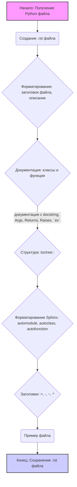

## ИНСТРУКЦИЯ:

Анализирует предоставленную инструкцию для создания документации в формате `rst` на основе Python кода, описывая шаги и структуру необходимой документации.

### <алгоритм>

1. **Начало**: Получение Python файла для обработки.
2. **Форматирование документации**:
   - Создание `rst` файла для данного Python файла.
   - Добавление заголовка файла (`=`) с названием модуля.
   - Включение краткого описания содержимого файла.
   - Для всех классов и функций:
     - Написание комментариев с использованием формата docstring, включая:
       - описание параметров (`Args`) с указанием типов и смысла.
       - описание возвращаемых значений (`Returns`) с указанием типов и смысла.
       - описание возможных исключений (`Raises`).
     - Использование `ex` вместо `e` в блоках обработки исключений.
3. **Добавление структуры TOC Tree**:
   - Использование директивы `.. toctree::` для создания разделов в документации.
   -  Включение в `index.rst` ссылок на все описания модулей.
4. **Форматирование с помощью Sphinx**:
   - Использование директив Sphinx (`autoclass`, `autofunction`) для документирования классов, функций и методов.
     - Применение `.. automodule:: module_name` для автоматической генерации документации по модулю.
     - Указание `:members:`, `:undoc-members:`, и `:show-inheritance:` для включения соответствующих деталей.
5. **Создание заголовков разделов**:
   - Использование заголовков разных уровней:
     - Уровень 1: `=`
     - Уровень 2: `-`
     - Уровень 3: `~`
     - Уровень 4: `^`
6. **Пример файла**:
   - Создание `rst` файла, повторяющего пример в инструкции:
     ```rst
     Module Name
     ===========

     .. automodule:: module_name
        :members:
        :undoc-members:
        :show-inheritance:

     Functions
     ---------

     .. autofunction:: module_name.function_name
     ```
7. **Конец**: Сохранение полученного `rst` файла.

### <mermaid>


**Зависимости:**
- Нет импортов из внешних библиотек или других частей проекта, поэтому `mermaid` диаграмма не показывает каких-либо импортов.

### <объяснение>

**Общее назначение:**
Инструкция описывает процесс создания документации для Python кода в формате `rst` (reStructuredText), который используется Sphinx. Основная цель - автоматизировать процесс генерации документации, делая её структурированной, подробной и легкой в навигации.

**Разделы и их назначение:**

- **Форматирование документации:** определяет структуру каждого `rst` файла. Она устанавливает стандарты для заголовков, комментариев и описаний функций, классов и методов. `docstring` - это стандартный способ написания документации внутри Python кода.
- **TOC Tree:** определяет структуру оглавления (table of contents). Это обеспечивает навигацию по всем модулям проекта, делая документацию более удобной для пользователя.
- **Форматирование с помощью Sphinx:** использует директивы Sphinx для автоматического извлечения информации из Python кода и её правильного отображения в документации. Это сокращает необходимость ручного написания документации и уменьшает вероятность ошибок.
- **Section Headings:** определяет уровни заголовков, которые обеспечивают четкую структуру документа.

**Инструкции и их назначение:**

- **Использование `ex` вместо `e` в блоках `except`**: Это не является строгим стандартом, но, вероятно, используется для улучшения читаемости или для специфических требований проекта.
- **Пример файла:**  Предоставляет шаблон для создания `rst` файлов, который должен быть использован для каждого Python файла.

**Возможные улучшения:**

1. **Гибкость форматирования:** Инструкция может быть расширена для поддержки различных стилей документации (например, Google Style Docstrings, NumPy Style Docstrings).
2. **Расширенные примеры:** Примеры могут быть дополнены различными сценариями для классов и методов, а также могут быть включены примеры использования.
3. **Автоматизация:** Можно добавить шаги для автоматического преобразования этих `rst` файлов в HTML или PDF с помощью Sphinx.
4. **Проверка:** Можно добавить проверку, которая убедится, что документация соответствует заданной структуре.

**Связь с другими частями проекта:**

- Инструкция является частью процесса генерации документации и тесно связана с Sphinx. Она также связана с Python кодом, для которого создается документация.
- Она является частью процесса разработки, обеспечивая документацию для проекта.

В целом, эта инструкция хорошо описывает процесс создания документации в формате `rst` для Python проектов. Она требует от разработчика следовать определенным стандартам, что обеспечивает единообразие и высокое качество документации.