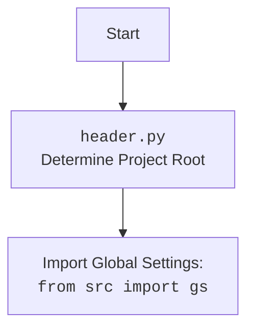

## Анализ кода

### 1. **<алгоритм>**

1. **Начало:** Получаем на вход Python-файл.
2. **Анализ:** Проверяем наличие в файле классов и функций.
3. **Формирование заголовка:** Создаем заголовок в формате reStructuredText (rst) для модуля, используя `==` для уровня 1.
4. **Добавление директивы automodule:** Добавляем директиву `automodule` для автоматического включения документации по модулю с настройками отображения членов, не задокументированных членов и наследования.
5. **Формирование заголовков секций:**
   - Если в файле есть функции, то создаем заголовок "Functions" с уровнем 2 (`--`).
   - Добавляем директиву `autofunction` для каждой найденной функции.
6. **Формирование заголовков классов:**
   - Если в файле есть классы, то создаем заголовок "Classes" с уровнем 2 (`--`).
   - Добавляем директиву `autoclass` для каждого найденного класса, используя `:members:`, `:undoc-members:`, `:show-inheritance:`.
7. **Обработка параметров и возвращаемых значений:**
   - Для каждой функции или метода класса, анализируем docstring.
   - Формируем документацию для параметров, возвращаемого значения и возможных исключений на основе docstring в формате, указанном в инструкции.
8. **Создание структуры TOC Tree:**
   - Для каждого модуля создаём файл *.rst.
   - Составляем `index.rst` файл, содержащий `toctree` с ссылками на все модули.
9. **Генерация RST:**
   - Собираем все сгенерированные блоки rst в один файл.
10. **Конец:** Возвращаем сгенерированную документацию в формате `.rst`.

**Примеры:**

-   **Анализ:** `def my_function(param: str, param1: int) -> bool:` -> извлекаем название функции, параметры, возвращаемое значение
-   **Формирование заголовка:** `Module Name\n===========\n`
-   **Добавление директивы `automodule`:** `.. automodule:: module_name\n    :members:\n    :undoc-members:\n    :show-inheritance:\n`
-   **Формирование заголовка "Functions":** `Functions\n---------\n`
-   **Формирование директивы `autofunction`:** `.. autofunction:: module_name.my_function\n`

### 2. **<mermaid>**

```mermaid
flowchart TD
    Start --> AnalyzeFile[Analyze Python File]
    AnalyzeFile --> CreateHeader[Create rst Header (level 1)]
    CreateHeader --> AddAutoModule[Add automodule directive]
    AddAutoModule --> CheckFunctions{Check for Functions}
    CheckFunctions -- Yes --> CreateFunctionsHeader[Create "Functions" Header (level 2)]
    CreateFunctionsHeader --> AddAutoFunction[Add autofunction directive for each function]
    AddAutoFunction --> CheckClasses{Check for Classes}
    CheckFunctions -- No --> CheckClasses
    CheckClasses -- Yes --> CreateClassesHeader[Create "Classes" Header (level 2)]
    CreateClassesHeader --> AddAutoClass[Add autoclass directive for each class]
    AddAutoClass --> AnalyzeDocstrings[Analyze docstrings for parameters, return values, exceptions]
    CheckClasses -- No --> AnalyzeDocstrings

    AnalyzeDocstrings --> CreateTOC[Create TOC tree in index.rst]
    CreateTOC --> GenerateRST[Generate rst output]
    GenerateRST --> End

    style Start fill:#f9f,stroke:#333,stroke-width:2px
    style End fill:#ccf,stroke:#333,stroke-width:2px
```

**Зависимости:**

В данном коде не используется явных `import`, но неявно используются следующие зависимости:

-   **`reStructuredText (rst)`**: Это стандарт, который используется для форматирования документации. Этот стандарт не является импортом, а скорее стандартом разметки текста.
-   **Sphinx directives**: `automodule`, `autofunction`, `autoclass` - это директивы, используемые Sphinx для автоматического создания документации. Их использование не означает явного импорта библиотек в Python коде, но является ключевой частью процесса генерации документации.

Дополнительно, если используется `import header` (хотя в представленном коде этого нет), то диаграмма для `header.py` выглядела бы следующим образом:


### 3. **<объяснение>**

**Общее назначение:**

Данный код предназначен для автоматической генерации документации в формате reStructuredText (rst) из Python-кода. Это позволяет создавать документацию, совместимую со Sphinx, для проектов на Python. Процесс включает в себя анализ Python-файлов, создание соответствующих rst-блоков, структурирование документации и подготовку TOC Tree.

**Импорты:**

В предоставленном коде нет явных операторов `import`. Однако, неявно используются:

-   `reStructuredText`: Стандарт разметки текста.
-   `Sphinx`: Используются директивы, но Sphinx является инструментом, а не импортируемым пакетом.

**Классы:**

В предоставленной инструкции классы не рассматриваются в контексте кода, но в процессе генерации документации, классы в анализируемых Python-файлах будут документированы с помощью директивы `autoclass`. Для классов, анализируются атрибуты, методы, и взаимодействие с другими компонентами проекта.

**Функции:**

В предоставленной инструкции рассматриваются функции в контексте генерации документации. Функции в анализируемых файлах будут документироваться с помощью директивы `autofunction`. Анализируются параметры, возвращаемые значения и исключения на основе docstring функций.
Пример:
```python
def example_function(param: str, param1: int) -> bool:
    """
    Args:
        param (str): Some string parameter
        param1 (int): Some int parameter

    Returns:
        bool: Returns True if param is not None and param1 > 0, otherwise False
    """
    if param and param1 > 0:
        return True
    else:
        return False
```
Импортируется `example_function`,  анализируется его docstring и создается документация rst  в виде директивы `autofunction`.

**Переменные:**

В предоставленном коде непосредственно переменных нет, но при генерации документации, если бы в классах и функциях присутствовали переменные, их типы и назначения учитывались бы при создании документации.

**Потенциальные ошибки и области для улучшения:**

-   **Обработка docstring**: Анализ docstring может быть улучшен для обработки разных форматов docstring (например, Google style, NumPy style) и автоматического форматирования документации на основе этих форматов.
-   **Сложность обработки**: Алгоритм пока не обрабатывает более сложные случаи, такие как вложенные классы и функции, а также не использует метаинформацию о типах.

**Цепочка взаимосвязей:**

Данный код является частью системы, которая позволяет автоматически создавать документацию для Python-проектов. Взаимодействует со Sphinx для преобразования `.rst` файлов в документацию HTML. Данный код является генератором, который создаёт эти `.rst` файлы на основе анализа исходного кода.