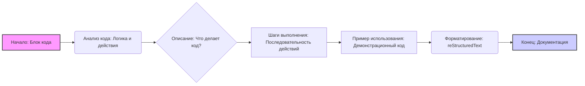

# Анализ кода

## 1. <алгоритм>

**Описание:** Данный код представляет собой шаблон инструкций для создания документации к коду. Он задает структуру и форматирование для описания кода, включая объяснение его назначения, шаги выполнения и примеры использования.

**Пошаговая блок-схема:**

1.  **Начало:** Получаем блок кода, который нужно задокументировать.
2.  **Анализ:** Разбираем логику и действия, которые выполняет блок кода.
3.  **Описание:** Составляем краткое описание того, что делает код.
    *   **Пример:** "Данный блок кода отправляет данные на сервер."
4.  **Шаги выполнения:** Определяем последовательность действий в коде.
    *   **Пример:**
        1.  "Проверяет валидность входных данных."
        2.  "Форматирует данные в JSON."
        3.  "Отправляет данные по HTTP."
5.  **Пример использования:** Создаем пример кода, демонстрирующий использование данного блока в проекте.
    *   **Пример:**

        ```python
        def send_data(data):
            # Проверка данных
            if not is_valid(data):
                raise ValueError("Невалидные данные")
            # Форматирование
            json_data = json.dumps(data)
            # Отправка
            send_to_server(json_data)
        ```
6.  **Форматирование:** Оформляем описание в формате `reStructuredText (RST)`.
7.  **Конец:** Результатом является документ с описанием, шагами выполнения и примером использования.

## 2. <mermaid>



**Разбор диаграммы:**

*   `A[Начало: Блок кода]` - Начальный узел, представляющий входящий блок кода, который нужно проанализировать.
*   `B(Анализ кода: Логика и действия)` - Узел, описывающий процесс анализа кода для понимания его логики и действий.
*   `C{Описание: Что делает код?}` - Узел, представляющий составление краткого описания того, что делает код.
*   `D[Шаги выполнения: Последовательность действий]` - Узел, описывающий процесс определения последовательности действий в коде.
*   `E[Пример использования: Демонстрационный код]` - Узел, представляющий создание примера кода, демонстрирующего использование данного блока в проекте.
*   `F(Форматирование: reStructuredText)` - Узел, описывающий процесс форматирования документации в формате reStructuredText.
*   `G[Конец: Документация]` - Конечный узел, представляющий результирующую документацию.

**Зависимости:**
    Диаграмма не импортирует никаких зависимостей. Все узлы представляют этапы процесса создания документации, а не внешние модули.

## 3. <объяснение>

**Импорты:**
В предоставленном коде отсутствуют какие-либо импорты. Это всего лишь шаблон инструкции для написания документации, и он не зависит от внешних модулей.

**Классы:**
В данном коде классы не используются.

**Функции:**
В коде отсутствуют функции. Он представляет собой шаблон инструкции для написания документации, а не исполняемый код.

**Переменные:**
В коде нет явных переменных. Однако, логически можно выделить следующие переменные:
- **`code_block`** - Представляет блок кода, который нужно задокументировать. Тип: Строка (текст кода)
- **`description`** - Описание функциональности кода. Тип: Строка.
- **`execution_steps`** - Список шагов выполнения кода. Тип: Список строк.
- **`usage_example`** - Код примера использования. Тип: Строка.

**Объяснения:**

- **Описание работы кода:** Этот код является инструкцией для создания документации к блоку кода. Он предлагает четкую структуру и формат для описания кода, включая описание его назначения, шаги выполнения и пример использования.
- **Форматирование:** Инструкция требует форматирования документации в формате `reStructuredText (RST)`. Это позволяет создать читаемую и структурированную документацию, которая может быть использована для генерации HTML-страниц или других форматов.
- **Специфичность:** Важным требованием является избежание неясных терминов и использование конкретных глаголов, описывающих действия кода. Это помогает более точно и понятно документировать код.
- **Цепочка взаимосвязей:** Данная инструкция сама по себе является частью процесса разработки и документирования программного обеспечения. Она может быть применена к любому блоку кода в проекте для создания подробной документации.

**Потенциальные ошибки или области для улучшения:**

*   **Нет проверки:** Инструкция не включает проверку правильности и полноты документации. Необходимо предусмотреть процесс проверки, чтобы убедиться, что документация соответствует реальному коду.
*   **Автоматизация:** Можно автоматизировать процесс генерации документации с использованием этой инструкции, например, разработав инструмент, который автоматически анализирует код и создает черновик документации в формате RST.
*   **Разнообразие примеров:** Можно добавить требования по предоставлению нескольких примеров использования, включая примеры с разными сценариями использования.

**Заключение:**
Этот шаблон инструкций обеспечивает стандартизированный и структурированный подход к документированию кода. Он помогает разработчикам создавать понятную и полезную документацию, которая облегчает сопровождение и использование кода.