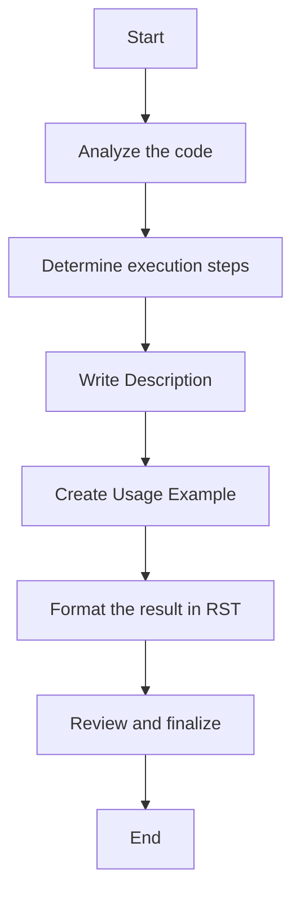

## ИНСТРУКЦИЯ:

Анализ предоставленного кода и его представление в виде структурированного markdown документа.

### <алгоритм>

1.  **Анализ кода**: Начните с внимательного чтения представленного кода, чтобы понять его общую цель и логику.
2.  **Определение шагов**: Выделите последовательные действия, выполняемые кодом. Это будет основа для раздела "Execution steps".
3.  **Формулировка описания**: Напишите четкое и краткое описание цели кода. Это будет использовано в разделе "Description".
4.  **Создание примера использования**: Придумайте и напишите пример кода, показывающий, как использовать анализируемый код в реальном проекте. Это будет использоваться в разделе "Usage example".
5.  **Форматирование в RST**:
    *   Начните с заголовка `How to use this code block`.
    *   Создайте разделы `Description`, `Execution steps` и `Usage example`, используя заголовки второго уровня.
    *   В разделе `Execution steps` пронумеровать шаги.
    *   В разделе `Usage example` используйте блок `code-block:: python` для форматирования кода.
6.  **Проверка на неточности**: Пересмотрите все пункты на предмет неточностей и добавьте конкретики, избегая расплывчатых терминов, таких как "получение" или "делание".

**Пример потока данных:**

Предположим, что дан код, который проверяет корректность email адреса.

1.  **Ввод данных**: На вход поступает строка, представляющая email.
2.  **Проверка формата**: Выполняется проверка формата строки на соответствие правилам email.
3.  **Возврат результата**: Функция возвращает `True`, если email валиден, и `False` в противном случае.

### <mermaid>

**Объяснение `mermaid`**:

*   `Start` и `End` - Начало и конец блок-схемы.
*   `AnalyzeCode` - Первый шаг, где анализируется предоставленный код.
*   `DetermineSteps` - Второй шаг, где определяются шаги выполнения кода.
*   `WriteDescription` - Третий шаг, где формируется описание работы кода.
*   `CreateUsageExample` - Четвертый шаг, где создается пример использования кода.
*   `FormatInRST` - Пятый шаг, где форматируется вывод в формате reStructuredText.
*   `ReviewAndFinalize` - Шестой шаг, где происходит проверка и окончательная доработка.

Данная блок-схема наглядно отображает процесс создания документации кода, начиная с его анализа и заканчивая форматированием и проверкой результата.

### <объяснение>

**Импорты**:
В данном коде нет явных импортов модулей. Инструкция работает с текстом и не требует каких-либо внешних библиотек. Если бы импорты были, то они бы были частью процесса форматирования кода в `Usage example`.

**Классы**:
В текущей инструкции нет классов. Инструкция описывает процедуру работы с текстом, а не объектно-ориентированную модель. Если бы в инструкциях были бы классы, то они описывали бы, например, класс для форматирования кода.

**Функции**:
В данной инструкции нет функций. Но если бы они были, то:
  * Аргументы: принимали бы, например, текст кода для анализа
  * Возвращаемые значения: возвращали бы, например, отформатированный текст в формате RST.
  * Назначение: разделение процесса обработки кода на более мелкие этапы.
  * Примеры: `process_code(code_text) -> formatted_rst_text`

**Переменные**:
В данном коде не используются переменные. Но если бы они были, то они имели бы тип `string` или `list[string]` для хранения текстовых данных, инструкций и шагов.

**Потенциальные ошибки и улучшения**:
1.  **Недостаточная детализация**: В примере шагов "Description", "Execution steps" и "Usage example" может не хватать детализации.
2.  **Ограниченность форматирования**: Инструкция подразумевает только RST, но можно было бы добавить поддержку других форматов.
3.  **Проверка кода**: Инструкция не подразумевает автоматической проверки работоспособности примера кода.
4.  **Адаптация**: Можно улучшить инструкцию за счет адаптации к различным языкам программирования.
5.  **Отсутствует проверка контекста**: Инструкция не проверяет контекст использования кода.

**Цепочка взаимосвязей**:
Данная инструкция является частью системы документации кода. Она может быть интегрирована с инструментами для автоматического создания документации. Интеграция с инструментами линтинга, например, может помочь в автоматизации проверки примеров кода и соответствие стандартам. Эта инструкция позволяет  преобразовать код в документацию с помощью RST.