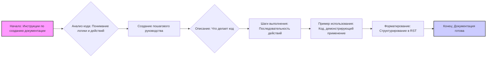
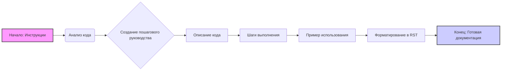

## ИНСТРУКЦИЯ:

Анализируй предоставленный код подробно и объясни его функциональность. Ответ должен включать три раздела:

1.  **<алгоритм>**: Опиши рабочий процесс в виде пошаговой блок-схемы, включая примеры для каждого логического блока, и проиллюстрируй поток данных между функциями, классами или методами.
2.  **<mermaid>**: Напиши код для диаграммы в формате `mermaid`, проанализируй и объясни все зависимости,
    которые импортируются при создании диаграммы.
    **ВАЖНО!** Убедитесь, что все имена переменных, используемые в диаграмме `mermaid`,
    имеют осмысленные и описательные имена. Имена переменных вроде `A`, `B`, `C`, и т.д., не допускаются!

    **Дополнительно**: Если в коде есть импорт `import header`, добавьте блок `mermaid` flowchart, объясняющий `header.py`:
    ```mermaid
    flowchart TD
        Start --> Header[<code>header.py</code><br> Determine Project Root]

        Header --> import[Import Global Settings: <br><code>from src import gs</code>]
    ```

3.  **<объяснение>**: Предоставьте подробные объяснения:
    -   **Импорты**: Их назначение и взаимосвязь с другими пакетами `src.`.
    -   **Классы**: Их роль, атрибуты, методы и взаимодействие с другими компонентами проекта.
    -   **Функции**: Их аргументы, возвращаемые значения, назначение и примеры.
    -   **Переменные**: Их типы и использование.
    -   Выделите потенциальные ошибки или области для улучшения.

Дополнительно, постройте цепочку взаимосвязей с другими частями проекта (если применимо).

Это обеспечивает всесторонний и структурированный анализ кода.
## Формат ответа: `.md` (markdown)
**КОНЕЦ ИНСТРУКЦИИ**
```markdown
## <алгоритм>

**Описание работы кода:**

Представленный код описывает процесс создания документации для блоков кода в формате `reStructuredText (RST)`. Он включает в себя анализ, объяснение, и форматирование кода для дальнейшего использования в документации.
Блок-схема:



**Примеры для логических блоков:**

*   **Анализ кода:**
    *   Входные данные: код на Python.
    *   Результат: Понимание назначения кода.

*   **Создание пошагового руководства:**
    *   Входные данные: Результат анализа кода.
    *   Результат: Разделы 'Описание', 'Шаги выполнения', 'Пример использования'.

*   **Описание:**
    *   Входные данные: Функция для валидации email-адреса
    *   Результат: Текст "Эта функция проверяет корректность введенного email-адреса."

*   **Шаги выполнения:**
    *   Входные данные: Код проверки email.
    *   Результат: "1. Проверить наличие символа `@`. 2. Проверить наличие точки `.`. 3. Вернуть `True` если все условия выполнены, иначе `False`."

*   **Пример использования:**
    *   Входные данные: Функция и переменные для проверки email.
    *   Результат: `.. code-block:: python
    def validate_email(email):
        if "@" in email and "." in email:
            return True
        return False
    
    example_email = "test@example.com"
    is_valid = validate_email(example_email)
    print(is_valid)  # Output: True`

*   **Форматирование:**
    *   Входные данные: Текст и примеры.
    *   Результат: Готовый RST блок документации.

## <mermaid>



**Описание зависимостей:**

Диаграмма показывает последовательность шагов, необходимых для создания документации на основе кода. Нет импорта библиотек или внешних зависимостей.

## <объяснение>

**Импорты:**
В представленном коде нет импортов. Инструкции полагаются на понимание и обработку исходного кода и вывод в формате `rst`, без привлечения сторонних библиотек.

**Классы:**
В данном коде нет классов.

**Функции:**
В коде нет функций.
Однако, если представить, что код описывает процесс документирования функции, то можно сделать пример:

*   **`process_code_block()`**
    *   **Аргументы:** `code_string` - строка с кодом, который нужно задокументировать.
    *   **Возвращаемое значение:** `rst_formatted_document` - строка с готовым `rst` документом.
    *   **Назначение:** Принимает код, анализирует его и преобразует в отформатированный документ `rst`.
    *   **Пример:**
        ```python
        def process_code_block(code_string):
            description = "This function converts the given code to rst formatted documentation"
            execution_steps = ["1. Analyze code.", "2. Create description.", "3. Create execution steps.", "4. Create usage example.", "5. Format to rst."]
            usage_example =  f".. code-block:: python\n\n    {code_string}"
            rst_document = f"""How to use this code block
=========================================================================================

Description
-------------------------
{description}

Execution steps
-------------------------
{'\\n'.join(f'{i+1}. {step}' for i, step in enumerate(execution_steps))}

Usage example
-------------------------
{usage_example}"""
            return rst_document
        ```

**Переменные:**
В представленном коде есть следующие концептуальные переменные:

*   `code_string`: Представляет собой исходный код, который подлежит документированию.
*   `description`: Описание того, что делает код.
*   `execution_steps`: Список шагов, которые выполняются в коде.
*   `usage_example`: Пример использования кода.
*   `rst_document`: Строка, которая содержит отформатированный `rst` документ.

**Потенциальные ошибки и области для улучшения:**

*   **Отсутствие проверки входных данных:** Код не проверяет корректность входных данных, что может вызвать ошибки, если входные данные не соответствуют ожидаемому формату.
*   **Недостаточная автоматизация:** Процесс в текущем виде является достаточно ручным и может потребовать значительных усилий при документировании больших блоков кода. Можно улучшить, добавив автоматический анализ кода (например, используя `ast` модуль Python).
*   **Недостаточная гибкость:** Код недостаточно гибок для обработки различных типов документации.
*   **Нет обработки исключений**: Код не содержит блоков для обработки возможных исключений, например, если входная строка кода не является валидным python кодом.

**Цепочка взаимосвязей с другими частями проекта:**
Этот код может использоваться в системе автоматической генерации документации, где он будет частью пайплайна обработки исходного кода. Например, в CI/CD пайплайне для обновления документации.
```