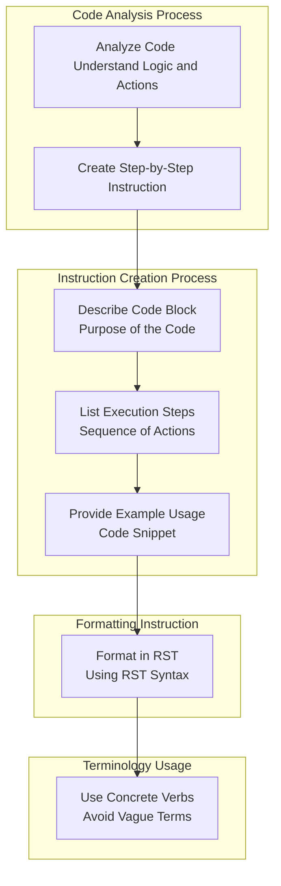

## ИНСТРУКЦИЯ:

Анализируй предоставленный код подробно и объясни его функциональность. Ответ должен включать три раздела:

1.  **<алгоритм>**: Опиши рабочий процесс в виде пошаговой блок-схемы, включая примеры для каждого логического блока, и проиллюстрируй поток данных между функциями, классами или методами.
2.  **<mermaid>**: Напиши код для диаграммы в формате `mermaid`, проанализируй и объясни все зависимости,
    которые импортируются при создании диаграммы.
    **ВАЖНО!** Убедитесь, что все имена переменных, используемые в диаграмме `mermaid`,
    имеют осмысленные и описательные имена. Имена переменных вроде `A`, `B`, `C`, и т.д., не допускаются!

    **Дополнительно**: Если в коде есть импорт `import header`, добавьте блок `mermaid` flowchart, объясняющий `header.py`:\
    ```mermaid
    flowchart TD
        Start --> Header[<code>header.py</code><br> Determine Project Root]

        Header --> import[Import Global Settings: <br><code>from src import gs</code>]
    ```

3.  **<объяснение>**: Предоставьте подробные объяснения:
    *   **Импорты**: Их назначение и взаимосвязь с другими пакетами `src.`.
    *   **Классы**: Их роль, атрибуты, методы и взаимодействие с другими компонентами проекта.
    *   **Функции**: Их аргументы, возвращаемые значения, назначение и примеры.
    *   **Переменные**: Их типы и использование.
    *   Выделите потенциальные ошибки или области для улучшения.

Дополнительно, постройте цепочку взаимосвязей с другими частями проекта (если применимо).

Это обеспечивает всесторонний и структурированный анализ кода.
## Формат ответа: `.md` (markdown)
**КОНЕЦ ИНСТРУКЦИИ**

## <алгоритм>

Этот код представляет собой инструкцию для генерации документации к коду. Он определяет, как анализировать код и форматировать документацию в reStructuredText (RST). Вот пошаговая блок-схема процесса:

1. **Анализ кода:**
   - **Описание:** Прочитать и понять логику, последовательность действий и предназначение кода.
   - **Пример:** Изучение функции, которая суммирует два числа, обращая внимание на типы входных данных и возвращаемое значение.

2. **Создание пошаговой инструкции:**
   - **Описание:** Подготовка текста для документации.
   - **Шаги выполнения:**
     1. **Описание блока кода:** Описать, что делает код в целом.
         -  **Пример:** "Эта функция складывает два числа."
     2.  **Шаги выполнения:** Описать последовательность действий внутри кода.
         -  **Пример:** "1. Принять два числа. 2. Сложить их. 3. Вернуть результат."
     3. **Пример использования:** Привести код, демонстрирующий, как использовать данный фрагмент.
        -  **Пример:**
        ```python
        def add(a, b):
            return a + b

        result = add(5, 3)
        print(result) # Вывод: 8
        ```
3.  **Форматирование в reStructuredText (RST):**
    -   **Описание:** Структурирование инструкции с использованием синтаксиса RST.
    -   **Пример:**
        ```rst
        Как использовать этот блок кода
        =========================================================================================

        Описание
        -------------------------
        Эта функция складывает два числа.

        Шаги выполнения
        -------------------------
        1. Принять два числа.
        2. Сложить их.
        3. Вернуть результат.

        Пример использования
        -------------------------
        .. code-block:: python

            def add(a, b):
                return a + b

            result = add(5, 3)
            print(result)
        ```

4. **Избегание расплывчатых терминов:**
    - **Описание:** Использование конкретных глаголов, таких как "проверяет", "валидирует", "отправляет" вместо общих "получаем" или "делаем".
    - **Пример:** Вместо "Функция получает данные", нужно писать "Функция проверяет наличие данных."

## <mermaid>



**Описание `mermaid` диаграммы:**

1.  **`CodeAnalysis` subgraph**: Представляет процесс анализа кода.
    -   `A` (Analyze Code): Начальный этап, на котором нужно понять логику и действия кода.
    -   Стрелка `-->`: Указывает на переход к следующему этапу.
    -   `B` (Create Step-by-Step Instruction): Подготовка пошаговой инструкции.
2.  **`InstructionCreation` subgraph**: Показывает процесс создания инструкции.
    -   `B` (Create Step-by-Step Instruction): Начало процесса, инструкция создается на основе анализа кода.
    -   `C` (Describe Code Block): Описывает, что делает блок кода.
    -   `D` (List Execution Steps): Перечисляет последовательность действий кода.
    -   `E` (Provide Example Usage): Предоставляет пример кода.
3.  **`Formatting` subgraph**: Процесс форматирования.
    -   `E` (Provide Example Usage): Данные передаются для форматирования.
    -   `F` (Format in RST): Инструкция форматируется в RST.
4. **`Terminology` subgraph**: Процесс использования терминологии.
    -   `F` (Format in RST): Данные передаются для форматирования.
    -   `G` (Use Concrete Verbs): Используются конкретные глаголы, избегая расплывчатых терминов.

## <объяснение>

**Объяснение кода:**

Этот код представляет собой набор инструкций о том, как анализировать и документировать код, используя формат reStructuredText (RST).

**Импорты:**

В данном коде нет импортов. Код является инструкцией, а не исполняемым кодом, поэтому импорты не требуются.

**Классы:**
В этом коде классы не используются.

**Функции:**

В этом коде нет функций. Это скорее набор инструкций или рецепт.

**Переменные:**

В этом коде переменные не используются.

**Подробное объяснение:**

1.  **Анализ кода**:
    *   Цель: Понимание логики, действий и назначения кода.
    *   Описание: Этот шаг является основой для дальнейшей документации. Требуется внимательное чтение и понимание работы кода.
2.  **Создание пошаговой инструкции**:
    *   Цель: Подготовка структурированного текста документации.
    *   Описание: Инструкция разбита на три основные части:
        *   **Описание**: Объясняет, что делает код в целом.
        *   **Шаги выполнения**: Описывает порядок выполнения действий в коде.
        *   **Пример использования**: Предоставляет пример кода для демонстрации использования.
3.  **Форматирование в reStructuredText (RST)**:
    *   Цель: Структурирование документации с использованием синтаксиса RST.
    *   Описание: RST используется для создания читабельной и структурированной документации.
4.  **Избегание расплывчатых терминов**:
    *   Цель: Сделать документацию более точной и понятной.
    *   Описание: Требуется использовать конкретные глаголы, которые точно описывают действия кода.

**Потенциальные ошибки и области для улучшения:**

*   **Нет примеров сложного кода**: Инструкция не содержит примеров для обработки более сложного кода. Можно добавить примеры с циклами, условиями и т.д.
*   **Нет указаний на обработку исключений**: В инструкциях не рассматривается, как документировать обработку исключений, что важно для полного понимания кода.
*   **Недостаточно информации об RST**: Можно добавить ссылки на документацию RST, чтобы пользователи могли глубже изучить этот формат.

**Взаимосвязь с другими частями проекта:**

Этот код, по сути, является мета-инструкцией и не зависит от других частей проекта. Он может быть использован для документирования любой части проекта. Его задача - предоставить структуру и правила для создания документации, а не выполнение какой-либо конкретной функциональности.