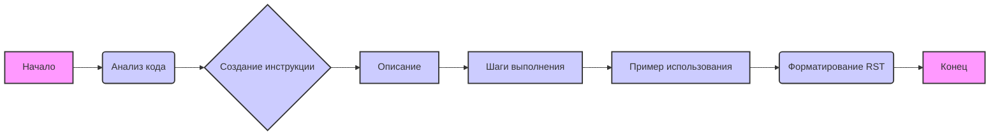

## Анализ инструкции для генерации документации к коду

### 1. **<алгоритм>**

Представленная инструкция описывает процесс создания документации к коду. Вот пошаговая блок-схема процесса:

1.  **Начало:** Получаем фрагмент кода для анализа.
    *   *Пример:*  `def add(x, y): return x + y`

2.  **Анализ кода:** Проводим анализ логики и действий, выполняемых кодом.
    *   *Пример:*  Анализируем функцию `add`, которая складывает два числа.

3.  **Создание пошаговой инструкции:**
    *   **Описание:** Объясняем, что делает код.
        *   *Пример:* "Функция `add` складывает два числовых аргумента."
    *   **Шаги выполнения:** Описываем последовательность действий в коде.
        *   *Пример:* "Функция принимает два числа `x` и `y`, затем возвращает их сумму."
    *   **Пример использования:** Предоставляем пример использования кода.
        *   *Пример:*
            ```python
            .. code-block:: python

                result = add(5, 3)
                print(result) # Вывод: 8
            ```

4.  **Форматирование:** Оформляем документацию в формате `reStructuredText (RST)`.
    *   *Пример:*
        ```rst
        Как использовать функцию add
        =========================================================================================

        Описание
        -------------------------
        Функция `add` складывает два числовых аргумента.

        Шаги выполнения
        -------------------------
        1. Функция принимает два числа `x` и `y`.
        2. Функция возвращает их сумму.

        Пример использования
        -------------------------
        .. code-block:: python

            result = add(5, 3)
            print(result) # Вывод: 8
        ```

5.  **Избегание расплывчатых терминов:** Убеждаемся, что используем конкретные глаголы.
    *   *Пример:*  Вместо "получаем данные", используем "извлекаем данные". Вместо "делает что-то", используем "валидирует ввод".

6.  **Конец:** Готовая документация в формате `RST`.

### 2. **<mermaid>**



**Анализ диаграммы `mermaid`:**

*   **graph LR**: Объявляет направленный граф (слева направо).
*   **A[Начало]**: Начальная точка процесса, помеченная как "Начало".
*   **B(Анализ кода)**: Шаг анализа предоставленного кода.
*   **C{Создание инструкции}**: Принятие решения о создании инструкции.
*   **D[Описание]**: Создание текстового описания функциональности кода.
*   **E[Шаги выполнения]**: Описание последовательности действий в коде.
*   **F[Пример использования]**: Добавление примеров использования кода.
*   **G(Форматирование RST)**: Форматирование с помощью reStructuredText.
*   **H[Конец]**: Конечная точка процесса, помеченная как "Конец".
*   **style A fill:#f9f,stroke:#333,stroke-width:2px**: Стиль для блока "Начало"
*   **style H fill:#f9f,stroke:#333,stroke-width:2px**: Стиль для блока "Конец"
*   **classDef process fill:#ccf,stroke:#333,stroke-width:2px**: Определение стиля для блоков процесса.
*   **class B,C,D,E,F,G process;**: Применение стиля "process" к соответствующим блокам.

Диаграмма показывает последовательность шагов от начала анализа кода до получения отформатированной документации.

### 3. **<объяснение>**

**Импорты:**

В данном фрагменте кода нет импортов, так как это инструкция, а не исполняемый код.

**Классы:**

В данном фрагменте кода нет классов.

**Функции:**

В данном фрагменте кода нет функций. Однако, основная задача данного фрагмента состоит в описании процесса создания документации на основе функций (или классов) и их использования.

**Переменные:**

В явном виде переменных нет, но неявные переменные - это элементы процесса, который описан в инструкции.

**Подробное объяснение:**

*   **Описание инструкции:** Инструкция предназначена для автоматизации создания документации к коду. Она предполагает стандартизированный подход, который включает в себя анализ кода, создание структурированного описания, пошаговое объяснение работы кода и предоставление примеров его использования.
*   **Структура RST:** Использование reStructuredText (RST) обеспечивает возможность генерации красивой и понятной документации, которую можно преобразовать в различные форматы (например, HTML или PDF) с помощью таких инструментов, как Sphinx.
*   **Конкретные глаголы:** Инструкция подчеркивает важность использования конкретных и точных глаголов (например, "валидирует" вместо "делает"), что повышает ясность и точность документации.
*   **Последовательность действий:** Пошаговый подход позволяет не упустить важные детали и сделать процесс документирования более структурированным.
*   **Примеры:** Примеры использования кода в секции "Пример использования" являются важной частью документации, так как они показывают, как можно применить этот код на практике.

**Потенциальные ошибки и области для улучшения:**

1.  **Отсутствие контекста:** Инструкция не упоминает, в какой именно части проекта она используется.
2.  **Сложность для начинающих:** Начинающие разработчики могут испытывать трудности с пониманием RST, поэтому может потребоваться дополнительная инструкция по его использованию.
3.  **Автоматизация:** В инструкции не упоминается возможность автоматизации процесса создания документации, например, через парсер кода и генератор документации.

**Цепочка взаимосвязей с другими частями проекта:**

Данная инструкция является важной частью любого проекта, требующего хорошо документированного кода. Она может быть использована в следующих частях проекта:

1.  **Модули кода:** Данная инструкция используется для документирования функциональности отдельных модулей.
2.  **Классы и функции:** Она также необходима для описания работы отдельных классов и функций.
3.  **API:** Инструкция поможет в создании документации API для интеграции между разными частями проекта или внешними системами.

Таким образом, данная инструкция представляет собой руководство для создания качественной документации к коду, которая облегчает понимание и использование кода.