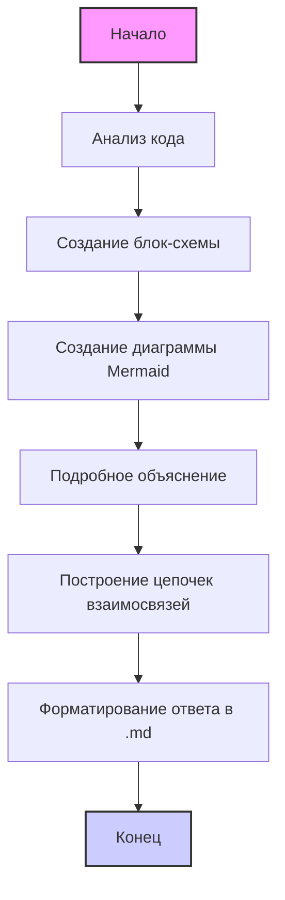

## Анализ Инструкций по Обработке Кода

### 1. **<алгоритм>**

Представленные инструкции описывают процесс анализа кода, который модель должна выполнить. Вот пошаговый алгоритм, иллюстрирующий этот процесс:

1. **Ввод**: Модель получает на вход код (`input_code`) и инструкции (в данном случае это `readme.md`).
   -  *Пример:* `input_code` может быть любым фрагментом кода на Python, Java и т.д.
   ```python
    def add(a, b):
        return a + b
   ```
   Инструкции задают формат и структуру ответа.
   
2. **Анализ Инструкций**: Модель анализирует предоставленные инструкции, чтобы понять, как структурировать свой ответ. Инструкции предписывают:
   - Разделить ответ на три секции: `<алгоритм>`, `<mermaid>`, `<объяснение>`.
   - Следовать указанному формату `MD`.
   -  Предоставить подробный анализ кода.

3. **Анализ Кода**: Модель анализирует предоставленный код (`input_code`) согласно инструкциям. Это включает в себя:
    - Выявление функций, классов, переменных, импортов.
    - Определение их ролей и взаимосвязей.
    - Понимание логики работы кода.
    - *Пример:* Если `input_code` содержит функцию `add`, модель должна понять, что она принимает два аргумента и возвращает их сумму.

4. **Создание Блок-Схемы (<алгоритм>)**: Модель описывает рабочий процесс анализируемого кода в виде пошаговой блок-схемы.
   - *Пример:* Если есть вызов функции `add`, блок-схема может включать шаг "Вызов `add`" со стрелкой, указывающей на шаг "Возвращение суммы".

5. **Создание Диаграммы Mermaid (<mermaid>)**: Модель создает `mermaid` диаграмму, отражающую зависимости и взаимодействие компонентов кода.
    - *Пример:* Если функция `add` использует переменную `result`, `mermaid` диаграмма может отобразить поток данных от параметров к функции, а затем к результату.
    - *Пример:* При наличии импорта `header`, модель должна добавить flowchart для `header.py`, как описано в инструкции.

6. **Подробное Объяснение (<объяснение>)**: Модель предоставляет подробные объяснения, включая:
   - **Импорты**: Назначение, связи с другими пакетами.
    - *Пример:* Если импортирован `os`, модель объяснит, что этот модуль предоставляет инструменты для работы с операционной системой.
   - **Классы**: Роль, атрибуты, методы, взаимодействие.
   - **Функции**: Аргументы, возвращаемые значения, назначение, примеры.
   - **Переменные**: Типы и использование.
   - **Ошибки и улучшения**: Выявление потенциальных проблем и способов их устранения.
    - *Пример:* Если функция не обрабатывает возможные исключения, модель укажет на это как на область для улучшения.

7. **Построение Цепочек Взаимосвязей**: Модель устанавливает связи анализируемого кода с другими частями проекта, если это применимо.
   - *Пример:* Если функция `add` используется в другом модуле, модель укажет на эту связь.

8. **Формирование Ответа**: Модель формирует ответ в формате `MD`, включая все три секции: `<алгоритм>`, `<mermaid>`, `<объяснение>`.

9. **Вывод**: Модель выводит структурированный и подробный анализ кода в формате `.md`.

### 2. **<mermaid>**


**Объяснение диаграммы `mermaid`:**

*   **`flowchart TD`**: Объявление диаграммы типа flowchart с ориентацией сверху вниз.
*   **`Start[Начало]`**: Начальный узел процесса анализа.
*   **`AnalyzeCode[Анализ кода]`**:  Узел, представляющий этап анализа входного кода.
*   **`GenerateAlgorithm[Создание блок-схемы]`**:  Узел, представляющий этап создания блок-схемы.
*    **`GenerateMermaid[Создание диаграммы Mermaid]`**:  Узел, представляющий этап создания диаграммы Mermaid.
*    **`GenerateExplanation[Подробное объяснение]`**: Узел, представляющий этап предоставления подробного объяснения кода.
*    **`BuildConnections[Построение цепочек взаимосвязей]`**: Узел, представляющий этап установления связей с другими частями проекта.
*   **`FormatResponse[Форматирование ответа в .md]`**:  Узел, представляющий этап форматирования ответа в формате Markdown.
*   **`End[Конец]`**:  Конечный узел процесса.
*  **`style Start fill:#f9f,stroke:#333,stroke-width:2px`**: Указывает стиль для `Start` узла.
*  **`style End fill:#ccf,stroke:#333,stroke-width:2px`**: Указывает стиль для `End` узла.
*   **`-->`**: Стрелки, указывающие порядок выполнения этапов.

**Зависимости**:
Диаграмма отражает последовательность обработки кода и построения ответа,  зависимости между этапами. Каждый этап выполняется последовательно, основываясь на результатах предыдущего.

### 3. **<объяснение>**

**Импорты:**

Инструкции не подразумевают явных импортов в коде, который нужно анализировать. Вместо этого, они определяют формат и структуру анализа кода. Если бы в анализируемом коде присутствовали импорты, например, `import os` или `from src import gs`,  модель должна была бы объяснить назначение этих модулей и их взаимосвязь с другими пакетами, например, `src`.

**Классы:**

В представленных инструкциях нет классов, которые нужно анализировать. Если бы они были, модель должна была бы объяснить их роль, атрибуты, методы и взаимодействие с другими компонентами.

**Функции:**

В инструкциях описаны действия, которые должна выполнять модель.  Но нет явных функций в коде. В случае, если в анализируемом коде есть функции, то модель должна бы была объяснить их аргументы, возвращаемые значения, назначение и привести примеры их использования.

**Переменные:**

В инструкциях есть переменные, например,  `input_code`, которые хранят данные. Модель должна анализировать их типы (например, строка для `input_code`) и их использование в процессе анализа.

**Потенциальные ошибки и области для улучшения:**

*   **Неопределенность входных данных**: Инструкции не устанавливают жестких ограничений на формат входного кода (`input_code`), что может привести к проблемам при обработке сложных или неформатированных данных.
*  **Сложность анализа**: Анализ сложного кода, требующий понимания больших структур данных и  взаимосвязанной логики может привести к неточностям и упущениям.
*   **Отсутствие обработки исключений**:  Инструкции не требуют явной обработки исключений, возникающих в процессе анализа, что может привести к сбоям.
*   **Ограниченность контекста**: Анализ кода без понимания общего контекста проекта может привести к неправильному интерпретированию его предназначения и функциональности.
*   **Недостаточное уточнение требований к диаграмме `mermaid`**:  Требование осмысленных переменных в диаграмме `mermaid` может быть недостаточным, если не конкретизировать, какие именно аспекты кода должны быть отражены.

**Цепочки взаимосвязей с другими частями проекта:**

В данном случае, так как `readme.md` является самостоятельным файлом с инструкциями, явных цепочек взаимосвязей с другими частями проекта нет. Однако, если бы эти инструкции были частью большего проекта, они были бы связаны с другими модулями и компонентами через входной код (`input_code`) и могли бы влиять на работу других частей.

**Дополнительные замечания:**

*   Инструкции структурированы,  но требуют от модели высокого уровня понимания кода, умения его анализировать и предоставлять понятное объяснение.
*   Процесс обработки кода должен быть автоматизирован и надежен, чтобы  обеспечить качественный анализ.
*   Для улучшения точности анализа необходимо предоставить более конкретные примеры для различных сценариев и типов входного кода.