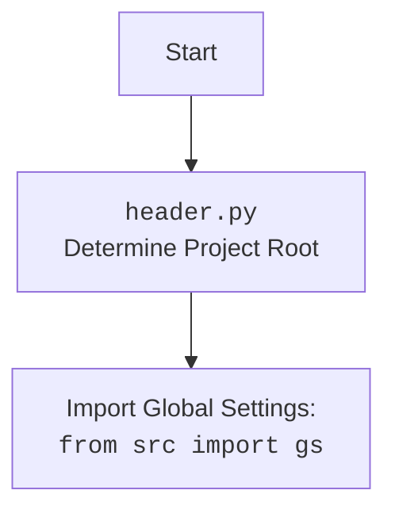

## ИНСТРУКЦИЯ:

Анализируй предоставленный код подробно и объясни его функциональность. Ответ должен включать три раздела:  

1. **<алгоритм>**: Опиши рабочий процесс в виде пошаговой блок-схемы, включая примеры для каждого логического блока, и проиллюстрируй поток данных между функциями, классами или методами.  
2. **<mermaid>**: Напиши код для диаграммы в формате `mermaid`, проанализируй и объясни все зависимости, 
    которые импортируются при создании диаграммы. 
    **ВАЖНО!** Убедитесь, что все имена переменных, используемые в диаграмме `mermaid`, 
    имеют осмысленные и описательные имена. Имена переменных вроде `A`, `B`, `C`, и т.д., не допускаются!  
    
    **Дополнительно**: Если в коде есть импорт `import header`, добавьте блок `mermaid` flowchart, объясняющий `header.py`:\
    ```mermaid
    flowchart TD
        Start --> Header[<code>header.py</code><br> Determine Project Root]
    
        Header --> import[Import Global Settings: <br><code>from src import gs</code>] 
    ```

3. **<объяснение>**: Предоставьте подробные объяснения:  
   - **Импорты**: Их назначение и взаимосвязь с другими пакетами `src.`.  
   - **Классы**: Их роль, атрибуты, методы и взаимодействие с другими компонентами проекта.  
   - **Функции**: Их аргументы, возвращаемые значения, назначение и примеры.  
   - **Переменные**: Их типы и использование.  
   - Выделите потенциальные ошибки или области для улучшения.  

Дополнительно, постройте цепочку взаимосвязей с другими частями проекта (если применимо).  

Это обеспечивает всесторонний и структурированный анализ кода.
## Формат ответа: `.md` (markdown)
**КОНЕЦ ИНСТРУКЦИИ**

## <алгоритм>

1.  **Начало**: Скрипт запускается с аргументами командной строки: `--lang` (язык) и `src_dir` (путь к исходной директории).
    
    *   Пример: `python make_summary.py --lang ru src`
2.  **Обработка аргументов**:
    *   Используется `argparse` для разбора аргументов.
    *   `language`: Определяется язык (например, 'ru' или 'en').
    *   `source_directory`: Определяется путь к исходной директории (например, 'src').
3.  **Определение корневой директории проекта**:
    *   Вызывается `header.get_project_root()`, чтобы определить корень проекта.
        *   Пример: Если скрипт находится в `src/endpoints/hypo69/code_assistant/`, то корневой директорией будет родительский каталог `hypo`.
4.  **Построение пути к выходному файлу**:
    *   Путь к файлу `SUMMARY.md` формируется путем объединения корня проекта, папки `docs` и имени файла `SUMMARY.md`.
        *   Пример: `<project_root>/docs/SUMMARY.md`
5.  **Инициализация списка строк оглавления**:
    *   Создается пустой список `summary_lines`, в который будут добавляться строки оглавления.
6.  **Начало рекурсивного обхода**:
    *   Начало рекурсивного обхода директории `source_directory` с помощью функции `os.walk()`.
7.  **Обработка каждого файла**:
    *   Для каждого `.md` файла в директории выполняется:
        *   **Фильтрация по языку**:
            *   Если язык `ru`, то файлы без `.ru.md` игнорируются.
            *   Если язык `en`, то файлы с `.ru.md` игнорируются.
        *   **Формирование строки оглавления**:
            *   Формируется строка вида `- [<имя файла без расширения>] (<относительный путь к файлу от корня проекта>)`.
                *   Пример: `- [file1](src/file1.md)` или `- [file2](src/file2.ru.md)`
        *   **Добавление строки в список**:
            *   Строка добавляется в `summary_lines`.
8.  **Запись в файл `SUMMARY.md`**:
    *   Создается или открывается файл `SUMMARY.md` для записи.
    *   В начале файла записывается заголовок `# Summary`.
    *   Все строки из `summary_lines` последовательно записываются в файл.
9.  **Конец**: Скрипт завершает работу, создав или обновив файл `SUMMARY.md`.

## <mermaid>

```mermaid
flowchart TD
    Start[Start] --> ParseArgs[Parse Command Line Arguments]
    ParseArgs -- language, source_directory --> GetProjectRoot[Get Project Root from header.py]
    GetProjectRoot -- project_root --> BuildOutputPath[Build Output File Path: <br>project_root/docs/SUMMARY.md]
    BuildOutputPath --> InitSummaryList[Initialize Empty List: <br> summary_lines]
    InitSummaryList --> StartWalk[Start os.walk(source_directory)]
    StartWalk --> LoopFiles{For each file in directory}
    LoopFiles -- yes --> FilterFiles{Filter file by language}
    FilterFiles -- include --> GenerateSummaryLine[Generate Summary Line: <br>- [filename](relative_path)]
    FilterFiles -- ignore --> LoopFiles
    GenerateSummaryLine --> AppendSummaryLine[Append line to summary_lines]
    AppendSummaryLine --> LoopFiles
    LoopFiles -- no --> WriteSummaryFile[Write summary_lines to <br> SUMMARY.md file]
    WriteSummaryFile --> End[End]
```



**Анализ зависимостей:**

*   **`argparse`**: Используется для обработки аргументов командной строки, таких как `--lang` и `src_dir`. Это стандартный модуль Python, который упрощает создание интерфейса командной строки.
*   **`os`**: Предоставляет функции для работы с операционной системой, включая `os.walk()` для рекурсивного обхода директорий и `os.path.join()` для формирования путей.
*   **`header`**: Кастомный модуль (предположительно, из `src/header.py` в проекте), который используется для определения корневой директории проекта.

## <объяснение>

**Импорты:**

*   `import argparse`: Модуль `argparse` используется для разбора аргументов командной строки. В данном случае, он парсит аргументы `--lang` (язык) и позиционный аргумент, определяющий директорию с исходными файлами.
    *   Взаимосвязь с другими частями проекта: Этот модуль не зависит от других частей проекта, но обеспечивает интерфейс для передачи параметров в скрипт.
*   `import os`: Модуль `os` предоставляет функции для работы с операционной системой, включая рекурсивный обход директорий (`os.walk`) и управление путями (`os.path`).
    *   Взаимосвязь с другими частями проекта: Этот модуль не зависит от других частей проекта, но используется для работы с файловой системой.
*   `from src import header`: Импортирует модуль `header` из пакета `src`. Этот модуль используется для определения корневой директории проекта, что обеспечивает независимость от текущего рабочего каталога.
    *   Взаимосвязь с другими частями проекта: Модуль `header` играет важную роль в инициализации проекта и определении глобальных настроек.

**Классы:**

*   В данном коде нет классов.

**Функции:**

*   `if __name__ == "__main__":`: Это блок кода, который выполняется только при запуске скрипта напрямую.
    *   Внутри этого блока выполняется основная логика скрипта.
*   **`main()`**: основная функция скрипта.
    *   **Аргументы**: нет
    *   **Возвращаемое значение**: нет
    *   **Назначение**: Запускает разбор аргументов, определяет путь к файлу `SUMMARY.md`, рекурсивно обходит директорию и записывает оглавление в файл `SUMMARY.md`.
    *   **Примеры**:
        *   Вызывается при запуске скрипта, например: `python src/endpoints/hypo69/code_assistant/make_summary.py -lang ru src`.
*   `header.get_project_root()`: Функция из модуля `header`.
    *   **Аргументы**: нет
    *   **Возвращаемое значение**: Путь к корневой директории проекта.
    *   **Назначение**: Определяет корневую директорию проекта для независимости от места запуска скрипта.
    *   **Примеры**: Если скрипт находится в `src/endpoints/hypo69/code_assistant/`, а корневая директория `hypo`, то функция вернет абсолютный путь к каталогу `hypo`.
*  `os.walk(source_directory)`: Функция из модуля `os`.
    *   **Аргументы**: `source_directory` - путь к директории, которую нужно обойти рекурсивно.
    *   **Возвращаемое значение**: Генератор, который производит кортежи (root, dirs, files) для каждой директории.
    *   **Назначение**: Рекурсивно обходит все файлы и директории, начиная с `source_directory`.
    *   **Примеры**: Если `source_directory` - это `src`, то `os.walk` обойдет все поддиректории и файлы в `src`.
*   `os.path.join(project_root, "docs", "SUMMARY.md")`: Функция из модуля `os`.
     *   **Аргументы**: Путь до корневого каталога `project_root`, подкаталоги `"docs"`, имя файла `"SUMMARY.md"`.
    *   **Возвращаемое значение**: полный путь до файла `SUMMARY.md`.
    *   **Назначение**: Соединяет части пути в один путь, обеспечивая правильную работу на разных операционных системах.
*   `os.path.relpath(os.path.join(root, file), project_root)`: Функция из модуля `os`.
    *   **Аргументы**:  полный путь до файла и путь до корня проекта.
    *   **Возвращаемое значение**:  относительный путь от корня проекта до файла.
    *   **Назначение**: Получает относительный путь от корня проекта до обрабатываемого файла, который нужен для правильного формирования ссылок в `SUMMARY.md`.

**Переменные:**

*   `parser`: Объект `argparse.ArgumentParser`, используется для парсинга аргументов командной строки.
    *   **Тип**: `argparse.ArgumentParser`
    *   **Использование**: Определяет аргументы скрипта и их типы.
*   `language`: Строка, содержащая язык фильтрации ('ru' или 'en'), полученная из аргументов командной строки.
    *   **Тип**: `str`
    *   **Использование**: Определяет, какие файлы будут включены или исключены из оглавления.
*   `source_directory`: Строка, содержащая путь к директории с исходными `.md` файлами.
    *   **Тип**: `str`
    *   **Использование**: Определяет место, где скрипт ищет `.md` файлы.
*   `project_root`: Строка, содержащая путь к корневой директории проекта, полученный из функции `header.get_project_root()`.
    *   **Тип**: `str`
    *   **Использование**: Базовый путь для формирования остальных путей в проекте.
*   `output_path`: Строка, содержащая путь к файлу `SUMMARY.md`.
    *   **Тип**: `str`
    *   **Использование**: Определяет, где будет сохранен файл `SUMMARY.md`.
*   `summary_lines`: Список строк, которые представляют собой оглавление.
    *   **Тип**: `list`
    *   **Использование**: Хранит строки оглавления, которые потом будут записаны в файл `SUMMARY.md`.

**Потенциальные ошибки и области для улучшения:**

*   **Обработка ошибок**: В коде нет обработки исключений, что может привести к падению скрипта при ошибках файловой системы (например, отсутствие доступа к директории).
*   **Оптимизация**: Обход файлов можно оптимизировать, если есть большой объем файлов.
*   **Конфигурация**: Языки можно было бы хранить в конфигурационном файле.

**Цепочка взаимосвязей с другими частями проекта:**

1.  **`header.py`**:
    *   Определяет корень проекта.
    *   Импортирует `gs` (global settings), предполагаемый модуль для хранения глобальных настроек.
2.  **`make_summary.py`**:
    *   Использует `header.get_project_root()` для определения корня проекта.
    *   Работает с файловой системой (`os.walk`, `os.path`) для обхода директорий и файлов.
    *   Создает или обновляет `SUMMARY.md` в каталоге `docs`, который будет использован для генерации документации.

Модуль `make_summary.py` является частью процесса автоматической генерации документации, используя данные из файловой системы проекта и следуя общим настройкам и стандартам проекта, установленным в `header.py`.