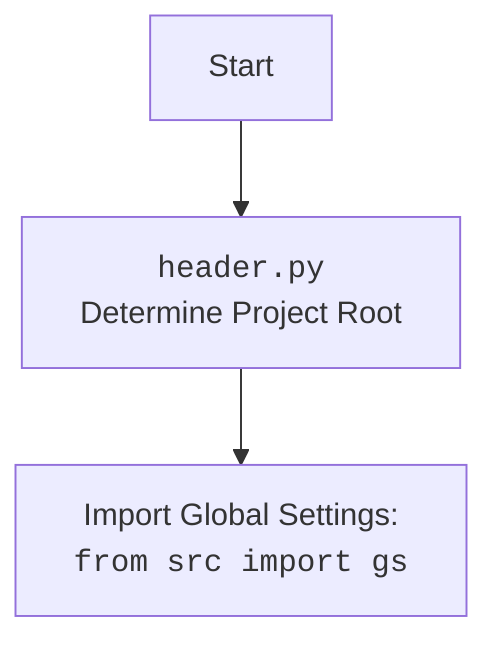

## Анализ кода `pdf2html.py`

### 1. `<алгоритм>`:

**Блок-схема:**

```mermaid
graph LR
    A[Начало] --> B(Импорт модулей: header, gs, PDFUtils);
    B --> C{Определение pdf2html(pdf_file, html_file)};
    C --> D(Вызов PDFUtils.pdf_to_html(pdf_file, html_file));
    D --> E(Определение путей к PDF и HTML файлам);
        E --> F(Вызов pdf2html(pdf_file, html_file));
    F --> G[Конец];
    
    style B fill:#f9f,stroke:#333,stroke-width:2px
    style C fill:#ccf,stroke:#333,stroke-width:2px
    style D fill:#ccf,stroke:#333,stroke-width:2px
    style E fill:#aaf,stroke:#333,stroke-width:2px
    style F fill:#ccf,stroke:#333,stroke-width:2px
    
    
```
**Примеры:**

- **Импорт модулей:**
  -  `import header`:  Импортирует модуль `header.py` для определения корневой директории проекта.
  -  `from src import gs`: Импортирует глобальные настройки проекта из `src.gs`.
  - `from src.utils.pdf import PDFUtils`: Импортирует утилиты для работы с PDF из `src.utils.pdf.PDFUtils`.
- **Определение `pdf2html`:**
  - Функция `pdf2html` принимает пути к PDF и HTML файлам.
  - Вызывает метод `pdf_to_html` из класса `PDFUtils` для конвертации PDF в HTML.
- **Определение путей к файлам:**
  - `pdf_file`: Определяет путь к исходному PDF файлу, используя глобальные настройки (`gs.path.root`).
  - `html_file`: Определяет путь к выходному HTML файлу, используя глобальные настройки (`gs.path.root`).
- **Вызов `pdf2html`:**
  - Вызов функции `pdf2html` с указанными путями к PDF и HTML файлам.

### 2. `<mermaid>`:

```mermaid
flowchart TD
    Start --> ImportModules[Импорт модулей:<br><code>import header</code><br><code>from src import gs</code><br><code>from src.utils.pdf import PDFUtils</code>]
    ImportModules --> DefinePdf2Html[Определение функции:<br><code>def pdf2html(pdf_file, html_file)</code>]
    DefinePdf2Html --> CallPDFUtils[Вызов функции:<br><code>PDFUtils.pdf_to_html(pdf_file, html_file)</code>]
    CallPDFUtils --> DefineFilePaths[Определение путей к PDF и HTML:<br><code>pdf_file = gs.path.root / ...</code><br><code>html_file = gs.path.root / ...</code>]
    DefineFilePaths --> CallPdf2HtmlWithPaths[Вызов функции:<br><code>pdf2html(pdf_file, html_file)</code>]
    CallPdf2HtmlWithPaths --> End[Конец]
    
    style ImportModules fill:#f9f,stroke:#333,stroke-width:2px
    style DefinePdf2Html fill:#ccf,stroke:#333,stroke-width:2px
    style CallPDFUtils fill:#ccf,stroke:#333,stroke-width:2px
    style DefineFilePaths fill:#aaf,stroke:#333,stroke-width:2px
    style CallPdf2HtmlWithPaths fill:#ccf,stroke:#333,stroke-width:2px
    
```



**Объяснение зависимостей `mermaid`:**

- **`import header`**: Импортируется для получения доступа к функциональности `header.py`, которая, вероятно, отвечает за определение корневого каталога проекта.
- **`from src import gs`**: Импортируется для доступа к глобальным настройкам проекта, включая корневой путь, что позволяет получать доступ к файлам проекта.
- **`from src.utils.pdf import PDFUtils`**: Импортирует класс `PDFUtils` для преобразования PDF в HTML.
- **Остальное**: Описывает логику работы функции `pdf2html` и последовательность действий.

### 3. `<объяснение>`:

**Импорты:**

- **`import header`**: Этот импорт используется для определения корневой директории проекта. `header.py` вероятно содержит логику для определения корня проекта на основе расположения файла или других факторов. Обычно это используется для обеспечения переносимости и корректной работы кода независимо от среды выполнения.
- **`from src import gs`**: Импортирует объект `gs` из пакета `src`, который, вероятно, содержит глобальные настройки проекта, например, пути к директориям, переменные окружения и т.д.
- **`from src.utils.pdf import PDFUtils`**: Импортирует класс `PDFUtils` из пакета `src.utils.pdf`. Этот класс предоставляет функциональность для работы с PDF файлами, включая конвертацию PDF в HTML.

**Функции:**

- **`pdf2html(pdf_file, html_file)`**:
    - **Аргументы:**
        - `pdf_file` (str): Путь к исходному PDF файлу.
        - `html_file` (str): Путь к выходному HTML файлу.
    - **Возвращаемое значение:** Ничего не возвращает (None).
    - **Назначение:** Эта функция является основной точкой входа для конвертации PDF в HTML. Она принимает пути к файлам и делегирует фактическую конвертацию классу `PDFUtils`.
    - **Пример:**
       ```python
        pdf2html("/path/to/input.pdf", "/path/to/output.html")
       ```

**Переменные:**

- **`pdf_file`**: Тип `Path` (скорее всего, `pathlib.Path`). Хранит путь к PDF файлу, который нужно сконвертировать. Путь формируется на основе корневого каталога проекта, определенного в `gs.path.root`, и конкатенации с относительными путями `'assets' / 'materials' / '101_BASIC_Computer_Games_Mar75.pdf'`.
- **`html_file`**: Тип `Path` (скорее всего, `pathlib.Path`). Хранит путь к HTML файлу, который будет создан в результате конвертации. Путь формируется аналогично `pdf_file`, но с расширением `.html`.

**Объяснение:**

Файл `pdf2html.py` предназначен для конвертации PDF файлов в HTML. Он использует модуль `header` для определения корневой директории проекта, объект `gs` для доступа к глобальным настройкам, и класс `PDFUtils` для конвертации. Функция `pdf2html` выполняет конвертацию, а пути к файлам определены с использованием глобальных настроек, что делает код переносимым и гибким.

**Взаимосвязь с другими частями проекта:**

- **`header.py`**: Используется для определения корневой директории проекта, что является важным для правильной работы с файловой системой.
- **`src/gs.py`**: Предоставляет глобальные настройки, включая корневой путь, что делает код переносимым и позволяет легко изменять пути к файлам.
- **`src/utils/pdf/PDFUtils.py`**: Предоставляет функциональность конвертации PDF в HTML. Код полагается на этот класс для выполнения основной задачи.

**Потенциальные ошибки или области для улучшения:**

- **Обработка исключений**: Отсутствует явная обработка исключений. Если процесс конвертации PDF в HTML завершится с ошибкой, то не будет предпринято никаких действий по обработке ошибок. Необходимо добавить обработку исключений, чтобы корректно обрабатывать ошибки и логировать их.
- **Конфигурация путей**: Пути к файлам жестко заданы в коде. Было бы лучше сделать их более гибкими, позволяя, например, передавать пути как аргументы командной строки или через файл конфигурации.
- **Универсальность**: В текущей реализации предполагается, что имя выходного html файла совпадает с именем pdf файла. Может возникнуть задача, когда нужно изменять название выходного файла.

В целом код выполняет свою задачу, но может быть улучшен с точки зрения обработки ошибок, гибкости и универсальности.