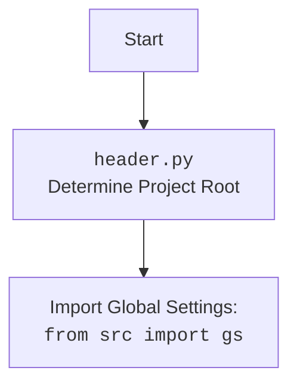

## АНАЛИЗ КОДА: `code_assistant`

### <алгоритм>

1. **Инициализация**:
   - Программа запускается с параметрами командной строки или настройками из JSON-файла.
   - Определяются:
     - `role` (роль, например, "doc_writer", "code_checker"), определяющая промпт.
     - `lang` (язык, например, "ru", "en"), определяющий язык промпта и выходных данных.
     - `models` (список моделей, например, "gemini", "openai"), которые будут использоваться.
     - `start_dirs` (список начальных директорий для обработки).
     - `exclude_file_patterns`, `exclude_dirs`, `exclude_files` для исключения.
2. **Поиск файлов**:
   - Рекурсивно обходятся `start_dirs`.
   - Ищутся файлы с расширениями `.py` и `README.MD`, исключая файлы и директории, соответствующие `exclude_file_patterns`, `exclude_dirs`, и `exclude_files`.
3. **Загрузка промптов**:
   - Из директории `src/ai/prompts/developer/` загружается промпт, соответствующий `role` и `lang`. 
   - Пример: для `role="doc_writer"` и `lang="ru"` загружается `doc_writer_ru.md`.
4. **Обработка файлов**:
   - Для каждого найденного файла:
     - Содержимое файла читается и используется для формирования запроса.
     - Запрос отправляется в каждую указанную модель из списка `models`.
       - Пример:
           - Если `models` содержит `gemini` и `openai`, то запрос отправляется сначала в Gemini, потом в OpenAI.
5. **Получение ответов**:
   - Модели возвращают ответы на запросы.
6. **Сохранение ответов**:
   - Ответы от каждой модели сохраняются в отдельную директорию, определенную ролю и моделью.
     - Пример: `docs/raw_rst_from_gemini/ru/` для `role="doc_writer"`, `lang="ru"` и модели `gemini`.
7. **Логирование**:
   - Вся важная информация о процессе, включая прочитанные файлы, отправленные запросы, полученные ответы и исключения, логируется.
8. **Завершение**:
   - Программа завершается.

### <mermaid>

```mermaid
flowchart TD
    Start --> Initialize[Инициализация параметров\n(из командной строки или JSON)]
    Initialize --> FindFiles[Поиск файлов\n(.py и README.MD)]
    FindFiles --> LoadPrompt[Загрузка промпта\n(соответствующего роли и языку)]
    LoadPrompt --> ProcessFiles{Для каждого файла}
    ProcessFiles -- Да --> ReadFile[Чтение файла]
    ReadFile --> CreateRequest[Формирование запроса]
    CreateRequest --> SendToModels{Для каждой модели}
    SendToModels -- Да --> SendRequest[Отправка запроса]
     SendRequest --> GetResponse[Получение ответа от модели]
    GetResponse --> SaveResponse[Сохранение ответа в файл]
    SaveResponse --> LogData[Логирование]
     LogData --> SendToModels
    SendToModels -- Нет --> ProcessFiles
    ProcessFiles -- Нет --> End
     
    classDef file fill:#f9f,stroke:#333,stroke-width:2px
   
    class FindFiles, ReadFile file;
    class LoadPrompt, CreateRequest, SendRequest, GetResponse, SaveResponse, LogData file;
   
    
   
    
```



### <объяснение>

#### Импорты:

Модуль `code_assistant` является частью проекта `hypo69`. Он не содержит явных `import` в предоставленной документации, так как это README, а не исходный код. Однако, согласно описанию, он использует:

-   **Gemini API**: Для взаимодействия с моделью Gemini. Это подразумевает импорт пакета, предоставляемого Google для доступа к Gemini API.
-   **OpenAI API**: Для взаимодействия с моделью OpenAI. Это подразумевает импорт пакета, предоставляемого OpenAI для доступа к их API.
-   **Библиотеку `logger`**: Для ведения логов работы программы, которая может быть частью проекта `hypo69`.
-   `src.gs`: Модуль глобальных настроек в проекте `hypo69`, который скорее всего содержит настройки проекта, ключи API и пути к файлам.

#### Классы:

В предоставленном описании нет явного упоминания о классах. Скорее всего, основной функционал реализован с помощью функций, а не классов. Если бы использовались классы, то они могли бы включать:

-   **Модели ИИ**: Классы, инкапсулирующие взаимодействие с API Gemini и OpenAI, например, `GeminiClient` и `OpenAIClient`.
-   **Обработчики файлов**: Классы для чтения, фильтрации и обработки файлов.
-   **Логгер**: Возможно, класс для централизованного управления логированием.

#### Функции:

Основываясь на описании, можно предположить наличие следующих функций:

-   `main()` или подобная функция, которая является точкой входа и управляет всем процессом.
-   `find_files(start_dirs, exclude_patterns, exclude_dirs, exclude_files)`: Находит все соответствующие файлы в заданных директориях, исключая указанные.
-   `load_prompt(role, lang)`: Загружает промпт из файла на основе роли и языка.
-   `process_file(file_path, prompt, models)`: Читает файл, формирует запрос и отправляет его в каждую модель, сохраняя ответы.
-   `send_request_to_model(model, request)`: Отправляет запрос в указанную модель и возвращает ответ.
-   `save_response(response, role, model, lang, file_path)`: Сохраняет ответ в файл.
-   `load_settings(settings_path)`: Загружает настройки из JSON-файла.
-   `parse_command_line_arguments()`: Парсит аргументы командной строки.
-   `setup_logging()`: Настраивает логирование.

#### Переменные:

-   `role`: Строка, определяющая роль модели (например, "doc_writer").
-   `lang`: Строка, определяющая язык (например, "ru").
-   `models`: Список строк, определяющих используемые модели (например, ["gemini", "openai"]).
-   `start_dirs`: Список строк, определяющих директории для обработки.
-   `exclude_file_patterns`: Список строк, содержащих регулярные выражения для исключения файлов.
-   `exclude_dirs`: Список строк, определяющих директории для исключения.
-   `exclude_files`: Список строк, определяющих файлы для исключения.
-   `settings`: Словарь с настройками из JSON.
-   `prompt`: Строка, содержащая промпт, загруженный из файла.
-   `file_path`: Строка, путь к обрабатываемому файлу.
-   `response`: Строка, содержащая ответ от модели.

#### Потенциальные ошибки и улучшения:

-   **Отсутствие обработки ошибок API**: Не хватает обработки ошибок, которые могут возникать при взаимодействии с Gemini и OpenAI API.
-   **Асинхронность**: В коде может отсутствовать асинхронное выполнение для одновременной обработки нескольких запросов.
-   **Недостаточная модульность**: Функционал можно разбить на более мелкие и переиспользуемые модули.
-   **Отсутствие обработки исключений**: Не все исключения могут обрабатываться, что может привести к сбоям.
-   **Управление токенами API**: Не хватает гибкости в управлении токенами API.

#### Цепочка взаимосвязей с другими частями проекта:

-   **`src/ai/prompts/developer/`**: Зависимость от этой директории для загрузки промптов.
-   **`src.gs`**: Зависимость от глобальных настроек для путей к файлам и ключей API.
-   **`src/endpoints/hypo69/`**: Модуль `code_assistant` является частью этого пакета.
-   **`logger`**: Зависимость от библиотеки для ведения логов.
-  **`translations/translations.json`**: Зависимость от файла переводов для названий ролей.
-  **`instructions/`**: Зависимость от директории с инструкциями команд.
-  **`code_assistant.json`**: Зависимость от файла конфигурации, который определяет используемые роли.

Этот анализ обеспечивает подробное описание функциональности модуля `code_assistant`, его архитектуры и взаимодействия с другими компонентами проекта.