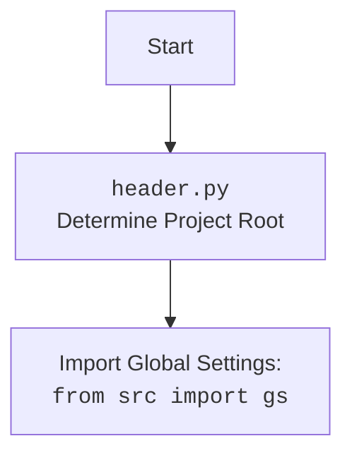

## Алгоритм

1.  **Инициализация:**
    *   Импортируются необходимые библиотеки: `sys`, `pathlib`, `fastapi`, `pydantic`, `uvicorn`, `json`, `header`, `src.gs`, `src.logger`, `src.ai.GoogleGenerativeAI`.
    *   Настраиваются базовые пути: `base_path`, `templates_path`, `locales_path`, основываясь на глобальных настройках `gs`.
    *   Создается экземпляр FastAPI `app`.
    *   Конфигурируется `CORSMiddleware` для разрешения кросс-доменных запросов.
    *   Создается `ChatRequest` класс Pydantic для валидации запросов чата.
    *   Инициализируются глобальные переменные: `model` (экземпляр GoogleGenerativeAI), `api_key`, `system_instruction`.
    *   Монтируется `/templates` для статических файлов.
2.  **Обработка корневого пути `/`:**
    *   При получении GET-запроса к `/` функция `root` пытается прочитать файл `index.html` из `templates_path`.
    *   Если файл найден, его содержимое возвращается как HTMLResponse.
    *   Если файл не найден или возникает ошибка при чтении, регистрируется ошибка в логере и возвращается HTTP-ошибка 500.
3.  **Обработка пути `/api/chat`:**
    *   При получении POST-запроса к `/api/chat` функция `chat` принимает `ChatRequest`.
    *   Если `model` не инициализирован, то создается экземпляр `GoogleGenerativeAI` с использованием `api_key` и `gemini-2.0-flash-exp`.
    *   Затем вызывается метод `chat` у модели для получения ответа.
    *   Возвращается JSON с ключом "response".
    *   Если происходит ошибка, регистрируется ошибка в логере и возвращается HTTP-ошибка 500.
4.  **Обработка пути `/locales/{lang}.json`:**
    *   При получении GET-запроса к `/locales/{lang}.json` функция `locales` принимает языковой параметр `lang`.
    *   Вызывается `get_locale_file` для чтения файла перевода.
5.  **Функция `get_locale_file`:**
    *   Принимает `lang` как аргумент.
    *   Формирует путь к файлу локали из `locales_path`.
    *   Пытается открыть и прочитать файл, возвращая JSON.
    *   Обрабатывает ошибки:
        *   `FileNotFoundError`:  HTTP-ошибка 404 с сообщением "Locale not found".
        *   `json.JSONDecodeError`: HTTP-ошибка 500 с сообщением "Invalid locale file".
        *   Другие ошибки: HTTP-ошибка 500 с сообщением "Error reading locales".
6. **Запуск сервера:**
    *   Если скрипт выполняется напрямую (`if __name__ == "__main__":`), запускается Uvicorn-сервер на хосте `127.0.0.1` и порту `8000`.

## mermaid

```mermaid
flowchart TD
    Start --> Setup[Setup: Import libraries and configure paths]
    Setup --> AppInit[App Initialization: FastAPI, CORS]
    AppInit --> ChatModelInit[Chat Model Initialization: `GoogleGenerativeAI` ]
    ChatModelInit --> MountStatic[Mount static files]
    MountStatic --> RootRoute[Root Route: GET /]
    RootRoute --> ChatRoute[Chat Route: POST /api/chat]
    ChatRoute --> LocalesRoute[Locales Route: GET /locales/{lang}.json]
    LocalesRoute --> GetLocaleFile[Get Locale File: function get_locale_file(lang: str)]
    GetLocaleFile --> ServerStart[Server Start: uvicorn.run()]

    style Start fill:#f9f,stroke:#333,stroke-width:2px
    style ServerStart fill:#ccf,stroke:#333,stroke-width:2px

    
    classDef fileStyle fill:#f0f0f0,stroke:#333,stroke-width:1px
    class Setup, AppInit, ChatModelInit, MountStatic, RootRoute, ChatRoute, LocalesRoute,GetLocaleFile fileStyle
    
     classDef funcStyle fill:#fff,stroke:#333,stroke-width:1px
    class  RootRoute, ChatRoute, LocalesRoute,GetLocaleFile funcStyle
    
    
     classDef routeStyle fill:#eee,stroke:#333,stroke-width:1px
    class  RootRoute, ChatRoute, LocalesRoute routeStyle
```



### Объяснение `mermaid`

*   **flowchart TD**: Задает тип диаграммы как блок-схему и направление сверху вниз.
*   **Start**: Начало процесса.
*   **Setup**: Блок, представляющий инициализацию: импорт библиотек и настройку путей к файлам.
*  **AppInit**: Блок, представляющий инициализацию FastAPI приложения и CORS.
*   **ChatModelInit**:  Блок, представляющий инициализацию модели чата `GoogleGenerativeAI`.
*  **MountStatic**: Блок, представляющий монтирование статических файлов.
*   **RootRoute**: Блок, представляющий обработку корневого пути `/` и вызов функции `root`.
*   **ChatRoute**: Блок, представляющий обработку пути `/api/chat` и вызов функции `chat`.
*   **LocalesRoute**: Блок, представляющий обработку пути `/locales/{lang}.json` и вызов функции `locales`.
*   **GetLocaleFile**: Блок, представляющий вызов функции `get_locale_file` для чтения файлов локализации.
*   **ServerStart**: Блок, представляющий запуск сервера `uvicorn`.
*   **style**: Определяет стили для блоков для лучшей визуализации: `Start`, `ServerStart`.
*  **classDef**: Задает классы стилей, которые применяются к блокам: `fileStyle`, `funcStyle`, `routeStyle`.

#### Объяснение `mermaid` для `header.py`

*   **Start**: Начало процесса определения корневой директории.
*   **Header**: Описывает основной процесс в `header.py` - определение корневой директории проекта.
*   **import**: Блок, показывающий, что `header.py` импортирует глобальные настройки из `src` через `from src import gs`.

## Объяснение

### Импорты

*   `from __future__ import annotations`: Позволяет использовать аннотации типов, включая отложенную оценку аннотаций, что улучшает читаемость и упрощает работу с типами данных.
*   `sys`: Предоставляет доступ к некоторым переменным и функциям, используемым или поддерживаемым интерпретатором.
*   `pathlib.Path`:  Класс для работы с путями к файлам и каталогам в кроссплатформенном режиме.
*   `types.SimpleNamespace`: Простой класс для создания объекта с атрибутами (в данном случае для глобальных настроек).
*   `fastapi.middleware.cors.CORSMiddleware`:  Middleware для обработки CORS (Cross-Origin Resource Sharing) запросов, позволяя браузерам делать запросы к API с разных доменов.
*   `fastapi.FastAPI`:  Основной класс для создания веб-приложения FastAPI.
*   `fastapi.HTTPException`:  Класс для создания исключений HTTP с определенными кодами состояния и деталями.
*   `fastapi.responses.HTMLResponse`: Класс для возврата HTML контента как ответа на запрос.
*  `fastapi.staticfiles.StaticFiles`: Класс для обслуживания статических файлов.
*   `pydantic.BaseModel`: Базовый класс Pydantic для валидации и сериализации данных.
*   `uvicorn`:  ASGI-сервер для запуска FastAPI-приложений.
*   `json`:  Библиотека для работы с JSON-данными.
*   `header`: Модуль, который определяет корень проекта.
*   `src.gs`: Модуль с глобальными настройками приложения, включая пути к директориям, ключи API и прочее.
*   `src.logger`:  Модуль для логирования событий, используется для отслеживания ошибок и информационных сообщений.
*   `src.ai.GoogleGenerativeAI`:  Класс для работы с моделью Google Gemini AI.

### Классы

*   `ChatRequest(BaseModel)`: Pydantic модель, определяющая структуру запроса к API чата.
    *   `message: str`: Обязательное текстовое сообщение пользователя.

### Функции

*   `root()`:
    *   Обрабатывает GET-запросы к корню `/`.
    *   Пытается прочитать файл `index.html` из директории `templates`.
    *   Возвращает HTML-контент в ответе, если файл найден.
    *   Вызывает исключение `HTTPException` при ошибках (файл не найден, ошибка чтения).
*   `chat(request: ChatRequest)`:
    *   Обрабатывает POST-запросы к `/api/chat`.
    *   Принимает запрос типа `ChatRequest`.
    *   Инициализирует `GoogleGenerativeAI` модель, если она ещё не инициализирована.
    *   Вызывает метод `chat` у модели, передавая текст сообщения от пользователя.
    *   Возвращает JSON-ответ с ключом "response" и ответом от модели.
    *   Вызывает исключение `HTTPException` при ошибках.
*   `get_locale_file(lang: str)`:
    *   Принимает код языка `lang` в виде строки.
    *   Формирует путь к файлу локализации.
    *   Пытается прочитать JSON из файла и возвратить его.
    *   Вызывает исключение `HTTPException` при ошибках (файл не найден, невалидный JSON).
*   `locales(lang: str)`:
    *   Обрабатывает GET-запросы к `/locales/{lang}.json`.
    *   Принимает код языка `lang` из URL-параметра.
    *   Вызывает `get_locale_file`, чтобы получить файл локализации.
    *   Возвращает JSON-ответ с данными локализации.

### Переменные

*   `base_path`: Путь к директории `desktop_assistant` внутри `hypo69`.
*   `templates_path`: Путь к директории с HTML-шаблонами.
*   `locales_path`:  Путь к директории с файлами локализации.
*   `app`: Экземпляр `FastAPI`, используемый для создания API.
*   `model`:  Экземпляр `GoogleGenerativeAI`, который используется для общения с AI-моделью, изначально равен `None`.
*   `api_key`: Ключ API для доступа к Google Gemini.
*   `system_instruction`: Строка с системной инструкцией для AI-модели.

### Потенциальные ошибки и улучшения

1.  **Обработка ошибок**: В функциях `root`, `chat`, `get_locale_file` ошибки логируются и возвращаются как `HTTPException`, что хорошо, но можно добавить более детальное логирование и обработку конкретных типов ошибок (например, сетевых ошибок при обращении к AI-модели).
2.  **Конфигурация модели**: Сейчас модель `gemini-2.0-flash-exp` жестко задана в коде. Можно вынести ее в конфигурационный файл или переменные окружения, чтобы можно было легко ее менять.
3.  **Инициализация модели**: Модель `GoogleGenerativeAI` инициализируется каждый раз при первом запросе к `/api/chat`. Возможно имеет смысл инициализировать модель при старте приложения, чтобы не тратить время на инициализацию при каждом первом запросе.
4.  **Безопасность**: `api_key` хранится в `gs.credentials`, что может быть не самым безопасным способом хранения чувствительных данных. Лучше использовать переменные окружения или менеджер секретов.
5.  **Локализация**: Вызывается функция get\_locale\_file, которая является частью пути, и в случае ошибки вылетает `HTTPException`, что не совсем корректно для локализации.
6. **CORS**: Разрешены все origins ("\*"). В боевом приложении это может быть небезопасным, рекомендуется указать конкретные разрешенные origins.
7. **Глобальные переменные**: Использование глобальной переменной `model` не всегда является лучшей практикой, особенно в многопоточном окружении. Лучше использовать dependency injection.

### Взаимосвязь с другими частями проекта

*   **`header.py`**: Определяет корневую директорию проекта, что используется для настройки путей.
*   **`src.gs`**: Содержит глобальные настройки, включая пути к файлам, API-ключи и другие параметры, необходимые для работы приложения.
*   **`src.logger`**: Предоставляет интерфейс для логирования событий, которые возникают в процессе работы приложения, что позволяет отслеживать ошибки и дебажить приложение.
*   **`src.ai.GoogleGenerativeAI`**: Реализует интерфейс для взаимодействия с моделью Google Gemini AI.

В целом, код представляет собой RESTful API, которое предоставляет интерфейс для общения с AI-моделью, возвращает статические файлы (HTML, CSS, JavaScript), и обрабатывает файлы локализации.