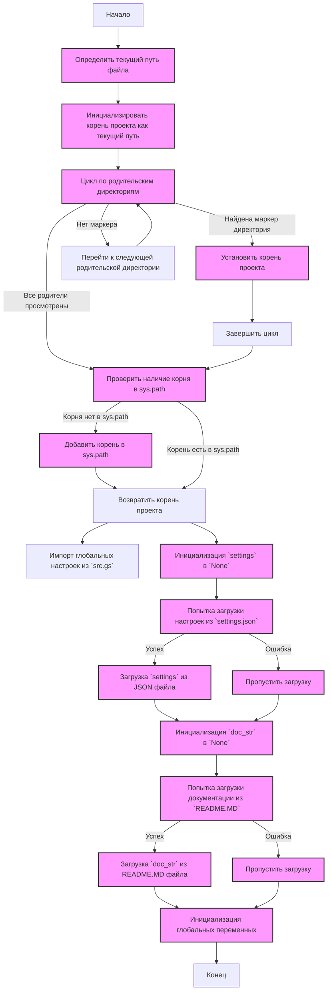
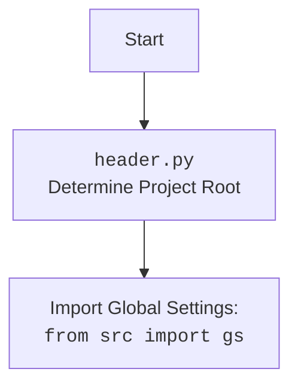

## АНАЛИЗ КОДА `hypotez/src/endpoints/hypo69/header.py`

### <алгоритм>

1.  **Определение корневой директории проекта (`set_project_root`)**:
    *   Начинаем с директории, в которой находится текущий файл (`__file__`).
    *   Итерируемся вверх по дереву директорий, от текущей до родительских.
    *   На каждой итерации проверяем, существует ли в текущей директории хотя бы один из файлов-маркеров (например, `__root__` или `.git`).
    *   Если маркер найден, считаем текущую директорию корневой и выходим из цикла.
        *   *Пример:* Если `__file__` находится в `hypotez/src/endpoints/hypo69/header.py`, и в `hypotez` есть файл `__root__`, то `hypotez` будет корневой директорией.
    *   Добавляем корневую директорию в `sys.path`, если ее там нет, для возможности импорта модулей из корневой директории.
        *   *Пример:* Если корень - `/home/user/hypotez`, то `/home/user/hypotez` будет добавлено в `sys.path`.
    *   Возвращаем путь к корневой директории (`Path` объект).
        *   *Пример:* `/home/user/hypotez`.
2.  **Инициализация `__root__`**:
    *   Вызываем `set_project_root()` для получения корневой директории и сохраняем ее в переменной `__root__`.
        *   *Пример:* `__root__` = `/home/user/hypotez`
3. **Импорт `src.gs`**:
    *  Импортируем модуль `gs` из пакета `src`. Этот модуль, вероятно, содержит глобальные настройки или константы проекта.
        * *Пример*: `from src import gs`
4.  **Загрузка настроек из `settings.json`**:
    *   Инициализируем переменную `settings` как `None`.
    *   Пытаемся открыть и прочитать файл `settings.json` по пути `gs.path.root / 'src' / 'settings.json'`.
        *   *Пример:* Если `gs.path.root` это `/home/user/hypotez`, то путь будет `/home/user/hypotez/src/settings.json`
    *   Если файл успешно открыт, загружаем JSON-содержимое в переменную `settings`.
        *   *Пример:* `settings = {"project_name": "hypotez", "version": "1.0", ...}`.
    *   Если возникает ошибка `FileNotFoundError` или `json.JSONDecodeError`, пропускаем блок `try`, оставляя `settings` как `None`.
5.  **Загрузка документации из `README.MD`**:
    *   Инициализируем переменную `doc_str` как `None`.
    *   Пытаемся открыть и прочитать файл `README.MD` по пути `gs.path.root / 'src' / 'README.MD'`.
         *  *Пример:* Если `gs.path.root` это `/home/user/hypotez`, то путь будет `/home/user/hypotez/src/README.MD`
    *   Если файл успешно открыт, читаем содержимое файла в переменную `doc_str`.
         * *Пример*: `doc_str = "# Project Title\n...\n"`
    *   Если возникает ошибка `FileNotFoundError` или `json.JSONDecodeError`, пропускаем блок `try`, оставляя `doc_str` как `None`.
6.  **Инициализация глобальных переменных**:
    *   Извлекаем значения из `settings` (если он не `None`) или задаем значения по умолчанию:
        *   `__project_name__` из `settings.get("project_name", 'hypotez')` (по умолчанию 'hypotez').
            *   *Пример:* если `settings = {"project_name": "MyProject"}`, то `__project_name__ = "MyProject"`.
        *   `__version__` из `settings.get("version", '')` (по умолчанию '').
             *   *Пример:* если `settings = {"version": "1.2"}`, то `__version__ = "1.2"`.
        *    `__doc__` из `doc_str` (если `doc_str` не `None`).
        *   `__details__` инициализируется как пустая строка.
        *   `__author__` из `settings.get("author", '')` (по умолчанию '').
             *   *Пример:* если `settings = {"author": "John Doe"}`, то `__author__ = "John Doe"`.
        *   `__copyright__` из `settings.get("copyrihgnt", '')` (по умолчанию '').
        *   `__cofee__` из `settings.get("cofee", "...")` (по умолчанию длинная строка с ссылкой).

### <mermaid>

### <объяснение>

1.  **Импорты:**
    *   `import sys`:  Используется для работы с системными переменными и функциями, в частности `sys.path` для добавления пути к корневой директории проекта.
    *   `from pathlib import Path`:  Используется для работы с путями к файлам и директориям, обеспечивает кроссплатформенность.
    *   `from src import gs`: Импортирует модуль `gs` из пакета `src`. `gs`, вероятно, содержит глобальные настройки и константы проекта, включая путь к корневой директории (`gs.path.root`).

2.  **Функция `set_project_root`**:
    *   **Аргументы**:
        *   `marker_files` (tuple, по умолчанию `('__root__', '.git')`): Кортеж с именами файлов или каталогов, которые указывают на корневую директорию проекта.
    *   **Возвращаемое значение**: `Path` объект, представляющий путь к корневой директории проекта.
    *   **Назначение**: Определяет корневую директорию проекта путем поиска файлов-маркеров вверх по дереву каталогов от текущего файла.
    *   **Пример**: Если скрипт расположен в `/home/user/project/src/endpoints/hypo69/header.py`, а файл `.git` находится в `/home/user/project`, то функция вернет `Path('/home/user/project')`.

3.  **Глобальные переменные**:
    *   `__root__`: `Path` объект, хранит путь к корневой директории проекта. Инициализируется с помощью `set_project_root()`.
    *   `settings`: `dict` или `None`. Содержит настройки проекта, загруженные из файла `settings.json`. Если файл не найден или не валиден, значение `None`.
    *   `doc_str`: `str` или `None`. Содержит документацию, загруженную из файла `README.MD`. Если файл не найден или не валиден, значение `None`.
    *   `__project_name__`: `str`, имя проекта, полученное из `settings` или по умолчанию 'hypotez'.
    *   `__version__`: `str`, версия проекта, полученная из `settings` или пустая строка.
    *   `__doc__`: `str`, документация, полученная из `doc_str` или пустая строка.
    *   `__details__`: `str`, детали проекта, инициализируется как пустая строка.
    *   `__author__`: `str`, автор проекта, полученный из `settings` или пустая строка.
    *   `__copyright__`: `str`, авторские права, полученные из `settings` или пустая строка.
    *  `__cofee__`: `str`, сообщение с ссылкой на "кофе для разработчика", полученное из `settings` или по умолчанию с ссылкой на boosty.

4.  **`try-except` блоки**:
    *   Используются для обработки ошибок при чтении файлов `settings.json` и `README.MD`.
    *   Если файлы не найдены или не могут быть разобраны как JSON, переменные `settings` и `doc_str` остаются `None` и используются значения по умолчанию.

5. **Взаимосвязи с другими частями проекта**:
    *   Этот модуль зависит от модуля `src.gs` для доступа к глобальным настройкам, которые могут содержать путь к корневой директории.
    *   Использует `settings.json` для хранения информации о проекте (имя, версия, автор и т.д.)
    *  Использует `README.MD` для загрузки документации.

**Потенциальные ошибки и области для улучшения:**

*   **Обработка ошибок**: В `try-except` блоках используется многоточие `...`, что не является хорошей практикой. Желательно добавить логирование или более детальную обработку ошибок.
*   **Обработка `settings == None`**: Код многократно проверяет `if settings else` для установки значений по умолчанию. Возможно, имеет смысл создать отдельную функцию для этого, для переиспользования.
*   **Жёсткие пути**: Жестко прописаны пути `'src/settings.json'` и `'src/README.MD'`. Имеет смысл вынести их в конфигурацию.
*   **Неоднозначность root маркеров**. Использование `__root__` может конфликтовать с переменными, созданными пользователем.

**Цепочка взаимосвязей**:
`header.py` -> `src.gs` -> `settings.json` и `README.MD` -> другие модули, использующие глобальные переменные (например, `__project_name__`, `__version__`, etc.).