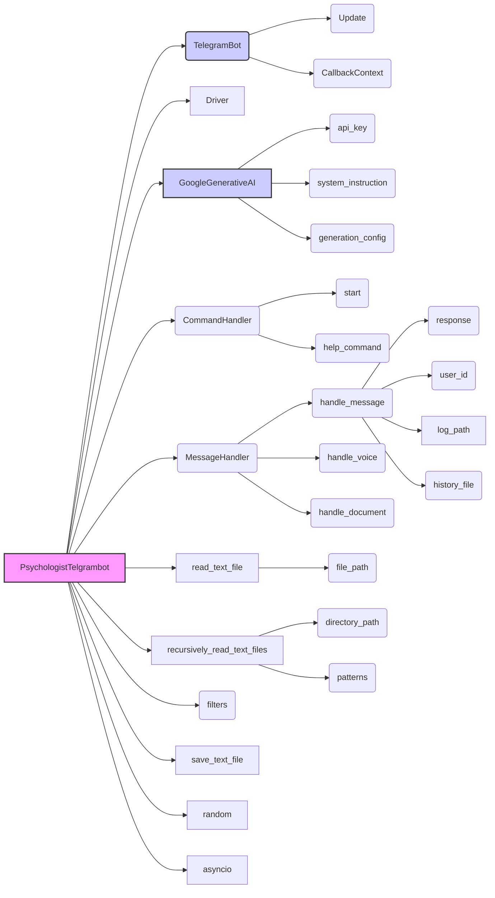

## <алгоритм>

1.  **Инициализация бота:**
    *   Создается экземпляр класса `PsychologistTelgrambot`.
    *   Инициализируется токен бота из `gs.credentials.telegram.hypo69_psychologist_bot`.
    *   Создается экземпляр драйвера браузера (`Driver` с `Chrome`).
    *   Загружается системная инструкция из файла `chat_system_instruction.txt`.
        *   Пример пути: `gs.path.google_drive/hypo69_psychologist_bot/prompts/chat_system_instruction.txt`.
    *   Загружается список вопросов из директории `train_data/q`.
        *   Пример пути: `gs.path.google_drive/hypo69_psychologist_bot/prompts/train_data/q`.
    *   Создается экземпляр `GoogleGenerativeAI` с API ключом, системной инструкцией и конфигурацией.
    *   Регистрируются обработчики команд и сообщений.

2.  **Регистрация обработчиков:**
    *   `start`: Обработчик команды `/start`.
    *   `help`: Обработчик команды `/help`.
    *   `handle_message`: Обработчик текстовых сообщений (не команд).
    *   `handle_voice`: Обработчик голосовых сообщений.
    *   `handle_document`: Обработчик загруженных документов.

3.  **Обработка команды `/start`:**
    *   Бот отправляет приветственное сообщение "Hi! I am a smart assistant psychologist.".

4.  **Обработка текстовых сообщений (`handle_message`):**
    *   Получает текст сообщения от пользователя.
    *   Получает ID пользователя.
    *   Сохраняет сообщение в лог файл с именем `chat_logs.txt` в директории `gs.path.google_drive/bots/<user_id>`.
        *   Пример: Сообщение "Привет!" от пользователя с ID `12345` сохранится как "User 12345: Привет!\n".
    *   Отправляет сообщение в `GoogleGenerativeAI` для получения ответа.
        *   История чата сохраняется в файле `<user_id>.txt`.
    *   Отправляет ответ пользователю.

5.  **Обработка URL (`handle_message`):**
    *   Определяет обработчик для URL, если URL присутствует в сообщении.
        *   Обработчик `handle_suppliers_response` если url начинается с `https://morlevi.co.il`, `https://www.morlevi.co.il`, `https://grandadvance.co.il`, `https://www.grandadvance.co.il`, `https://ksp.co.il`, `https://www.ksp.co.il`, `https://ivory.co.il`, `https://www.ivory.co.il`.
        *   Обработчик `handle_onetab_response` если url начинается с `https://www.one-tab.com`.
    *   Если URL не найден, то сообщение обрабатывается как обычное текстовое сообщение.

6.  **Обработка команд (`handle_next_command`):**
    *   Выбирается случайный вопрос из `questions_list`.
    *   Отправляет вопрос в `GoogleGenerativeAI` для получения ответа.
    *   Отправляет вопрос и ответ пользователю.
    *   В случае ошибки логирует ошибку.

7.  **Обработка документов (`handle_document`):**
    *   Получает содержимое файла.
    *   Отправляет сообщение пользователю, включая содержимое файла.

8.  **Запуск бота:**
    *   Создается экземпляр `PsychologistTelgrambot`.
    *   Запускается `application.run_polling()`, который начинает прослушивать обновления Telegram.

## <mermaid>

**Зависимости:**

*   `PsychologistTelgrambot`:
    *   Наследуется от `TelegramBot` для основных функций бота.
    *   Использует `Driver` для управления браузером (вероятно, для веб-скрапинга).
    *   Использует `GoogleGenerativeAI` для обработки запросов и генерации ответов.
    *   Использует `read_text_file` и `recursively_read_text_files` для чтения текстовых данных.
    *   Использует `CommandHandler` и `MessageHandler` из `telegram.ext` для обработки команд и сообщений.
    *   Использует `filters` из `telegram.ext` для фильтрации сообщений.
    *   Использует `save_text_file` для сохранения логов.
    *   Использует `random` для выбора случайных вопросов.
    *    Использует `asyncio` для асинхронного программирования.
*   `TelegramBot`:
    *   Использует `Update` и `CallbackContext` из `telegram.ext`.
*   `GoogleGenerativeAI`:
    *   Использует `api_key`, `system_instruction` и `generation_config`.
*   `CommandHandler`:
    *   Использует `start` и `help_command`.
*    `MessageHandler`:
    *    Использует `handle_message`, `handle_voice`, `handle_document`.
*   `read_text_file`:
     *  Использует `file_path`
*   `recursively_read_text_files`:
     *  Использует `directory_path`, `patterns`.
*   `handle_message`:
    *   Использует `response`, `user_id`, `log_path`, `history_file`.

## <объяснение>

### Импорты

*   `asyncio`: Используется для асинхронного программирования, необходимого для работы с ботом.
*   `pathlib.Path`: Используется для работы с путями к файлам и директориям.
*   `typing.Optional`: Используется для обозначения необязательных типов переменных.
*   `dataclasses.dataclass`, `dataclasses.field`: Используется для создания классов данных (Data Classes).
*   `random`: Используется для генерации случайных чисел, например, для выбора случайного вопроса.
*   `telegram.Update`, `telegram.ext.CommandHandler`, `telegram.ext.MessageHandler`, `telegram.ext.filters`, `telegram.ext.CallbackContext`: Используются для работы с Telegram API, обработки обновлений, команд, сообщений и контекста.
*   `src.gs`: Содержит глобальные настройки и пути.
*   `src.bots.telegram.TelegramBot`: Базовый класс для Telegram ботов.
*   `src.webdriver.driver.Driver`, `src.webdriver.driver.Chrome`: Классы для управления браузером, вероятно для веб-скрапинга.
*   `src.ai.gemini.GoogleGenerativeAI`: Класс для взаимодействия с Google Gemini API.
*   `src.utils.file.read_text_file`, `src.utils.file.recursively_read_text_files`, `src.utils.file.save_text_file`: Функции для работы с файлами.
*   `src.utils.url.is_url`: Функция для проверки, является ли строка URL.
*   `src.logger.logger.logger`: Объект логгера для записи сообщений в лог.

### Классы

*   `PsychologistTelgrambot(TelegramBot)`:
    *   **Роль:** Представляет собой кастомного Telegram бота с поведением, адаптированным для конкретного пользователя (Казаринов).
    *   **Атрибуты:**
        *   `token: str`: Токен Telegram бота.
        *   `d: Driver`: Драйвер браузера.
        *   `model: GoogleGenerativeAI`: Модель для генерации ответов.
        *   `system_instruction: str`: Системная инструкция для модели.
        *   `questions_list: list`: Список вопросов для бота.
        *   `timestamp: str`: Временная метка создания экземпляра бота.
    *   **Методы:**
        *   `__post_init__(self)`: Инициализация атрибутов класса после создания объекта.
        *   `register_handlers(self)`: Регистрация обработчиков команд и сообщений.
        *   `start(self, update: Update, context: CallbackContext) -> None`: Обработчик команды `/start`.
        *   `handle_message(self, update: Update, context: CallbackContext) -> None`: Обработчик текстовых сообщений.
        *   `get_handler_for_url(self, response: str)`: Определяет обработчик для URL.
        *   `handle_suppliers_response(self, update: Update, response: str) -> None`: Обработчик URL поставщиков.
        *   `handle_onetab_response(self, update: Update, response: str) -> None`: Обработчик URL OneTab.
        *  `handle_next_command(self, update: Update) -> None`: Обработчик команд связанных с показом следующего вопроса.
        *   `handle_document(self, update: Update, context: CallbackContext) -> None`: Обработчик загруженных документов.
    *   **Взаимодействие:**
        *   Наследует от `TelegramBot`, используя его функциональность для работы с Telegram API.
        *   Использует `Driver` для управления браузером и сбора данных (предположительно для `mexiron.run_scenario`).
        *   Использует `GoogleGenerativeAI` для генерации ответов на запросы пользователей.

### Функции

*   `register_handlers(self)`:
    *   **Аргументы:** `self` (экземпляр класса `PsychologistTelgrambot`).
    *   **Возвращает:** `None`.
    *   **Назначение:** Регистрирует обработчики для команд `/start` и `/help`, а также для текстовых сообщений, голосовых сообщений и документов.
    *   **Пример:** Регистрирует `self.start` как обработчик команды `/start`.

*   `start(self, update: Update, context: CallbackContext) -> None`:
    *   **Аргументы:** `self` (экземпляр класса `PsychologistTelgrambot`), `update` (обновление Telegram), `context` (контекст).
    *   **Возвращает:** `None`.
    *   **Назначение:** Отправляет приветственное сообщение пользователю при получении команды `/start`.
    *   **Пример:** Отправляет сообщение "Hi! I am a smart assistant psychologist." в ответ на команду `/start`.

*   `handle_message(self, update: Update, context: CallbackContext) -> None`:
    *   **Аргументы:** `self` (экземпляр класса `PsychologistTelgrambot`), `update` (обновление Telegram), `context` (контекст).
    *   **Возвращает:** `None`.
    *   **Назначение:** Обрабатывает текстовые сообщения от пользователя. Сохраняет сообщение в лог, отправляет запрос в `GoogleGenerativeAI` и отправляет ответ пользователю.
    *   **Пример:** Сообщение "Как дела?" будет отправлено в `GoogleGenerativeAI`, и ответ будет отправлен пользователю.

*   `get_handler_for_url(self, response: str)`:
    *   **Аргументы:** `self` (экземпляр класса `PsychologistTelgrambot`), `response` (текстовое сообщение).
    *   **Возвращает:** Функция обработчик или `None`
    *   **Назначение:** Определяет обработчик для URL на основе начала URL.
    *   **Пример:** Если сообщение начинается с `https://morlevi.co.il`, то возвращается `self.handle_suppliers_response`.

*   `handle_suppliers_response(self, update: Update, response: str) -> None`:
    *   **Аргументы:** `self` (экземпляр класса `PsychologistTelgrambot`), `update` (обновление Telegram), `response` (текстовое сообщение).
    *   **Возвращает:** `None`.
    *   **Назначение:** Обрабатывает URL поставщиков, вызывая метод `mexiron.run_scenario`.
    *   **Пример:** URL `https://morlevi.co.il/product/123` будет обработан через `mexiron.run_scenario`.

*   `handle_onetab_response(self, update: Update, response: str) -> None`:
    *   **Аргументы:** `self` (экземпляр класса `PsychologistTelgrambot`), `update` (обновление Telegram), `response` (текстовое сообщение).
    *   **Возвращает:** `None`.
    *   **Назначение:** Обрабатывает URL OneTab, вызывая метод `mexiron.run_scenario`.
    *    **Пример:** URL `https://www.one-tab.com/123` будет обработан через `mexiron.run_scenario`.

*   `handle_next_command(self, update: Update) -> None`:
     *  **Аргументы:** `self` (экземпляр класса `PsychologistTelgrambot`), `update` (обновление Telegram).
     *  **Возвращает:** `None`.
     *   **Назначение:** Обрабатывает команды выбора следующего вопроса, отправляя случайный вопрос и ответ на него пользователю.

*   `handle_document(self, update: Update, context: CallbackContext) -> None`:
    *   **Аргументы:** `self` (экземпляр класса `PsychologistTelgrambot`), `update` (обновление Telegram), `context` (контекст).
    *   **Возвращает:** `None`.
    *   **Назначение:** Обрабатывает загруженные документы, выводя содержимое файла.
    *   **Пример:** Если пользователь загружает файл `test.txt`, его содержимое будет отправлено ботом в сообщении.

### Переменные

*   `MODE: str = 'dev'`: Устанавливает режим работы (в данном коде не используется).
*   `token: str`: Токен Telegram бота, инициализируется в `__post_init__`.
*   `d: Driver`: Экземпляр драйвера браузера, инициализируется в `__post_init__`.
*   `model: GoogleGenerativeAI`: Экземпляр модели `GoogleGenerativeAI`, инициализируется в `__post_init__`.
*   `system_instruction: str`: Системная инструкция для модели, загружается из файла.
*   `questions_list: list`: Список вопросов, загружается из директории.
*   `timestamp: str`: Временная метка создания экземпляра бота, генерируется при создании экземпляра.
*  `log_path`: Путь к файлу для сохранения логов.
*  `user_id`: ID пользователя, отправившего сообщение.
*  `response`: Текст сообщения пользователя.
*  `answer`: Ответ на сообщение пользователя.
*   `file_content`: Содержимое загруженного документа.

### Потенциальные ошибки и области для улучшения

*   **Обработка ошибок:**  Не хватает глобальной обработки исключений для всех взаимодействий.
*   **`mexiron`:**  Непонятно, что делает `mexiron.run_scenario` и как это связано с ботом. Необходимо уточнение, что это за класс и какая у него роль.
*   **Гибкость URL-обработчиков:**  Список URL-обработчиков жестко закодирован в методе `get_handler_for_url`. Следует вынести их в конфигурацию.
*  **Улучшение логирования:**  Нужно более детальное логирование ошибок.
*  **Конфигурация**: Токены, пути к файлам, и прочие настройки, лучше вынести в конфигурационный файл.
*   **Отсутсвует `help` command:** В коде есть регистрация хэндлера на команду `/help`, но его реализации нет.
*  **Обработка голосовых сообщений:**  Отсутствует обработка голосовых сообщений.

### Взаимосвязи с другими частями проекта

*   **`src.gs`**: Используется для получения путей к файлам и настроек.
*   **`src.bots.telegram.TelegramBot`**: Используется как базовый класс для бота.
*   **`src.webdriver`**: Используется для веб-скрапинга, но как именно - неясно.
*  **`src.ai.gemini`**: Используется для получения ответов на запросы пользователей.
*   **`src.utils.file`**: Используется для работы с файлами.
*  **`src.logger`**: Используется для логирования.

**Цепочка взаимосвязей:**

`PsychologistTelgrambot` -> `TelegramBot` -> `telegram.ext` (для обработки обновлений) -> `GoogleGenerativeAI` (для генерации текста) -> `src.gs` (для доступа к файлам и настройкам) -> `src.utils` (для работы с файлами и URL) -> `src.webdriver` (возможно, для веб-скрапинга).