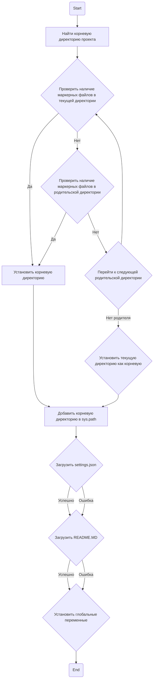

## Анализ кода `hypotez/src/endpoints/hypo69/small_talk_bot/header.py`

### 1. <алгоритм>

**Блок-схема:**



**Примеры для каждого блока:**

1.  **Start**: Начало выполнения скрипта.
2.  **FindRoot**: Функция `set_project_root` вызывается.
3.  **CheckMarkers**:
    *   Пример 1: Проверка наличия файла `__root__` в текущей директории.
    *   Пример 2: Проверка наличия файла `__root__` в родительской директории.
4.  **RootFound**: Если маркерный файл найден, устанавливается корневая директория.
5.  **SetSysPath**: Добавление пути к корневой директории в `sys.path`.
    *   Пример: `sys.path` обновляется добавлением `/home/user/project/`.
6.  **LoadSettings**: Загрузка файла `settings.json` из `/home/user/project/src/settings.json`.
7.  **LoadReadme**: Загрузка файла `README.MD` из `/home/user/project/src/README.MD`.
8.  **SetGlobalVars**:
    *   `__project_name__` устанавливается из `settings['project_name']`, если `settings` не `None`, или как `hypotez` по умолчанию.
    *   `__version__` устанавливается из `settings['version']`, если `settings` не `None`, или как `''` по умолчанию.
    *   `__doc__` устанавливается из `doc_str`, если `doc_str` не `None`, или как `''` по умолчанию.
    *   `__author__` устанавливается из `settings['author']`, если `settings` не `None`, или как `''` по умолчанию.
    *   `__copyright__` устанавливается из `settings['copyrihgnt']`, если `settings` не `None`, или как `''` по умолчанию.
    *    `__cofee__` устанавливается из `settings['cofee']`, если `settings` не `None`, или как ссылка на boosty по умолчанию.
9.  **End**: Завершение выполнения скрипта.

### 2. <mermaid>

```mermaid
flowchart TD
    Start --> FindRoot[<code>set_project_root()</code><br> Найти корневую директорию]
    FindRoot --> CheckMarkers{Проверка маркерных файлов<br><code>__root__</code>}
    CheckMarkers -- Да --> RootFound[Установить корневую директорию]
    RootFound --> UpdateSysPath[Обновить <code>sys.path</code>]
    UpdateSysPath --> LoadSettings[Загрузить <code>settings.json</code>]
    LoadSettings -- Успех --> LoadReadme[Загрузить <code>README.MD</code>]
      LoadSettings -- Ошибка --> LoadReadme
      LoadReadme -- Успех --> SetGlobalVars[Установить глобальные переменные]
      LoadReadme -- Ошибка --> SetGlobalVars
    SetGlobalVars --> End
    CheckMarkers -- Нет --> CheckParent{Проверка родительской директории<br><code>__root__</code>}
      CheckParent -- Да --> RootFound
      CheckParent -- Нет --> CheckAgain{Переход к следующей родительской директории}
      CheckAgain --> CheckMarkers
      CheckAgain -- Нет родителя --> RootNotFound[Установить текущую директорию<br>как корневую]
      RootNotFound --> UpdateSysPath
    
    
    
    style Start fill:#f9f,stroke:#333,stroke-width:2px
    style End fill:#ccf,stroke:#333,stroke-width:2px
```

```mermaid
    flowchart TD
        Start --> Header[<code>header.py</code><br> Determine Project Root]
    
        Header --> import[Import Global Settings: <br><code>from src import gs</code>] 
    ```

**Объяснение зависимостей `mermaid`:**

*   `Start`: Начальная точка выполнения скрипта.
*   `FindRoot`: Вызов функции `set_project_root()` для определения корневой директории проекта.
*   `CheckMarkers`: Проверка наличия маркерных файлов в текущей директории.
*   `RootFound`: Установка корневой директории, если маркерный файл найден.
*   `UpdateSysPath`: Добавление пути к корневой директории в `sys.path` для возможности импорта модулей из проекта.
*   `LoadSettings`: Попытка загрузить данные из `settings.json` для глобальных настроек проекта.
*   `LoadReadme`: Попытка загрузить данные из `README.MD` для документации проекта.
*   `SetGlobalVars`: Установка глобальных переменных, таких как имя проекта, версия, автор и т. д. из загруженных настроек.
*   `End`: Конечная точка выполнения скрипта.
*   `CheckParent`: Проверка наличия маркерных файлов в родительской директории.
*  `CheckAgain`: Переход к следующей родительской директории.
*  `RootNotFound`: Установка текущей директории как корневой, если маркерные файлы не найдены.
* `Header`: указывает на  `header.py` как на начало операции определения корня проекта.
* `import`: указывает на импорт глобальных настроек из  `src.gs`, что подразумевает  зависимость от этого модуля.

### 3. <объяснение>

**Импорты:**

*   `sys`: Используется для работы с системными параметрами и функциями, такими как добавление пути к корневой директории в `sys.path`.
*   `json`: Используется для работы с JSON-файлами, в частности для загрузки настроек из `settings.json`.
*    `packaging.version.Version`: Используется для работы с версиями, не используется в коде, скорее всего, является устаревшим импортом.
*    `pathlib.Path`: Используется для работы с путями к файлам и директориям, предоставляет удобный объектно-ориентированный интерфейс.
*    `src`:  Пакет, к которому принадлежит проект, позволяет импортировать его компоненты.
*  `gs`: Глобальные настройки проекта из модуля `src`.

**Функция `set_project_root`:**

*   **Аргументы**: `marker_files` (tuple, по умолчанию `('__root__',)`). Это список имен файлов или директорий, которые используются для определения корневой директории проекта.
*   **Возвращаемое значение**: `Path` - путь к корневой директории проекта или путь к директории, где находится скрипт, если маркерные файлы не найдены.
*   **Назначение**: Функция ищет корневую директорию проекта, начиная с директории скрипта и поднимаясь вверх по иерархии. Она останавливается, когда находит директорию, содержащую хотя бы один из файлов, указанных в `marker_files`.
    *   **Пример**: Если `marker_files = ('__root__', 'setup.py')` и файл `setup.py` находится в `/home/user/project`, то функция вернет `Path('/home/user/project')`.
*   **Переменные:**
    *   `__root__`: переменная типа `Path`, хранит путь к корневой директории.
    *   `current_path`: переменная типа `Path`, хранит путь к директории, где находится скрипт.
    *   `parent`: переменная типа `Path`, представляет родительскую директорию текущей директории.

**Глобальные переменные:**

*   `__root__`:  Переменная типа `Path`, хранит путь к корневой директории проекта, полученный из функции `set_project_root`.
*   `settings`:  Словарь (`dict`) с настройками проекта, загруженный из файла `settings.json`.
*    `doc_str`: Строка (`str`), содержащая документацию из файла `README.MD`.
*   `__project_name__`: Строка (`str`), название проекта, по умолчанию `hypotez`.
*   `__version__`: Строка (`str`), версия проекта, по умолчанию пустая строка.
*   `__doc__`: Строка (`str`), документация проекта, по умолчанию пустая строка.
*   `__details__`: Строка (`str`), детали проекта, по умолчанию пустая строка.
*   `__author__`: Строка (`str`), автор проекта, по умолчанию пустая строка.
*   `__copyright__`: Строка (`str`), авторские права проекта, по умолчанию пустая строка.
*    `__cofee__`: Строка (`str`), сообщение о поддержке проекта, по умолчанию ссылка на boosty.

**Потенциальные ошибки и области для улучшения:**

1.  **Обработка ошибок `FileNotFoundError`, `json.JSONDecodeError`**:
    *   В коде используется `try-except`, но блок `except` пустой (`...`). В этом случае ошибки не обрабатываются, что может привести к непредсказуемому поведению, если, например, `settings.json` или `README.MD` отсутствуют или имеют некорректный формат.
    *   **Улучшение**: Добавить логирование ошибок или установить значения по умолчанию для `settings` и `doc_str`.
2.  **Использование `Version`**:
    *   Импорт `from packaging.version import Version` присутствует, но не используется в коде.
    *   **Улучшение**: Удалить неиспользуемый импорт.
3.  **Неопределенный `__details__`**:
    *   Переменная `__details__` инициализируется пустой строкой и нигде не устанавливается.
    *   **Улучшение**: Уточнить назначение переменной и инициализировать ее корректным значением.
4.  **Неявное преобразование типов:**
    *   `settings.get("copyrihgnt", '')` Опечатка.
    *  **Улучшение**: Исправить опечатку.
5.  **Отсутствие явных типов для переменных:**
    *    Некоторые переменные не имеют явного указания типа, например,  `settings` или `doc_str`, что может затруднить чтение кода.
    *   **Улучшение**: Использовать аннотации типов для всех переменных.

**Взаимосвязи с другими частями проекта:**

*   `header.py` используется для определения корневой директории проекта, что необходимо для правильной работы импортов и загрузки настроек. Он устанавливает `__root__`, который используется для построения путей к файлам настроек и документации.
*   Глобальные переменные, такие как `__project_name__`, `__version__`, `__doc__`, могут быть использованы в других частях проекта для получения информации о проекте.
*   Модуль `src.gs` содержит глобальные настройки проекта, которые используются в `header.py`.
*  `settings.json` и `README.MD` являются внешними файлами, которые влияют на значения переменных в этом модуле.

**Цепочка взаимосвязей:**

`set_project_root` -->  `sys.path` (обновление) --> импорт модулей --> `settings.json` & `README.MD` --> глобальные переменные --> другие модули проекта.