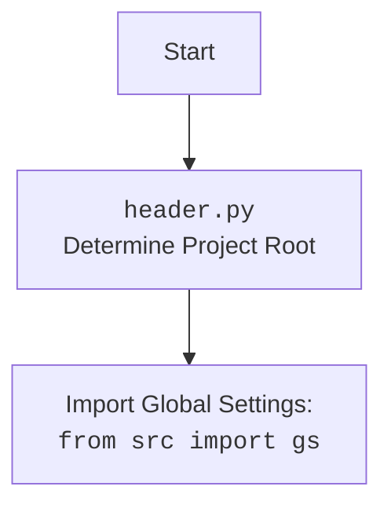

## <алгоритм>

**1. Инициализация `BotHandler`:**

   - При создании экземпляра `BotHandler`  инициализируется `MexironBuilder`, который используется для создания и запуска сценариев.
   - Выбирается драйвер браузера (`Firefox`, `Chrome` или `Edge`) на основе переданного аргумента `webdriver_name`. По умолчанию используется `Firefox` с параметрами `--kiosk` и `--headless`.

   *Пример:*
     ```python
     handler = BotHandler(webdriver_name='chrome')
     # Создаётся экземпляр BotHandler с драйвером Chrome
     ```

**2. Обработка URL (`handle_url`):**

   - Получает сообщение от пользователя, содержащее URL OneTab.
   - Проверяет, начинается ли сообщение с известных URL OneTab.
   - Если URL корректный, вызывает `fetch_target_urls_onetab` для извлечения целевых URL и данных.
   - Если `fetch_target_urls_onetab` возвращает корректные данные, запускает сценарий с помощью `self.mexiron.run_scenario`, передавая `update`, `context`, список URL, цену и имя.
   - Отправляет ответное сообщение "Готово!" или "Некорректные данные." в зависимости от результата.

   *Пример:*
     ```
      # Update.message.text = 'https://one-tab.com/1234567890'
      # После проверки и извлечения данных
      self.mexiron.run_scenario(update, context, urls=['https://example.com', 'https://test.com'], price='100', mexiron_name='Test')
      #  Отправляется сообщение "Готово!" если сценарий выполнится, иначе "Некорректные данные."
      # Update.message.text = 'https://example.com'
      # отправляется сообщение 'Ошибка. Попробуй ещё раз.'
     ```

**3. Извлечение URL из OneTab (`fetch_target_urls_onetab`):**

   - Получает URL OneTab.
   - Выполняет GET-запрос к URL, парсит HTML-контент, используя `BeautifulSoup`.
   - Извлекает ссылки из тегов `<a>` с классом `tabLink`.
   - Извлекает текст из элемента `div` с классом `tabGroupLabel`, который может содержать цену и название.
   - Разбивает текст на цену и название, если данные доступны.
   - Возвращает цену, название и список URL или `False` в случае ошибки.

   *Пример:*
    ```
    #  one_tab_url = 'https://one-tab.com/1234567890'
    # После запроса и парсинга HTML
     # returns: price='1000', mexiron_name='Test', urls=['https://example.com', 'https://test.com']
    ```

**4. Обработка команды `--next` (`handle_next_command`):**

   - Выбирает случайный вопрос из списка `questions_list`.
   - Запрашивает ответ у `self.model.ask(question)`.
   - Отправляет пользователю вопрос и ответ.
   - Обрабатывает возможные исключения и отправляет сообщение об ошибке.

   *Пример:*
    ```
    # question = "Какой сегодня день?"
    # answer = "Сегодня вторник"
    # Выводится вопрос и ответ в телеграмм
    ```

**Поток данных:**

1.  **Пользователь** отправляет сообщение боту (через `telegram.Update`).
2.  `BotHandler` получает `Update` и `CallbackContext`.
3.  `BotHandler`  определяет тип сообщения и вызывает соответствующий обработчик.
    -   Если это URL OneTab, вызывается `handle_url`.
    -   Если команда `--next`, вызывается `handle_next_command`.
4.  `handle_url` вызывает `fetch_target_urls_onetab` для получения данных.
5.  `fetch_target_urls_onetab` отправляет HTTP-запрос и возвращает список URL, цену и имя.
6.  `handle_url` запускает сценарий с помощью `self.mexiron.run_scenario`, передавая данные, полученные из `fetch_target_urls_onetab`.
7.  `handle_next_command` запрашивает ответ у `self.model` и отправляет сообщения пользователю.
8.  Бот отправляет ответ пользователю (через `update.message.reply_text`).

## <mermaid>

```mermaid
flowchart TD
    Start[Начало] --> InitBotHandler[Инициализация BotHandler]
    InitBotHandler --> CreateMexironBuilder[Создание MexironBuilder]
    CreateMexironBuilder --> ChooseDriver[Выбор драйвера (Firefox, Chrome, Edge)]
    ChooseDriver --> DriverInstance[Создание экземпляра Driver]
    DriverInstance --> MexironBuilderInstance[Создание экземпляра MexironBuilder]
    MexironBuilderInstance --> HandleUpdate[Обработка update]
    
    HandleUpdate -- Сообщение начинается с URL OneTab --> FetchUrls[fetch_target_urls_onetab]
    HandleUpdate -- Сообщение не начинается с URL OneTab --> ReplyError[Отправить "Ошибка. Попробуй ещё раз."]
    ReplyError --> End[Конец]
    FetchUrls --> HttpRequest[HTTP GET запрос к one_tab_url]
    HttpRequest --> ParseHTML[Парсинг HTML (BeautifulSoup)]
    ParseHTML --> ExtractUrls[Извлечение URL из тегов 'a']
    ExtractUrls --> ExtractData[Извлечение данных из div 'tabGroupLabel']
    ExtractData --> PrepareData[Подготовка данных (цена, имя)]
    PrepareData --> RunScenario[Запуск сценария (self.mexiron.run_scenario)]
    RunScenario -- Сценарий выполнен --> ReplySuccess[Отправить "Готово!"]
    RunScenario -- Сценарий не выполнен --> ReplyInvalid[Отправить "Некорректные данные."]

     HandleUpdate -- Сообщение содержит --next --> HandleNextCommand[Обработка команды --next]

    HandleNextCommand --> ChooseQuestion[Выбор случайного вопроса из questions_list]
    ChooseQuestion --> AskModel[Запрос ответа у модели]
     AskModel --> ReplyQuestion[Отправить вопрос и ответ]

    ReplySuccess --> End
    ReplyInvalid --> End
    ReplyQuestion --> End
    

    classDef styleFill fill:#f9f,stroke:#333,stroke-width:2px
    class InitBotHandler, CreateMexironBuilder, ChooseDriver,DriverInstance, MexironBuilderInstance,HandleUpdate, FetchUrls, HttpRequest, ParseHTML, ExtractUrls, ExtractData, PrepareData, RunScenario, HandleNextCommand styleFill
```

**Объяснение `mermaid`:**

-   **`Start`**: Начало процесса.
-   **`InitBotHandler`**: Инициализация класса `BotHandler`.
-   **`CreateMexironBuilder`**: Создание экземпляра `MexironBuilder`.
-   **`ChooseDriver`**: Выбор драйвера браузера на основе аргумента `webdriver_name`.
-    **`DriverInstance`**: Создание экземпляра драйвера.
-   **`MexironBuilderInstance`**: Создание экземпляра `MexironBuilder`.
-   **`HandleUpdate`**:  Обработка входящего обновления от Telegram.
-   **`FetchUrls`**: Вызов функции `fetch_target_urls_onetab` для извлечения URL.
-   **`HttpRequest`**: Выполнение HTTP GET-запроса к URL OneTab.
-   **`ParseHTML`**: Парсинг HTML-содержимого с использованием BeautifulSoup.
-   **`ExtractUrls`**: Извлечение ссылок из HTML-документа.
-   **`ExtractData`**: Извлечение данных из `div` с классом `tabGroupLabel`.
-   **`PrepareData`**: Подготовка данных, извлеченных из `div`, (цена, имя).
-   **`RunScenario`**: Запуск сценария с использованием `mexiron`.
-   **`HandleNextCommand`**: Обработка команды `--next`.
-    **`ChooseQuestion`**: Выбор случайного вопроса для модели.
-   **`AskModel`**: Запрос ответа у языковой модели.
-    **`ReplyQuestion`**: Отправка вопроса и ответа пользователю.
-   **`ReplySuccess`**: Отправка сообщения об успешном выполнении.
-   **`ReplyInvalid`**: Отправка сообщения о некорректных данных.
-   **`ReplyError`**: Отправка сообщения об ошибке.
-   **`End`**: Конец процесса.

**Импорт `header`:**



## <объяснение>

### Импорты:

-   `header`: Используется для определения корня проекта и импорта глобальных настроек из `src.gs`.
-   `random`: Используется для выбора случайного вопроса из списка в `handle_next_command`.
-   `asyncio`: Используется для асинхронного выполнения операций.
-   `requests`: Используется для выполнения HTTP-запросов (например, к URL OneTab).
-   `typing.Optional`, `typing.Any`: Используются для аннотации типов.
-   `bs4.BeautifulSoup`: Используется для парсинга HTML-контента.
-   `src.gs`: Глобальные настройки проекта.
-   `src.logger.logger`: Логирование событий.
-   `src.webdriver.driver.Driver`: Базовый класс для веб-драйверов.
-   `src.webdriver.chrome.Chrome`, `src.webdriver.firefox.Firefox`, `src.webdriver.edge.Edge`: Классы для управления веб-драйверами Chrome, Firefox, Edge соответственно.
-   `src.ai.gemini.GoogleGenerativeAI`: Класс для взаимодействия с моделью Google Gemini.
-   `src.endpoints.kazarinov.scenarios.scenario_pricelist.MexironBuilder`: Класс для построения и запуска сценариев.
-   `src.utils.url.is_url`: Функция для проверки, является ли строка URL.
-   `src.utils.printer.pprint`: Функция для форматированного вывода.
-   `telegram.Update`: Объект, представляющий входящее обновление от Telegram.
-   `telegram.ext.CallbackContext`: Контекст для работы с ботом в Telegram.

### Классы:

-   **`BotHandler`**:
    -   **Роль**: Обрабатывает команды, полученные от Telegram-бота, выполняет операции, связанные с OneTab и другими сценариями.
    -   **Атрибуты**:
        -   `mexiron` (`MexironBuilder`): Объект для построения и запуска сценариев.
    -   **Методы**:
        -   `__init__(self, webdriver_name: str)`: Конструктор класса, инициализирует `MexironBuilder` с выбранным веб-драйвером.
        -   `async handle_url(self, update: Update, context: CallbackContext) -> Any`: Обрабатывает URL, присланный пользователем.
        -    `async handle_next_command(self, update: Update) -> None`: Обрабатывает команду "--next" и её аналоги.
        -   `fetch_target_urls_onetab(self, one_tab_url: str) -> list[str] | bool`: Извлекает URL из страницы OneTab.

### Функции:

-   **`__init__(self, webdriver_name: str)`:**
    -   **Аргументы**:
        -   `webdriver_name` (`str`): Название веб-драйвера ("firefox", "chrome", "edge").
    -   **Возвращаемое значение**: None
    -   **Назначение**: Инициализирует `BotHandler`, создавая `MexironBuilder` на основе выбранного веб-драйвера.

-   **`async handle_url(self, update: Update, context: CallbackContext) -> Any`:**
    -   **Аргументы**:
        -   `update` (`Update`): Объект обновления от Telegram.
        -   `context` (`CallbackContext`): Контекст выполнения.
    -   **Возвращаемое значение**: `True` если сценарий был выполнен, иначе `None`
    -   **Назначение**: Обрабатывает URL OneTab, извлекает данные, запускает сценарий, и отвечает пользователю.

-   **`fetch_target_urls_onetab(self, one_tab_url: str) -> list[str] | bool`:**
    -   **Аргументы**:
        -   `one_tab_url` (`str`): URL страницы OneTab.
    -   **Возвращаемое значение**: Список URL, цена и имя, или `None` в случае ошибки.
    -   **Назначение**: Извлекает URL, цену и имя из HTML-контента страницы OneTab.

-  **`async handle_next_command(self, update: Update) -> None`:**
    -   **Аргументы**:
         -   `update` (`Update`): Объект обновления от Telegram.
    -   **Возвращаемое значение**: `None`
    -   **Назначение**: Обрабатывает команду `--next`, запрашивает у модели ответ на случайный вопрос и отправляет пользователю.

### Переменные:

-   `self.mexiron`: Экземпляр класса `MexironBuilder`.
-   `webdriver_name`:  Название веб-драйвера (`str`).
-   `response`: Текст сообщения, присланного пользователем или ответ от HTTP-запроса (`str`).
-   `one_tab_url`: URL страницы OneTab (`str`).
-    `question`:  Случайный вопрос из `questions_list` (`str`).
-    `answer`: Ответ на вопрос, полученный от языковой модели (`str`).
-   `price`: Цена, извлеченная из `tabGroupLabel` (`str` или `int`).
-   `mexiron_name`:  Имя, извлеченное из `tabGroupLabel` или текущее время (`str`).
-   `urls`: Список URL, извлеченных из OneTab (`list[str]`).
-   `soup`: Объект `BeautifulSoup`, представляющий HTML-контент.
-   `element`: Элемент `div` с классом `tabGroupLabel`.
-   `data`: Текст из `tabGroupLabel` (`str`).

### Потенциальные ошибки и улучшения:

-   **Обработка ошибок**: В блоках `try...except` есть много мест с заглушками `...`. Следует добавить конкретную логику обработки ошибок.
-   **Обработка неверного формата URL:** Обработка случаев, когда URL OneTab некорректный, но при этом не начинается с `https://one-tab.com`.
-  **Работа с моделью AI:** Присутствует вызов `self.model.ask(question)`, но нет явного определения `self.model`, что может привести к `AttributeError`. Необходима инициализация модели.
-   **Определение `questions_list`**: Переменная `questions_list` используется в `handle_next_command`, но нигде не инициализируется. Необходима её инициализация при инициализации `BotHandler`.
-  **Типизация**: Не везде прописана типизация переменных
- **Многоточия**:  в коде много многоточий, это необходимо исправить
-  **Безопасность**:  Необходимо проверять, есть ли у пользователя права на запуск кода.
-   **Логирование**: Добавить логирование ошибок и важных событий в `fetch_target_urls_onetab`, таких как  код статуса HTTP-запроса или данные извлеченные `BeautifulSoup`
-  **Производительность**:  добавить асинхронность в `fetch_target_urls_onetab`

### Взаимосвязи с другими частями проекта:

-   Использует `src.gs` для глобальных настроек.
-   Использует `src.logger.logger` для логирования.
-   Использует `src.webdriver` для управления браузерами.
-   Использует `src.ai.gemini` для работы с AI.
-   Использует `src.endpoints.kazarinov.scenarios.scenario_pricelist.MexironBuilder` для запуска сценариев.
-   Использует `src.utils.url` для проверки URL.
-   Использует `src.utils.printer` для форматированного вывода.