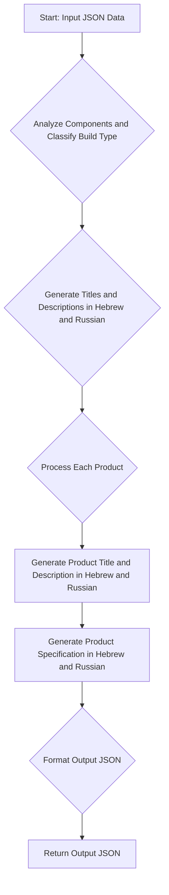

## ИНСТРУКЦИЯ:

Анализ предоставленного кода подробно и объяснение его функциональности.

### 1. **<алгоритм>**

Этот код представляет собой инструкцию для языковой модели, предназначенную для обработки данных о компьютерных компонентах в формате JSON. Основная задача - это анализ предоставленных данных, классификация сборки компьютера (например, как игровой или рабочая станция), формирование описаний и названий на иврите и русском, и, в итоге, возврат структурированного JSON.

**Пошаговая блок-схема:**

1.  **Ввод (JSON):** Получение на вход JSON с информацией о компьютерных компонентах.
    *   **Пример:**
        ```json
        {
        "products": [
                {
                "product_id": "123",
                "product_name": "Intel i7-14700F",
                "image_local_saved_path": "/path/to/image1.jpg"
                },
                {
                "product_id": "456",
                "product_name": "Gigabyte RTX 4070",
                "image_local_saved_path": "/path/to/image2.jpg"
                }
            ]
        }
        ```
2.  **Анализ и Классификация:** Анализ полученных компонент и определение типа сборки (игровой, рабочая станция и т.д.) с присвоением оценок достоверности (confidence scores) для каждого типа.
    *   **Пример:** Если в JSON есть "RTX 4070", то *игровой* тип получит высокую оценку (например, 0.9), а *рабочая станция* – низкую (например, 0.1).
3.  **Генерация Названий и Описаний:** Формирование названий и описаний сборки на иврите и русском языках.
    *   **Пример:**
        *   Иврит: "מחשב גיימינג בעל ביצועים גבוהים" (Высокопроизводительный игровой компьютер)
        *   Русский: "Высокопроизводительный игровой компьютер"
4.  **Обработка Компонентов:** Для каждого компонента:
    *   Сохранение идентификатора (`product_id`) и пути к изображению (`image_local_saved_path`) без изменений.
    *   Генерация названия (`product_title`) и описания (`product_description`) на иврите и русском языках, если это возможно (если нет, то поле оставить пустым).
    *   Генерация спецификации  (`product_specification`) на иврите и русском языках, если это возможно (если нет, то поле оставить пустым).
    *   **Пример:**
        ```json
         {
            "product_id": "123",
            "product_title": "מעבד Intel i7-14700F",
            "product_description": "מעבד חזק למשחקים",
            "specification": "8 ליבות, 16 הליכי משנה",
            "image_local_saved_path": "/path/to/image1.jpg"
          }
        ```
5.  **Формирование JSON:** Создание структурированного JSON в соответствии с предоставленным шаблоном, содержащим названия, описания, классификацию сборки и информацию о компонентах на иврите и русском языках.
6.  **Вывод (JSON):** Возвращение структурированного JSON в формате, указанном в шаблоне.

### 2. **<mermaid>**


**Объяснение диаграммы:**

*   **Start: Input JSON Data (A):** Начало процесса, получение входных данных в формате JSON.
*   **Analyze Components and Classify Build Type (B):** Анализ полученных компонентов для определения типа сборки (например, игровой, рабочая станция) и присвоение оценок достоверности.
*   **Generate Titles and Descriptions in Hebrew and Russian (C):** Генерация общих заголовков и описаний для сборки на иврите и русском языках.
*    **Process Each Product (D):** Итерация по каждому продукту (компоненту) во входном JSON.
*   **Generate Product Title and Description in Hebrew and Russian (E):** Для каждого компонента генерация названия и описания на иврите и русском языках.
*   **Generate Product Specification in Hebrew and Russian (F):** Для каждого компонента генерация спецификации на иврите и русском языках.
*   **Format Output JSON (G):** Форматирование полученных данных в соответствии с предопределенным шаблоном JSON.
*   **Return Output JSON (H):** Вывод структурированного JSON.

### 3. **<объяснение>**

**Импорты:**

В предоставленном коде отсутствуют явные импорты Python, так как это скорее инструкция для языковой модели, а не исполняемый код Python. В контексте проекта `src.` обычно означает, что код взаимодействует с модулями и пакетами внутри каталога `src`.

**Классы:**

В данном примере нет классов, так как это инструкция для языковой модели.

**Функции:**

В инструкции нет явно определенных функций. Однако, подразумевается, что будут использоваться функции для анализа текста, перевода, классификации, и форматирования JSON.

*   **Анализ и Классификация:** Функция, которая получает JSON с компонентами, анализирует их и определяет тип сборки.
    *   **Аргументы:** JSON с информацией о компонентах.
    *   **Возвращаемое значение:** Словарь с оценками достоверности для каждого типа сборки (например, `{"gaming": 0.9, "workstation": 0.1}`).
*   **Генерация Текстов:** Функция для генерации текстов на иврите и русском.
    *   **Аргументы:** Название компонента, его описание на английском.
    *   **Возвращаемое значение:** Словарь с названиями и описаниями на иврите и русском.
*   **Обработка Компонентов:** Функция для обработки отдельного компонента.
    *   **Аргументы:** Информация о компоненте (название, `id`, путь к изображению).
    *   **Возвращаемое значение:** JSON с названием, описанием и другой информацией о компоненте в двух языках (иврит и русский).
*   **Форматирование JSON:** Функция, которая объединяет все полученные данные в структурированный JSON.
    *   **Аргументы:** Данные о сборке, классификации и компонентах.
    *   **Возвращаемое значение:** Структурированный JSON в соответствии с шаблоном.

**Переменные:**

*   `product_id`: Идентификатор продукта (компонента). Тип - `string`.
*   `product_title`: Название продукта. Тип - `string`.
*   `product_description`: Описание продукта. Тип - `string`.
*   `image_local_saved_path`: Путь к локально сохраненному изображению. Тип - `string`.
*   `build_types`: Словарь с типами сборки и их оценками. Тип - `dict`.
*   `confidence score`: Числовая оценка уверенности в классификации. Тип - `float`.
*   `he`: Словарь для хранения информации на иврите. Тип - `dict`.
*    `ru`: Словарь для хранения информации на русском. Тип - `dict`.

**Потенциальные ошибки или области для улучшения:**

*   **Отсутствие спецификации:** В некоторых случаях модель может не иметь достаточно информации для генерации спецификации, тогда поле остается пустым.
*   **Неточность перевода:** Автоматический перевод может быть неточным.
*   **Несоответствие шаблону:** Модель должна строго придерживаться заданного шаблона, любые отклонения являются ошибкой.
*   **Недостаточная обработка ошибок:** Отсутствует явная обработка ошибок (например, если нет данных для перевода).

**Цепочка взаимосвязей:**

В рамках проекта, эта инструкция взаимодействует с:

1.  **Ввод данных:** Получает данные из системы, где хранятся информация о компонентах.
2.  **Обработка данных:** Использует функции для анализа, генерации текста, и форматирования.
3.  **Вывод данных:** Возвращает структурированный JSON для дальнейшего использования.

Эта инструкция является частью более широкой системы, которая, вероятно, включает в себя:

*   **Система хранения данных:** Где хранятся данные о компонентах.
*   **Инструменты перевода:**  Для точного перевода.
*   **Система выдачи данных:** Для использования сгенерированного JSON.