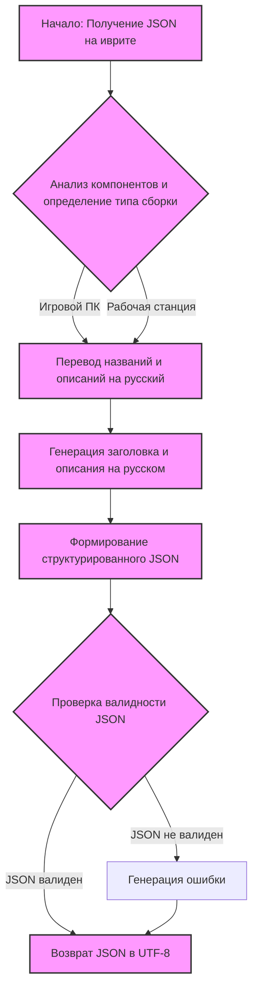

## ИНСТРУКЦИЯ:

Анализируй предоставленный код подробно и объясни его функциональность. Ответ должен включать три раздела:  

1. **<алгоритм>**: Опиши рабочий процесс в виде пошаговой блок-схемы, включая примеры для каждого логического блока, и проиллюстрируй поток данных между функциями, классами или методами.  
2. **<mermaid>**: Напиши код для диаграммы в формате `mermaid`, проанализируй и объясни все зависимости, 
    которые импортируются при создании диаграммы. 
    **ВАЖНО!** Убедитесь, что все имена переменных, используемые в диаграмме `mermaid`, 
    имеют осмысленные и описательные имена. Имена переменных вроде `A`, `B`, `C`, и т.д., не допускаются!  
    
    **Дополнительно**: Если в коде есть импорт `import header`, добавьте блок `mermaid` flowchart, объясняющий `header.py`:\
    ```mermaid
    flowchart TD
        Start --> Header[<code>header.py</code><br> Determine Project Root]
    
        Header --> import[Import Global Settings: <br><code>from src import gs</code>] 
    ```

3. **<объяснение>**: Предоставьте подробные объяснения:  
   - **Импорты**: Их назначение и взаимосвязь с другими пакетами `src.`.  
   - **Классы**: Их роль, атрибуты, методы и взаимодействие с другими компонентами проекта.  
   - **Функции**: Их аргументы, возвращаемые значения, назначение и примеры.  
   - **Переменные**: Их типы и использование.  
   - Выделите потенциальные ошибки или области для улучшения.  

Дополнительно, постройте цепочку взаимосвязей с другими частями проекта (если применимо).  

Это обеспечивает всесторонний и структурированный анализ кода.
## Формат ответа: `.md` (markdown)
**КОНЕЦ ИНСТРУКЦИИ**

### <алгоритм>
1. **Получение JSON с данными на иврите:**
    - Принимается JSON, содержащий информацию о компонентах компьютера. Например:
      ```json
      {
        "products": [
          {
            "product_id": "123",
            "product_title": "מעבד Intel i7",
            "image_local_saved_path": "/path/to/image1.jpg"
          },
          {
            "product_id": "456",
            "product_title": "כרטיס מסך RTX 4070",
            "image_local_saved_path": "/path/to/image2.jpg"
          }
        ]
      }
      ```

2.  **Определение типа сборки:**
    - Анализ данных о компонентах (например, по названию) и классификация типа сборки (игровой, рабочая станция и т.д.).
    - Пример: Если есть RTX 4070, то вероятно это игровой ПК. Если есть Xeon CPU, то это может быть рабочая станция.

3. **Перевод на русский язык:**
    - Перевод всех текстовых полей с иврита на русский, используя какой-либо механизм перевода.
      - Например, `מעבד Intel i7`  переводится как `Процессор Intel i7`.
      - `כרטיס מסך RTX 4070` переводится как `Видеокарта RTX 4070`.

4. **Создание заголовка и описания:**
   - На основе типа сборки и компонентов создается заголовок и описание на русском языке.
   - Пример:
     - Заголовок: "Мощный игровой компьютер"
     - Описание: "Сборка включает процессор Intel i7, видеокарту RTX 4070, 16GB RAM и SSD 4TB"

5. **Формирование структурированного JSON ответа:**
   - Создание JSON-ответа в соответствии с заданным шаблоном.
   - Пример:
   ```json
   {
      "ru": {
         "title": "Мощный игровой компьютер",
         "description": "Сборка включает процессор Intel i7, видеокарту RTX 4070, 16GB RAM и SSD 4TB"
        },
        "products": [
           {
             "product_id": "123",
             "product_title": "Процессор Intel i7",
             "product_description": "Мощный процессор от Intel для игр и требовательных задач",
             "specification": "8 ядер, 16 потоков, частота 3.6GHz",
              "image_local_saved_path": "/path/to/image1.jpg"
           },
           {
            "product_id": "456",
             "product_title": "Видеокарта RTX 4070",
             "product_description": "Производительная видеокарта для современных игр",
            "specification": "8GB GDDR6X, 5888 CUDA cores",
            "image_local_saved_path": "/path/to/image2.jpg"
           }
         ]
      }
    ```

6. **Проверка валидности:**
    - Проверка корректности сформированного JSON-ответа перед его отправкой.
7. **Возврат JSON ответа:**
   - Возвращение JSON-ответа в UTF-8 кодировке.
   
### <mermaid>


**Объяснение диаграммы `mermaid`:**
* **A (Начало: Получение JSON на иврите):** Это начальный этап, на котором входной JSON с данными на иврите поступает в систему.
* **B (Анализ компонентов и определение типа сборки):** На этом этапе происходит анализ полученных данных для определения типа сборки компьютера (игровой, рабочая станция и т.д.). Решение о типе сборки влияет на дальнейшую обработку.
* **C (Перевод названий и описаний на русский):** Все названия и описания продуктов переводятся с иврита на русский язык.
* **D (Генерация заголовка и описания на русском):** На основе типа сборки и переведённых данных создаётся заголовок и описание сборки на русском языке.
* **E (Формирование структурированного JSON):** Сформированный заголовок, описание и данные о продуктах упаковываются в структурированный JSON-ответ.
* **F (Проверка валидности JSON):** Выполняется проверка на корректность сформированного JSON.
* **G (Возврат JSON в UTF-8):** Корректный JSON-ответ возвращается в кодировке UTF-8.
* **H (Генерация ошибки):** Если JSON не валиден, возвращается ошибка и процесс завершается.
* `classDef important fill:#f9f,stroke:#333,stroke-width:2px` - стилизует блоки A, B, C, D, E, F, и G, делая их визуально более заметными на диаграмме.

### <объяснение>

**Импорты:**

В предоставленном коде нет явных импортов. Однако, подразумевается, что для перевода с иврита на русский и для работы с JSON используются какие-то библиотеки и модули внутри проекта `src`, например:
  - `json`: Для обработки JSON-данных.
  - Модуль перевода (например,  `src.translation.translator`): Для перевода текстов с иврита на русский.
  - Модуль для определения типа сборки (например, `src.classification.assembly_classifier`): Для определения типа сборки на основе компонентов.

**Классы:**

В предоставленном коде нет явных классов. Однако, можно предположить, что внутри проекта `src`  могут быть реализованы классы для:
  -  `Translator`: Класс, инкапсулирующий логику перевода текстов. Может иметь методы для перевода с разных языков, включая иврит на русский.
  -  `AssemblyClassifier`: Класс для классификации типа сборки компьютера. Может принимать список компонентов и возвращать тип сборки.
  - `JsonValidator`: Класс, проверяющий валидность JSON-данных.

**Функции:**

В коде подразумеваются следующие функции:
1. **`translate_text(text_he: str) -> str`**:
  - **Аргументы**:  `text_he` - строка на иврите.
  - **Возвращаемое значение**: Строка на русском языке.
  - **Назначение**: Переводит входную строку с иврита на русский.
  - **Пример**: `translate_text("מעבד")` может вернуть "Процессор".
2.  **`classify_assembly(components: list) -> str`**:
    -   **Аргументы**:  `components` - список компонентов (словарей), каждый из которых содержит информацию о компоненте.
    -   **Возвращаемое значение**:  Строка, представляющая тип сборки (например, "игровой", "рабочая станция").
    -   **Назначение**: Определяет тип сборки на основе предоставленных компонентов.
    -   **Пример**:  `classify_assembly([{"product_title": "RTX 4070"}, {"product_title": "i7-14700F"}])` может вернуть "игровой".
3.  **`generate_title_description(assembly_type: str, components: list) -> tuple[str, str]`**:
    -   **Аргументы**: `assembly_type` - строка с типом сборки, `components` - список компонентов.
    -   **Возвращаемое значение**: Кортеж из двух строк: заголовок и описание сборки на русском.
    -   **Назначение**:  Генерирует заголовок и описание сборки на основе типа сборки и компонентов.
    -  **Пример**: `generate_title_description("игровой", [{"product_title":"RTX 4070"}, {"product_title":"Intel i7"}])` может вернуть `("Игровой ПК", "Мощный игровой компьютер с RTX 4070 и Intel i7")`
4. **`validate_json(data: dict) -> bool`**:
   - **Аргументы**:  `data` - словарь, представляющий JSON-объект.
   - **Возвращаемое значение**:  `True`, если JSON валиден, `False` в противном случае.
   - **Назначение**: Проверяет, соответствует ли структура словаря ожидаемому формату JSON.
   - **Пример**: `validate_json(json_data)` возвращает `True` если структура `json_data` верна, иначе `False`.

**Переменные:**

- **`products` (list):** Список словарей, каждый из которых представляет компонент компьютера.
- **`product_id` (str):** Уникальный идентификатор компонента.
- **`product_title` (str):** Название компонента на иврите (входные данные), затем на русском (после перевода).
- **`product_description` (str):** Описание компонента на русском.
- **`image_local_saved_path` (str):**  Путь к сохраненному изображению компонента.
- **`title` (str):**  Заголовок сборки на русском.
- **`description` (str):**  Описание сборки на русском.
- **`assembly_type` (str):**  Тип сборки (например, "игровой", "рабочая станция").
- **`json_data` (dict):** Представляет данные в виде словаря для дальнейшей работы с JSON

**Потенциальные ошибки и улучшения:**

1. **Отсутствие обработки ошибок перевода:** Если переводчик не сможет перевести текст, то нужно предусмотреть обработку этой ситуации (например, вернуть исходный текст или сообщение об ошибке).
2. **Неоднозначная классификация типа сборки:** Алгоритм определения типа сборки должен быть точным и надежным, так как от него зависят заголовок и описание. Нужно предусмотреть случаи, когда тип сборки определить сложно.
3.  **Отсутствие спецификаций:**  Для каждого продукта могут отсутствовать спецификации, поэтому нужно обрабатывать такие ситуации и устанавливать спецификацию по умолчанию или выводить поле пустым
4.  **Валидация JSON:** Валидация JSON должна включать проверку типов данных, обязательных полей и соответствия структуре шаблона.
5.  **Производительность:** Для большого количества компонентов необходимо обеспечить производительность процесса перевода и классификации. Можно рассмотреть использование асинхронных операций.
6. **Кодировка:** Обязательное использование UTF-8 должно быть четко проконтролировано на всех этапах обработки данных.
7. **Логирование:** Добавить логирование ошибок и важных событий для отладки и мониторинга.

**Взаимосвязь с другими частями проекта:**

Данный код может быть частью большего проекта, включающего:
 - `src.translation`: Модуль, отвечающий за перевод текстов.
 - `src.classification`: Модуль, отвечающий за классификацию данных, включая типы сборок.
 - `src.utils`: Модуль с общими утилитами, например, для работы с JSON.
 - `src.api`: Модуль для взаимодействия с внешними сервисами или базами данных.

Входные данные могут поступать из базы данных или через API, и результат будет отправлен обратно через API или сохранен в базе данных.