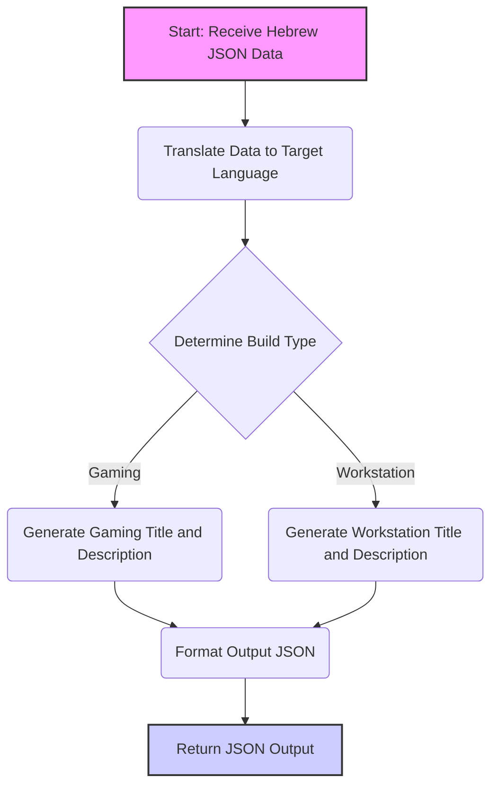

## ИНСТРУКЦИЯ:

Анализируй предоставленный код подробно и объясни его функциональность. Ответ должен включать три раздела:

1.  **<алгоритм>**: Опиши рабочий процесс в виде пошаговой блок-схемы, включая примеры для каждого логического блока, и проиллюстрируй поток данных между функциями, классами или методами.
2.  **<mermaid>**: Напиши код для диаграммы в формате `mermaid`, проанализируй и объясни все зависимости,
    которые импортируются при создании диаграммы.
    **ВАЖНО!** Убедитесь, что все имена переменных, используемые в диаграмме `mermaid`,
    имеют осмысленные и описательные имена. Имена переменных вроде `A`, `B`, `C`, и т.д., не допускаются!

    **Дополнительно**: Если в коде есть импорт `import header`, добавьте блок `mermaid` flowchart, объясняющий `header.py`:
    ```mermaid
    flowchart TD
        Start --> Header[<code>header.py</code><br> Determine Project Root]

        Header --> import[Import Global Settings: <br><code>from src import gs</code>]
    ```

3.  **<объяснение>**: Предоставьте подробные объяснения:
    -   **Импорты**: Их назначение и взаимосвязь с другими пакетами `src.`.
    -   **Классы**: Их роль, атрибуты, методы и взаимодействие с другими компонентами проекта.
    -   **Функции**: Их аргументы, возвращаемые значения, назначение и примеры.
    -   **Переменные**: Их типы и использование.
    -   Выделите потенциальные ошибки или области для улучшения.

Дополнительно, постройте цепочку взаимосвязей с другими частями проекта (если применимо).

Это обеспечивает всесторонний и структурированный анализ кода.
## Формат ответа: `.md` (markdown)
**КОНЕЦ ИНСТРУКЦИИ**

## <алгоритм>

1. **Получение данных на иврите в формате JSON:**
    - Пример: 
    ```json
    [
        {
            "product_id": "123",
            "product_title": "מעבד Intel i9-14900K",
            "product_description": "מעבד חזק למחשבי גיימינג",
            "specification": "8 ליבות, 16 תהליכונים",
            "image_local_saved_path": "/images/cpu.jpg"
        },
        {
            "product_id": "456",
            "product_title": "כרטיס מסך NVIDIA RTX 4060 Ti",
            "product_description": "כרטיס מסך לגיימינג ברזולוציה גבוהה",
            "specification": "8GB GDDR6",
            "image_local_saved_path": "/images/gpu.jpg"
         }
    ]
    ```

2. **Перевод данных на целевой язык:**
   - Используется модель машинного перевода для перевода всех текстовых полей (названий компонентов, описаний, спецификаций).
   - Пример:
   ```json
   [
        {
            "product_id": "123",
            "product_title": "Intel i9-14900K processor",
            "product_description": "Powerful processor for gaming computers",
            "specification": "8 cores, 16 threads",
            "image_local_saved_path": "/images/cpu.jpg"
        },
        {
            "product_id": "456",
            "product_title": "NVIDIA RTX 4060 Ti graphics card",
            "product_description": "Graphics card for high-resolution gaming",
            "specification": "8GB GDDR6",
            "image_local_saved_path": "/images/gpu.jpg"
         }
    ]
    ```

3.  **Определение типа сборки компьютера:**
    -   Анализируется список компонентов и их характеристики (например, процессор, видеокарта, объем памяти и т.д.).
    -   Пример: Если присутствуют мощный процессор и видеокарта, то это сборка для игр, если процессор и большой объем оперативной памяти – рабочая станция.
    -   Результат:
        - `build_types`: `{"gaming": 0.9, "workstation": 0.1}`

4.  **Генерация заголовка и описания сборки:**
    -   На основе определенных компонентов и типа сборки генерируется заголовок и подробное описание на целевом языке.
    -   Пример:
        - `title`: "High-performance Gaming PC"
        - `description`: "This high-performance gaming PC features an Intel i9-14900K processor, NVIDIA RTX 4060 Ti graphics card, and other high-end components."

5. **Формирование выходных данных в формате JSON:**
    -  Создание JSON-объекта с информацией о типе сборки, заголовком, описанием и переведенными данными о компонентах.
    -  Пример:
    ```json
    {
      "en": {
        "build_types": {
          "gaming": 0.9,
          "workstation": 0.1
        },
        "title": "High-performance Gaming PC",
        "description": "This high-performance gaming PC features an Intel i9-14900K processor, NVIDIA RTX 4060 Ti graphics card, and other high-end components.",
        "products": [
          {
            "product_id": "123",
            "product_title": "Intel i9-14900K processor",
            "product_description": "Powerful processor for gaming computers",
            "specification": "8 cores, 16 threads",
            "image_local_saved_path": "/images/cpu.jpg"
          },
          {
            "product_id": "456",
            "product_title": "NVIDIA RTX 4060 Ti graphics card",
            "product_description": "Graphics card for high-resolution gaming",
            "specification": "8GB GDDR6",
            "image_local_saved_path": "/images/gpu.jpg"
          }
         ]
       }
    }
    ```

6.  **Возврат JSON:**
    -   Результат возвращается в требуемом формате.

## <mermaid>


В диаграмме `mermaid`:
-   `Start: Receive Hebrew JSON Data`: Начальная точка, где принимаются данные в формате JSON на иврите.
-   `Translate Data to Target Language`: Блок, отвечающий за перевод данных на целевой язык.
-   `Determine Build Type`: Блок принятия решения о типе сборки (игровая, рабочая станция и т.д.) на основе компонентов.
-   `Generate Gaming Title and Description`: Блок генерации заголовка и описания для игровой сборки.
-   `Generate Workstation Title and Description`: Блок генерации заголовка и описания для рабочей станции.
-   `Format Output JSON`: Блок форматирования выходных данных в JSON.
-   `Return JSON Output`: Конечная точка, где возвращаются данные в формате JSON.

**Зависимости:**

Диаграмма отражает поток данных и логику обработки:
1.  Входные данные (JSON на иврите) поступают на вход.
2.  Данные переводятся на целевой язык.
3.  На основе переведенных данных определяется тип сборки.
4.  В зависимости от типа сборки генерируется заголовок и описание.
5.  Результаты форматируются в JSON.
6.  JSON возвращается в качестве результата.

## <объяснение>

**Общая задача:**

Задача заключается в том, чтобы принять JSON-данные на иврите, содержащие информацию о компонентах компьютера, перевести их на целевой язык, определить тип сборки и предоставить подробное описание сборки в формате JSON.

**Импорты:**
В предоставленном коде не указаны импорты. Это подразумевает, что в данном случае код представлен в виде инструкций, а не как исполняемый код Python. Если бы были импорты, то они, вероятно, включали бы:
    -   `json`: Для работы с JSON-данными.
    -   `googletrans` или `deep_translator`: Для перевода текста.
    -   Модули для анализа спецификаций (если таковые предусмотрены).

**Классы:**

В данном коде нет классов. Это инструкция, описывающая процесс обработки данных. Если бы были классы, они бы, вероятно, включали:
    - Класс для управления переводом.
    - Класс для анализа компонентов и определения типа сборки.
    - Класс для форматирования выходных данных.

**Функции:**

Функции в этом случае подразумеваются на концептуальном уровне:
    -   `translate_data(input_data, target_language)`: Функция для перевода данных.
    -   `determine_build_type(components)`: Функция для определения типа сборки.
    -   `generate_title_and_description(build_type, components)`: Функция для генерации заголовка и описания.
    -   `format_output(build_type, title, description, translated_components)`: Функция для форматирования выходных данных в JSON.

**Переменные:**

- `input_data`: JSON-данные, полученные на входе (на иврите).
- `target_language`: Целевой язык для перевода (например, "en").
- `translated_data`: JSON-данные после перевода на целевой язык.
- `build_types`: Словарь с вероятностями типа сборки (например, `{"gaming": 0.9, "workstation": 0.1}`).
- `title`: Заголовок сборки.
- `description`: Описание сборки.
- `output_data`: JSON-объект для возврата.
- `product_id`, `product_title`, `product_description`, `specification`, `image_local_saved_path`: Атрибуты отдельных компонентов.

**Потенциальные ошибки и области для улучшения:**

1.  **Обработка ошибок перевода:**
    -   Могут возникнуть ошибки при переводе, особенно если есть специфические технические термины. Нужна более точная настройка модели перевода и обработка ошибок.
2.  **Сложность определения типа сборки:**
    -   Логика определения типа сборки может быть недостаточно точной, требуются дополнительные правила и анализ характеристик компонентов.
3.  **Поиск информации в интернете:**
    -   Необходимо реализовать механизм для поиска недостающей информации в интернете, если это требуется.
4.  **Улучшенная категоризация:**
    - Добавить возможность более детальной категоризации (например, "Competitive Gaming" или "Creative Workstation").
5.  **Контроль качества перевода:**
    -  Нужна автоматическая или ручная проверка качества переведенного текста, чтобы гарантировать точность.

**Взаимосвязь с другими частями проекта:**

Этот код может быть частью более крупной системы, включающей:

-   API для приема данных.
-   Модуль для взаимодействия с моделями машинного перевода.
-   Базу данных с информацией о компонентах.
-   Модуль для работы с файловой системой и хранения изображений.

**Заключение:**

Данный код описывает логику обработки JSON-данных о компонентах компьютера, их перевода, классификации и форматирования результатов. Он предоставляет хорошую основу для системы, которая может автоматически собирать информацию о компьютерах и предоставлять структурированную информацию на разных языках. Важно учесть потенциальные ошибки и области для улучшения, чтобы обеспечить надежность и точность работы системы.