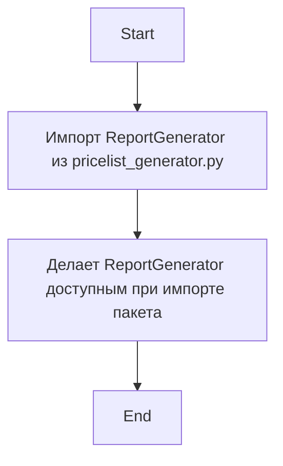

## АНАЛИЗ КОДА: `src/endpoints/kazarinov/pricelist_generator/__init__.py`

### 1. <алгоритм>

1.  **Импорт:** Импортируется класс `ReportGenerator` из модуля `pricelist_generator.py`, расположенного в той же директории.
2.  **Инициализация:** Файл `__init__.py`  используется для инициализации пакета `pricelist_generator`. Он делает `ReportGenerator` доступным при импорте пакета, а не только при импорте `pricelist_generator.py`. 
3. **Использование:**  Другие части кода могут импортировать  `ReportGenerator`  из пакета `src.endpoints.kazarinov.pricelist_generator`, используя `from src.endpoints.kazarinov.pricelist_generator import ReportGenerator`, вместо `from src.endpoints.kazarinov.pricelist_generator.pricelist_generator import ReportGenerator`.

**Пример:**
*   Допустим, в другом модуле проекта есть код, которому нужен функционал `ReportGenerator`.
*   Этот модуль выполняет `from src.endpoints.kazarinov.pricelist_generator import ReportGenerator` 
*   Теперь в модуле можно создавать экземпляры `ReportGenerator` и использовать его методы.

### 2. <mermaid>

**Объяснение диаграммы:**
*   `Start` - начало процесса.
*   `ImportReportGenerator` - импортирует класс `ReportGenerator` из `pricelist_generator.py`
*   `ExposeReportGenerator` - с помощью `__init__.py` делает класс `ReportGenerator` доступным для импорта из родительского каталога.
*   `End` - конец процесса.

### 3. <объяснение>
**Импорты:**
*   `from .pricelist_generator import ReportGenerator`: Этот импорт выполняет следующее:
    *   `.` (точка) означает текущую директорию, то есть, директорию `src/endpoints/kazarinov/pricelist_generator`.
    *   `pricelist_generator` - это имя файла (модуля) `pricelist_generator.py`.
    *   `import ReportGenerator` - импортирует класс `ReportGenerator`, определенный в файле `pricelist_generator.py`. 
    *   **Назначение:** `__init__.py` делает класс `ReportGenerator` доступным для импорта из пакета `src.endpoints.kazarinov.pricelist_generator`. Это упрощает доступ к классу и улучшает структуру проекта, позволяя импортировать `ReportGenerator` через `from src.endpoints.kazarinov.pricelist_generator import ReportGenerator` а не как `from src.endpoints.kazarinov.pricelist_generator.pricelist_generator import ReportGenerator`.
  
**Классы:**
*   В данном файле нет определений классов. Класс `ReportGenerator` определен в `pricelist_generator.py`. Этот файл служит для импорта и перенаправления экспорта.
    *   `ReportGenerator`: Судя по названию, этот класс, вероятно, предназначен для генерации отчетов по прайс-листам.
        *   *Атрибуты и методы*: Вероятно, у класса есть атрибуты для хранения данных о прайс-листе и методы для его обработки, форматирования и создания отчета. Точные атрибуты и методы можно увидеть, изучив файл `pricelist_generator.py`.
  
**Функции:**
*  В данном файле не определены функции. Файл служит только для импорта `ReportGenerator` и выноса его в пространство имен пакета.

**Переменные:**
*   В данном файле нет переменных.

**Взаимосвязи с другими частями проекта:**
*   Файл является частью пакета `src.endpoints.kazarinov.pricelist_generator`. 
*   Он предназначен для использования в других частях проекта, где требуется функционал генерации отчетов по прайс-листам.  
*   Другие модули могут импортировать `ReportGenerator` и использовать его методы.

**Потенциальные ошибки и области для улучшения:**
*   Данный файл не вызывает ошибок, его единственная цель - импорт и экспорт `ReportGenerator`. 
*   Дальнейшее улучшение зависит от содержимого `pricelist_generator.py`, которое не было предоставлено для анализа.