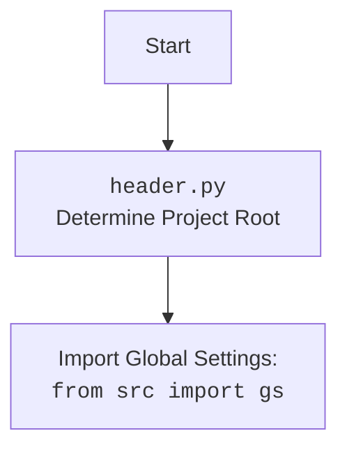

## ИНСТРУКЦИЯ:

Анализируй предоставленный код подробно и объясни его функциональность. Ответ должен включать три раздела:  

1. **<алгоритм>**: Опиши рабочий процесс в виде пошаговой блок-схемы, включая примеры для каждого логического блока, и проиллюстрируй поток данных между функциями, классами или методами.  
2. **<mermaid>**: Напиши код для диаграммы в формате `mermaid`, проанализируй и объясни все зависимости, 
    которые импортируются при создании диаграммы. 
    **ВАЖНО!** Убедитесь, что все имена переменных, используемые в диаграмме `mermaid`, 
    имеют осмысленные и описательные имена. Имена переменных вроде `A`, `B`, `C`, и т.д., не допускаются!  
    
    **Дополнительно**: Если в коде есть импорт `import header`, добавьте блок `mermaid` flowchart, объясняющий `header.py`:\
    ```mermaid
    flowchart TD
        Start --> Header[<code>header.py</code><br> Determine Project Root]
    
        Header --> import[Import Global Settings: <br><code>from src import gs</code>] 
    ```

3. **<объяснение>**: Предоставьте подробные объяснения:  
   - **Импорты**: Их назначение и взаимосвязь с другими пакетами `src.`.  
   - **Классы**: Их роль, атрибуты, методы и взаимодействие с другими компонентами проекта.  
   - **Функции**: Их аргументы, возвращаемые значения, назначение и примеры.  
   - **Переменные**: Их типы и использование.  
   - Выделите потенциальные ошибки или области для улучшения.  

Дополнительно, постройте цепочку взаимосвязей с другими частями проекта (если применимо).  

Это обеспечивает всесторонний и структурированный анализ кода.
## Формат ответа: `.md` (markdown)
**КОНЕЦ ИНСТРУКЦИИ**
```markdown
## <алгоритм>

**1. Определение корневой директории проекта:**

   - Начинается с определения текущего пути к файлу `header.py`.
   - Создается переменная `__root__`, изначально равная текущей директории.
   - Перебираются все родительские директории, начиная с текущей.
   - Для каждой родительской директории проверяется, содержит ли она хотя бы один из файлов-маркеров (`__root__` или `.git`).
     - **Пример**: Если текущий путь `/home/user/project/src/endpoints/kazarinov/scenarios`, то будут проверены `/home/user/project/src/endpoints/kazarinov/scenarios`, `/home/user/project/src/endpoints/kazarinov`, `/home/user/project/src/endpoints`, `/home/user/project/src`, `/home/user/project`, `/home/user`, `/home`.
   - Если маркер найден, `__root__` переопределяется на директорию с маркером, и цикл завершается.
   - Если корневая директория не находится в `sys.path`, она добавляется.
   - Функция возвращает `__root__` (объект `Path`).

**2. Загрузка настроек проекта:**

   - Пытается открыть файл `settings.json` из директории `src` относительно корневой директории.
   - Если файл открыт, то его содержимое загружается в переменную `settings` (словарь) при помощи `json.load()`.
   - Если файл не найден или не является валидным `JSON`, переменной `settings` присваивается `None`.

**3. Загрузка документации из файла README.MD:**
    -  Пытается открыть файл `README.MD` из директории `src` относительно корневой директории.
    -  Если файл открыт, то его содержимое считывается в переменную `doc_str` (строка) при помощи `settings_file.read()`.
    -  Если файл не найден или не является валидным, то `doc_str` присваивается `None`.
    
**4. Инициализация глобальных переменных:**

   - Из словаря `settings` извлекаются значения для глобальных переменных:
     - `__project_name__`: название проекта (по умолчанию "hypotez").
     - `__version__`: версия проекта (по умолчанию "").
     - `__doc__`: строка документации из `README.MD` файла.
     - `__details__`: не инициализируется (пустая строка).
     - `__author__`: имя автора проекта.
     - `__copyright__`: информация об авторских правах.
     - `__cofee__`: сообщение о возможности поддержать разработчика.
   - Если `settings` равно `None`, то для переменных устанавливаются значения по умолчанию.

## <mermaid>

```mermaid
flowchart TD
    Start[Start] --> FindProjectRoot[Determine Project Root <br> <code>set_project_root()</code>]
    FindProjectRoot --> CheckMarker[Check for Marker Files: '__root__', '.git']
    CheckMarker -- Found --> SetRoot[Set __root__]
    CheckMarker -- Not Found --> CheckParent[Check Parent Directory]
    SetRoot --> AddToSysPath[Add __root__ to sys.path (if needed)]
    AddToSysPath --> LoadSettings[Load Project Settings: <br> <code>settings.json</code>]
     CheckParent -- Has Parent --> CheckMarker
     CheckParent -- No Parent -->SetCurrentRoot[Set __root__ to Current Directory]
     SetCurrentRoot -->AddToSysPath
    LoadSettings -- Success --> LoadReadme[Load README.MD]
    LoadSettings -- Fail -->  SetDefaultSettings[Set Default Settings]
    LoadReadme -- Success -->  InitializeGlobals[Initialize Global Variables]
    LoadReadme -- Fail -->  InitializeGlobals
     SetDefaultSettings --> InitializeGlobals
    InitializeGlobals --> End[End]
```

**Объяснение `mermaid` диаграммы:**

*   `Start`: Начало выполнения скрипта.
*   `FindProjectRoot`: Функция `set_project_root` ищет корневую директорию проекта.
*   `CheckMarker`: Проверяет, содержат ли текущая директория или её родительские директории файлы-маркеры.
*   `SetRoot`: Устанавливает найденную директорию как корень проекта (`__root__`).
*   `AddToSysPath`: Добавляет путь к корневой директории в `sys.path` если этого еще не сделано.
*   `CheckParent`: Проверяет, есть ли у текущей директории родительская директория.
*   `SetCurrentRoot`: Устанавливает текущую директорию, если родительских нет и маркер не найден.
*   `LoadSettings`: Загружает настройки проекта из файла `settings.json`.
*   `LoadReadme`: Загружает документацию из файла `README.MD`.
*   `SetDefaultSettings`:  Использует значения по умолчанию если не удалось загрузить настройки.
*    `InitializeGlobals`: Инициализирует глобальные переменные на основе загруженных настроек или значений по умолчанию.
*   `End`: Конец выполнения скрипта.

**Диаграмма для `header.py` (из инструкции):**


## <объяснение>

**Импорты:**

*   `sys`: Используется для работы с системными параметрами и функциями, в частности, для добавления пути к корневой директории в `sys.path`.
*   `json`: Используется для загрузки настроек проекта из файла `settings.json` в формате JSON.
*   `pathlib.Path`: Используется для работы с путями к файлам и директориям в объектно-ориентированном стиле.
*   `packaging.version.Version`: Используется для сравнения версий.
*   `src`: Импортирует `gs` (вероятно, глобальные настройки) из пакета `src`.

**Функции:**

*   `set_project_root(marker_files=('__root__', '.git')) -> Path`:
    *   **Аргументы:** `marker_files` (tuple) - кортеж с именами файлов или директорий, которые являются маркерами корневой директории.
    *   **Возвращаемое значение:** `Path` - объект `Path`, представляющий путь к корневой директории проекта.
    *   **Назначение:** Функция определяет корневую директорию проекта, проходя вверх по дереву директорий, пока не найдет директорию с одним из маркеров.
    *   **Пример:**  Если вызывается из файла `/home/user/project/src/endpoints/kazarinov/scenarios/header.py`, то функция будет искать файлы или папки `__root__` и `.git` начиная с `/home/user/project/src/endpoints/kazarinov/scenarios`, далее `/home/user/project/src/endpoints/kazarinov`, и так далее.

**Переменные:**

*   `__root__`: `Path` -  путь к корневой директории проекта, вычисляемый функцией `set_project_root`.
*   `settings`: `dict` или `None` - словарь с настройками проекта, загруженными из `settings.json` (если файл найден и является валидным JSON).
*   `doc_str`: `str` или `None` -  документация из файла README.MD.
*   `__project_name__`: `str` -  название проекта.
*   `__version__`: `str` - версия проекта.
*  `__doc__`: `str` -  документация проекта.
*   `__details__`: `str` - детальная информация о проекте (пока не используется).
*   `__author__`: `str` - автор проекта.
*   `__copyright__`: `str` - информация об авторских правах.
*   `__cofee__`: `str` - сообщение о поддержке разработчика.
*  `gs`: глобальные настройки импортированные из `src`.

**Потенциальные ошибки и области для улучшения:**

*   **Обработка исключений:** Обработка исключений `FileNotFoundError` и `json.JSONDecodeError` в блоках `try/except` очень минимальна (`...`).  Вместо этого, можно было бы выводить предупреждение об ошибке или использовать значения по умолчанию для переменных.
*   **Использование `gs`**: Зависимость от `gs` не очень очевидна.
*   **Отсутствие явного определения типа для `__root__`** в функции `set_project_root`. Хотя и не обязательно, но явное объявление типа повышает читаемость.
*   **Неиспользуемая переменная `__details__`**. Стоит либо убрать её, либо добавить функционал.
*   **Улучшенная обработка отсутствия `settings.json` или `README.MD`:** Вместо того, чтобы просто присваивать переменной `None`, можно добавить логику для создания дефолтного словаря или вывода сообщения об ошибке.
*   **Жестко заданное имя файла:** Имя файла настроек `settings.json` и `README.MD` жестко задано. Можно сделать его настраиваемым через аргумент функции или переменную среды.

**Взаимосвязи с другими частями проекта:**

*   Этот файл (`header.py`) является частью структуры проекта, и его основная задача - определить корневую директорию, а также загрузить и предоставить общие настройки проекта.
*   Он импортирует `gs` из пакета `src`, что подразумевает зависимость от этого пакета для получения глобальных параметров.
*   Полученные настройки (переменные, определенные в этом файле) вероятно используются в других частях проекта, как глобальные переменные (например для определения версий, имен, и тд) и/или в качестве конфигурации.
*   `set_project_root` обеспечивает правильную адресацию файлов и модулей в проекте, независимо от того, откуда был запущен скрипт, что важно для переносимости и масштабируемости проекта.