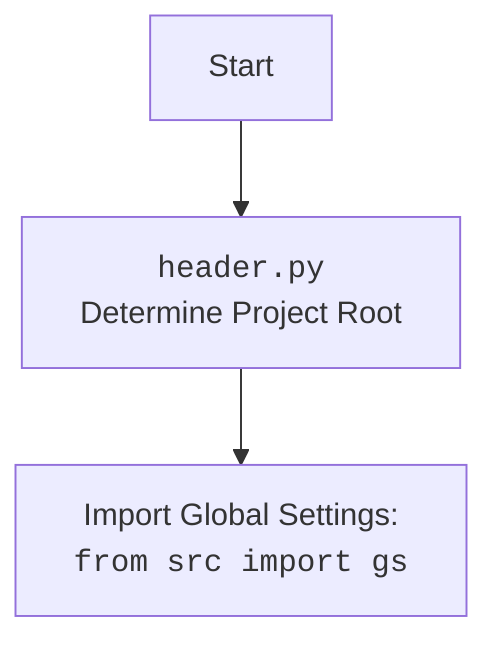

## АНАЛИЗ КОДА:

### 1. **<алгоритм>**

**Блок-схема работы кода:**

1.  **`main(mexiron:str, lang:str)`**:
    *   Принимает `mexiron` (имя файла данных) и `lang` (язык отчёта) в качестве входных параметров.
    *   Формирует `base_path` к каталогу с данными, используя `gs.path.external_storage / 'kazarinov' / 'mexironim' / mexiron`.
        *   *Пример*: `gs.path.external_storage/kazarinov/mexironim/24_12_01_03_18_24_269`
    *   Загружает данные из JSON-файла: `data = j_loads(base_path / f'{lang}.json')`.
        *   *Пример*: Загружает `ru.json` если `lang` = 'ru'.
    *   Определяет пути к HTML и PDF файлам:
        *   `html_file` = `base_path / f'{mexiron}_{lang}.html'`
            *   *Пример*: `gs.path.external_storage/kazarinov/mexironim/24_12_01_03_18_24_269/24_12_01_03_18_24_269_ru.html`
        *   `pdf_file` = `base_path / f'{mexiron}_{lang}.pdf'`
            *   *Пример*: `gs.path.external_storage/kazarinov/mexironim/24_12_01_03_18_24_269/24_12_01_03_18_24_269_ru.pdf`
    *   Создаёт экземпляр `ReportGenerator`: `r = ReportGenerator()`.
    *   Запускает асинхронный метод `r.create_report(data, lang, html_file, pdf_file)` с помощью `asyncio.run()`.
2.  **`ReportGenerator.__init__`**:
    *   Инициализирует окружение Jinja2 для работы с шаблонами.

3.  **`ReportGenerator.create_report(data: dict, lang: str, html_file: str | Path, pdf_file: str | Path)`**:
    *   Создаёт словарь `service_dict` с данными о сервисе.
        *   Заполняет  ключ `product_title`: "Сервис" если `lang` = 'ru' или "שירות" если `lang` = 'he'.
        *   Заполняет  ключ `specification` : читает и подготавливает HTML контент из файла `service_as_product_{lang}.html` с заменой `\n` на `<br>`.
        *   Заполняет  ключ `image_local_saved_path`:  случайное изображение из каталога `gs.path.external_storage/kazarinov/converted_images`.
    *   Добавляет `service_dict` в список продуктов `data['products']`.
    *   Вызывает `self.generate_html(data, lang)` для генерации HTML-контента.
    *   Сохраняет полученный HTML-контент в файл `html_file`.
    *   Создаёт экземпляр класса `PDFUtils`.
    *   Конвертирует HTML в PDF и сохраняет в `pdf_file` с помощью  `pdf.save_pdf_pdfkit(html_content,pdf_file)`.
    *   Возвращает `True`, если PDF создан успешно, иначе `False`.
4.  **`ReportGenerator.generate_html(data: dict, lang: str) -> str`**:
    *   Определяет имя шаблона в зависимости от языка (`template_table_he.html` для `he` и `template_table_ru.html` для `ru`).
    *   Формирует полный путь к шаблону, используя `gs.path.endpoints/kazarinov/pricelist_generator/templates/{template}`.
        *   *Пример*: `gs.path.endpoints/kazarinov/pricelist_generator/templates/template_table_ru.html`
    *   Читает содержимое шаблона из файла.
    *   Создаёт шаблон Jinja2 из содержимого.
    *   Рендерит HTML, подставляя `data` в шаблон.
    *   Возвращает сгенерированный HTML.

### 2. **<mermaid>**

```mermaid
flowchart TD
    Start(Начало) --> MainFunc[<code>main(mexiron, lang)</code><br>Установка параметров отчета]
    MainFunc --> LoadData[Загрузка JSON данных <br><code>j_loads(base_path / f'{lang}.json')</code>]
    LoadData --> CreateReportGenerator[Создание экземпляра<br><code>ReportGenerator()</code>]
    CreateReportGenerator --> CreateReport[<code>r.create_report(data, lang, html_file, pdf_file)</code><br>Генерация отчета]

    CreateReport --> ServiceDict[Создание словаря `service_dict`<br>с данными о сервисе]
    ServiceDict --> AppendService[Добавление сервиса в `data['products']`]
    AppendService --> GenerateHTML[Вызов `self.generate_html(data, lang)`<br>Генерация HTML контента]
    GenerateHTML --> SaveHTML[Сохранение HTML файла<br><code>Path(html_file).write_text(...)</code>]
    SaveHTML --> CreatePDFUtils[Создание экземпляра `PDFUtils`]
    CreatePDFUtils --> GeneratePDF[Конвертация HTML в PDF<br><code>pdf.save_pdf_pdfkit(html_content, pdf_file)</code>]

    GeneratePDF --> CheckPDF[Проверка результата создания PDF]
    CheckPDF -- PDF OK --> End(Конец: Успех)
    CheckPDF -- PDF Error --> LogError[Логирование ошибки <br><code>logger.error(...)</code>]
    LogError --> EndError(Конец: Ошибка)

    style Start fill:#f9f,stroke:#333,stroke-width:2px
    style End fill:#ccf,stroke:#333,stroke-width:2px
    style EndError fill:#fcc,stroke:#333,stroke-width:2px

```

**Разбор диаграммы:**

*   **`Start`**: Начало выполнения программы.
*   **`MainFunc`**: Функция `main(mexiron, lang)`: устанавливает основные параметры отчёта, включая имя файла данных и язык.
*    **`LoadData`**: Загрузка данных из JSON файла, используя функцию `j_loads`.
*   **`CreateReportGenerator`**: Создание экземпляра класса `ReportGenerator`.
*    **`CreateReport`**: Вызов метода `create_report` класса `ReportGenerator`, который выполняет основной процесс генерации отчёта.
*   **`ServiceDict`**: Создание словаря `service_dict` с данными о сервисе, которые будут добавлены к данным для отчета.
*   **`AppendService`**: Добавление словаря `service_dict` к списку продуктов, содержащихся в данных для отчета `data['products']`.
*   **`GenerateHTML`**: Вызов метода `generate_html` для генерации HTML-контента на основе данных и шаблона Jinja2.
*   **`SaveHTML`**: Сохранение сгенерированного HTML-контента в файл.
*   **`CreatePDFUtils`**: Создание экземпляра класса `PDFUtils`, который используется для конвертации HTML в PDF.
*    **`GeneratePDF`**: Конвертация HTML-контента в PDF-файл.
*   **`CheckPDF`**: Проверка результата создания PDF, успешное или неудачное.
*   **`End`**: Конец программы при успешном создании PDF.
*   **`LogError`**: Логирование ошибки, если не удалось создать PDF файл.
*   **`EndError`**: Конец программы при ошибке создания PDF.



**Разбор диаграммы:**

*   **`Start`**: Начало процесса.
*   **`Header`**: `header.py`  определяет корневой каталог проекта.
*   **`import`**: Импорт глобальных настроек `gs` из пакета `src`. Это позволяет использовать общие параметры и пути проекта.

### 3. **<объяснение>**

**Импорты:**

*   `import header`: Импортирует модуль `header.py`, который, вероятно, определяет корневую директорию проекта и настраивает пути.
*   `import asyncio`: Импортирует асинхронную библиотеку для выполнения асинхронных операций.
*   `from dataclasses import dataclass, field`: Импортирует декоратор `@dataclass` и функцию `field` для создания классов данных.
*   `from src import gs`: Импортирует глобальные настройки проекта, включая пути и другие конфигурационные параметры. `gs` вероятно инициализируется в `header.py`.
*   `import json`: Импортирует библиотеку `json` для работы с JSON-данными.
*   `from pathlib import Path`: Импортирует класс `Path` для работы с путями файловой системы.
*   `from jinja2 import Environment, FileSystemLoader`: Импортирует классы для работы с шаблонизатором Jinja2.
*   `import pdfkit`: Импортирует библиотеку `pdfkit` для конвертации HTML в PDF.
*   `from src.utils.jjson import j_loads`: Импортирует функцию `j_loads` для загрузки JSON-данных.
*   `from src.utils.file import read_text_file, save_text_file`: Импортирует функции для чтения и записи текстовых файлов.
*   `from src.utils.pdf import PDFUtils`: Импортирует класс `PDFUtils` для работы с PDF.
*   `from src.utils.convertors.html import html2pdf`: Импортирует функцию `html2pdf` для конвертации HTML в PDF.
*  `from src.utils.image import random_image`:  Импортирует функцию `random_image` для выбора случайного изображения.
*   `from src.utils.printer import pprint`: Импортирует функцию `pprint` для красивой печати данных.
*   `from src.logger.logger import logger`: Импортирует логгер для записи ошибок и другой информации.

**Классы:**

*   **`ReportGenerator`**:
    *   **`__init__(self)`**:
        *   Инициализирует атрибут `env`, как окружение Jinja2, загружающее шаблоны из текущей директории.
    *   **`generate_html(self, data: dict, lang: str) -> str`**:
        *   Принимает `data` (словарь с данными) и `lang` (язык отчёта).
        *   Определяет имя шаблона (`template_table_he.html` или `template_table_ru.html`) в зависимости от языка.
        *   Формирует полный путь к файлу шаблона.
        *   Читает содержимое шаблона, создаёт из него шаблон Jinja2 и рендерит его с переданными данными, возвращая готовый HTML.
    *   **`create_report(self, data: dict, lang: str, html_file: str | Path, pdf_file: str | Path) -> bool`**:
        *   Принимает данные отчёта `data`, язык `lang`, путь к HTML-файлу `html_file` и путь к PDF-файлу `pdf_file`.
        *   Создает словарь `service_dict` с данными о сервисе.
        *   Добавляет словарь `service_dict` в список продуктов `data['products']`.
        *   Генерирует HTML, сохраняет его в файл, конвертирует в PDF и возвращает `True` при успешном выполнении. В случае ошибки возвращает `False` и логирует её.
    
**Функции:**
*   **`main(mexiron: str, lang: str) -> bool`**:
    *   Принимает `mexiron` и `lang` в качестве входных параметров.
    *   Определяет `base_path` к директории с данными.
    *   Загружает данные из JSON-файла.
    *   Формирует пути к HTML и PDF файлам.
    *   Создаёт экземпляр `ReportGenerator`.
    *   Вызывает метод `create_report` для генерации отчёта.
*   **`if __name__ == "__main__":`**:
    *   Устанавливает значения для `mexiron` и `lang`  (эти переменные могут быть переданы через командную строку)
    *   Вызывает функцию `main` для запуска отчета.

**Переменные:**
*   `mexiron: str`: Имя файла данных для отчета.
*   `lang: str`: Язык отчета ('ru' или 'he').
*   `base_path: Path`:  путь к каталогу с данными.
*   `data: dict`: Данные, загруженные из JSON-файла.
*   `html_file: Path`: путь к HTML-файлу.
*   `pdf_file: Path`: путь к PDF-файлу.
*  `r: ReportGenerator`: Экземпляр класса `ReportGenerator`.
*  `service_dict: dict`: Словарь с данными о сервисе.
*  `html_content:str` : Сгенерированный HTML.
*  `pdf: PDFUtils` : экземпляр класса `PDFUtils`.
* `template:str` : имя файла шаблона, например `template_table_he.html`.
* `template_path:str` : полный путь к файлу шаблона, например `gs.path.endpoints/kazarinov/pricelist_generator/templates/template_table_he.html`.
* `template_string:str` : контент файла шаблона.

**Потенциальные ошибки и улучшения:**
*   **Обработка ошибок:** В коде есть простая проверка на успешность конвертации PDF, но можно добавить более подробную обработку исключений, например, при загрузке файла, генерации HTML или PDF.
*   **Конфигурация `pdfkit`:**  параметры `pdfkit`, такие как путь к `wkhtmltopdf`, прописанны в комментариях, возможно стоит хранить их в конфигурационном файле или в `gs`.
*   **Расширение функционала:** Можно добавить возможность настраивать шаблоны, стили и форматирование отчётов через конфигурационный файл.
* **Параметризация main:** Переменные `mexiron` и `lang` можно вынести за пределы функции `if __name__ == "__main__"` например в `argparse`.

**Взаимосвязь с другими частями проекта:**

*   **`header.py`**: Определяет корневой каталог проекта, который используется для формирования путей к шаблонам и данным.
*   **`src.gs`**:  Содержит глобальные настройки и пути к каталогам проекта.
*   **`src.utils.jjson.j_loads`**: Загружает данные из JSON-файла.
*   **`src.utils.pdf.PDFUtils`**: Преобразует HTML в PDF.
*   **`src.utils.image.random_image`**: Выбирает случайное изображение для добавления в отчет.
*    **`src.logger.logger`**: Используется для логирования ошибок.

Этот код предназначен для автоматической генерации HTML и PDF-отчётов на основе данных из JSON-файлов и шаблонов Jinja2. Он имеет модульную структуру, использующую функции и классы для каждой части процесса.