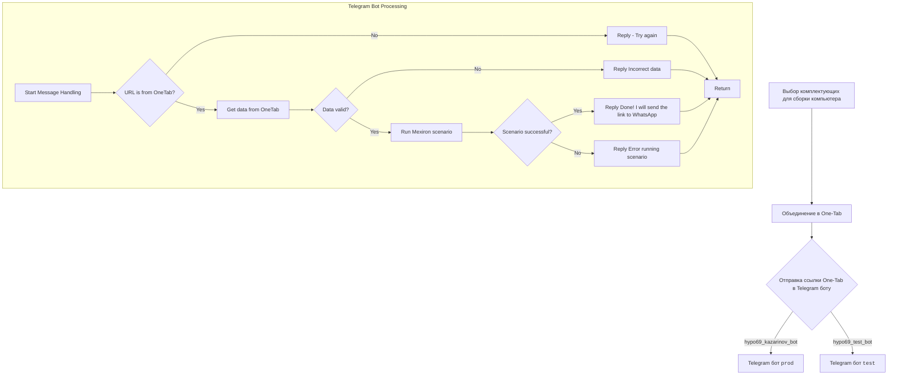

## ИНСТРУКЦИЯ:

Анализируй предоставленный код подробно и объясни его функциональность. Ответ должен включать три раздела:  

1. **<алгоритм>**: Опиши рабочий процесс в виде пошаговой блок-схемы, включая примеры для каждого логического блока, и проиллюстрируй поток данных между функциями, классами или методами.  
2. **<mermaid>**: Напиши код для диаграммы в формате `mermaid`, проанализируй и объясни все зависимости, 
    которые импортируются при создании диаграммы. 
    **ВАЖНО!** Убедитесь, что все имена переменных, используемые в диаграмме `mermaid`, 
    имеют осмысленные и описательные имена. Имена переменных вроде `A`, `B`, `C`, и т.д., не допускаются!  
    
    **Дополнительно**: Если в коде есть импорт `import header`, добавьте блок `mermaid` flowchart, объясняющий `header.py`:\
    ```mermaid
    flowchart TD
        Start --> Header[<code>header.py</code><br> Determine Project Root]
    
        Header --> import[Import Global Settings: <br><code>from src import gs</code>] 
    ```

3. **<объяснение>**: Предоставьте подробные объяснения:  
   - **Импорты**: Их назначение и взаимосвязь с другими пакетами `src.`.  
   - **Классы**: Их роль, атрибуты, методы и взаимодействие с другими компонентами проекта.  
   - **Функции**: Их аргументы, возвращаемые значения, назначение и примеры.  
   - **Переменные**: Их типы и использование.  
   - Выделите потенциальные ошибки или области для улучшения.  

Дополнительно, постройте цепочку взаимосвязей с другими частями проекта (если применимо).  

Это обеспечивает всесторонний и структурированный анализ кода.
## Формат ответа: `.md` (markdown)
**КОНЕЦ ИНСТРУКЦИИ**

### <алгоритм>
1.  **Пользователь формирует заказ:** Клиент выбирает комплектующие для сборки компьютера.
2.  **Объединение в One-Tab:** Клиент использует расширение One-Tab для объединения всех выбранных товаров в одну вкладку, создавая ссылку.
3.  **Отправка ссылки в Telegram бот:** Клиент отправляет ссылку One-Tab в Telegram бот, например, `hypo69_kazarinov_bot`.
4.  **Обработка сообщения ботом (`kazarinov_bot.handle_message()`):**
   - Бот получает сообщение с URL.
5.  **Проверка URL:** Бот проверяет, является ли полученный URL ссылкой One-Tab.
    - **Пример:** Если URL начинается с `https://one-tab.co.il/`, то это One-Tab ссылка.
6.  **Получение данных из One-Tab:** Если URL является ссылкой One-Tab, бот извлекает данные о товарах из этой вкладки.
7.  **Проверка данных:** Бот проверяет, что данные, полученные из One-Tab, являются корректными.
   - **Пример:** Проверяет, что извлеченные данные о товарах соответствуют ожидаемому формату.
8.  **Запуск сценария (`kazarinov.scenarios.run_scenario()`):** Если данные корректны, бот запускает сценарий обработки прайслиста Казаринова.
9.  **Проверка результата сценария:** Бот проверяет, был ли сценарий обработки выполнен успешно.
    - **Пример:** Сценарий может проверять, удалось ли собрать прайслист и подготовить его для отправки в WhatsApp.
10. **Отправка сообщения пользователю:**
    - **Успех:** Если сценарий выполнен успешно, бот отправляет сообщение пользователю "Готово! Я отправлю ссылку в WhatsApp".
    - **Ошибка:** Если сценарий не был выполнен успешно или данные были некорректными, бот отправляет соответствующее сообщение об ошибке.
11. **Завершение:** Бот завершает обработку текущего сообщения.

### <mermaid>


**Объяснение зависимостей `mermaid`:**
- `Start`: Начало процесса, где пользователь выбирает комплектующие.
- `Combine`: Этап, когда пользователь объединяет выбранные комплектующие в One-Tab.
- `SendToBot`: Этап, когда сформированная ссылка One-Tab отправляется в Telegram бот.
- `ProdBot` и `TestBot`: Два разных Telegram бота, которые могут обрабатывать сообщение. `ProdBot` - production бот, `TestBot` - тестовый бот.
- `BotStart`: Начало обработки сообщения внутри Telegram бота.
- `CheckURL`: Проверка, является ли полученный URL ссылкой One-Tab.
- `GetOneTabData`: Получение данных о товарах из One-Tab ссылки.
- `ValidateData`: Проверка корректности полученных данных.
- `RunScenario`: Запуск основного сценария обработки прайслиста.
- `ScenarioResult`: Проверка, был ли сценарий обработки успешен.
- `InvalidURLResponse`: Ответ пользователю, если URL не является ссылкой One-Tab.
- `InvalidDataResponse`: Ответ пользователю, если данные некорректны.
- `SuccessResponse`: Ответ пользователю об успешном выполнении сценария.
- `ErrorResponse`: Ответ пользователю, если произошла ошибка при выполнении сценария.
- `BotEnd`: Конец обработки сообщения внутри Telegram бота.

### <объяснение>
**Общее описание:**

Этот код описывает процесс создания прайс-листа для компании "Казаринов" с использованием Telegram бота. Клиент собирает товары для сборки компьютера, объединяет их с помощью расширения One-Tab в ссылку, и отправляет эту ссылку Telegram боту. Бот, в свою очередь, обрабатывает ссылку, получает данные о товарах и запускает сценарий для генерации прайса, который затем отправляется в WhatsApp.

**Импорты:**

-   В предоставленном коде нет явных импортов Python. Однако, из контекста понятно, что код является частью более крупного проекта, который, вероятно, использует следующие импорты:
    -   `src.endpoints.kazarinov.kazarinov_bot`: Содержит логику обработки сообщений от Telegram бота.
    -   `src.endpoints.kazarinov.scenarios`: Содержит сценарии для обработки данных и генерации прайс-листа.
    -   `src`: Корень проекта, который включает общие настройки и вспомогательные модули.
  
    **Взаимосвязь с `src.`:**
    -   `src.endpoints.kazarinov` - это пакет внутри `src`, который отвечает за конкретную функциональность бота Казаринова.
    -   Импорты внутри этого пакета позволяют переиспользовать общие настройки проекта и интегрировать разные компоненты.

**Классы:**

-   `KazarinovTelegramBot`:  Предположительно, класс, который реализует логику Telegram бота для обработки сообщений от пользователей.
    -  **Роль:** Принимает сообщения от пользователей, анализирует их и запускает необходимые сценарии.
    -  **Методы:** `handle_message()` - обрабатывает входящие сообщения, проверяет URL, получает данные, запускает сценарии и отправляет ответы пользователю.
-   `BotHandler`: Класс, который обрабатывает сообщения от Telegram.
    -  **Роль:** Организует обработку сообщений от разных ботов.

**Функции:**

-   `kazarinov_bot.handle_message()`: Функция, которая обрабатывает входящие сообщения от Telegram бота.
    -   **Аргументы:** Принимает сообщение от пользователя.
    -   **Возвращаемое значение:** Нет явного возвращаемого значения, но функция отвечает пользователю в Telegram, возвращает `None`.
    -   **Назначение:** Определяет, является ли входящее сообщение ссылкой One-Tab, получает данные, запускает сценарий и возвращает ответ пользователю.

-   `kazarinov.scenarios.run_scenario()`: Функция, которая запускает сценарий обработки для генерации прайс-листа.
    -   **Аргументы:** Принимает данные из One-Tab.
    -   **Возвращаемое значение:** Возвращает результат выполнения сценария (успех или провал).
    -   **Назначение:** Выполняет основную логику генерации прайс-листа, вклчая загрузку данных, форматирование и подготовку к отправке.

**Переменные:**

-   Переменные в коде не указаны явно, но подразумеваются такие, как:
    -   `url`: Строка, содержащая URL от пользователя.
    -   `data`: Данные, извлеченные из One-Tab ссылки.
    -   `result`: Результат выполнения сценария.
    -   `message`: Объект сообщения Telegram.

**Потенциальные ошибки и области для улучшения:**
-   **Обработка ошибок:** Код обрабатывает основные ошибки, такие как неверный формат URL или данных, но может быть улучшен в плане обработки более специфичных ошибок (например, сетевых сбоев или ошибок при выполнении сценария).
-   **Логирование:** Было бы полезно добавить логирование для записи ошибок и хода выполнения программы.
-   **Тестирование:**  Добавление тестов для проверки корректности обработки сообщений и сценариев.
-   **Расширяемость:**  При проектировании нужно учитывать возможность добавления новых сценариев и интеграции с другими сервисами.

**Цепочка взаимосвязей:**

1.  **Пользователь:** Формирует запрос (комплектующие) и отправляет ссылку One-Tab в Telegram бот.
2.  **Telegram бот:**
    -   `kazarinov_bot.handle_message()`: Получает сообщение, проверяет URL и данные.
    -   `kazarinov.scenarios.run_scenario()`: Запускает сценарий для обработки данных и создания прайс-листа.
3.  **Сценарии:** Выполняют конкретную логику для генерации прайс-листа, который, в свою очередь, отправляется через WhatsApp.

Таким образом, все компоненты (бот, сценарии, и т.д.) взаимодействуют в определенной последовательности для достижения конечной цели: создания прайс-листа для Казаринова.